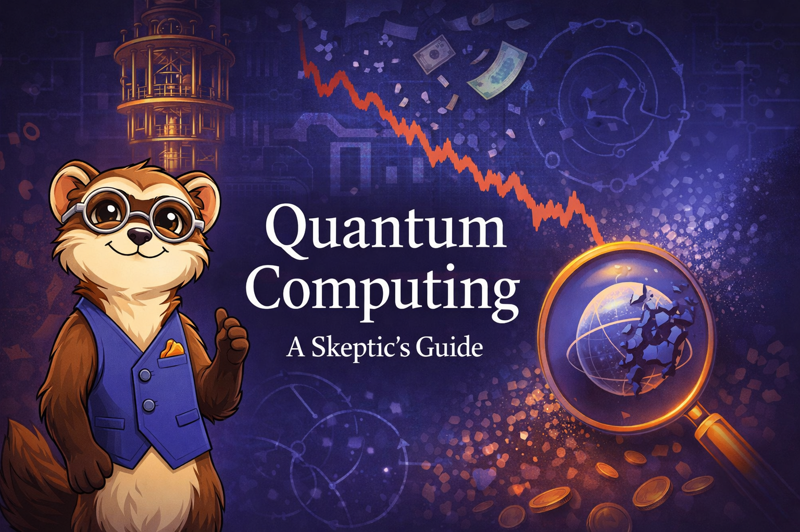

# Quantum Computing - A Skeptic's Guide

Welcome to the interactive intelligent textbook about quantum computing.
This book is a guide to non-technical people that want to understand
why there is so much interest in quantum computing and why it may
never be economically practical.

Our goal is to help everyone curious about quantum computing take
an realistic view of the many physics challenges in involved in
quantum computing and how difficult it will be to overcome these
challenges.

We also cover the history of quantum computing and some of the past
promises and predictions made about quantum computing and why they
were made but did not come to be accurate.

Finally, we look at the systemic bias that take hold of advocates of 
quantum computing and why unrealistic exceptions will continue.