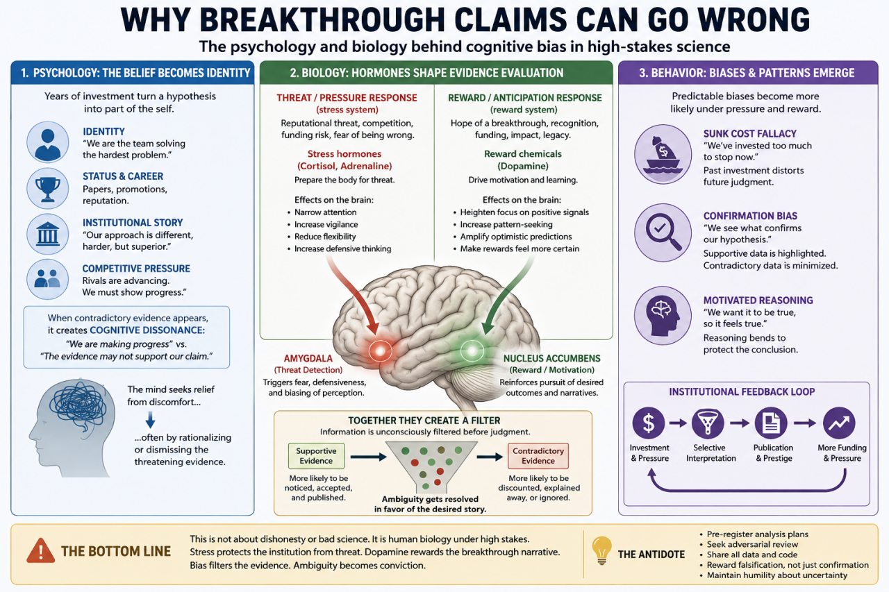
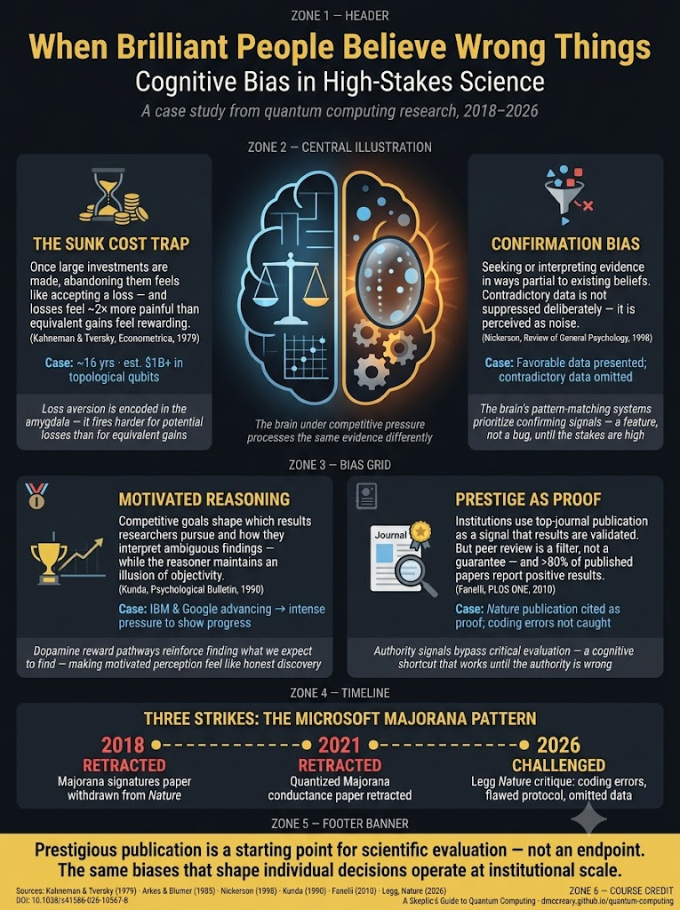
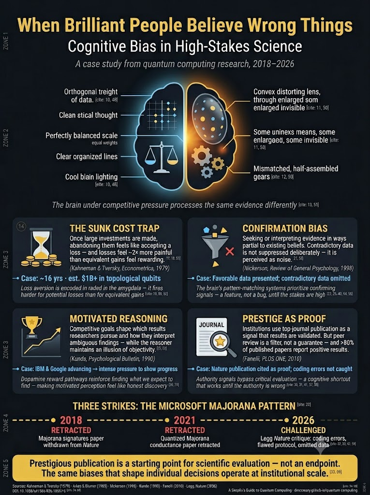

# Bias in High Stakes Science Posters

When the third Microsoft paper was challenged I decided it
was news worthy enough that I should create as post on
it on LinkedIn.  I wanted to use the interactive infographic
generator skill to generate some images.  Here are a few
samples as well as some other outputs that my readers sent me.

## Infographic Version 1

## Infographic Version 1

## Infographic Gemini

## Infographic Image Prompt
[Infographic Prompt](./infographic-prompt.md)

## Verification Report

[Verification Report](./02-verification-report.md)

## Layout Specification (YAML)
[Layout Specification (YAML)](03-layout-spec.yaml)

## LinkedIn Post

[LinkedIn Post](https://www.linkedin.com/posts/danmccreary_quantumcomputing-cognitivebias-criticalthinking-share-7475888527331782656-2e9Z/?utm_source=share&utm_medium=member_desktop&rcm=ACoAAAAD6N8BB1l53CprJPJ21thZQpRL_v53mK4)

## Microsoft Reply

[Microsoft Reply to Legg's paper](https://www.nature.com/articles/s41586-026-10568-7)