# List of MicroSims

This textbook includes **51 interactive MicroSims** — browser-based simulations
that let you explore quantum computing concepts, investment dynamics, cognitive
biases, and critical thinking frameworks hands-on. No installation required.

-   **[Bias Compounding Cascade](./bias-compounding-cascade/index.md)**

    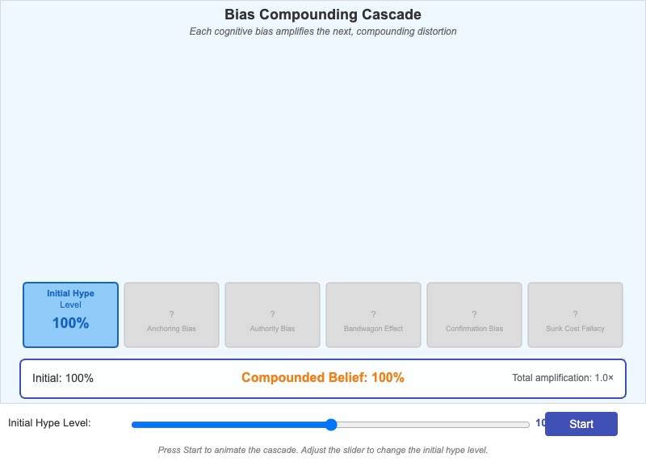

    This MicroSim demonstrates how cognitive biases do not operate in isolation -- they compound. Each bias amplifies the distortion introduced by the previous one, creating a cascade effect that can

-   **[Bias Detection Checklist](./bias-detection-checklist/index.md)**

    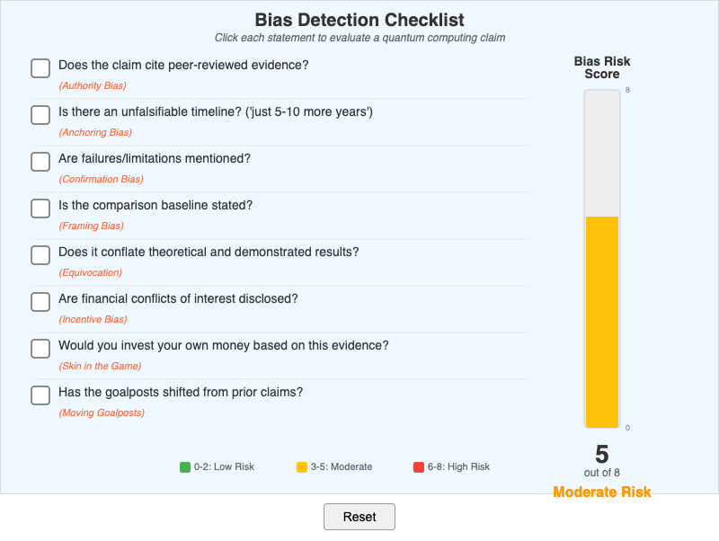

    This MicroSim provides an interactive checklist for evaluating quantum computing claims against common cognitive biases. Each item targets a specific bias pattern that frequently appears in press

-   **[Breakthrough Dependencies Map](./breakthrough-dependencies/index.md)**

    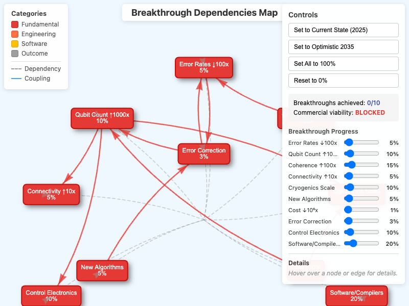

    This interactive visualization shows the ten breakthroughs required before quantum computing can become commercially viable. Each node represents a breakthrough area, with sliders to adjust estimated

-   **[Classical vs. Quantum Error Rate Comparison](./error-rate-comparison/index.md)**

    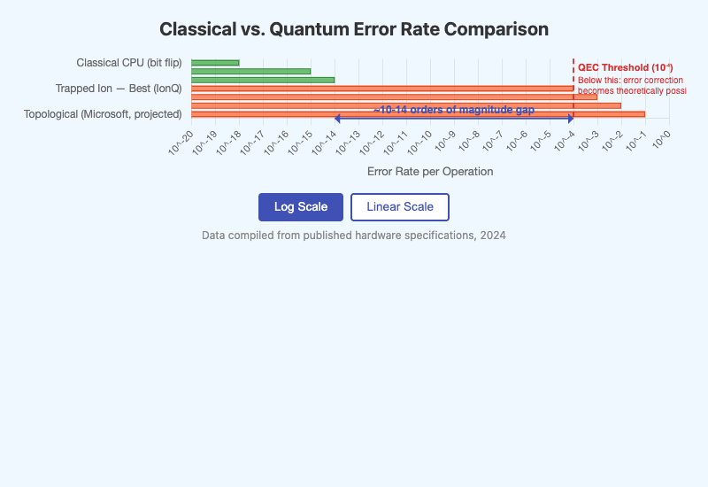

    This MicroSim uses a horizontal bar chart on a logarithmic scale to compare the error rates of classical computing components with current quantum computing hardware. The visualization makes the

-   **[Classical vs. Quantum Improvement Trajectories](./improvement-trajectories/index.md)**

    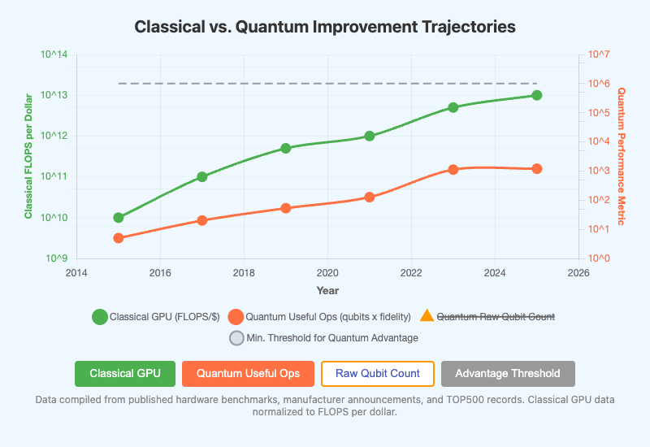

    This MicroSim uses a dual-axis logarithmic line chart to compare the historical improvement rates of classical and quantum computing from 2015 to 2025. The visualization highlights a critical

-   **[Cognitive Bias Network](./cognitive-bias-network/index.md)**

    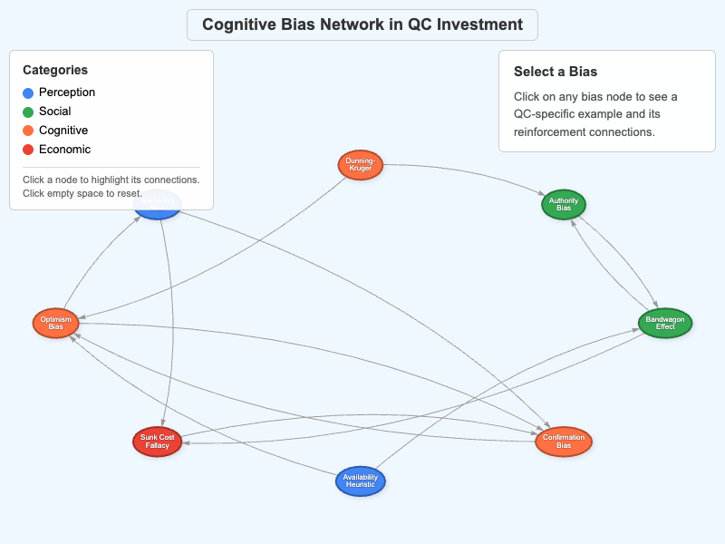

    This interactive network graph shows how cognitive biases reinforce each other in quantum computing investment decisions. Each node represents a distinct cognitive bias, and directed edges show how

-   **[Complete QC Feedback Loop System](./qc-feedback-loop-system/index.md)**

    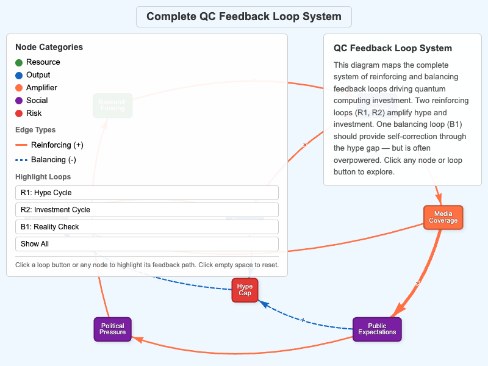

    This interactive causal loop diagram maps the complete system of reinforcing and balancing feedback loops that drive quantum computing investment. Understanding these loops is essential for analyzing

-   **[Computational Complexity Landscape](./complexity-landscape/index.md)**

    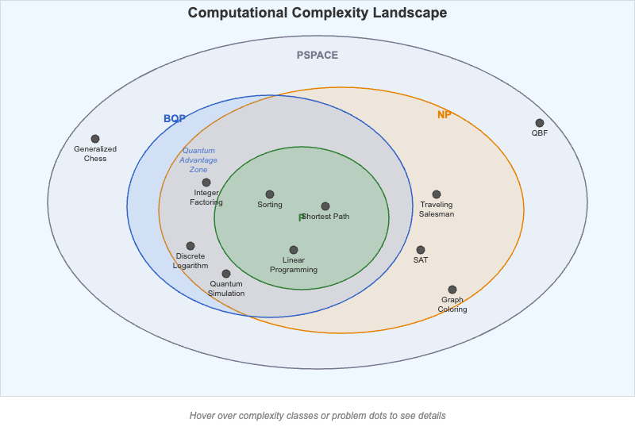

    This MicroSim presents an Euler diagram showing the containment and overlap relationships between major computational complexity classes: P, BQP, NP, and PSPACE. Specific problems are positioned

-   **[Cryptographic Vulnerability Window](./vulnerability-window/index.md)**

    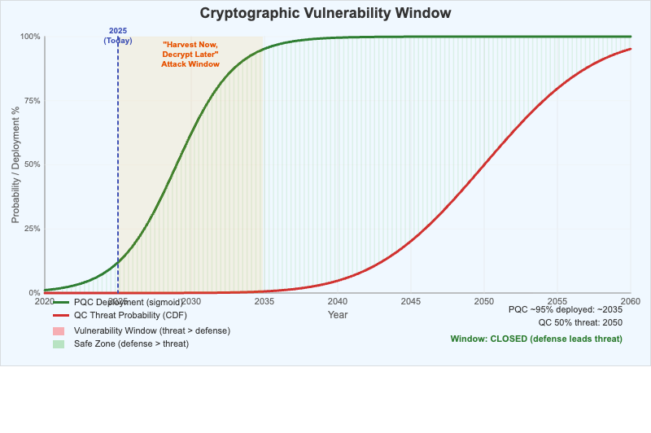

    This MicroSim visualizes the "vulnerability window" — the potential gap between when quantum computers might break current cryptographic systems (such as RSA-2048) and when post-quantum cryptography

-   **[Error Rate Gap: Quantum vs. Classical](./error-rate-gap/index.md)**

    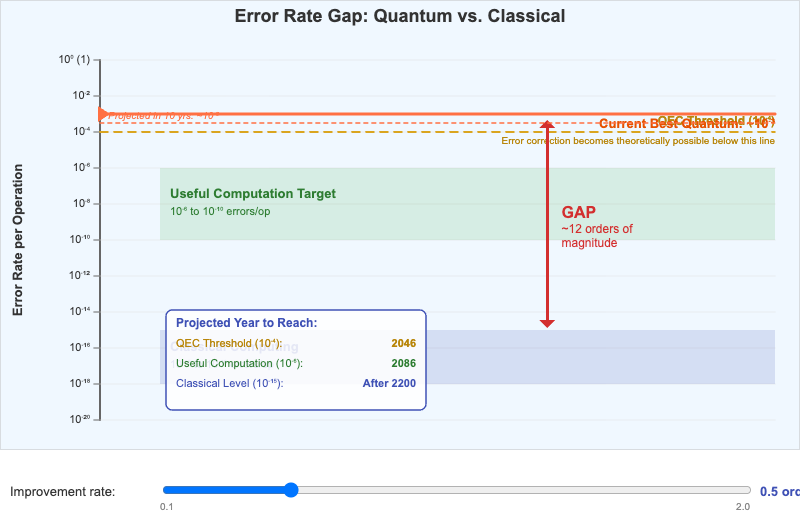

    This MicroSim visualizes the enormous gap between current quantum computing error rates and the error rates achieved by classical hardware. A vertical logarithmic scale spanning twenty orders of

-   **[Ethical Decision Framework](./ethical-decision-framework/index.md)**

    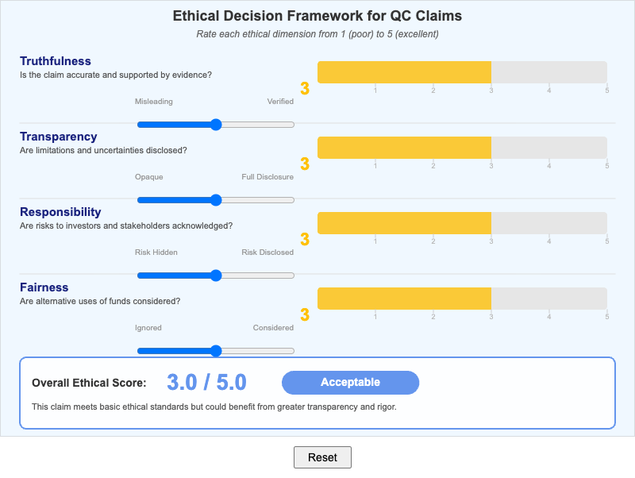

    This MicroSim provides an interactive tool for evaluating the ethical quality of quantum computing investment claims. It applies four key ethical dimensions — Truthfulness, Transparency,

-   **[GPT Qualification Scorecard](./gpt-scorecard/index.md)**

    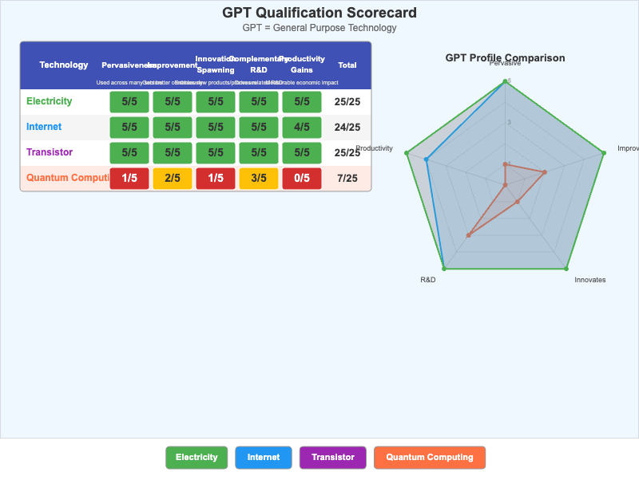

    A General Purpose Technology (GPT) is a technology so broadly applicable and continuously improving that it reshapes entire economies. Historical examples include electricity, the transistor, and the

-   **[Hardware Platform Radar Chart](./platform-comparison-radar/index.md)**

    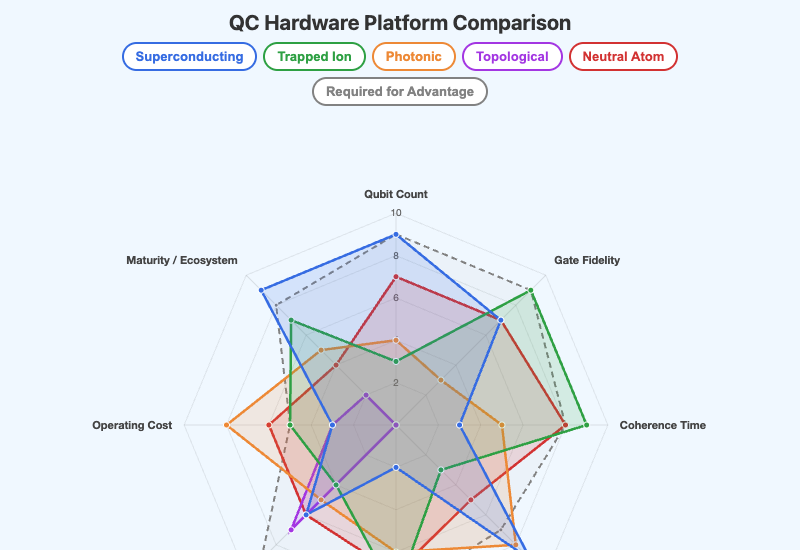

    This radar chart compares five major quantum computing hardware platforms across eight performance dimensions, each scored on a 0-10 scale (10 = best). A dashed gray "Required for Advantage"

-   **[Hype Detection Checklist](./hype-detection-tool/index.md)**

    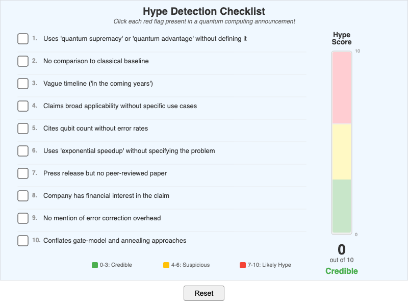

    This MicroSim provides an interactive checklist for detecting hype in quantum computing announcements and press releases. Each item represents a common red flag that appears in overhyped technology

-   **[Hype Parallels](./hype-parallels/index.md)**

    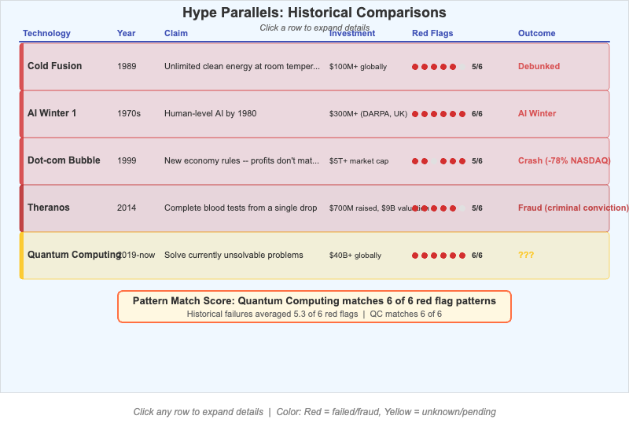

    This MicroSim presents a comparative infographic that places quantum computing's hype patterns alongside four historical technology episodes: Cold Fusion, the first AI Winter, the Dot-com Bubble, and

-   **[Hype Reinforcement Loop](./hype-reinforcement-loop/index.md)**

    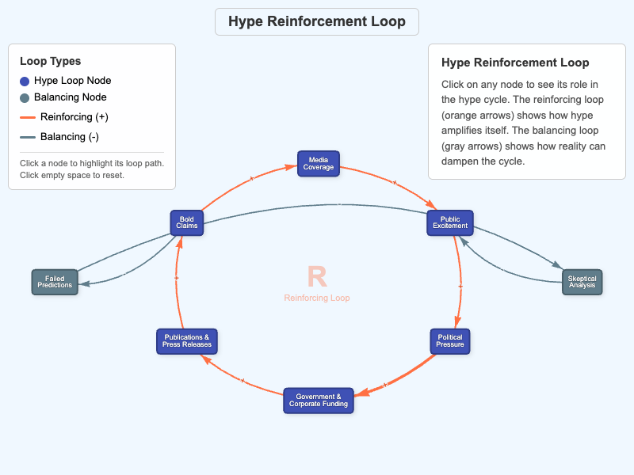

    This interactive causal loop diagram illustrates how quantum computing hype sustains itself through a self-reinforcing cycle. Each node represents a system variable, and directed edges show how one

-   **[Incentive Asymmetry Map](./incentive-asymmetry-map/index.md)**

    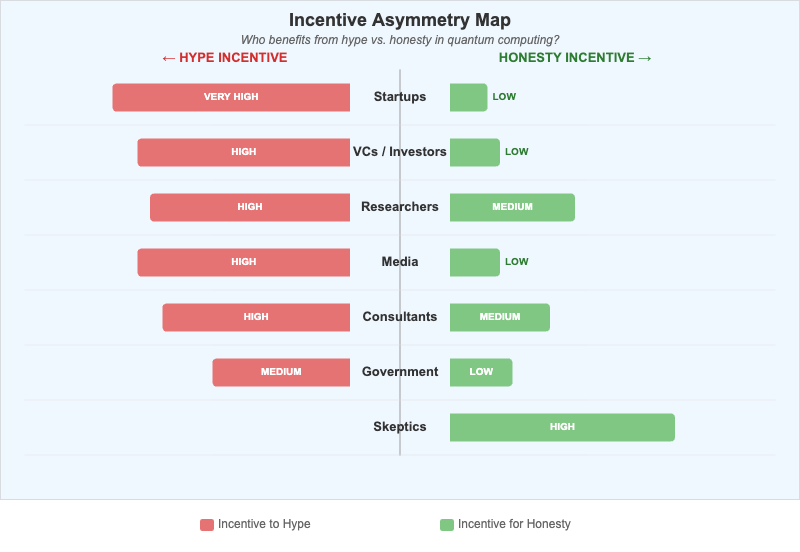

    This MicroSim visualizes the structural incentive imbalance in the quantum computing ecosystem. For each type of stakeholder, two bars extend from the center: a red bar pointing left shows the

-   **[Joint Probability Calculator](./joint-probability-calculator/index.md)**

    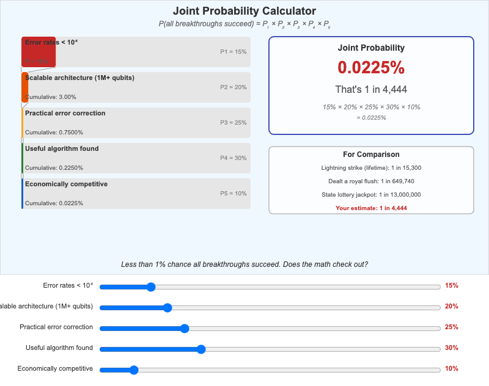

    This MicroSim demonstrates how the joint probability of multiple independent breakthroughs compounds multiplicatively. Even when each individual breakthrough seems plausible (10-30% likely), the

-   **[Learning Graph Viewer](./graph-viewer/index.md)**

    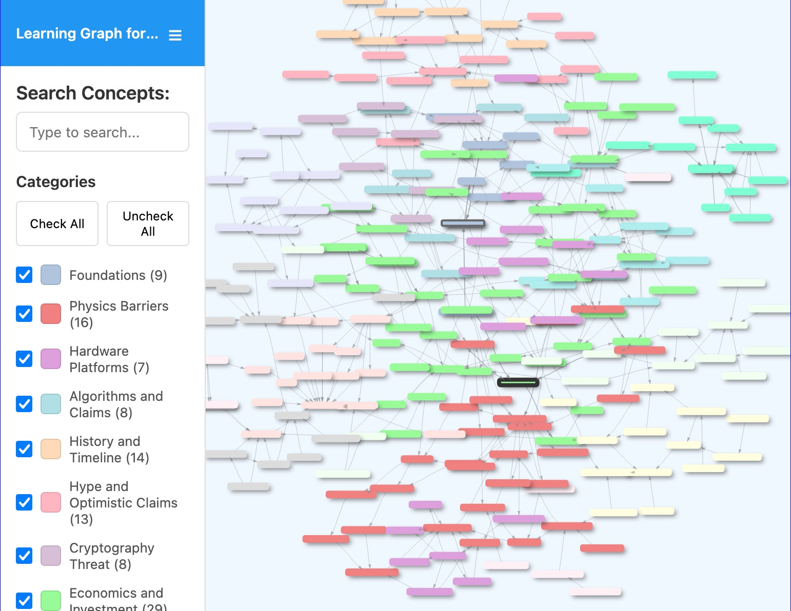

    This interactive viewer allows you to explore the learning graph for the course.

-   **[Leverage Point Explorer](./leverage-point-explorer/index.md)**

    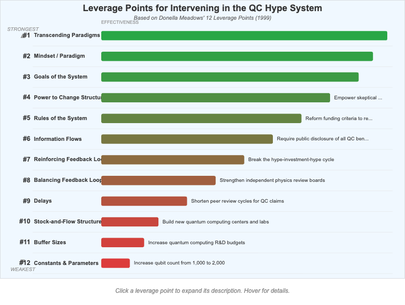

    This MicroSim visualizes Donella Meadows' 12 leverage points for intervening in a system, applied to the quantum computing hype cycle. Leverage points are ranked from weakest (bottom) to strongest

-   **[Physics Bet Timeline](./physics-bet-timeline/index.md)**

    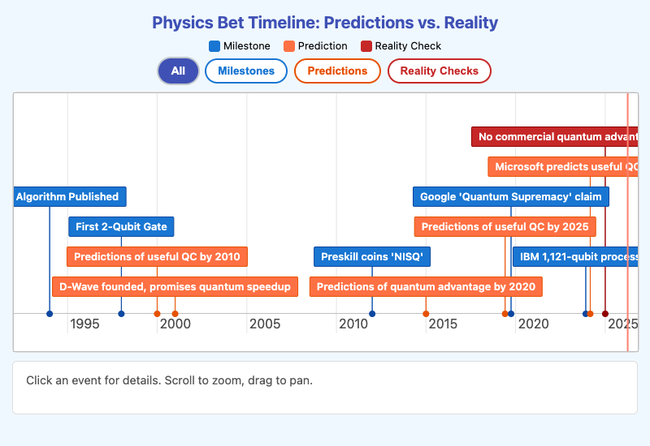

    This interactive timeline tracks major quantum computing milestones alongside the bold predictions made by researchers, companies, and investors over three decades. Each prediction is matched against

-   **[Prediction Track Record Timeline](./qc-prediction-tracker/index.md)**

    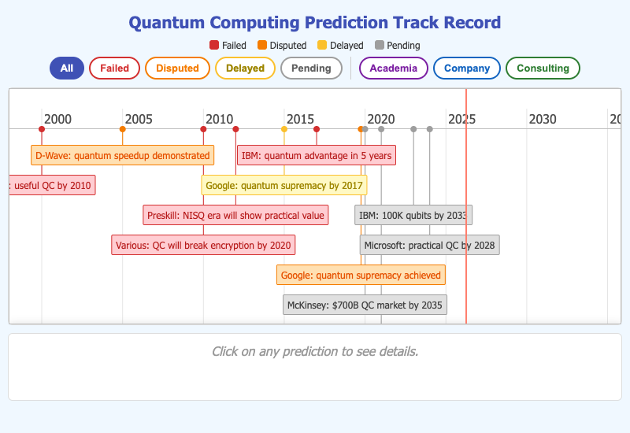

    This interactive timeline tracks major quantum computing predictions alongside their actual outcomes. It reveals a systematic pattern of overoptimism that spans decades, sources, and claim types.

-   **[Probability Waterfall](./probability-waterfall/index.md)**

    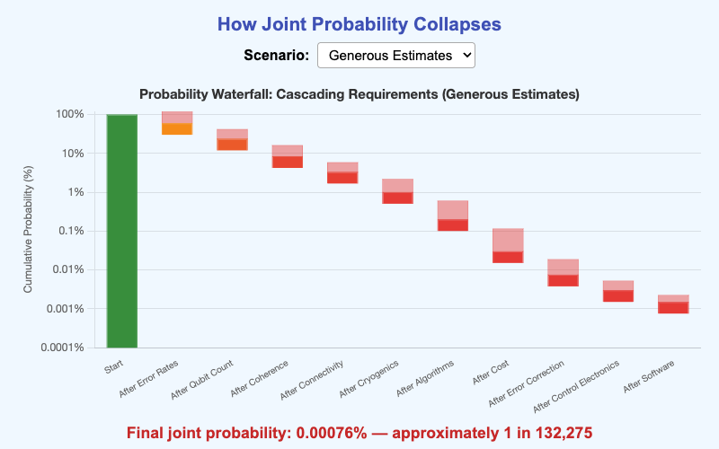

    This MicroSim uses a waterfall-style bar chart to show how joint probability collapses when multiple independent breakthroughs are each required for quantum computing to become economically viable.

-   **[QC Application Landscape](./qc-application-landscape/index.md)**

    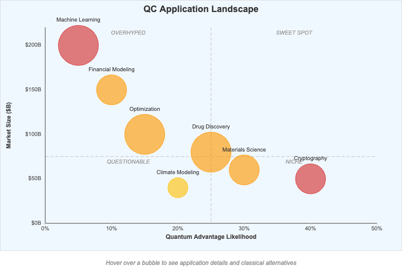

    This MicroSim presents a 2D bubble chart mapping proposed quantum computing applications by their likelihood of achieving genuine quantum advantage (x-axis) against their estimated market size

-   **[QC Company Valuations vs. Revenue](./qc-valuation-scatter/index.md)**

    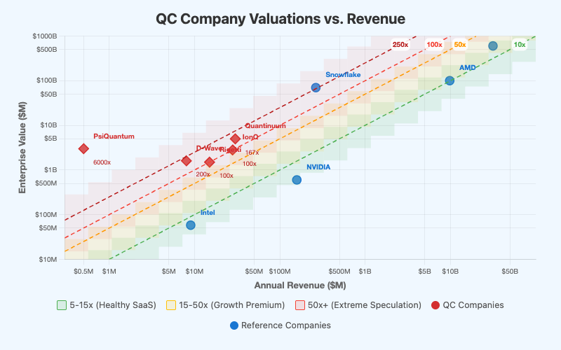

    This scatter chart plots quantum computing company valuations against their annual revenues on logarithmic axes, alongside reference companies from technology history. Diagonal shaded bands show

-   **[QC Investment Decision Tree](./qc-investment-decision-tree/index.md)**

    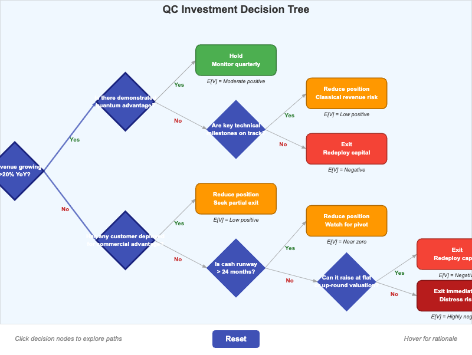

    This MicroSim presents an interactive decision tree that walks investors through a structured framework for evaluating quantum computing investments. Starting from a root question about revenue

-   **[QC Investment Expected Value Calculator](./qc-expected-value-calculator/index.md)**

    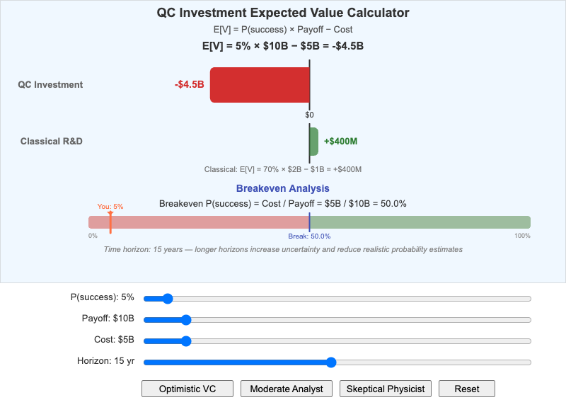

    This MicroSim lets you explore the expected value framework applied to quantum computing investments. By adjusting the probability of success, potential payoff, investment cost, and time horizon, you

-   **[QC Investment Flow](./qc-investment-flow/index.md)**

    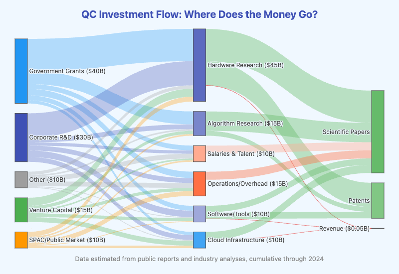

    This Sankey diagram traces the flow of capital through the quantum computing ecosystem, from funding sources on the left, through research and operational categories in the middle, to measurable

-   **[QC Investment vs. Revenue](./qc-investment-vs-revenue/index.md)**

    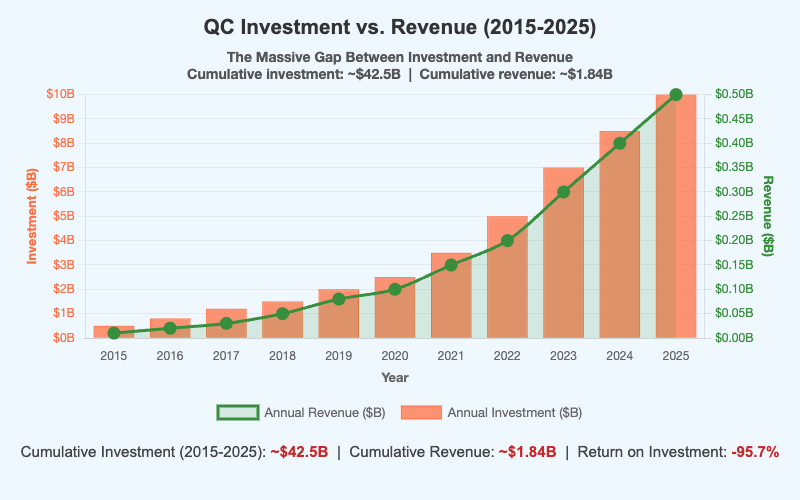

    This MicroSim visualizes the growing gap between quantum computing investment and commercial revenue from 2015 to 2025. The orange bars show annual investment while the green line tracks annual

-   **[Quantum Computing History Timeline](./qc-history-timeline/index.md)**

    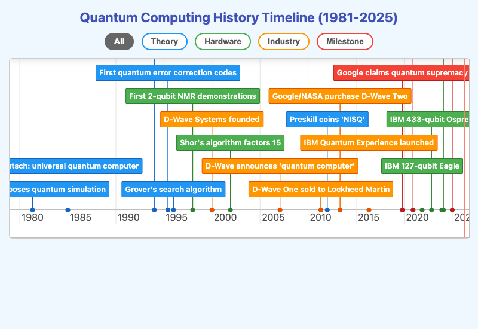

    This interactive timeline spans the full history of quantum computing from Feynman's 1981 proposal to the present day. Events are color-coded by category: theory (blue), hardware (green), industry

-   **[Quantum Portfolio Explorer](./quantum-portfolio-explorer/index.md)**

    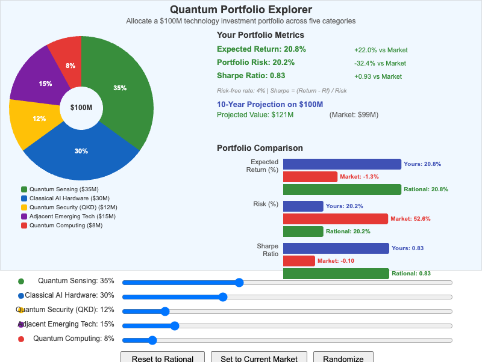

    This MicroSim lets you design your own quantum technology investment portfolio by allocating a hypothetical $100M across five technology categories. As you adjust the sliders, the expected return,

-   **[Qubit Scaling vs. Cryptographic Requirements](./qubit-scaling-vs-crypto/index.md)**

    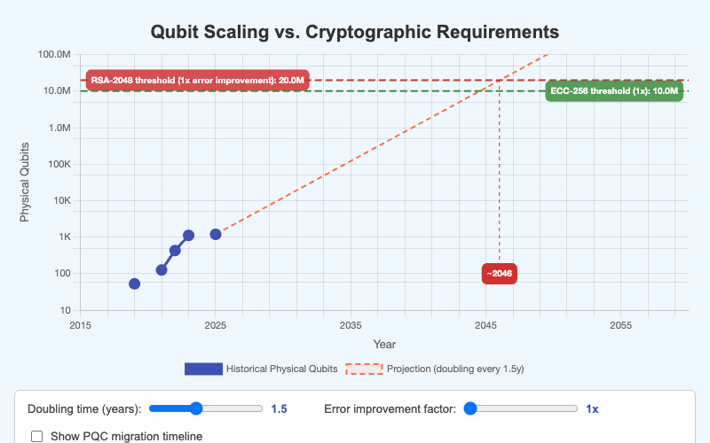

    This interactive chart shows the race between qubit scaling trajectories and the physical qubit counts required to break modern encryption standards. Use the sliders to explore how doubling time and

-   **[Qubit State on the Bloch Sphere](./bloch-sphere/index.md)**

    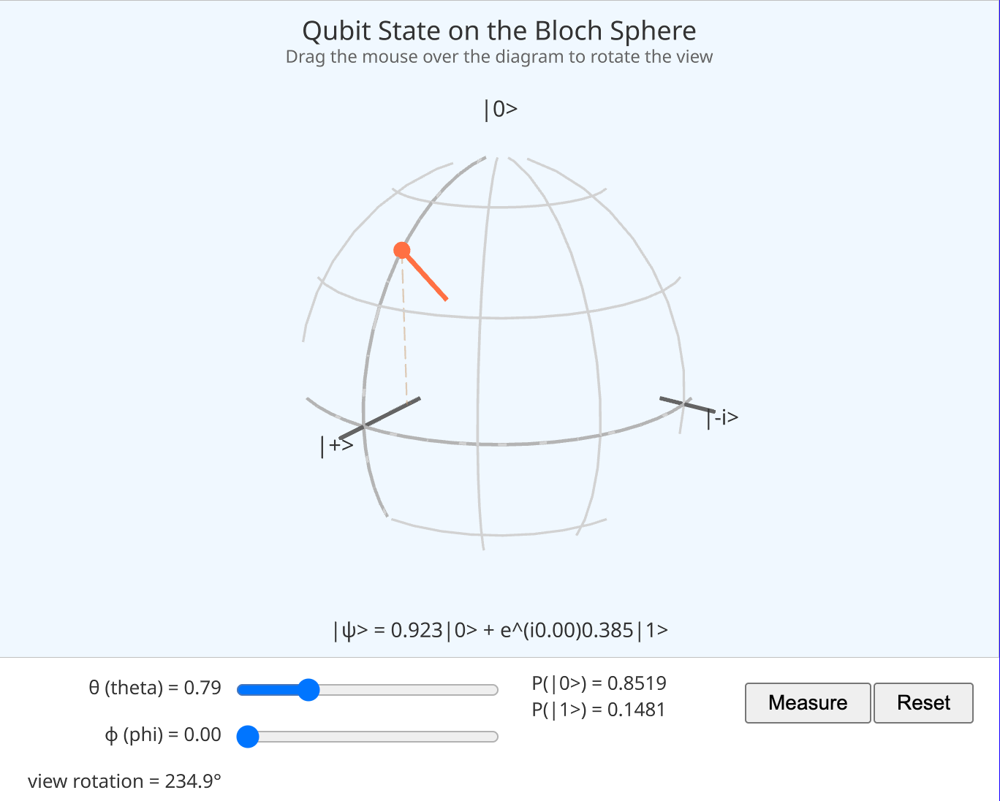

    The Bloch sphere is a geometric representation of the state of a single qubit. Every point on the surface of the unit sphere corresponds to a pure qubit state. The north pole represents , the south

-   **[Rhetorical Patterns in QC Advocacy](./rhetorical-patterns/index.md)**

    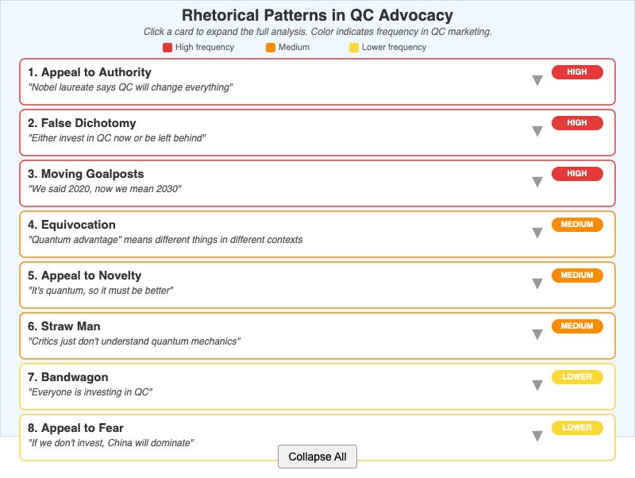

    This MicroSim is an interactive guide to eight rhetorical patterns commonly found in quantum computing marketing, press releases, and investor pitches. Each pattern is a recognized logical fallacy or

-   **[Risk-Return Scatter Plot](./quantum-risk-return-scatter/index.md)**

    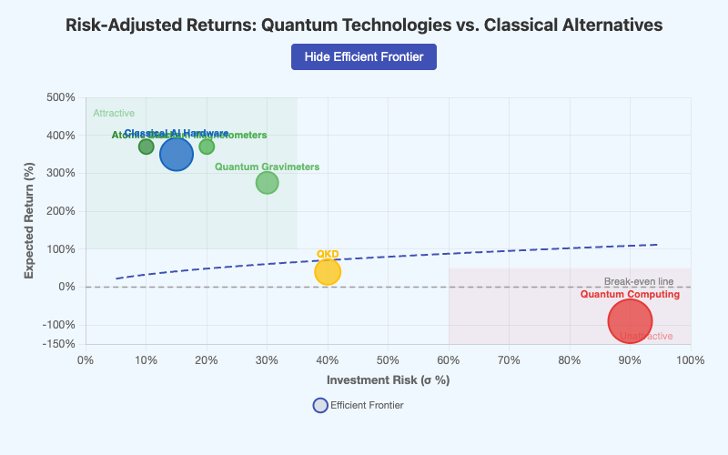

    This interactive scatter plot compares quantum and classical technology investments on two dimensions: investment risk (standard deviation of returns) and expected return. Bubble size reflects the

-   **[Shor's Algorithm: Resource Requirements](./shors-algorithm-resources/index.md)**

    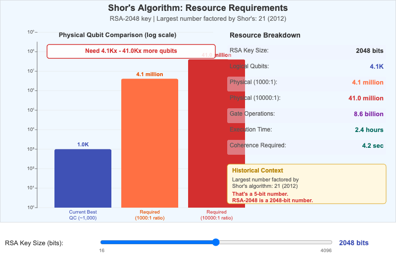

    This MicroSim visualizes the staggering hardware resources required to run Shor's algorithm for breaking RSA encryption at various key sizes. By adjusting the RSA key size slider, you can see how the

-   **[Skeptical Inquiry Flowchart](./skeptical-inquiry-flowchart/index.md)**

    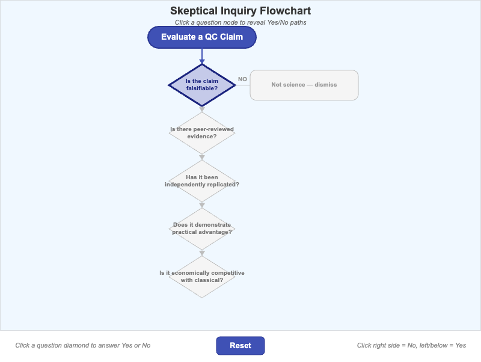

    This MicroSim presents an interactive decision flowchart for evaluating any quantum computing claim through a series of five critical questions. Each question acts as a filter, progressively testing

-   **[Success vs. Failure Patterns](./success-failure-patterns/index.md)**

    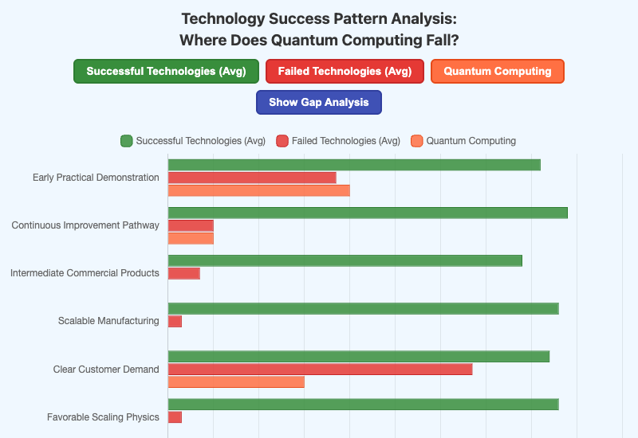

    This grouped horizontal bar chart compares quantum computing against the average profiles of historically successful and failed technology predictions across six key criteria. Hover over any bar to

-   **[TCO Comparison Dashboard](./tco-comparison-dashboard/index.md)**

    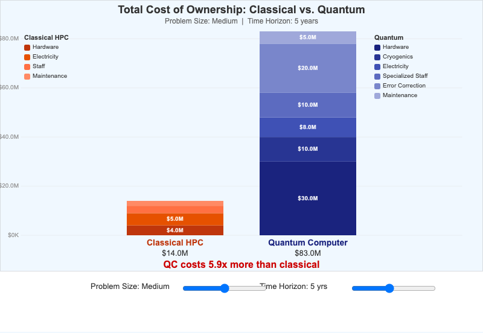

    This MicroSim presents a side-by-side comparison of the Total Cost of Ownership (TCO) for a classical high-performance computing cluster versus a quantum computer. Stacked bar charts break down costs

-   **[Technology Bet Decision Framework](./tech-bet-decision-framework/index.md)**

    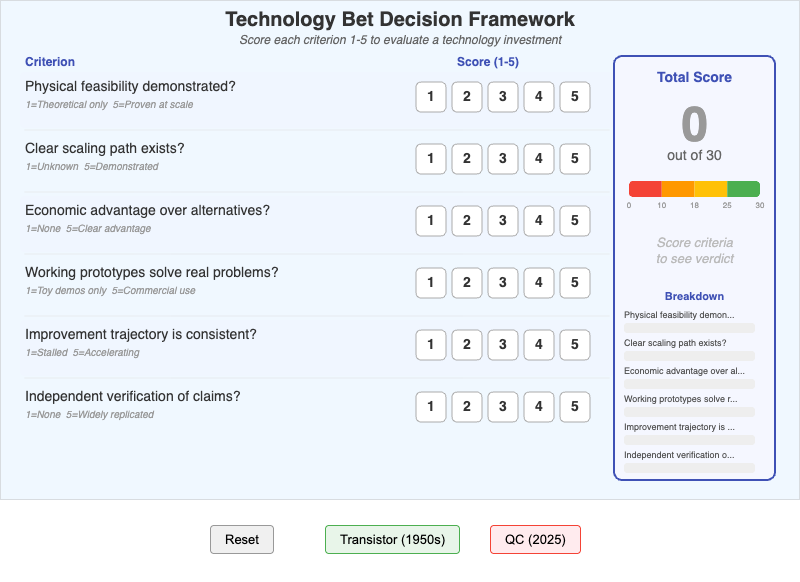

    This MicroSim provides a structured scoring matrix for evaluating whether an emerging technology is a sound investment bet. Six criteria drawn from the analytical tools covered throughout the course

-   **[Technology Bubble Dynamics](./tech-bubble-dynamics/index.md)**

    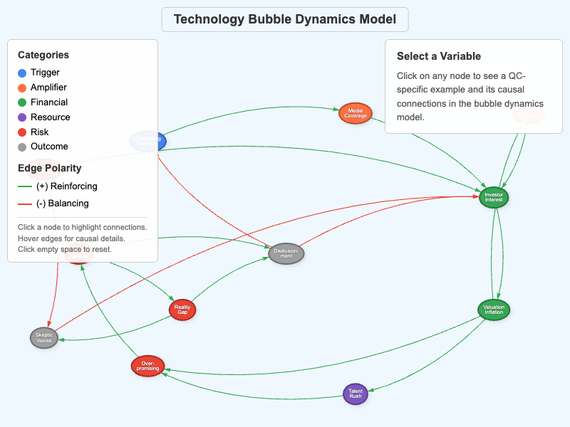

    This interactive causal loop diagram models the feedback loops that drive technology bubble formation and collapse, with specific examples drawn from quantum computing investment. Each node

-   **[Technology Success Indicator Analysis](./tech-success-analyzer/index.md)**

    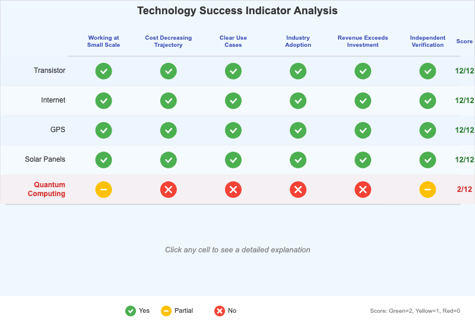

    This MicroSim presents a comparison matrix evaluating five technologies against six structural indicators of commercial success. The Transistor, Internet, GPS, and Solar Panels all show strong green

-   **[The Advantage Gap](./advantage-gap/index.md)**

    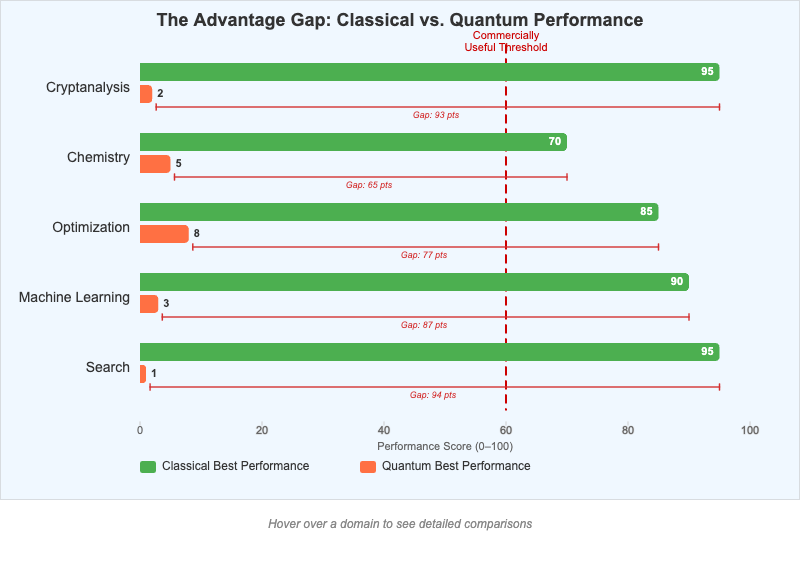

    This MicroSim presents a horizontal bar chart comparing classical and quantum computing performance across five key application domains: Cryptanalysis, Chemistry, Optimization, Machine Learning, and

-   **[The Barrier Stack](./barrier-stack/index.md)**

    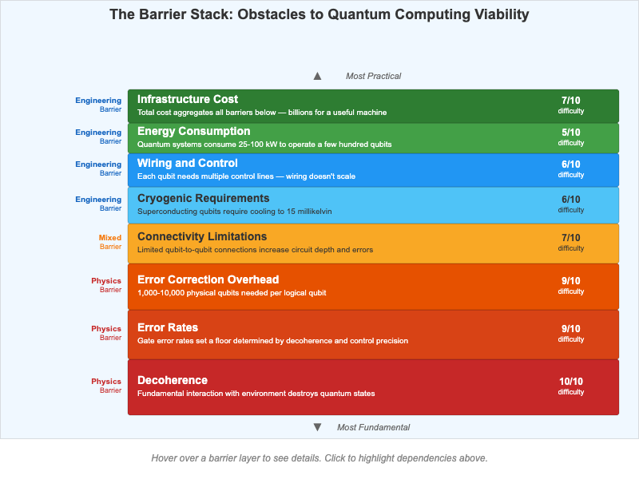

    This MicroSim presents a stacked barrier visualization showing the key obstacles standing between today's quantum hardware and a commercially viable quantum computer. Barriers are stacked from bottom

-   **[The Hype Amplification Pipeline](./hype-amplification-pipeline/index.md)**

    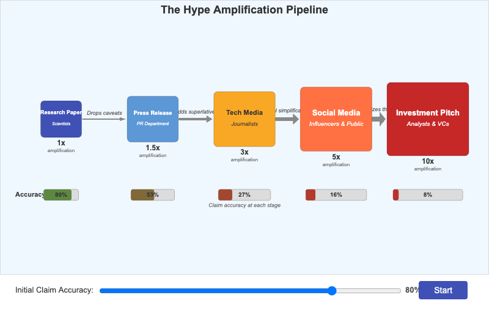

    This MicroSim visualizes how a careful, qualified scientific claim gets progressively distorted as it passes through successive stages of communication — from peer-reviewed paper to university press

-   **[The Hype Ecosystem](./hype-ecosystem/index.md)**

    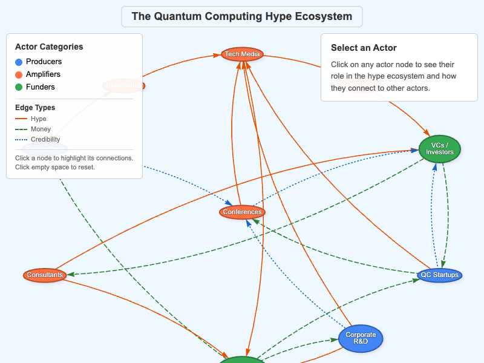

    This interactive network graph maps the self-reinforcing ecosystem that sustains quantum computing hype. Each node represents an actor -- researchers, media, investors, consultants, government

-   **[The Perpetual "5-10 Years Away" Pattern](./prediction-pattern/index.md)**

    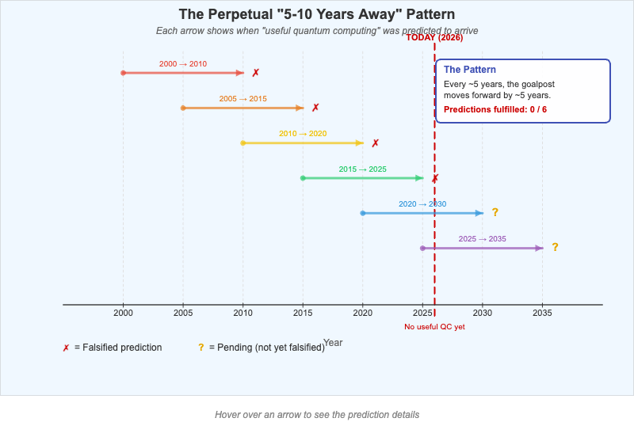

    This MicroSim visualizes one of the most telling patterns in quantum computing history: every five years or so, proponents predict that useful quantum computing is "just 5-10 years away." When the

-   **[The Shrinking 'Supremacy' Gap](./supremacy-gap-timeline/index.md)**

    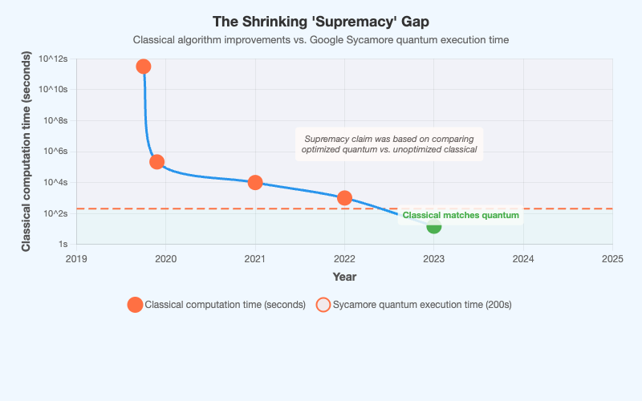

    In October 2019, Google announced that its 53-qubit Sycamore processor had achieved "quantum supremacy" by completing a random circuit sampling task in 200 seconds that would allegedly take the

-   **[TRL Assessment Tool](./trl-assessment-tool/index.md)**

    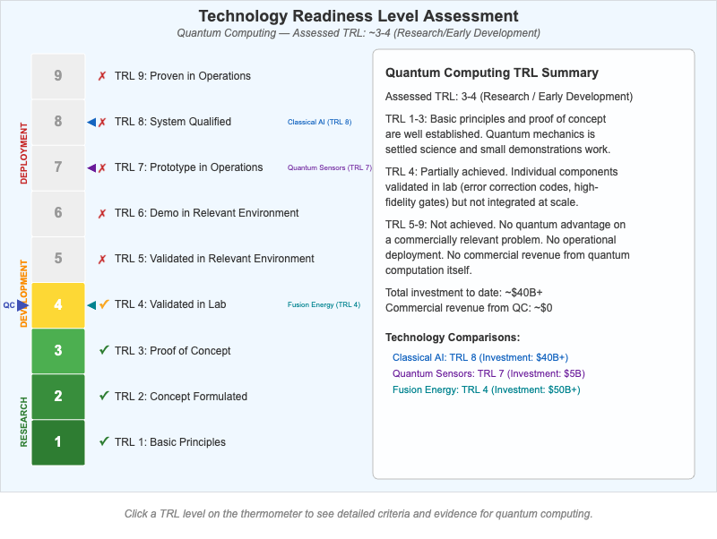

    This MicroSim applies the Technology Readiness Level (TRL) framework to quantum computing, providing a visual assessment of where the technology stands on the standard 1-to-9 readiness scale used by

-   **[VC Portfolio Simulator: QC vs. Classical](./vc-portfolio-simulator/index.md)**

    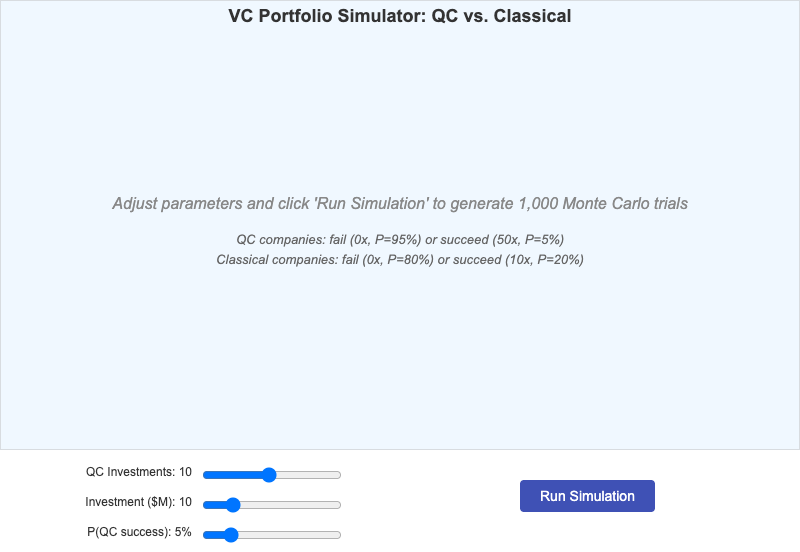

    This MicroSim runs 1,000 Monte Carlo trials to compare the expected returns of a venture capital portfolio invested in quantum computing startups versus classical technology startups. Each trial

-   **[Workload Distribution](./workload-distribution/index.md)**

    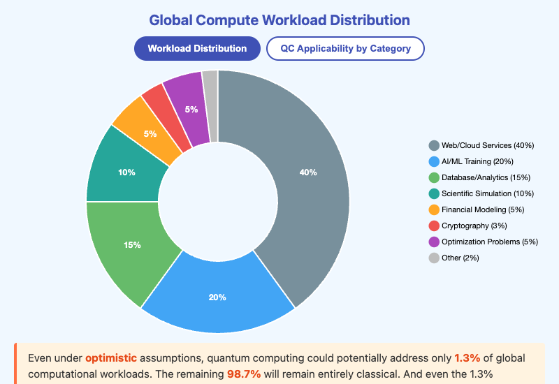

    This interactive chart shows how global computational workloads are distributed across major categories and highlights the tiny fraction that quantum computing could potentially address. Use the

