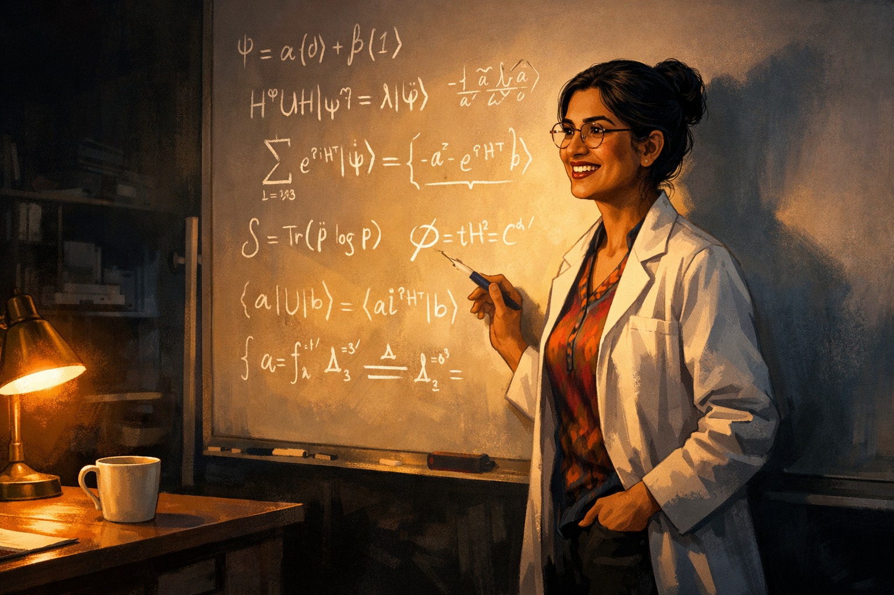
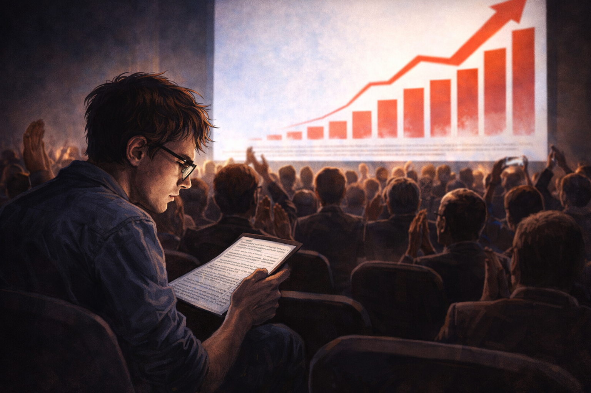
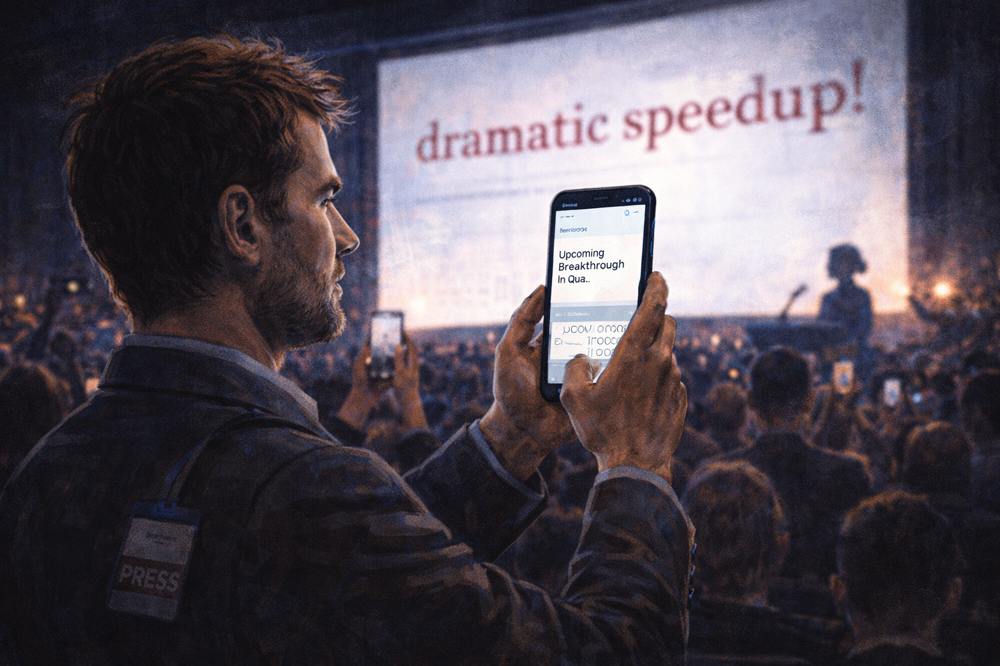
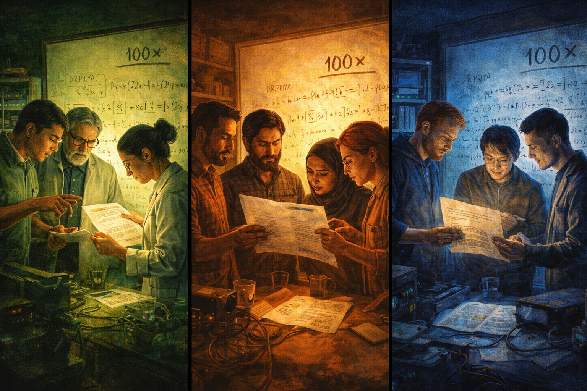
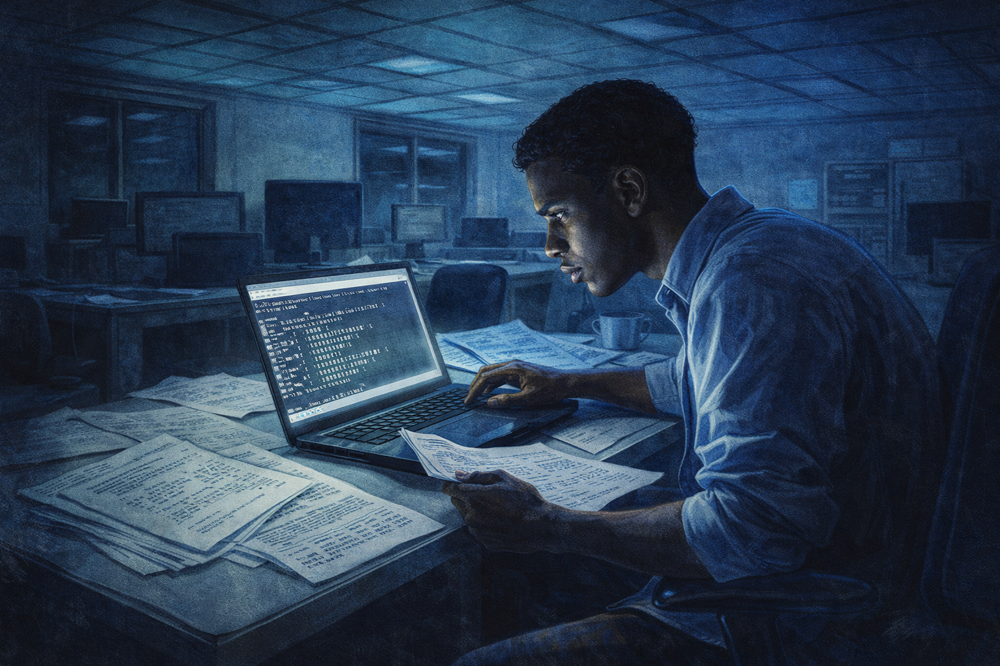
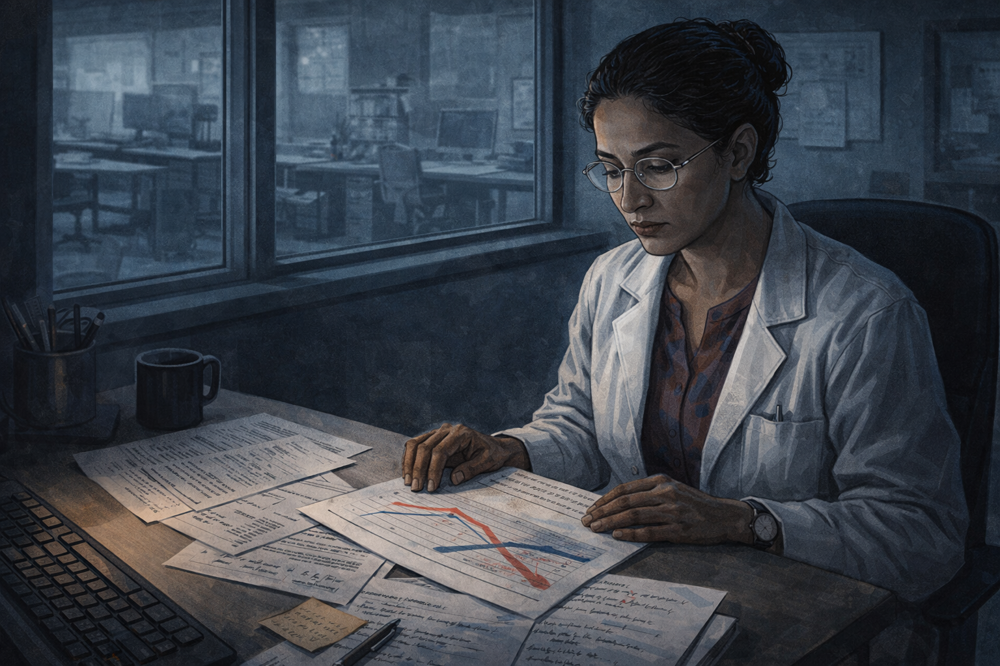
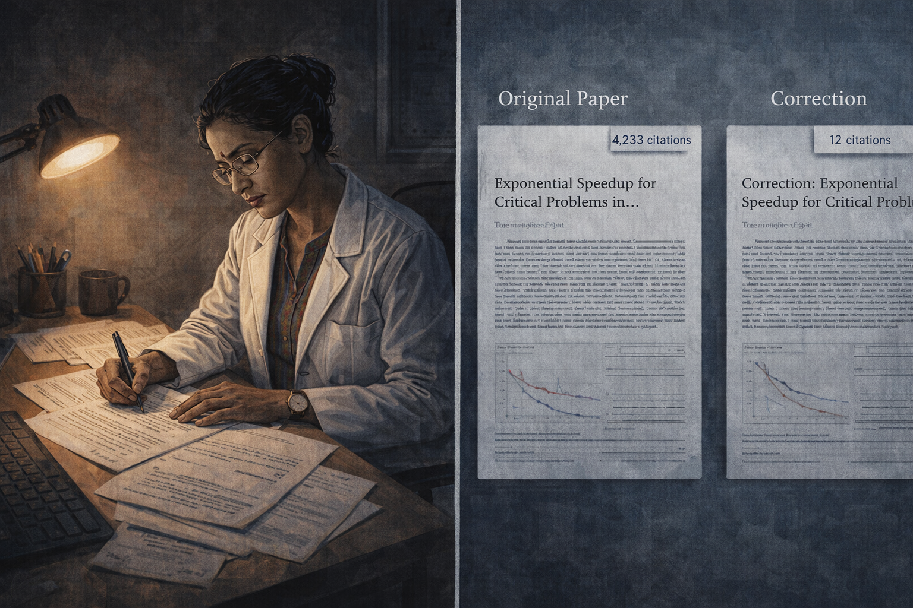
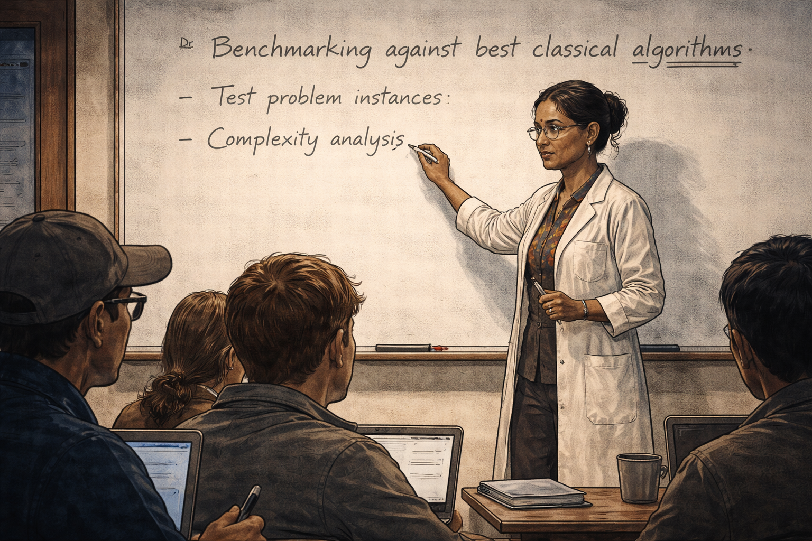

# The Benchmark Slide

## Panel 1: Late Night Discovery (The Lab)

Dr. Priya at the whiteboard late at night

Generate a wide-landscape graphic novel drawing with a width:height ratio of 16:9. Use rich colors in the style of a thoughtful, cinematic graphic novel — expressive character faces, dramatic lighting, environments that reflect emotional tone. Not cartoonish. Think Saga or Maus rather than superhero comics. Do not put captions or text in the image. Show Dr. Priya — a South Asian woman, early 40s, wire-rimmed glasses, dark hair in a bun, white lab coat over a colorful blouse — standing at a whiteboard covered in elegant equations in a university lab late at night. Her expression is one of genuine excitement and discovery. A coffee cup sits cold and forgotten on the desk beside her. The lab is dark beyond the pool of light around her. The equations on the board look beautiful and important. Color palette: warm amber light from a desk lamp against the deep cool darkness of the nighttime lab.

Dr. Priya has been at the whiteboard for three hours and the equations are doing what beautiful equations sometimes do — they are converging. The coffee on the desk went cold an hour ago and she hasn't noticed. The lab is empty except for her, lit by a single desk lamp that throws long shadows across the rows of equipment. The numbers suggest a speedup she did not expect. She checks them again. They still say it.

## Panel 2: The Conference Stage

Dr. Priya presenting the "100× speedup" slide

Generate a wide-landscape graphic novel drawing with a width:height ratio of 16:9. Use rich colors in the style of a thoughtful, cinematic graphic novel — expressive character faces, dramatic lighting, environments that reflect emotional tone. Not cartoonish. Do not put captions or text in the image. Show Dr. Priya — South Asian woman, early 40s, wire-rimmed glasses, dark hair in a bun, now in a professional blazer — standing on a large conference stage, laser pointer in hand. Behind her fills a massive projection screen showing a slide with bold red text indicating a dramatic speedup claim. She looks confident and proud. The conference hall is visible — a large audience, rows of faces. Stage lighting is bright on her, dramatic. Color palette: the bright white-blue of stage lighting, the bold red of the key slide, the dark sea of the audience beyond.

Six months later, Priya stands on a stage in front of four hundred people, and the slide filling the screen behind her shows "100×" in bold red. She has rehearsed this talk twenty times. The result is real — the experiment showed it, the analysis confirmed it. She gestures toward the number with her laser pointer, and the audience is very attentive. Nobody in this room has reason to doubt her. Including her.

## Panel 3: Standing Ovation

Conference hall applause, audience photographing the slide

Generate a wide-landscape graphic novel drawing with a width:height ratio of 16:9. Use rich colors in the style of a thoughtful, cinematic graphic novel — expressive character faces, dramatic lighting, environments that reflect emotional tone. Not cartoonish. Do not put captions or text in the image. Show the conference hall erupting in applause after Priya's talk. People are on their feet. Many in the audience are holding up phones, photographing the slide still projected on the screen. Priya on the stage looks moved and slightly overwhelmed by the response. Camera flashes from the press area at the sides. The energy in the room is palpable excitement. Color palette: warm applause-light, flash bursts, the bright screen behind Priya, the room lit with enthusiasm.

The applause begins before she finishes her final sentence. People are standing. Near the back, camera phones are raised, photographing the slide. She can see the red "100×" reflected in dozens of small screens. Priya smiles and thanks the conference organizers, and somewhere in the applause she feels, fully and without reservation, that she has done something important. It is a good feeling. It is the kind of feeling that makes careful people less careful.

## Panel 4: The Grad Student in the Back Row

A grad student squinting at the fine print on the slide

Generate a wide-landscape graphic novel drawing with a width:height ratio of 16:9. Use rich colors in the style of a thoughtful, cinematic graphic novel — expressive character faces, dramatic lighting, environments that reflect emotional tone. Not cartoonish. Do not put captions or text in the image. Show a single grad student in the back row of the conference hall — young, male, slightly disheveled, sitting slightly apart from the applauding crowd. While others clap, he is leaning forward, squinting intently at the still-projected slide, trying to read the fine print in the methodology footnote. His expression is not hostile — it is the focused frown of someone noticing something. The contrast with the celebrating crowd around him is subtle but clear. Color palette: the bright screen light reaching back to illuminate his focused face against the darker back-row surroundings.

In the last row, a second-year graduate student named Kwame is not applauding. He is squinting at the screen, tilting his head slightly, trying to read the footnote at the bottom of the benchmark slide — the one listing the classical baseline. The text is too small from back here. But something about the baseline description is familiar in a way that makes the back of his neck prickle. He takes a photo of the slide. He will look at it tonight.

## Panel 5: The Inbox That Night

Priya's email inbox overflowing with collaboration requests

Generate a wide-landscape graphic novel drawing with a width:height ratio of 16:9. Use rich colors in the style of a thoughtful, cinematic graphic novel — expressive character faces, dramatic lighting, environments that reflect emotional tone. Not cartoonish. Do not put captions or text in the image. Show Dr. Priya — South Asian woman, early 40s, wire-rimmed glasses, dark hair in a bun — sitting in a hotel room that night, laptop open, her face lit by the screen glow. The laptop screen shows an overflowing email inbox, subject lines suggesting collaboration requests, interview requests, speaking invitations. Her expression shows genuine pleasure and a little overwhelm. The hotel room is generic but comfortable, the city visible through the window behind her. Color palette: blue-white laptop glow in a warm hotel room, the city lights beyond the window.

By nine o'clock that evening, the inbox has forty-seven new messages with subjects like "Collaboration proposal," "Interview request," and "Keynote invitation." Priya reads them from her hotel bed, still in her conference blazer, eating room service crackers. She answers the most urgent ones. She forwards three to her department chair. She allows herself to feel, for a few hours, that things are going very well.

## Panel 6: The Journalist's Screenshot

A journalist screenshots the slide on their phone

Generate a wide-landscape graphic novel drawing with a width:height ratio of 16:9. Use rich colors in the style of a thoughtful, cinematic graphic novel — expressive character faces, dramatic lighting, environments that reflect emotional tone. Not cartoonish. Do not put captions or text in the image. Show a tech journalist in the conference hall — white man, late 30s, press lanyard around his neck — holding up his phone to photograph the projected slide, the screen bright behind him. On his phone screen we can see him opening a notes app, beginning to type a headline. His expression is businesslike, efficient — he has a story. The conference buzz is visible around him. Color palette: the bright slide light, the busy scene of a journalist working in a crowd.

A technology journalist from a major publication has already written the headline in his notes app: "Quantum Algorithm Leaves Classical Computing in the Dust." He takes three photos of the slide for backup. The story writes itself — it always does when the number is that big and that round. He will call one expert for a quote in the morning, someone who will say "impressive if it holds up," and that qualifier will not make it into the published piece.

## Panel 7: Three Labs Launch Copycat Experiments

Multiple labs starting new experiments based on Priya's talk

Generate a wide-landscape graphic novel drawing with a width:height ratio of 16:9. Use rich colors in the style of a thoughtful, cinematic graphic novel — expressive character faces, dramatic lighting, environments that reflect emotional tone. Not cartoonish. Do not put captions or text in the image. Show a split triptych composition — three different university labs, each in a different color palette, each showing a research team clustered around a printed copy of Priya's conference paper or slide. Each team has a whiteboard with the "100×" figure written at the top, and they are beginning to plan their own version of the experiment. The scenes are simultaneous and independent — three parallel starting-points. Color palette: warm lab lights in three slightly different tones — green-tinged, amber-tinged, blue-tinged — representing three separate institutions beginning the same race.

Within two weeks of the conference, three separate research groups have launched new projects, all beginning from the same starting point: the slide with the "100×" figure. In one lab in Amsterdam, a team erases a different project from their whiteboard to make room. In Boston, a graduate student is redirected from her dissertation topic. In Singapore, a grant proposal is revised mid-draft. Priya's number is traveling, propagating, becoming the premise of other people's work before anyone has run the baseline carefully.

## Panel 8: The Laptop and the Classical Baseline

The grad student runs the classical baseline on a laptop

Generate a wide-landscape graphic novel drawing with a width:height ratio of 16:9. Use rich colors in the style of a thoughtful, cinematic graphic novel — expressive character faces, dramatic lighting, environments that reflect emotional tone. Not cartoonish. Do not put captions or text in the image. Show Kwame — the grad student from the conference back row — six months later, alone in a university computer lab at night, running code on a standard laptop. The screen shows terminal output, timing results. His expression is intensely focused, slightly tense. He has printed papers spread around him, cross-referenced. The room is otherwise empty, fluorescent lights humming. He is doing something careful and methodical. The atmosphere is quiet but charged. Color palette: cool blue-white fluorescent light, laptop screen glow, the isolation of late-night careful work.

Six months after the conference, Kwame runs the classical baseline — the right baseline, the current best-known algorithm, not the one in Priya's footnote. He is methodical: he runs it three times, with different seeds, on three problem sizes. He is not trying to find an error. He is trying to make sure he isn't making one himself. The timing results come back clean, consistent, and deeply inconvenient.

## Panel 9: The Gap Closes

A graph showing the speedup gap shrinking, then reversing

Generate a wide-landscape graphic novel drawing with a width:height ratio of 16:9. Use rich colors in the style of a thoughtful, cinematic graphic novel — expressive character faces, dramatic lighting, environments that reflect emotional tone. Not cartoonish. Do not put captions or text in the image. Show Kwame at his desk, a results graph visible on his monitor. The graph shows two performance curves that begin far apart — the quantum result leading dramatically — and then converge, cross, and reverse. His face, partially lit by the screen, shows the careful neutral expression of someone looking at something that contradicts what they expected. Around him: printed papers, handwritten notes, the detritus of months of careful work. The room is quiet. Color palette: the cool screen glow on his face, the graph lines in contrasting colors — one the warm red of the original claim, one the cool blue of the new baseline.

The gap closes. Then it disappears. At the largest problem sizes — the ones that actually matter — the classical algorithm, properly implemented with the techniques from last year's conference proceedings, actually runs faster. The quantum speedup was real against the 2019 classical baseline. Against the 2024 classical baseline, it is not. Kwame sits looking at the graph for a long time. He is a second-year student. This is a very large result to be holding.

## Panel 10: Priya Confronts the Results

Priya stares at the new results in silence at her desk

Generate a wide-landscape graphic novel drawing with a width:height ratio of 16:9. Use rich colors in the style of a thoughtful, cinematic graphic novel — expressive character faces, dramatic lighting, environments that reflect emotional tone. Not cartoonish. Do not put captions or text in the image. Show Dr. Priya — South Asian woman, early 40s, wire-rimmed glasses, dark hair in a bun — sitting at her university desk, a printed report in front of her. She is very still. Her expression is the controlled stillness of someone processing something unwanted but true. On the desk around her: the original paper, her conference notes, and now Kwame's replication data. The lab beyond her office window is visible. The moment has a heavy, quiet quality. Color palette: cool morning lab light, Priya in the foreground in a muted palette that reflects the weight of the moment.

Priya reads Kwame's methodology twice, then checks his implementation herself, then asks her own postdoc to verify the classical baseline choice. The postdoc comes back in two days: Kwame is right. She sits at her desk with the results in front of her and the quiet in her office is complete. She did not lie. She used the baseline that existed when she did the work, the one that seemed correct, the one everybody used. That is not the same as it being right.

## Panel 11: The Correction

Priya rewrites the paper; citation counts contrasted

Generate a wide-landscape graphic novel drawing with a width:height ratio of 16:9. Use rich colors in the style of a thoughtful, cinematic graphic novel — expressive character faces, dramatic lighting, environments that reflect emotional tone. Not cartoonish. Do not put captions or text in the image. Show a split composition: on the left, Dr. Priya alone at her desk rewriting the corrected paper, expression determined and weary. On the right, two publication pages side by side — the original paper with a large citation count visible (4,000+) and the correction paper with a much smaller one (12). The contrast is stark and visual. Priya's face on the left reflects the quiet dignity of doing the right thing regardless of the audience it will find. Color palette: warm desk lamp on Priya writing, cool academic blue-grey for the publication comparison on the right.

Priya rewrites the paper herself. She sends it to Kwame for review before submission — he is listed as second author. The correction is thorough, honest, and carefully worded. It is not a retraction. It is a recalibration. The original paper has 4,000 citations by the time the correction publishes. The correction will accumulate twelve over the following year, mostly from researchers who study scientific error correction rather than quantum computing.

## Panel 12: The Lesson at the Whiteboard

Priya teaching a class, writing the lesson on the board

Generate a wide-landscape graphic novel drawing with a width:height ratio of 16:9. Use rich colors in the style of a thoughtful, cinematic graphic novel — expressive character faces, dramatic lighting, environments that reflect emotional tone. Not cartoonish. Do not put captions or text in the image. Show Dr. Priya — South Asian woman, early 40s, wire-rimmed glasses, dark hair in a bun — at the front of a graduate seminar room, writing on a whiteboard. The whiteboard text reads something about benchmarking against best classical algorithms. Her posture is confident and direct; she is teaching from experience. Graduate students face her, some taking notes. The atmosphere is serious and engaged. Color palette: warm classroom light, the clean white of the whiteboard, Priya's presence commanding and earned.

Two years later, Priya teaches a graduate seminar on benchmarking methodology. She does not hide what happened — she uses it as the first case study, her own paper, her own error, her own correction. "Always benchmark against the best classical algorithm," she writes on the board. "Not the best classical algorithm from when you started the project. The best one available today." The students write it down. Some of them will remember it. Some of them will not.

---

**Epilogue:** *Dr. Priya didn't lie. She used the baseline that seemed natural, ran the analysis that seemed right, and believed the result because she wanted it to be true. The vivid number — 100× — traveled further and faster than any correction could follow. That asymmetry is not a flaw in science. It is a feature of human attention that science must constantly fight.*
