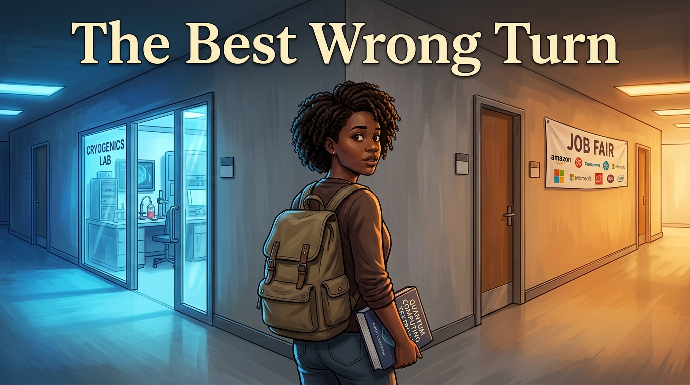
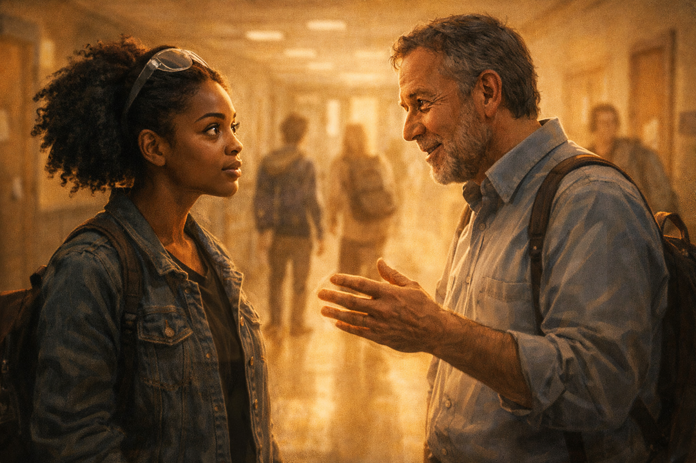
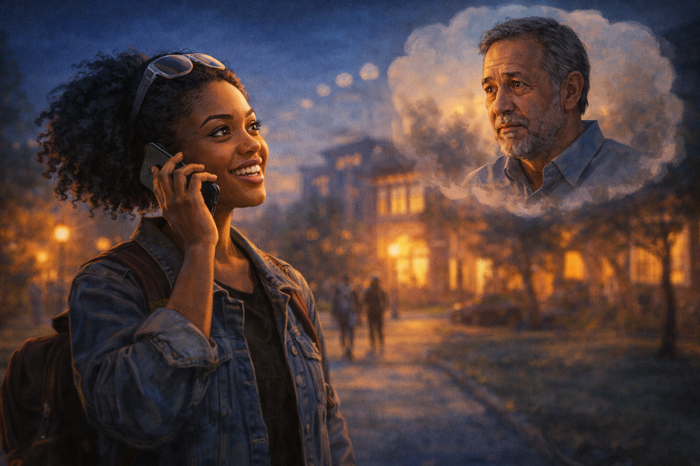
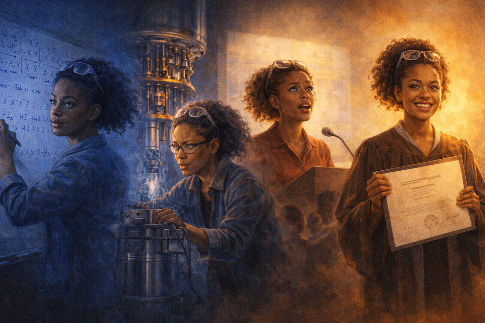
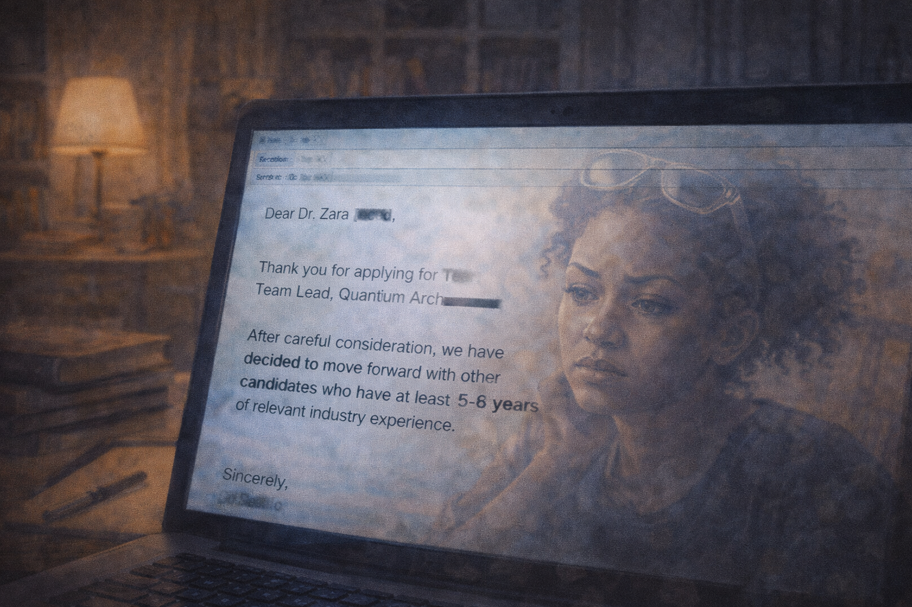
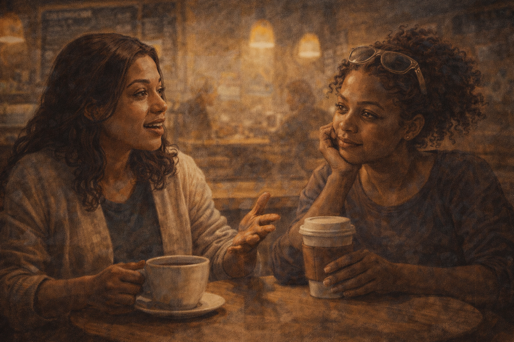
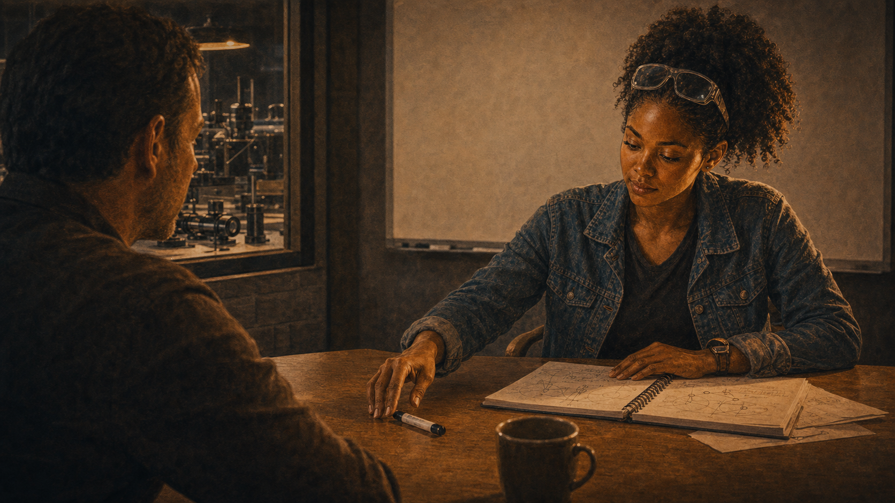
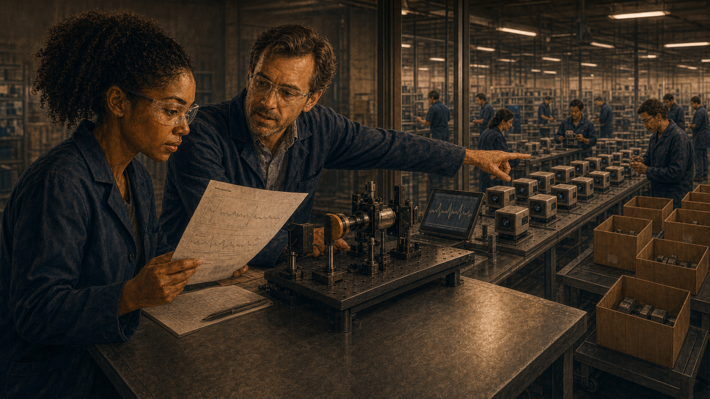
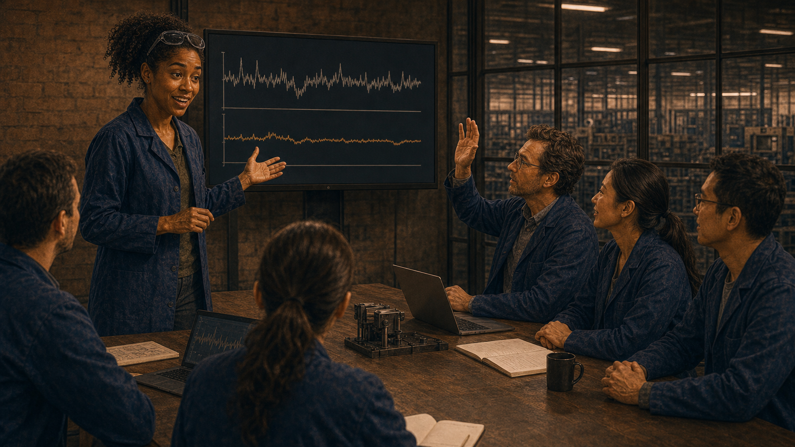
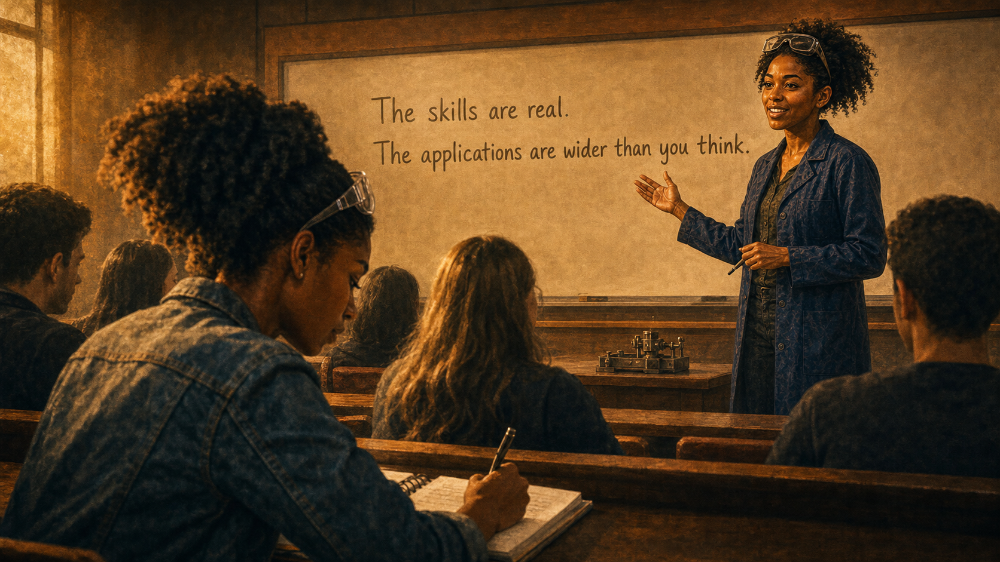

# The Best Wrong Turn

A talented student follows the quantum hype into a PhD that the job market was not ready for.

Cover Image 

Generate a wide-landscape graphic novel cover image with a width:height ratio of 16:9. Use rich colors in the style of a thoughtful, cinematic graphic novel — expressive character faces, dramatic lighting, environments that reflect emotional tone.

  Not cartoonish. Think Saga or Maus rather than superhero comics.
  Do not put any captions or text in the image EXCEPT the title at the top.

  Place the title text at the top of the image: "The Best Wrong Turn"

  Show Zara — a Black woman in her late 20s, natural hair, backpack, a quantum computing textbook under one arm — standing at a literal fork in a university corridor. One corridor glows with the blue light of a cryogenics lab visible through a glass door; the other leads to warm office light and a row of company logos on a job fair banner. She is looking back over her shoulder, not yet committed to either direction. Her expression holds the genuine curiosity that led her here and the first awareness that the path ahead is less certain than the lecture that inspired her. Color palette: the cool blue of the quantum lab on her left, the warm amber of the job fair on her right, the corridor itself a neutral grey where she stands.

## Panel 1: Front Row of the Lecture

Zara as a junior, front row of quantum computing lecture — hooked

Panel 1 of 14.
Generate a wide-landscape graphic novel drawing with a width:height ratio of 16:9. Use rich colors in the style of a thoughtful, cinematic graphic novel — expressive character faces, dramatic lighting, environments that reflect emotional tone. Not cartoonish. Think Saga or Maus rather than superhero comics. Do not put captions or text in the image. Show Zara — a Black woman, late 20s (younger here, so early 20s), natural hair, safety glasses pushed up on her forehead — in the front row of a university quantum computing lecture. Her notebook is full of furious notes. Her expression is complete absorption — the look of someone who has just found the thing. The lecture hall around her is visible, other students present but less visibly engaged than she is. Color palette: the warm lecture hall light, Zara in bright forward focus against the ambient student surroundings.

Zara is twenty-two and in the front row of Introduction to Quantum Computing, and the professor is describing superposition for the first time in her education and something in her brain clicks and does not unclick. Her pen cannot move fast enough. She fills three pages in one lecture. After class she goes to the library and doesn't leave until the building closes. This is the day she decides.

## Panel 2: The Professor's Promise

After class — professor tells Zara PhD grads will have their pick of jobs

Panel 2 of 14.
Generate a wide-landscape graphic novel drawing with a width:height ratio of 16:9. Use rich colors in the style of a thoughtful, cinematic graphic novel — expressive character faces, dramatic lighting, environments that reflect emotional tone. Not cartoonish. Do not put captions or text in the image. Show the hallway outside the lecture hall after class — Zara talking with her professor, a man in his 50s, warm and genuine. He is leaning slightly forward as he makes his point — he is telling her something he believes. Zara is listening with the intense attention of someone whose future is being described. Both of them are sincere in this moment. Color palette: the hallway light after lecture, the warm human quality of a mentor encouraging a student.

After class, Zara catches the professor in the hallway. She asks two questions about stabilizer codes. He answers them and then says: "The students who get PhDs in quantum computing over the next five years will have their pick of positions. The field is expanding faster than the talent pool." He says this because he believes it. He has been watching the field for twenty years and he is tracking the investment curves. He is not wrong about the investment. He is wrong about what follows from it.

## Panel 3: The Phone Call Home

Zara calls her parents: "I'm getting my PhD." Dad asks about jobs.

Panel 3 of 14.
Generate a wide-landscape graphic novel drawing with a width:height ratio of 16:9. Use rich colors in the style of a thoughtful, cinematic graphic novel — expressive character faces, dramatic lighting, environments that reflect emotional tone. Not cartoonish. Do not put captions or text in the image. Show Zara on the phone, standing outside on the university campus in the evening. Her expression is the excitement of a decision made. On the other end of the call, her father's face is shown as a small thought-cloud or partial frame — a man in his 50s, loving but practical, asking the practical question. Zara's answer is visible in her expression: complete confidence. Color palette: the evening campus light, Zara's warm certainty against the cooler evening.

She calls home that evening. "I'm going to do the PhD," she tells her father. He is quiet for a moment. "Are there jobs?" he asks. It is a reasonable question from a man who grew up in a family where employment was not a given. "Professor says absolutely," Zara says. "The field is exploding." Her father says he is proud of her. He does not say: ask the professor for data. Neither of them has thought to ask that yet.

## Panel 4: Five Years — PhD Montage

Five-year PhD montage — whiteboards, cryostats, thesis defense, diploma

Panel 4 of 14.
Generate a wide-landscape graphic novel drawing with a width:height ratio of 16:9. Use rich colors in the style of a thoughtful, cinematic graphic novel — expressive character faces, dramatic lighting, environments that reflect emotional tone. Not cartoonish. Do not put captions or text in the image. Show a wide montage panel flowing left to right across five years: Zara (natural hair, now more confident, safety glasses a fixture) at a whiteboard covered in stabilizer code theory; then at a cryogenic system that is not behaving; then at a podium presenting a dissertation defense, slightly nervous; then holding a diploma, genuinely proud. The progression shows growth, difficulty, expertise earned. Color palette: the journey color from uncertainty blue through the warm gold of achievement.

Five years. The dissertation is on error correction thresholds — original, careful, well-reviewed. The defense goes well: four hours of questions from a committee that includes two people who have read every paper in the space, and she answers them. She is, when she walks out of the building with her diploma, genuinely expert in her field. The professor was right about one thing: she knows things that very few people know.

## Panel 5: The Job Search Spreadsheet

The job search spreadsheet — 60 applications; the "quantum computing" column fills with rejections

Panel 5 of 14.
Generate a wide-landscape graphic novel drawing with a width:height ratio of 16:9. Use rich colors in the style of a thoughtful, cinematic graphic novel — expressive character faces, dramatic lighting, environments that reflect emotional tone. Not cartoonish. Do not put captions or text in the image. Show Zara at her desk at home, a laptop open showing a large spreadsheet — rows of companies, columns for status, dates, notes. The quantum computing positions column is visible and the status cells are filling with words that mean rejection. Her expression is the controlled tension of someone who expected a different result. The spreadsheet has 60+ rows. Color palette: the home desk light, the visual contrast between the neatly organized spreadsheet and the accumulating rejections.

Sixty applications. She is systematic: national labs, tech company quantum divisions, university research groups, startups. She has a spreadsheet with columns for position, date applied, response, notes. Over four months, the response column fills. Most cells say "no available positions" or no response at all. A few say "impressive credentials but we need someone with industry experience." She does not yet have industry experience. Almost no one does — the field is too new.

## Panel 6: The Rejection Email

Rejection close-up: "5+ years industry experience required" — she has zero

Panel 6 of 14.
Generate a wide-landscape graphic novel drawing with a width:height ratio of 16:9. Use rich colors in the style of a thoughtful, cinematic graphic novel — expressive character faces, dramatic lighting, environments that reflect emotional tone. Not cartoonish. Do not put captions or text in the image. Show Zara's laptop screen with a rejection email open — the kind where one phrase carries the weight: a requirement for years of industry experience. Zara's reflection is faintly visible in the screen. Her expression has the weariness of someone who has read a version of this sentence many times. The home or apartment setting around the laptop suggests she has been job searching for weeks. Color palette: the screen glow in a home setting, the close focus of a single email that represents a pattern.

The rejection she reads on a Tuesday at 9 a.m. is typical and not personal: "We are looking for candidates with 5+ years of industry experience in superconducting qubit systems." She has zero years of industry experience. The PhD is five years. She was in school. The industry was too young to have people with both the PhD and the industry time. The posting is asking for a combination that essentially does not yet exist.

## Panel 7: The Cohort Friend

Coffee shop — Zara's cohort friend describes an HPC job: "Not what I pictured. But it's real."

Panel 7 of 14.
Generate a wide-landscape graphic novel drawing with a width:height ratio of 16:9. Use rich colors in the style of a thoughtful, cinematic graphic novel — expressive character faces, dramatic lighting, environments that reflect emotional tone. Not cartoonish. Do not put captions or text in the image. Show a coffee shop — Zara and a friend from her PhD cohort, a woman her age, sitting with drinks. The friend is describing her new position: an HPC company, not quantum. Her expression is the pragmatic peace of someone who has landed somewhere real. Zara is listening, her own expression a mix of genuine warmth for her friend and private reckoning with what this implies for herself. Color palette: the warm coffee shop light, the intimate setting of two people who have been through something together comparing notes.

Her cohort friend Min landed a position at an HPC company — high-performance classical computing, optimization problems, real data, real customers. "It's not what I pictured," Min says over coffee. "No cryostats, no entanglement. But the problems are hard and the team is smart and they needed exactly what my PhD built. And I start in three weeks." Zara is happy for her. She is also sitting with the difference between what the professor promised and what Min's job description contains.

## Panel 8: The New Search Filter

Zara updates her search: quantum sensing, networking, metrology

Panel 8 of 14.
Generate a wide-landscape graphic novel drawing with a width:height ratio of 16:9. Use rich colors in the style of a thoughtful, cinematic graphic novel — expressive character faces, dramatic lighting, environments that reflect emotional tone. Not cartoonish. Do not put captions or text in the image. Show Zara at her desk, updating her job search filters on a laptop. She is typing new search terms: quantum sensing, quantum networking, quantum metrology. Her expression is pragmatic and focused — she has made a pivot in her thinking and she is acting on it. The spreadsheet from Panel 5 is still visible in another tab, but she is on a new search page. Color palette: the home desk light, the small but significant change of a new search beginning.

She widens the search. Not quantum computing — quantum. Quantum sensing covers atomic clocks, magnetometers, navigation systems. Quantum networking covers quantum repeaters and communication protocols. Quantum metrology covers the most precise measurements in the world. These are not fields where companies are hiring in the abstract future. They are fields where products ship. A different list of positions appears.

## Panel 9: Reading About Quantum Sensing

Zara reads about quantum sensing — real products, real customers

Panel 9 of 14.
Generate a wide-landscape graphic novel drawing with a width:height ratio of 16:9. Use rich colors in the style of a thoughtful, cinematic graphic novel — expressive character faces, dramatic lighting, environments that reflect emotional tone. Not cartoonish. Do not put captions or text in the image. Show Zara reading — papers and company websites about quantum sensing. The content is visible: atomic clocks, brain magnetometers, navigation systems. Her expression is shifting — the re-engagement of someone finding something that is actually interesting. She has her notebook out again and is making marks. The note-taking is the tell. Color palette: the desk light, but warmer now — the return of engaged curiosity.

She reads about quantum magnetometers — devices that can map the magnetic field of a human brain with precision that classical instruments cannot match. She reads about quantum-enhanced GPS-free navigation — relevant to autonomous vehicles and defense. She reads about optical atomic clocks that are now accurate enough to detect gravitational variation with altitude. These are real things. People are buying them. The error correction mathematics from her dissertation is directly applicable to several of the open problems.

## Panel 10: The Interview

Interview at quantum sensing startup — whiteboard challenge; Zara smiles

Panel 10 of 14.
Generate a wide-landscape graphic novel drawing with a width:height ratio of 16:9. Use rich colors in the style of a thoughtful, cinematic graphic novel — expressive character faces, dramatic lighting, environments that reflect emotional tone. Not cartoonish. Do not put captions or text in the image. Show a startup interview setting — Zara and a technical interviewer (a man in his 40s, optics-lab casual) at a small conference table. He has just slid a marker across the table to her — the universal signal of a whiteboard problem being offered. Zara is picking it up with the look of someone who has been waiting for this kind of question: focused, comfortable, ready. The whiteboard is behind her. Color palette: the interview room light, the moment of competence about to be demonstrated.

The interview at the quantum sensing startup covers noise floor modeling, decoherence characterization, and error statistics in sensing arrays. These are Zara's questions. The technical interviewer slides a marker across the table and asks her to walk through the noise floor derivation for a SQUID magnetometer. She goes to the whiteboard. Her dissertation is five years of preparing to answer exactly this kind of question. She fills the board in twenty minutes and then turns around to find the interviewer nodding.

## Panel 11: The Offer Letter

Offer letter — Zara reads it twice; salary higher than any QC role offered

Panel 11 of 14.
Generate a wide-landscape graphic novel drawing with a width:height ratio of 16:9. Use rich colors in the style of a thoughtful, cinematic graphic novel — expressive character faces, dramatic lighting, environments that reflect emotional tone. Not cartoonish. Do not put captions or text in the image. Show Zara holding a printed offer letter — she reads it once, then again. Her expression shifts from focused reading to something that is trying not to be relief but is relief. The salary visible on the letter is clearly good. Around her on the desk, the job search spreadsheet is visible, still open, still full of old rejections. Color palette: the desk light, the warm yellow of a letter that says yes after months of no.

The offer letter arrives on a Thursday and she reads it standing at her kitchen counter. She reads it again sitting down. The salary is higher than any of the quantum computing positions that rejected her had advertised. The role is on a product that ships. The team is eight people and they are looking for her specific expertise. She calls her father. He asks: "Is this what you wanted?" She thinks about the answer. "It might be better," she says.

## Panel 12: First Week — Shipping Products

First week — optics bench, colleague: "200 magnetometer units next quarter"

Panel 12 of 14.
Generate a wide-landscape graphic novel drawing with a width:height ratio of 16:9. Use rich colors in the style of a thoughtful, cinematic graphic novel — expressive character faces, dramatic lighting, environments that reflect emotional tone. Not cartoonish. Do not put captions or text in the image. Show Zara's first week — at an optics bench in a real product lab, safety glasses now properly on, a colleague beside her explaining the system. The colleague is gesturing toward equipment that is clearly part of a production line or product validation setup. The conversation has the matter-of-fact quality of "this is how real things work." Zara's expression is engaged and slightly adjusting — the PhD was theory-heavy; this is product. Color palette: the optics bench light — precise, clean, the quality of a lab that ships things.

Her first week, a colleague walks her through the magnetometer assembly line and says, matter-of-factly: "We're shipping 200 units next quarter to three hospital systems in Europe." Zara stops. She asks to see the spec sheet. She reads it. The devices measure cardiac magnetic fields at five picotesla resolution. They are in clinical trials for detecting arrhythmia in fetal monitoring. Two hundred units. Real hospitals. Real patients. She reads the spec sheet twice.

## Panel 13: Six Months In

Zara presenting noise reduction work — "Where did you learn to think about errors this carefully?"

Panel 13 of 14.
Generate a wide-landscape graphic novel drawing with a width:height ratio of 16:9. Use rich colors in the style of a thoughtful, cinematic graphic novel — expressive character faces, dramatic lighting, environments that reflect emotional tone. Not cartoonish. Do not put captions or text in the image. Show Zara at the front of a team meeting, presenting results from noise reduction work she has done on the sensing array. Her posture is the comfortable authority of someone who knows their material. A colleague — the man from Panel 12 — asks the question about her training. Zara's expression at the question is surprised-pleased, and then she laughs. Color palette: the team meeting light, the warmth of a group that has found someone who solves their problems.

Six months in, she presents the noise reduction improvement — a 23% decrease in the sensing floor from a new signal processing approach she adapted from her dissertation work. Her colleague raises his hand during questions: "Where did you learn to think about errors that carefully?" Zara laughs. "Fault-tolerant quantum computing," she says. He looks blank. "Quantum error correction theory — it's a way of thinking about how errors propagate through a system. The math translates." He writes something in his notebook.

## Panel 14: Guest Lecture

Zara guest-lecturing — "The skills are real. The applications are wider than you think."

Panel 14 of 14.
Generate a wide-landscape graphic novel drawing with a width:height ratio of 16:9. Use rich colors in the style of a thoughtful, cinematic graphic novel — expressive character faces, dramatic lighting, environments that reflect emotional tone. Not cartoonish. Do not put captions or text in the image. Show Zara — now more confident, more settled, safety glasses a permanent accessory — at the front of a university lecture room. The room is the same kind of room she sat in as a student in Panel 1. A student in the front row is taking furious notes. On the whiteboard behind Zara: "The skills are real. The applications are wider than you think." Her posture is the easy authority of someone who has been where these students are and is telling the truth about what comes next. Color palette: the lecture hall light, Zara at the front, a student in the foreground mirroring her own front-row intensity from years before.

She is invited back to her university to guest lecture. She stands at the front of the same room — the same lecture hall, same kind of fluorescent light, same rows of seats. She talks about quantum sensing, about where the jobs actually are, about the translation of quantum error theory into sensing and metrology and navigation. In the front row, a student is writing at the pace Zara recognizes. She points to the whiteboard. "The skills are real," she says. "The applications are wider than you think." The front-row student underlines something. Zara knows exactly what it feels like.

---

**Epilogue:** *Zara's professor wasn't lying — he was forecasting with more confidence than the evidence allowed. The skills he helped her build were real. The job market he promised was not. The gap between those two facts turned out to be, for Zara, the opening through which something better walked in.*
