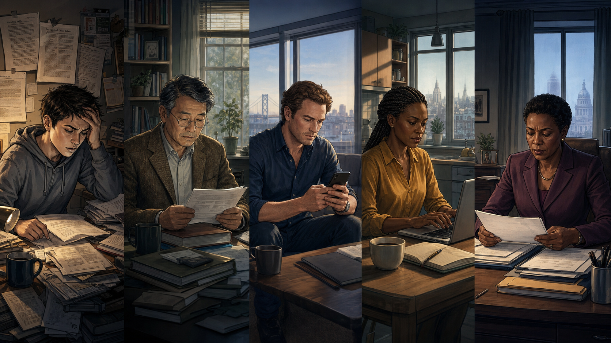
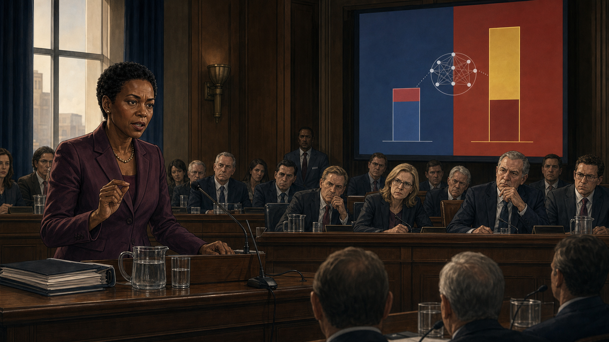
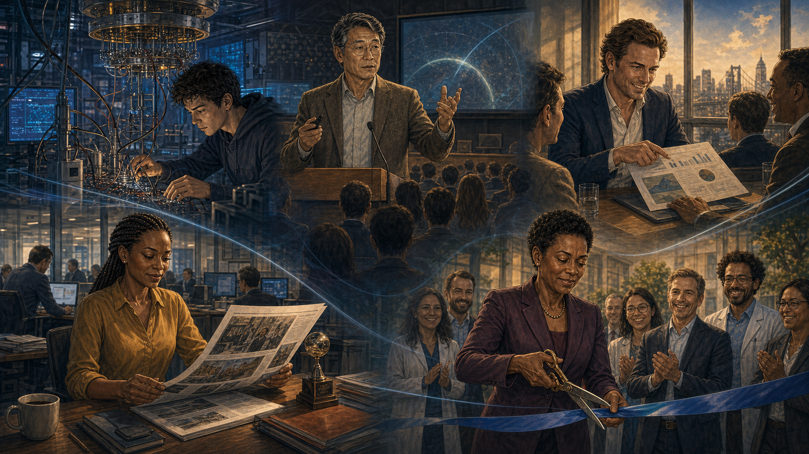
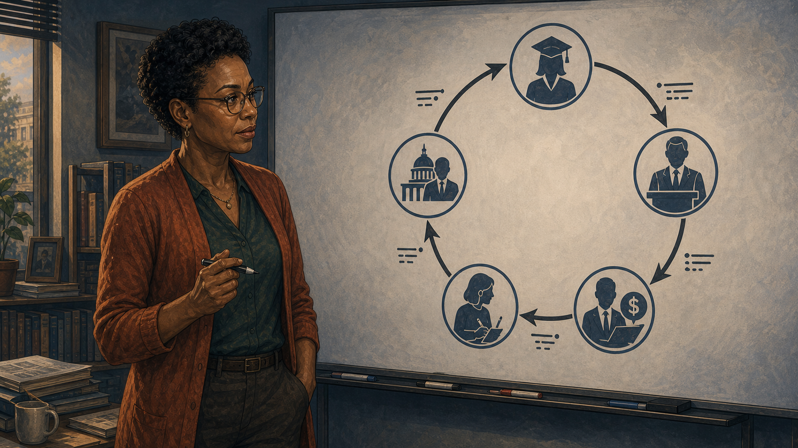
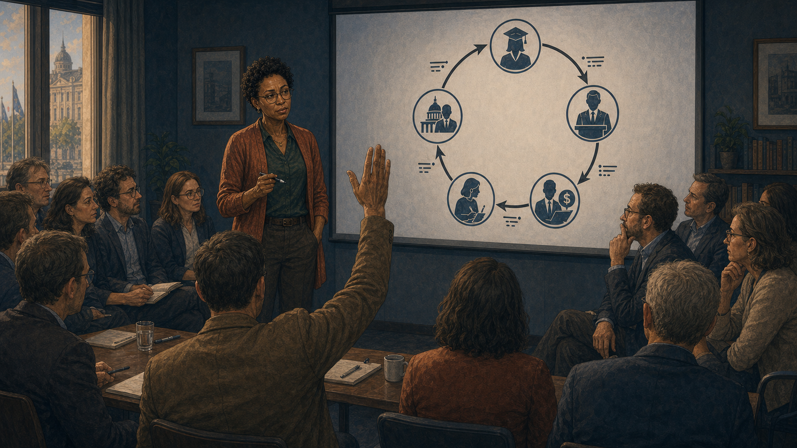
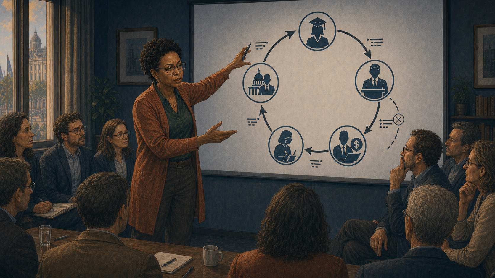
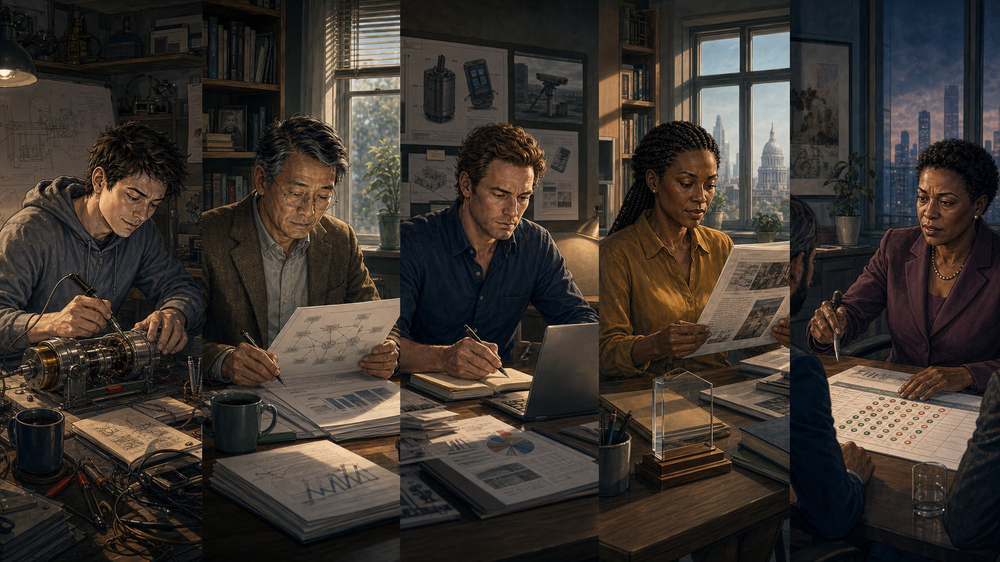
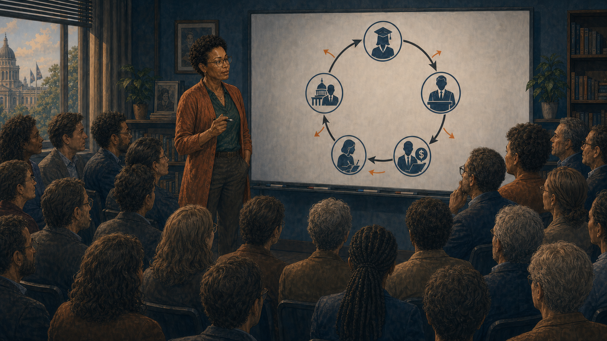

# The Career Incentive Loop

## Panel 1: Five People Waking Up

Split panel — five people waking on the same morning

Generate a wide-landscape graphic novel drawing with a width:height ratio of 16:9. Use rich colors in the style of a thoughtful, cinematic graphic novel — expressive character faces, dramatic lighting, environments that reflect emotional tone. Not cartoonish. Think Saga or Maus rather than superhero comics. Do not put captions or text in the image. Show five small scenes in a split-panel composition — the same morning, five different rooms. Sam: a young androgynous grad student, overwhelmed, surrounded by papers in a small apartment. Prof. Huang: a Chinese-American man in his 50s, tweedy, at a home desk already. Brendan: an Irish-American VC in his 40s, expensive casual, checking his phone in a modern apartment. Kezia: a Black British journalist in her 30s, always typing, at a kitchen table with her laptop open. Director Okonkwo: a Nigerian-American woman in her 50s, government formal even at home, reviewing documents. Color palette: five different morning light palettes — warm amber, cool blue-white, the full range of five different lives beginning the same day.

Five people wake up on the same Tuesday in October. Sam is in a studio apartment near campus, three half-finished thesis proposals pinned to the wall. Professor Huang is at his home desk at 6 a.m., reading grant review scores. Brendan is in his San Francisco apartment, already scrolling through portfolio updates. Kezia is at her kitchen table in London, laptop open before her coffee is ready. Director Okonkwo is at a government office before her team arrives, reviewing budget documents. None of them know the others. All of them will make the same kind of decision today.

## Panel 2: Sam's Funding Comparison

Sam comparing funding available for quantum vs classical thesis topics

Generate a wide-landscape graphic novel drawing with a width:height ratio of 16:9. Use rich colors in the style of a thoughtful, cinematic graphic novel — expressive character faces, dramatic lighting, environments that reflect emotional tone. Not cartoonish. Do not put captions or text in the image. Show Sam — young, androgynous, overwhelmed — at a university computer terminal, looking at a funding database or fellowship listing. Two options are visible on screen: a quantum computing track with multiple fellowships and stipend amounts, and a classical optimization track with fewer and smaller ones. Sam is comparing them with the clear-eyed calculation of someone making a practical decision. Color palette: the department computer lab light, Sam in pragmatic-student mode.

Sam has been admitted to two thesis tracks: quantum computing error correction, and classical optimization for logistics. Both are mathematically interesting. The funding available for quantum is approximately three times larger. Three fellowships, two industry partnerships, a department recruitment goal. Sam pivots to quantum. It is, under any reasonable analysis of the incentive structure, the rational choice.

## Panel 3: Professor Huang's Grant Proposal

Prof. Huang adding "quantum" angles to work that doesn't need them

Generate a wide-landscape graphic novel drawing with a width:height ratio of 16:9. Use rich colors in the style of a thoughtful, cinematic graphic novel — expressive character faces, dramatic lighting, environments that reflect emotional tone. Not cartoonish. Do not put captions or text in the image. Show Professor Huang — a Chinese-American man in his 50s, tweedy jacket, wire-rimmed glasses — at his desk writing a grant proposal. He is in the act of adding a paragraph to a document that is, fundamentally, about classical network theory. The paragraph he's adding connects the work to quantum networking — the connection is there, but it's a stretch and he knows it. His expression shows the slight discomfort of a practical man doing a practical thing. A program officer's email is visible on another screen, the one that mentioned quantum scoring. Color palette: the home-office morning light, the slight moral weight of a practical compromise.

Professor Huang's research is in distributed network protocols — genuinely important, clearly fundable in any reasonable world. A program officer mentioned over lunch that proposals with quantum relevance were scoring double in the current review cycle. Huang's research has a peripheral connection to quantum networking. He writes a section establishing the connection. It takes three hours. It is not dishonest. It is not the reason the work matters. His proposal score, in the next review cycle, will be twelve points higher.

## Panel 4: Brendan's Portfolio Question

Brendan reviewing his portfolio — LP asks "Why no quantum exposure?"

Generate a wide-landscape graphic novel drawing with a width:height ratio of 16:9. Use rich colors in the style of a thoughtful, cinematic graphic novel — expressive character faces, dramatic lighting, environments that reflect emotional tone. Not cartoonish. Do not put captions or text in the image. Show Brendan — an Irish-American VC in his 40s, expensive casual clothes — at his office desk, on a call or in a meeting. An LP (limited partner) is asking the question about quantum exposure. Brendan's expression shows the calculation happening in real time: the LP's concern is not technically well-grounded, but the LP's concern is the LP's concern. He is making a decision about how to respond to incentive pressure. Color palette: the sleek VC office light, the professional calculation of someone managing multiple relationships.

At the quarterly LP review, a pension fund representative asks: "I notice you have no quantum computing exposure. Our peer funds have 4-6% allocation to quantum. Can you explain your positioning?" Brendan's actual view is that most quantum startups are too early for his fund's stage and return requirements. His actual view does not help him retain this LP. He schedules three meetings with quantum startups the following week.

## Panel 5: Kezia's Pitch Lesson

Kezia pitching — classical piece rejected; quantum piece ran front page

Generate a wide-landscape graphic novel drawing with a width:height ratio of 16:9. Use rich colors in the style of a thoughtful, cinematic graphic novel — expressive character faces, dramatic lighting, environments that reflect emotional tone. Not cartoonish. Do not put captions or text in the image. Show Kezia — a Black British journalist in her 30s, always typing — pitching to her editor in a video call or in person. On one side, the editor's reaction to a classical computing pitch (slight disinterest). On the other side, the editor's reaction when Kezia proposes a quantum angle (immediate engagement). Kezia reads the room. She is learning something about her editor that will change what she pitches going forward. Color palette: the editorial environment — busy, deadline-adjacent, the editor's expressions telling the story.

The piece on classical algorithm improvements went through three rounds of edits and ran on page 8. The piece on a quantum computing startup ran front page and generated forty thousand shares. Kezia pitches quantum this week. Next week. The week after. She is a journalist whose work must be published to matter, and she has received a clear signal about what her editor considers publishable. She follows the signal. This is how she keeps her job.

## Panel 6: Director Okonkwo's Budget Defense

Director Okonkwo defending budget — China's quantum investment on the slide

Generate a wide-landscape graphic novel drawing with a width:height ratio of 16:9. Use rich colors in the style of a thoughtful, cinematic graphic novel — expressive character faces, dramatic lighting, environments that reflect emotional tone. Not cartoonish. Do not put captions or text in the image. Show Director Okonkwo — a Nigerian-American woman in her 50s, government formal, precise and authoritative — presenting to a Congressional committee or budget oversight body. Behind her on a slide: a comparison of U.S. and Chinese quantum computing investment. The geopolitical framing is doing the work in the room. Director Okonkwo is doing her job correctly — recommending funding for a national priority based on competitive analysis. Color palette: the formal government hearing light, the authority of the official presenting the case.

Director Okonkwo's program supports AI and quantum computing research across three agencies. Her annual budget defense requires justifying increases. The slide showing China's quantum investment is the most effective slide in the deck. Not because it settles the technical questions, but because it reframes the question from "is this effective?" to "can we afford not to?" She recommended increased funding because that is her honest assessment of the competitive situation. The assessment is based on public information. The public information is not peer-reviewed research.

## Panel 7: Five Decisions — Same Afternoon

All five make their decisions on the same afternoon — a quiet montage

Generate a wide-landscape graphic novel drawing with a width:height ratio of 16:9. Use rich colors in the style of a thoughtful, cinematic graphic novel — expressive character faces, dramatic lighting, environments that reflect emotional tone. Not cartoonish. Do not put captions or text in the image. Show the five characters in a montage of decisive moments happening simultaneously across different time zones and rooms: Sam hitting "submit" on a quantum thesis application. Huang emailing his revised proposal. Brendan scheduling the startup meeting from his phone. Kezia filing her quantum pitch to her editor. Okonkwo signing the budget recommendation document. Each moment is small and ordinary and rational. Color palette: five simultaneous moments — the afternoon light of five different worlds.

At 3 p.m. Eastern, 8 p.m. London, 12 p.m. Pacific: Sam submits the quantum track application. Professor Huang emails the revised proposal. Brendan's assistant sends meeting requests to three quantum startups. Kezia files the quantum pitch. Director Okonkwo signs the budget recommendation. Five decisions, made for five different reasons, all following the same arrow. No coordination. No conspiracy. Just five rational people responding to five sets of incentives that all point the same direction.

## Panel 8: Three Years Later — The Loop Tightens

Three years later — everyone's outcomes positive; the loop tightens

Generate a wide-landscape graphic novel drawing with a width:height ratio of 16:9. Use rich colors in the style of a thoughtful, cinematic graphic novel — expressive character faces, dramatic lighting, environments that reflect emotional tone. Not cartoonish. Do not put captions or text in the image. Show a collage of outcomes three years later: Sam in a funded lab. Professor Huang giving a funded research talk. Brendan presenting portfolio results to smiling LPs. Kezia's byline on a front-page piece. Director Okonkwo at a program ribbon cutting. Each person's decision paid off for them individually. The system that produced these outcomes is visible in the connections between them. Color palette: the warm tones of individual success, slightly cooler when seen as a system.

Three years later: Sam is funded. Professor Huang received the grant. Brendan has a quantum position in his portfolio — one has done well, two are struggling, but he has the exposure his LP wanted. Kezia won a technology journalism award. Director Okonkwo's program was renewed. Each person's rational decision produced a personally rational outcome. The aggregate of five rational decisions produced something that nobody designed and nobody chose — a closed loop of investment, study, coverage, and funding that is increasingly self-sustaining.

## Panel 9: The Diagram

A researcher from outside draws the Career Incentive Loop diagram

Generate a wide-landscape graphic novel drawing with a width:height ratio of 16:9. Use rich colors in the style of a thoughtful, cinematic graphic novel — expressive character faces, dramatic lighting, environments that reflect emotional tone. Not cartoonish. Do not put captions or text in the image. Show a researcher — a woman in her 40s, academic casual, outside the five main roles — at a whiteboard drawing the diagram. Five nodes in a circle: grad student, professor, VC, journalist, program officer. Five arrows connecting them in a loop. Each arrow is labeled. She is studying what she's drawn. Her expression is the particular focus of someone who has just made a structure visible. Color palette: the whiteboard light, the diagram in clean visual logic.

Dr. Farida Osei studies the sociology of scientific investment. She has been mapping the quantum computing ecosystem for four years. On a whiteboard in her university office, she draws the diagram: five nodes, five arrows, a closed loop. Each arrow represents an incentive flow — funding pressure, publication incentive, investor pressure, editorial preference, competitive geopolitics. She steps back and looks at it. There is no entry point for doubt. The loop has no node that profits from skepticism.

## Panel 10: The Workshop Question

Dr. Osei shows the diagram at a workshop — "How do you break it?"

Generate a wide-landscape graphic novel drawing with a width:height ratio of 16:9. Use rich colors in the style of a thoughtful, cinematic graphic novel — expressive character faces, dramatic lighting, environments that reflect emotional tone. Not cartoonish. Do not put captions or text in the image. Show Dr. Osei presenting her diagram at a small academic workshop — maybe fifteen people, mixed group of economists, science policy researchers, and a few physicists. She has the diagram on a slide behind her. The room is quiet. Someone asks the question. Osei's expression is the honest uncertainty of someone who has a diagnosis but not a cure. Color palette: the workshop room light, the diagram as the focal visual anchor.

At the Science Policy Workshop in Brussels, Dr. Osei presents the diagram. She calls it the Career Incentive Loop. The room — mostly science policy researchers and economists — is quiet in the way rooms are quiet when they recognize something they've seen before in a new form. Someone from the back asks: "How do you break it?" Dr. Osei says: "The diagram suggests you'd need changes at multiple nodes simultaneously, or one node to have a very bad outcome publicly." Neither happens easily.

## Panel 11: "You'd Need All Five to Change"

She points to the diagram — all five must change at once, or one has a public bad day

Generate a wide-landscape graphic novel drawing with a width:height ratio of 16:9. Use rich colors in the style of a thoughtful, cinematic graphic novel — expressive character faces, dramatic lighting, environments that reflect emotional tone. Not cartoonish. Do not put captions or text in the image. Show Dr. Osei at the whiteboard, pointing to specific nodes in the diagram. The room listens. Her answer is analytically clear and not comforting — the structural change required is significant. The faces in the room show the particular look of people who understand a difficult truth. Color palette: the workshop light, the diagram on the board, the room in thoughtful attention.

"If you change the grant incentives for grad students, that affects Sam but not the editorial incentives Kezia responds to," Dr. Osei explains. "If you change publication incentives for professors, that doesn't directly change Brendan's LP pressure. The loop is robust because each node is reinforced by the others. You need changes at multiple nodes, or you need a high-profile failure that resets the signal across all five simultaneously." Someone says: "Like an AI winter but for quantum?" She nods. "Something like that."

## Panel 12: Five Years Later — Small Changes

Five years later — same five people; small changes in each

Generate a wide-landscape graphic novel drawing with a width:height ratio of 16:9. Use rich colors in the style of a thoughtful, cinematic graphic novel — expressive character faces, dramatic lighting, environments that reflect emotional tone. Not cartoonish. Do not put captions or text in the image. Show the five characters five years after Panel 1 — each in their current life, each with a small but meaningful change from where they were. Sam at a quantum sensing job, genuinely satisfied. Professor Huang with a second grant for work that is more honestly framed. Brendan at his desk after writing down a quantum position — his notebook shows the loss. Kezia with her name on a corrective piece that she clearly worked hard on. Director Okonkwo at a meeting revising success metrics. Five quiet changes. Color palette: the five different settings, each slightly different in character from their earlier scenes — the colors of experience.

Five years later. Sam went into quantum sensing after the quantum computing job market proved difficult — the skills transferred, the pay is better. Professor Huang received a second grant; this time he submitted the same work with fewer quantum angles, more honest framing. The score was lower; the work is better. Brendan wrote down the quantum position that didn't perform, but two of the three companies pivoted to classical applications of their technology and are doing well. Kezia spent four months writing a corrective long-form piece on quantum hype — it won a different kind of award. Director Okonkwo is quietly revising the program success metrics to include honest baseline comparisons.

## Panel 13: The Weakened Loop

The diagram on a whiteboard — now with small arrows showing where each person changed

Generate a wide-landscape graphic novel drawing with a width:height ratio of 16:9. Use rich colors in the style of a thoughtful, cinematic graphic novel — expressive character faces, dramatic lighting, environments that reflect emotional tone. Not cartoonish. Do not put captions or text in the image. Show Dr. Osei's original diagram, now on a whiteboard at a later workshop, updated with five small additional annotations — one at each node, showing where each person's small change applies friction to the loop. The main loop is still there, still mostly intact. The five small arrows of change are visible but not dominant. The diagram is honest: the loop exists and is slightly weaker. Color palette: the whiteboard light, the original loop in dark ink, the five small changes in a different color.

Dr. Osei updates the diagram. Five small arrows, one at each node: a slight reduction in the incentive that was previously unidirectional. The loop is still there. It is slightly weaker. She presents the updated diagram at the following year's workshop. The room is larger this time — twenty-five people instead of fifteen. Someone asks: "Is this enough?" She says: "No. But it's what happened. And what happened matters."

---

**Epilogue:** *No villain. No fraud. Five people making individually rational decisions inside a system that rewards optimism and penalizes doubt. The most persistent problems in science are not caused by bad actors — they are caused by good actors optimizing for the wrong metrics. You cannot fix this problem by finding someone to blame. You fix it by redesigning the incentives.*
