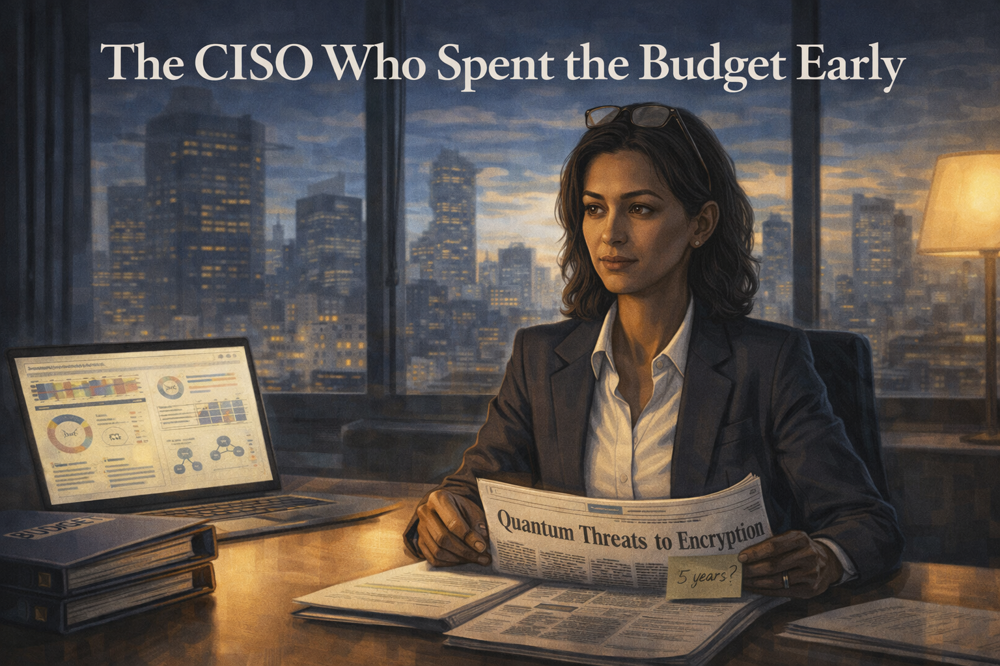
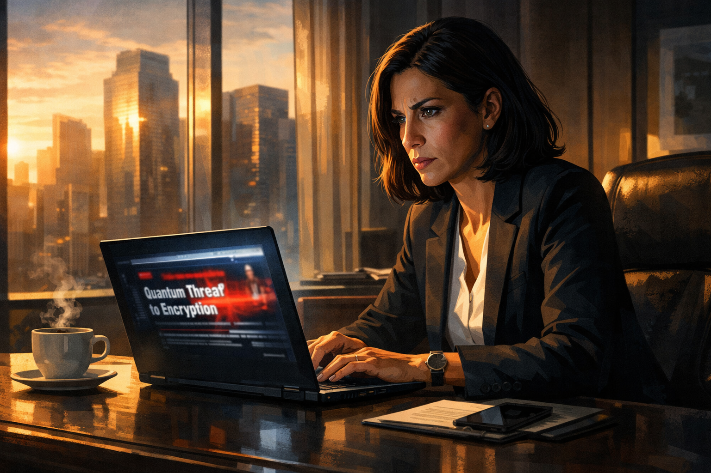
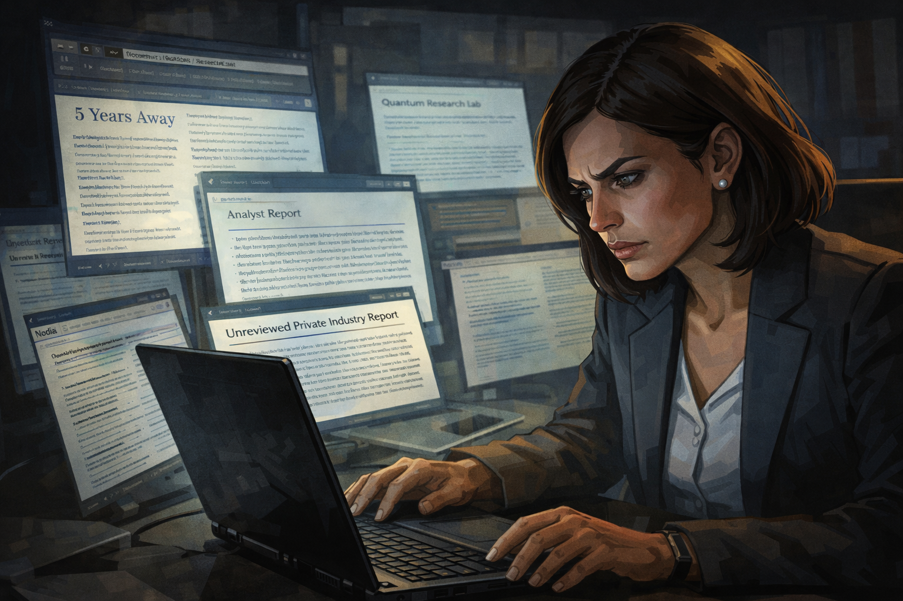
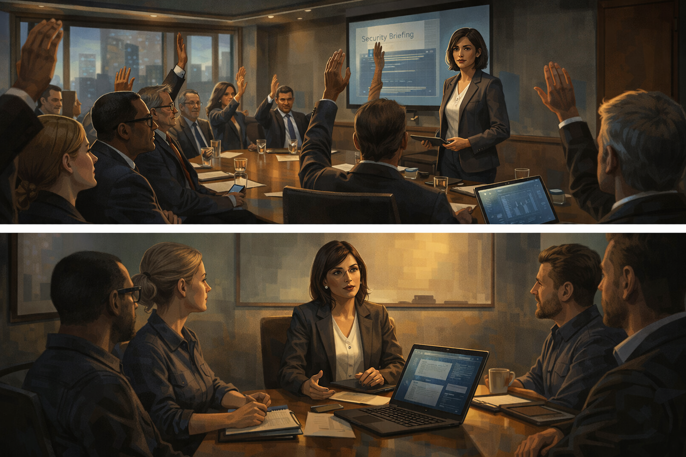
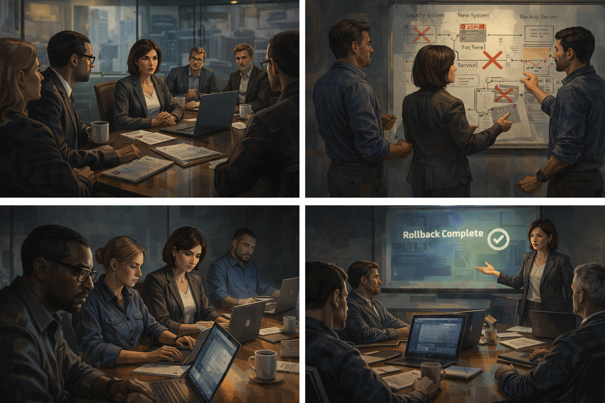
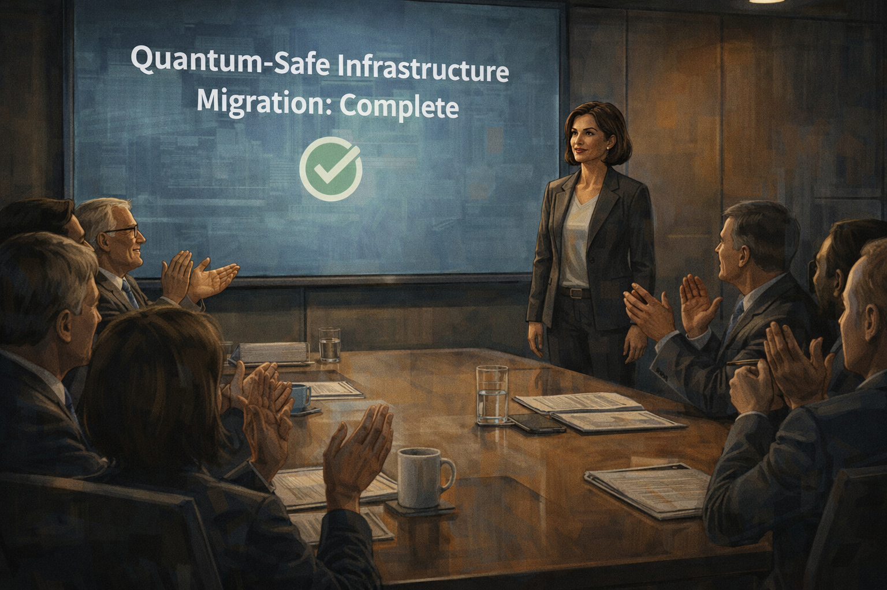
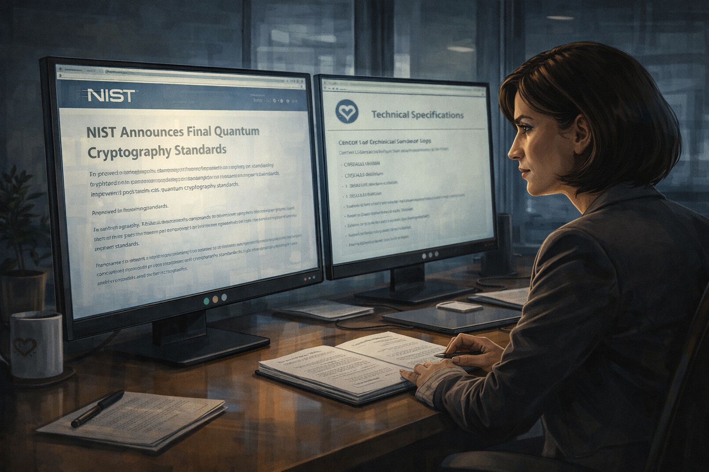
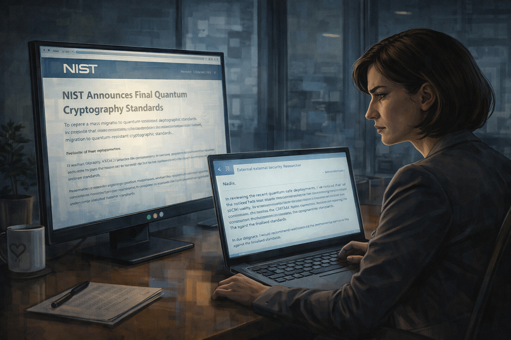
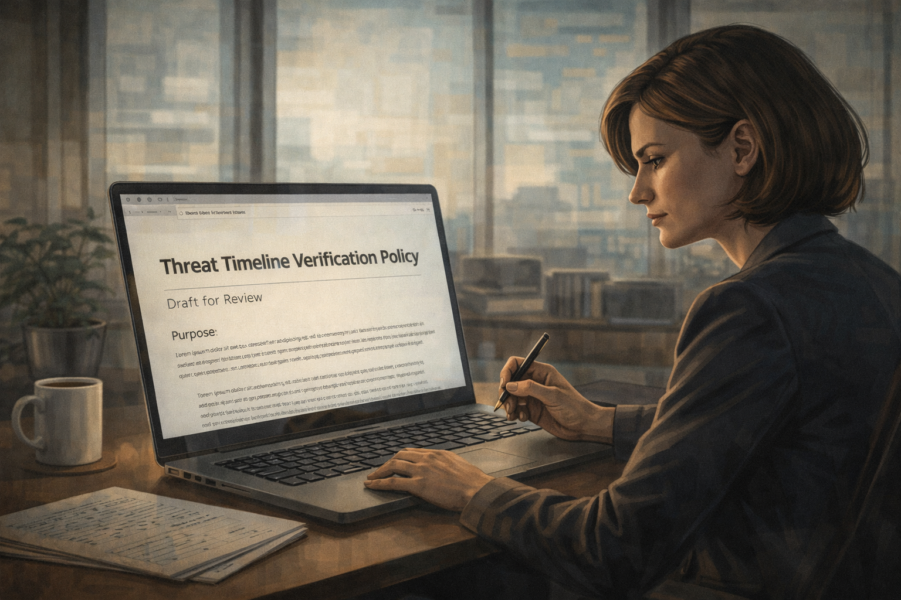
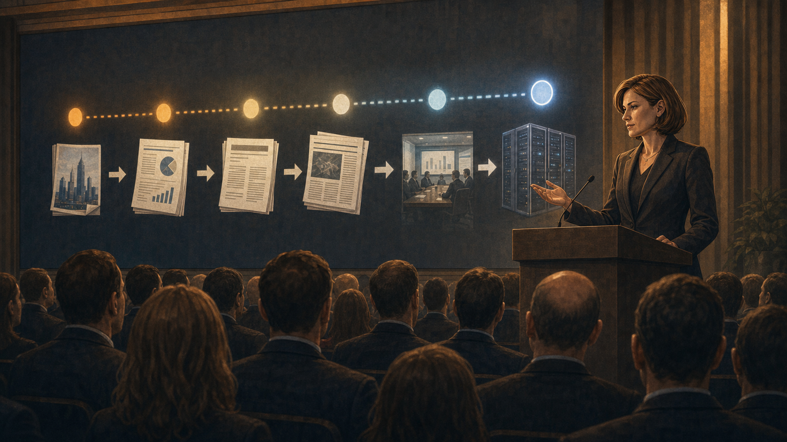

# The CISO Who Spent the Budget Early

A security executive acts on a five-year quantum threat timeline that traces back to one investor deck.

Cover Image 

Generate a wide-landscape graphic novel cover image with a width:height ratio of 16:9. Use rich colors in the style of a thoughtful, cinematic graphic novel — expressive character faces, dramatic lighting, environments that reflect emotional tone.

  Not cartoonish. Think Saga or Maus rather than superhero comics.
  Do not put any captions or text in the image EXCEPT the title at the top.

  Place the title text at the top of the image: "The CISO Who Spent the Budget Early"

  Show Nadia — a Black woman in her 40s, sharp professional composure, reading glasses pushed up on her head — at a boardroom table, a newspaper folded open to a headline about quantum threats to encryption. Behind her, a floor-to-ceiling window shows a city skyline at dusk. On the table: budget binders, a laptop showing an infographic, a stack of vendor proposals. Her expression is the measured focus of someone about to make a very large decision. A small sticky note on the newspaper reads "5 years?" in her handwriting. Color palette: the cool blue of the dusk city behind her, the warm lamp light of the boardroom on the documents, Nadia's composure a still point at the center.

## Panel 1: The Headline

Nadia reads the headline about quantum threat to banking encryption

Panel 1 of 14.
Generate a wide-landscape graphic novel drawing with a width:height ratio of 16:9. Use rich colors in the style of a thoughtful, cinematic graphic novel — expressive character faces, dramatic lighting, environments that reflect emotional tone. Not cartoonish. Think Saga or Maus rather than superhero comics. Do not put captions or text in the image. Show Nadia — a Middle Eastern woman, mid-40s, executive attire, always with a laptop open, sharp and methodical — at her desk in a financial institution's executive suite, reading a headline on her laptop. The headline implies urgent quantum threat to encryption. Her expression is the focused alertness of a security professional receiving a threat signal. Coffee on her desk. Morning light through floor-to-ceiling windows. Color palette: the executive suite morning light, Nadia in professional command mode.

Nadia reads the article over her second coffee and her professional reflexes engage before her critical analysis can catch up. "Quantum Threat to Banking Encryption: Experts Say Clock Is Ticking" — the publication is credible, the story is structured as news (not opinion), and the quoted experts sound authoritative. "Five years" is the central number. As the Chief Information Security Officer of a major bank, Nadia is paid to take five-year threats seriously. She opens a new document and starts writing notes.

## Panel 2: Tracing the Claim

Nadia traces the "five years" claim back to one investor presentation

Panel 2 of 14.
Generate a wide-landscape graphic novel drawing with a width:height ratio of 16:9. Use rich colors in the style of a thoughtful, cinematic graphic novel — expressive character faces, dramatic lighting, environments that reflect emotional tone. Not cartoonish. Do not put captions or text in the image. Show Nadia doing research — multiple browser tabs open, tracking a citation chain. Her expression shows methodical focus. She is following the "five years" claim from the article back through its sources: the article cites an analyst report, which cites a white paper, which cites... something. Her expression shifts slightly as she realizes where the chain leads — not peer-reviewed science. Color palette: the research-session light of multiple screens, the quiet intensity of source-chasing.

She spends forty minutes tracing the "five years" claim before a call pulls her away. The article cites an analyst's report. The analyst's report cites a white paper. The white paper references several sources, and she opens them in new tabs — one is an academic paper with no specific timeline, one is a news article (circular), and one is a company presentation. She bookmarks the company presentation to read later. The meeting starts. She closes the tabs.

## Panel 3: Board Meeting Preparation

The article is from a major publication — Nadia puts her notes away, prepares slides

Panel 3 of 14.
Generate a wide-landscape graphic novel drawing with a width:height ratio of 16:9. Use rich colors in the style of a thoughtful, cinematic graphic novel — expressive character faces, dramatic lighting, environments that reflect emotional tone. Not cartoonish. Do not put captions or text in the image. Show Nadia at her desk in the afternoon, the half-finished source-tracing research visible in one browser window as she minimizes it to open a slide presentation in another. Her expression is the professional decision of someone choosing action over further analysis — she doesn't have time to complete the trace before tomorrow's board meeting, and the article is from a credible outlet. Color palette: the afternoon desk light, the choice between two open windows.

The board meeting is tomorrow. The article is from the Financial Times. She did not finish tracing the source chain — three tabs down a rabbit hole before a meeting pulled her away. She builds the presentation around the threat as described: credible source, consistent with general expert consensus about quantum risk to RSA and ECC encryption, actionable timeline. She includes the caveat "timeline estimates vary" in the notes section. Not in the slide.

## Panel 4: Board Meeting — The CTO's Question

Board meeting — CTO asks how certain the timeline is; Nadia's answer

Panel 4 of 14.
Generate a wide-landscape graphic novel drawing with a width:height ratio of 16:9. Use rich colors in the style of a thoughtful, cinematic graphic novel — expressive character faces, dramatic lighting, environments that reflect emotional tone. Not cartoonish. Do not put captions or text in the image. Show the board meeting — a formal boardroom, executives around a long table. Nadia is presenting. The CTO — a man in his 50s, technically literate — asks the question about certainty. Nadia's answer is visible in her expression and posture: she frames uncertainty honestly but leans on the asymmetric risk argument. The board members are listening, several of them nodding at the "downside if we wait" framing. Color palette: the boardroom formal light, the slight weight of a decision being made.

The CTO asks: "How certain is the five-year timeline?" Nadia answers carefully: "The timeline is uncertain — it could be longer. But the question I'd ask the board is this: if we wait for certainty and we're wrong, we have an existential infrastructure failure. If we move early and the timeline was longer, we have spent money we would have needed to spend eventually anyway." Several board members nod. It is a sound risk argument. It is also built on a timeline whose source she didn't fully trace.

## Panel 5: The $2M Approved

$2M approved — infrastructure project begins

Panel 5 of 14.
Generate a wide-landscape graphic novel drawing with a width:height ratio of 16:9. Use rich colors in the style of a thoughtful, cinematic graphic novel — expressive character faces, dramatic lighting, environments that reflect emotional tone. Not cartoonish. Do not put captions or text in the image. Show the board vote and approval moment — a raised-hand or unanimous approval around the boardroom table. Nadia receives the approval with the professional composure of someone who has moved a serious initiative forward. Her team is with her for the briefing afterward — three or four security professionals in a smaller meeting room. Color palette: the boardroom approval light, the shift to the energized working-meeting light of a project beginning.

The project is approved at $2 million. Nadia briefs her team the same afternoon: the threat is real, the timeline is pressing, migration to post-quantum cryptography must begin immediately. Her team is competent and dedicated. They understand the urgency because she communicated it clearly. They begin that week.

## Panel 6: Eighteen Months of Pain

Eighteen months of legacy systems, failed migrations, vendor renegotiations

Panel 6 of 14.
Generate a wide-landscape graphic novel drawing with a width:height ratio of 16:9. Use rich colors in the style of a thoughtful, cinematic graphic novel — expressive character faces, dramatic lighting, environments that reflect emotional tone. Not cartoonish. Do not put captions or text in the image. Show a montage of the eighteen-month project — Nadia and her team across multiple scenes: a conference room with a vendor, a whiteboard showing migration diagrams with red X marks on failed paths, a late-night work session, a presentation of a rolled-back migration. The project is large and difficult. The team looks capable but exhausted. Color palette: the working blues and greys of a long infrastructure project, the accumulated evidence of real effort.

The project is everything a cryptographic infrastructure migration is expected to be: legacy systems that weren't built with migration in mind, vendor contracts that require renegotiation, two migration paths tested and rolled back after compatibility failures, staff time that pulls from other security work. Eighteen months. The team performs well under difficult conditions. Nadia respects their work. She respects what this cost.

## Panel 7: The Certified Vendor

A vendor calls: "Fully certified" — NIST hasn't finalized standards yet

Panel 7 of 14.
Generate a wide-landscape graphic novel drawing with a width:height ratio of 16:9. Use rich colors in the style of a thoughtful, cinematic graphic novel — expressive character faces, dramatic lighting, environments that reflect emotional tone. Not cartoonish. Do not put captions or text in the image. Show Nadia on a call with a vendor — a man on a video screen, confident and sales-ready. He is describing his solution as certified. Nadia is writing notes. Her expression is professional acceptance — she asks the right questions, receives the right answers, and the certification claim is the kind that sounds authoritative. The detail that NIST hasn't finalized standards is not yet in the room. Color palette: the video call blue-white, Nadia in her professional evaluation mode.

A vendor calls in month twelve with a fully packaged solution: "NIST post-quantum ready, fully certified, deployed in three major financial institutions." Nadia asks for the certification documentation. It arrives and looks right — the algorithm names match NIST's draft guidance, the security analysis is thorough, the vendor's reputation is solid. She recommends the solution to the board. The board approves. The implementation begins.

## Panel 8: Project Complete

Project complete — "We are quantum-safe." Board applause.

Panel 8 of 14.
Generate a wide-landscape graphic novel drawing with a width:height ratio of 16:9. Use rich colors in the style of a thoughtful, cinematic graphic novel — expressive character faces, dramatic lighting, environments that reflect emotional tone. Not cartoonish. Do not put captions or text in the image. Show a board presentation — Nadia at the front presenting the completed project. Her slide says "Quantum-Safe Infrastructure Migration: Complete." The board applauds — a real response to a real accomplishment. Nadia accepts it with the composure of a job done. She has no reason, in this moment, to feel anything except justified professional satisfaction. Color palette: the boardroom formal light, the warm approval of a completed initiative.

The project completes on budget, two months past the original schedule, which is a good outcome for a migration of this complexity. Nadia presents the completion to the board: "The institution's critical encryption infrastructure has been migrated to post-quantum cryptographic standards." The board applauds. The completion is real. The work was real. The system is, in fact, more secure than it was. This is all true.

## Panel 9: NIST Releases Final Standards

NIST releases final standards — they differ from the vendor's implementation

Panel 9 of 14.
Generate a wide-landscape graphic novel drawing with a width:height ratio of 16:9. Use rich colors in the style of a thoughtful, cinematic graphic novel — expressive character faces, dramatic lighting, environments that reflect emotional tone. Not cartoonish. Do not put captions or text in the image. Show Nadia at her desk reading the NIST announcement — a government document page on her screen. Her expression shifts from initial satisfaction to the focused look of someone comparing what they read to what they remember. Side by side: the NIST final standards and the vendor's technical specification. Something is different. Color palette: the desk light, the cooler quality of a discrepancy being noticed.

Three months after the project completion, NIST releases its final post-quantum cryptography standards. The finalization differs from the draft in one significant area: the lattice-based algorithm variant selected for key encapsulation. The variant NIST standardized is not the one the vendor implemented. The difference is technical — both are post-quantum secure — but NIST compliance requires the standardized algorithm. Nadia sits with this information for a long moment.

## Panel 10: The Security Researcher's Email

Security researcher's email: "Your new system uses a non-standard lattice variant"

Panel 10 of 14.
Generate a wide-landscape graphic novel drawing with a width:height ratio of 16:9. Use rich colors in the style of a thoughtful, cinematic graphic novel — expressive character faces, dramatic lighting, environments that reflect emotional tone. Not cartoonish. Do not put captions or text in the image. Show Nadia reading an email from an external security researcher — someone who has been reviewing quantum-safe deployments. The email is technical and specific: the lattice variant issue. Nadia's expression is the controlled processing of someone receiving confirmation of what she already suspected. Her laptop is open. The NIST final document is still on screen. Color palette: the desk light, the blue-white screen of the email, the quiet cost of being ahead of a standard rather than aligned with it.

The email arrives six days after the NIST release, from a cryptographer at a university who monitors major financial institution security postures as part of a research program. He is polite and specific: the system deployed uses a particular lattice-based key encapsulation variant; NIST finalized a different variant; interoperability with NIST-compliant systems will require migration. He asks if she is aware of this. She replies that she is reviewing it.

## Panel 11: Tracing the Original Claim

Nadia traces the "five years" claim — finds it leads to a startup pitch deck

Panel 11 of 14.
Generate a wide-landscape graphic novel drawing with a width:height ratio of 16:9. Use rich colors in the style of a thoughtful, cinematic graphic novel — expressive character faces, dramatic lighting, environments that reflect emotional tone. Not cartoonish. Do not put captions or text in the image. Show Nadia at her desk, returning to the browser research she had closed eighteen months ago. She finishes tracing the citation chain she abandoned before the board meeting. She is reading the source document at the end of the chain — a presentation slide from a company. Her expression carries the quiet weight of someone who has found something that would have changed a decision if she had found it earlier. Color palette: the desk research light, the same browser environment from Panel 2 but now she follows it to the end.

She goes back to the browser research. She finds the bookmark from eighteen months ago. She opens the company presentation — a slide deck she'd bookmarked and never read. It is a Series B fundraising pitch for a quantum computing startup. Slide 11 shows a timeline of when quantum computers will break RSA-2048 encryption. The source for the timeline is labeled as "internal projections." There is no peer-reviewed citation. The startup has since pivoted to classical optimization software.

## Panel 12: The Pitch Deck Source

The source is a Series B pitch deck — the startup has since pivoted

Panel 12 of 14.
Generate a wide-landscape graphic novel drawing with a width:height ratio of 16:9. Use rich colors in the style of a thoughtful, cinematic graphic novel — expressive character faces, dramatic lighting, environments that reflect emotional tone. Not cartoonish. Do not put captions or text in the image. Show the pitch deck slide on Nadia's screen — a startup's fundraising document, the timeline projection visible on the slide. Below it, a news item about the startup's pivot away from quantum hardware. Nadia is looking at both documents. Her expression is the composed recognition of a chain of causation: startup pitch → analyst report → white paper → article → board decision → $2M. Color palette: the screen glow, the quiet weight of a causal chain becoming visible.

The chain runs from startup investor pitch to analyst summary to white paper to Financial Times article to Nadia's board presentation to $2 million in infrastructure spending. Nobody in the chain is a fraud: the startup was making optimistic investor projections, the analyst was reporting on the startup's claims, the white paper was summarizing analyst reports, the article was citing the white paper. At each step, uncertainty stripped away. By the time the number reached Nadia's board, it was presented as fact.

## Panel 13: New Policy Document

New threat timeline verification protocol — all urgency claims trace to primary sources

Panel 13 of 14.
Generate a wide-landscape graphic novel drawing with a width:height ratio of 16:9. Use rich colors in the style of a thoughtful, cinematic graphic novel — expressive character faces, dramatic lighting, environments that reflect emotional tone. Not cartoonish. Do not put captions or text in the image. Show Nadia at her desk, the new policy document on her screen. The document title is visible — something about threat timeline verification. She is finalizing it before distributing it to her team. Her expression is the quiet professionalism of someone converting a hard lesson into institutional practice. Color palette: the morning desk light, the clean white of a new document, the calm of a person who has processed something and made something useful from it.

She writes the policy herself: any security threat that includes a specific timeline claim — "five years," "ten years" — requires citation to a primary source. The primary source must be peer-reviewed research or a primary government assessment, not a journalist's report, an analyst summary, or a company presentation. The policy is two pages. She adds it to the onboarding materials for her team and sends it to three peer CISOs she respects. Two of them email back asking to co-author an industry version.

## Panel 14: The Conference

Nadia at a security conference: "The quantum threat is real. The timeline was manufactured."

Panel 14 of 14.
Generate a wide-landscape graphic novel drawing with a width:height ratio of 16:9. Use rich colors in the style of a thoughtful, cinematic graphic novel — expressive character faces, dramatic lighting, environments that reflect emotional tone. Not cartoonish. Do not put captions or text in the image. Show Nadia at a security conference — on a panel or at a podium. Her expression is the composed authority of someone who has learned something the hard way and is teaching it clearly. The audience is attentive — security professionals, the people who make the same decisions she made. She is telling them the thing she needed to hear before she made her decision. Color palette: the conference stage light, Nadia in full professional command.

At the Financial Services Security Summit the following year, Nadia presents on quantum threat assessment methodology. She tells the full story: the article, the board meeting, the $2 million, the NIST divergence, the pitch deck at the end of the citation chain. The audience is very quiet during the source-tracing section. Afterward, three CISOs find her at the coffee table with the same question: how do you tell the real threat from the manufactured urgency? She gives them the two-page policy document.

---

**Epilogue:** *Nadia did her job exactly as a responsible security executive should. The failure was upstream: a technical claim, stripped of its uncertainty at each retelling, became a fact by the time it reached her boardroom. She spent $2M on a real problem with a fabricated deadline. The lesson is not to ignore risks. It is to verify the timeline before the timeline verifies you.*
