# The Decoherence Clock

## Panel 1: First Celebration

Dr. Yuki as postdoc, celebrating coherence going from 50 to 100 microseconds

Generate a wide-landscape graphic novel drawing with a width:height ratio of 16:9. Use rich colors in the style of a thoughtful, cinematic graphic novel — expressive character faces, dramatic lighting, environments that reflect emotional tone. Not cartoonish. Think Saga or Maus rather than superhero comics. Do not put captions or text in the image. Show Dr. Yuki — a Japanese woman, late 30s (younger here, so late 20s), cleanroom-ready at all times, hair tied back, surrounded by cryogenic equipment — as a postdoc in a quantum lab, celebrating a result with two colleagues. Paper cups with what might be cheap champagne. A monitor in the background shows a measurement result — a coherence time number that represents a doubling. The celebration is genuine, small-scale, real. Color palette: the lab lighting with the warm flush of a real achievement, the blue-white of equipment alongside the warmth of the people.

Dr. Yuki is twenty-nine and has been a postdoc for eight months when the coherence time on their qubit design doubles from 50 to 100 microseconds. Her advisor produces cheap champagne from a mini-fridge behind his desk, which is how she knows this is significant. 100 microseconds is real — it's publishable, it's a step toward the millisecond range that fault-tolerant computation requires. She writes the result in her notebook. She puts a small star next to it.

## Panel 2: Grant Proposal

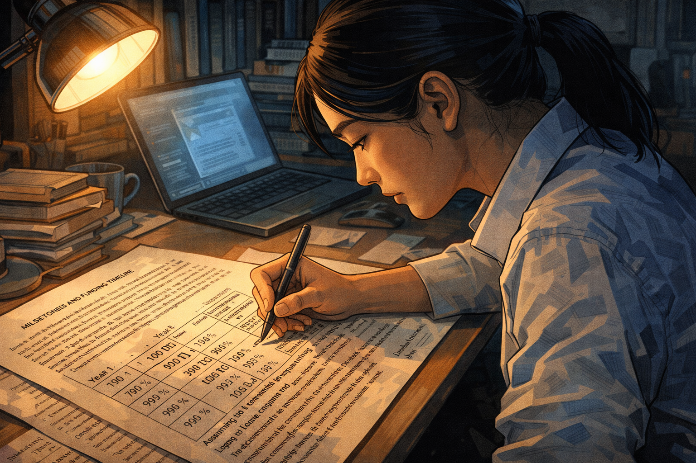

Dr. Yuki's grant proposal: "Projected coherence in 5 years: 10ms"

Generate a wide-landscape graphic novel drawing with a width:height ratio of 16:9. Use rich colors in the style of a thoughtful, cinematic graphic novel — expressive character faces, dramatic lighting, environments that reflect emotional tone. Not cartoonish. Do not put captions or text in the image. Show Dr. Yuki at a desk, writing or reviewing a grant proposal document. The proposal is visible — technical, dense, with projected milestone numbers. Her expression is the earnest forward focus of a researcher building an argument for her future. The numbers she writes are projections, not certainties, but in the proposal they look like certainties — that is what grant proposals require. Color palette: the desk light of careful academic writing, Yuki in professional focus.

The independent grant proposal requires milestones. Yuki writes: "Year 1: 500 microseconds. Year 3: 1 millisecond (required threshold for fault tolerance). Year 5: 10 milliseconds." These numbers are extrapolations from the improvement curves in the published literature — if the trend continues, this is the trajectory. The grant reviewers want to see a path. She draws the path. She believes in the path. The path assumes the trend continues. All paths assume this.

## Panel 3: The Lab

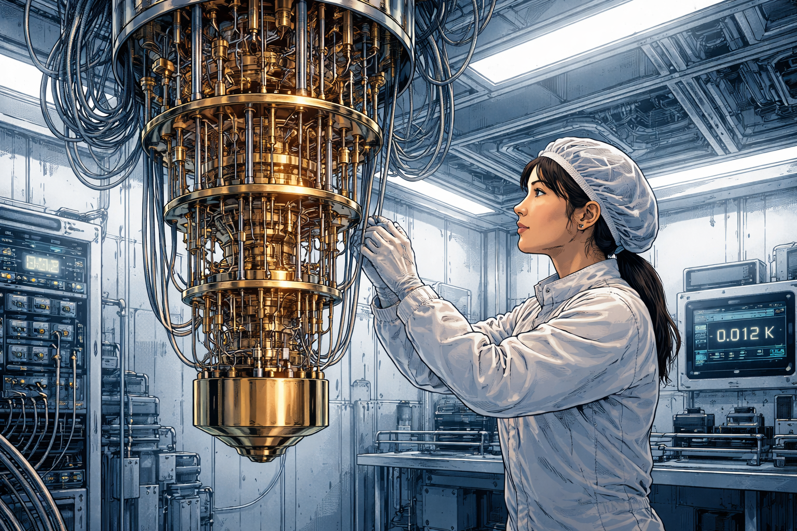

The beautiful alien hardware — dilution refrigerator, cables, 15 millikelvin

Generate a wide-landscape graphic novel drawing with a width:height ratio of 16:9. Use rich colors in the style of a thoughtful, cinematic graphic novel — expressive character faces, dramatic lighting, environments that reflect emotional tone. Not cartoonish. Do not put captions or text in the image. Show Yuki's new lab — her own lab now — with a dilution refrigerator as the visual centerpiece. The fridge hangs from the ceiling, a forest of coaxial cables running up and down its length. The equipment has the beautiful alien quality of something designed for extreme conditions — clean, precise, strange. Yuki stands beside it in cleanroom gear, adjusting something. The temperature readout somewhere in the scene suggests near absolute zero. Color palette: the cool blue-silver of cryogenic equipment, the cleanroom white of the surrounding space, the science-fiction quality of extreme physics made real.

Her lab, when she gets it, is organized around the dilution refrigerator — a meter-tall cylinder of stainless steel and copper that cools the quantum chip at its center to fifteen millikelvin. Colder than empty space. The cables running in and out of it are organized with the care that the technology requires: any vibration, any stray electromagnetic signal can destroy the quantum states she is trying to preserve. She tends this machine the way some people tend a living thing. It responds with results.

## Panel 4: Year 2 — New Shielding Works

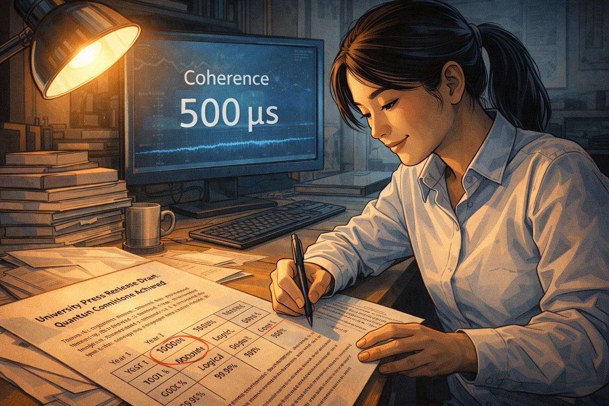

New shielding reaches 500 microseconds — press release drafted

Generate a wide-landscape graphic novel drawing with a width:height ratio of 16:9. Use rich colors in the style of a thoughtful, cinematic graphic novel — expressive character faces, dramatic lighting, environments that reflect emotional tone. Not cartoonish. Do not put captions or text in the image. Show Yuki at a monitor showing the coherence measurement — 500 microseconds, a clear record. She is drafting or reviewing a university press release at a desk nearby. Her expression is genuine satisfaction. On her desk, the grant proposal milestone chart is visible — Year 1 target: 500 microseconds — she has hit it. Color palette: the lab success light, the warmth of a milestone achieved.

Year 2: the new electromagnetic shielding configuration reaches 500 microseconds. It is a university press release — "Record Coherence Time Achieved" — and three quantum computing publications write it up. The grant milestone is met ahead of schedule. Yuki allows herself the satisfaction of a person who is, by the evidence, on the right trajectory. She begins designing the next shielding iteration. She is planning the path to 1 millisecond.

## Panel 5: The New Error Mode

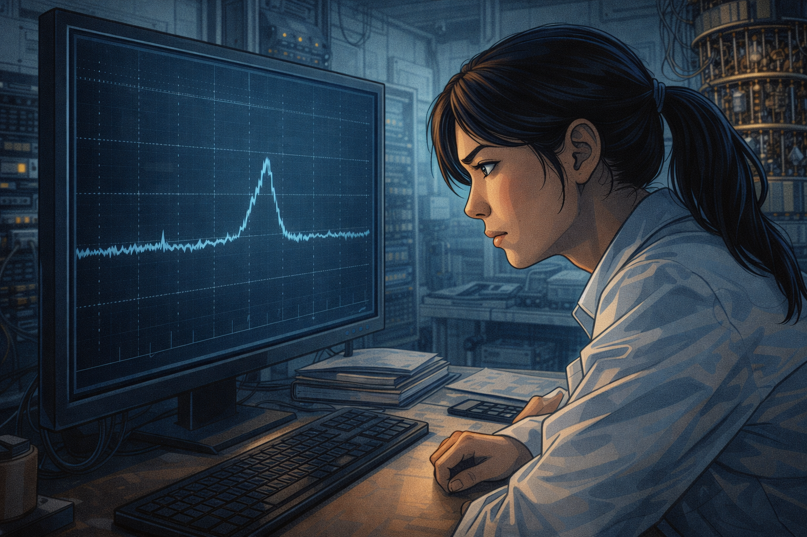

New shielding changes EM environment — a different error mode appears

Generate a wide-landscape graphic novel drawing with a width:height ratio of 16:9. Use rich colors in the style of a thoughtful, cinematic graphic novel — expressive character faces, dramatic lighting, environments that reflect emotional tone. Not cartoonish. Do not put captions or text in the image. Show Yuki at her monitor, studying a new measurement — a different error signature from the one she was controlling. The screen shows a graph with a new feature: a bump, or an asymmetry, that wasn't there before. Her expression is puzzled concentration — she is looking at something unexpected. The lab around her is running normally. Color palette: the lab working light, Yuki's focus sharpening around a problem that wasn't in the plan.

The improved shielding changes the electromagnetic environment in ways she didn't fully model. Three weeks after the 500-microsecond result, a different error mode appears in the spectroscopy: a frequency-specific decoherence source that the old shielding was, apparently, accidentally suppressing through a different mechanism. Yuki maps it, traces it, identifies its source. Fixing it will require a change to the shielding that will reduce the coherence time she just measured. The problem has moved, not shrunk.

## Panel 6: Staring at the Total Error Rate

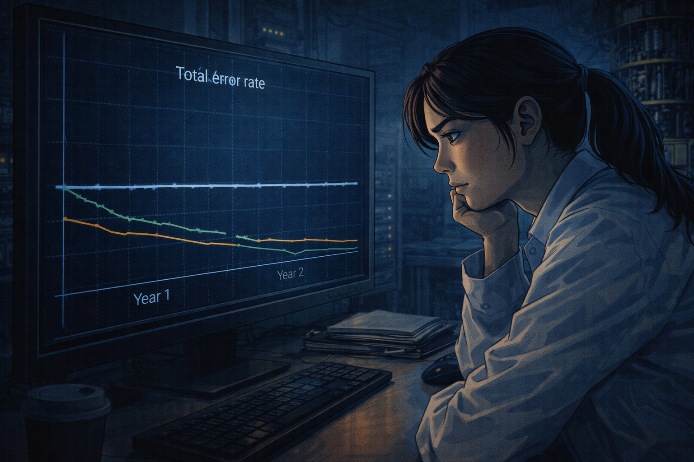

Late at night — total error rate unchanged despite "records"

Generate a wide-landscape graphic novel drawing with a width:height ratio of 16:9. Use rich colors in the style of a thoughtful, cinematic graphic novel — expressive character faces, dramatic lighting, environments that reflect emotional tone. Not cartoonish. Do not put captions or text in the image. Show Yuki at her station very late at night, a graph on her monitor. The graph plots the total error rate over two years of her lab's existence. The line shows individual components improving (one goes down, then another) but the total error rate — the actual figure of merit — is essentially flat. Her expression is the particular focus of a scientist who is seeing something true and difficult. Color palette: the late-night monitor glow, the flat line as the visual story.

She makes a graph she has never shown anyone: total error rate over time, not broken down by component but as a single number. The line is flat. Every time she improves one source of error, another source emerges. The coherence time is 500 microseconds — a "record." The gate fidelity has improved. The two-qubit error rate has slightly worsened. The net total has not moved in eighteen months. She stares at this graph late at night, alone. It is saying something that the individual progress plots do not say.

## Panel 7: The Conference Question

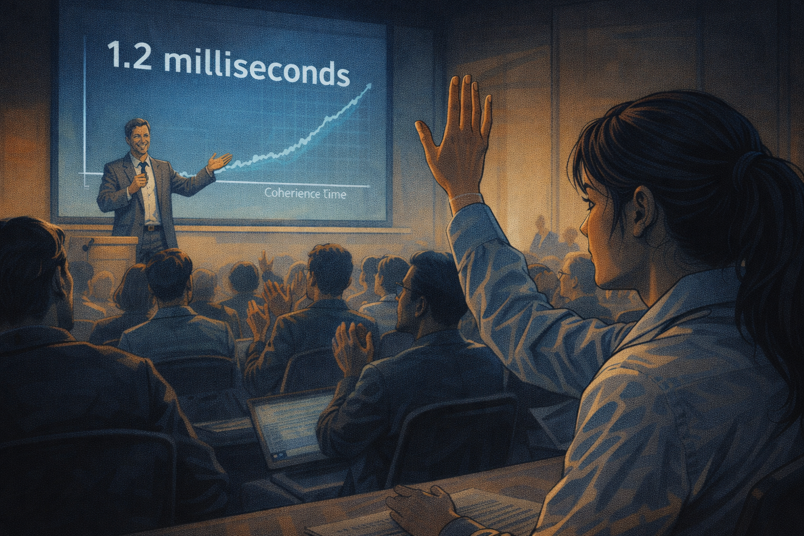

Another lab announces 1.2ms coherence — Yuki raises hand: "What's gate fidelity?"

Generate a wide-landscape graphic novel drawing with a width:height ratio of 16:9. Use rich colors in the style of a thoughtful, cinematic graphic novel — expressive character faces, dramatic lighting, environments that reflect emotional tone. Not cartoonish. Do not put captions or text in the image. Show a conference presentation — an excited presenter at the front announcing a 1.2 millisecond coherence time result. The audience is enthusiastic. Yuki, in the audience, has her hand raised — she is asking the follow-up question. Her expression is not competitive or dismissive; it is the specific curiosity of a person who knows what question exposes whether a record is meaningful. Color palette: the conference room light, Yuki's raised hand the visual focal point.

At the Quantum Hardware Conference, a group from Stockholm announces 1.2 millisecond coherence — and the room erupts. Yuki raises her hand before the applause finishes. "What's the two-qubit gate fidelity?" she asks. The presenter pauses. The gate fidelity is 99.1%, down from 99.6% in their previous system. The coherence time improved; the operation fidelity decreased. The audience processes this slowly. Yuki writes it in her notebook next to the coherence number.

## Panel 8: The Whiteboard Calculation

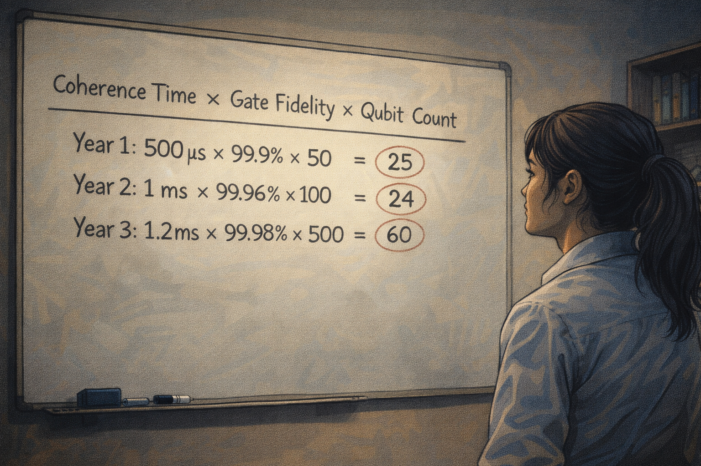

Yuki's whiteboard: coherence × fidelity × qubit count = unchanged product

Generate a wide-landscape graphic novel drawing with a width:height ratio of 16:9. Use rich colors in the style of a thoughtful, cinematic graphic novel — expressive character faces, dramatic lighting, environments that reflect emotional tone. Not cartoonish. Do not put captions or text in the image. Show Yuki's office whiteboard with a calculation she has written — a product of three factors: coherence time, gate fidelity, qubit count. The numbers from the last three years of the field are filled in. The product — which represents usable computation capacity — shows a nearly flat trend despite individual metric improvements. Yuki stands back from the board, looking at it. The calculation is clear and uncomfortable. Color palette: the office whiteboard light, the clean logic of a calculation that doesn't lie.

Her whiteboard shows three years of the field's published results: coherence time, gate fidelity, effective qubit count. Each metric individually shows improvement. The product of the three — the figure that actually measures whether useful quantum computation is approaching — has been essentially flat across the field for three years. Records are being broken. The thing the records are supposed to indicate isn't improving. She photographs the whiteboard. She writes "Are We Making Progress?" at the top of a new document.

## Panel 9: The Review Paper

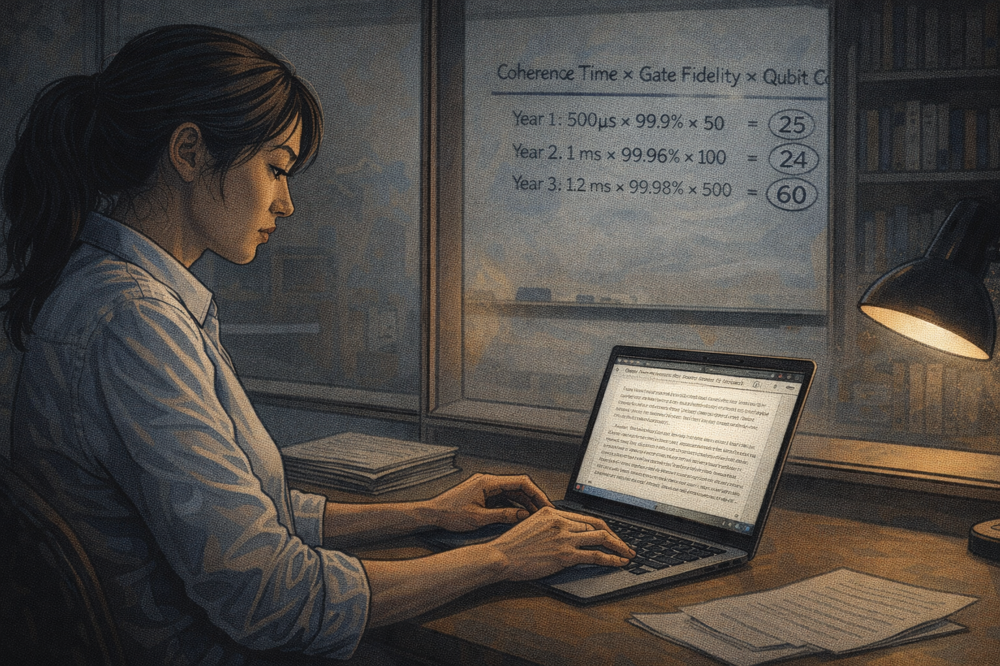

Yuki writes "Are We Making Progress?" — careful, genuinely uncertain

Generate a wide-landscape graphic novel drawing with a width:height ratio of 16:9. Use rich colors in the style of a thoughtful, cinematic graphic novel — expressive character faces, dramatic lighting, environments that reflect emotional tone. Not cartoonish. Do not put captions or text in the image. Show Yuki writing at her desk — the review paper taking shape on her laptop. Her expression is the careful deliberateness of someone writing something honest that will be read by people with strong interests in the answer. The whiteboard calculation is visible through her office window, on the wall. She is writing slowly, choosing words. Color palette: the office writing light, the slight weight of someone composing something genuinely uncertain.

The paper takes four months to write. She analyzes the composite progress metric across eleven hardware groups over six years. The conclusion is careful: individual metrics are improving; the combination required for useful quantum computation has not improved at a rate consistent with the projected timelines. She does not say "quantum computing is impossible." She says the data does not yet support the projected timelines, and asks what that means for the field. She sends it to five colleagues for pre-submission review. Three of them are uncomfortable with it.

## Panel 10: The Reviewer Comment

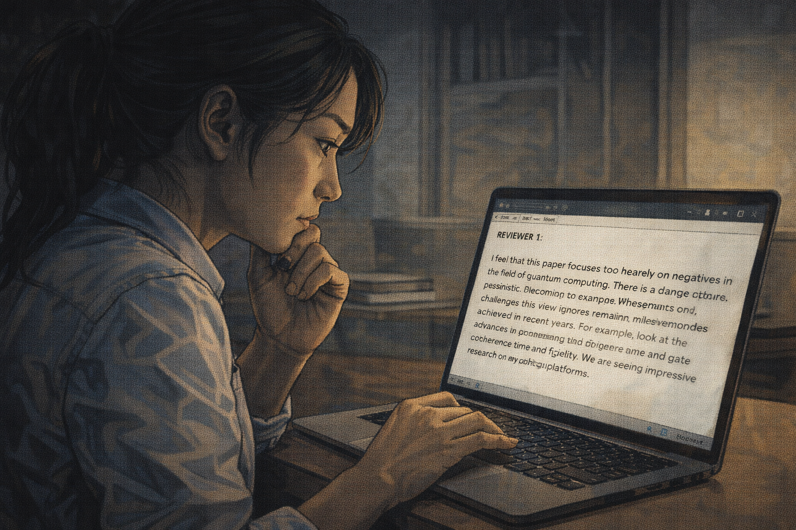

Reviewer: "Too negative — you're not accounting for future techniques"

Generate a wide-landscape graphic novel drawing with a width:height ratio of 16:9. Use rich colors in the style of a thoughtful, cinematic graphic novel — expressive character faces, dramatic lighting, environments that reflect emotional tone. Not cartoonish. Do not put captions or text in the image. Show Yuki reading reviewer comments on her laptop. One reviewer comment is particularly long — she is rereading a specific paragraph. The comment is clearly of the "too pessimistic" variety. Her expression as she reads is the careful look of someone deciding how to respond to an argument that is not entirely wrong and is also not entirely right. Color palette: the screen light, Yuki's expression showing the particular difficulty of this kind of reviewer pushback.

Reviewer 2 writes: "The analysis is technically correct but the framing is inappropriately negative. The author is not accounting for disruptive techniques that have not yet been discovered. Past experience in quantum physics includes multiple discontinuous jumps. This paper would discourage investment in an important field based on extrapolation of current trends." Yuki reads this twice. The reviewer is not wrong that discontinuous improvements are possible. She is not wrong that the current trends don't show one. These are both true.

## Panel 11: Softened Paper, Honest Drawer

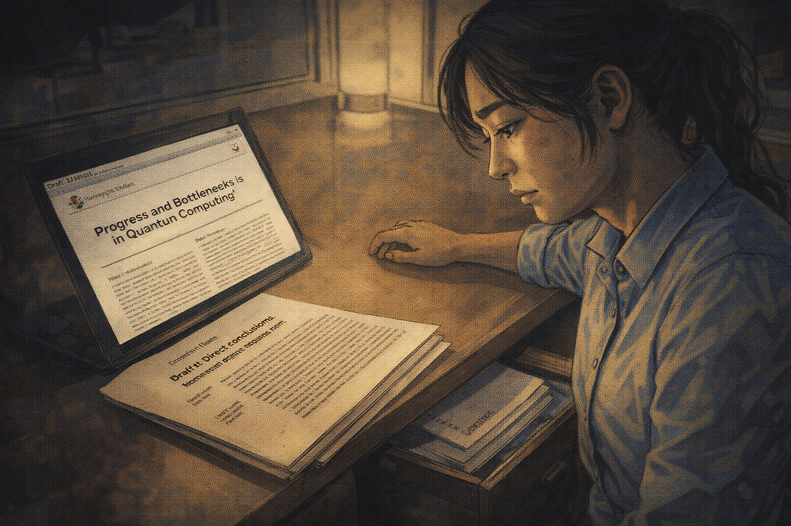

The paper publishes softened — the honest version lives in her desk drawer

Generate a wide-landscape graphic novel drawing with a width:height ratio of 16:9. Use rich colors in the style of a thoughtful, cinematic graphic novel — expressive character faces, dramatic lighting, environments that reflect emotional tone. Not cartoonish. Do not put captions or text in the image. Show Yuki's desk — on the surface, the published version of the paper (visible as a journal PDF). In the drawer, partially open, the original draft with its more direct conclusions. Yuki sits at the desk, the drawer slightly open beside her. Her expression carries the quiet dissatisfaction of someone who told a partial truth and knows it. Color palette: the desk light, the visual contrast between the published document and the drawer-document.

The published paper is softened in the second half. The conclusion now reads: "These findings suggest opportunities for accelerated progress through novel approaches not captured in current trend analysis." She added this sentence because Reviewer 2 had a point, and because she wanted the paper published, and because she is not certain enough to stake her reputation on the pessimistic interpretation. The honest version — the version without the softening — is in a folder on her desk. She keeps it.

## Panel 12: The Younger Colleague's Question

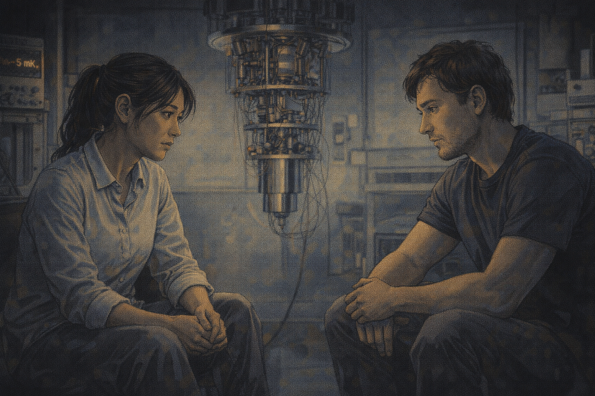

Younger colleague: "Do you actually think we'll get there?" — long pause

Generate a wide-landscape graphic novel drawing with a width:height ratio of 16:9. Use rich colors in the style of a thoughtful, cinematic graphic novel — expressive character faces, dramatic lighting, environments that reflect emotional tone. Not cartoonish. Do not put captions or text in the image. Show Yuki and a younger researcher — a postdoc in her lab, a man in his late 20s — in a quiet moment in the lab. He has asked the question. Yuki's response is the specific quality of a long pause — she is not composing a comforting answer; she is sitting with the real one. The cryogenic equipment is visible around them. The pause has weight. Color palette: the quiet lab light of a moment after the official work has stopped, two people in an honest conversation.

Her postdoc asks after a late-night equipment session. He is twenty-eight and has just read the published paper. "Do you actually think we'll get there?" he asks. "Fault tolerance at scale." Yuki is quiet for a moment. It is a real pause — not a rhetorical one, not a moment of composing reassurance. She is thinking about what she actually believes, and what the whiteboard calculation says, and what the desk drawer version of the paper says. The lab hums around them.

## Panel 13: "I Used to Be Certain"

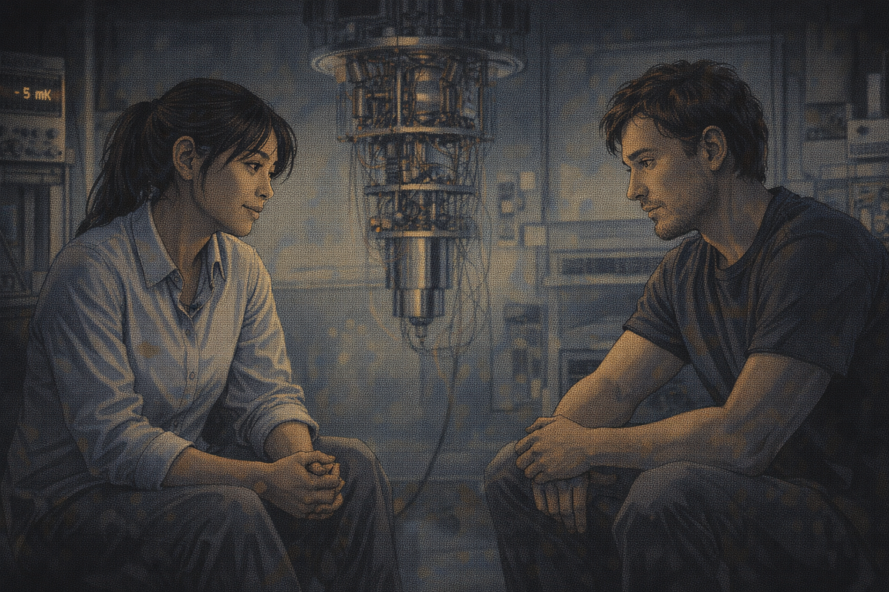

Yuki: "I think we might. But I used to be certain. Now I just think we might."

Generate a wide-landscape graphic novel drawing with a width:height ratio of 16:9. Use rich colors in the style of a thoughtful, cinematic graphic novel — expressive character faces, dramatic lighting, environments that reflect emotional tone. Not cartoonish. Do not put captions or text in the image. Show Yuki and her postdoc in the lab — she is giving her answer. Her expression carries the particular quality of earned uncertainty: not despair, not false hope, just the calibrated honesty of someone who has looked at the data for six years. Her postdoc receives this answer with the thoughtful look of someone who understands that the honest answer is harder than either yes or no. Color palette: the late-night lab light, the human warmth of two researchers talking about what they actually know.

"I think we might," she says. "But I used to be certain. I came into this field certain we'd get there in twenty years, and now I've been in it for six years and I think we might. That's what the data supports — we might." Her postdoc is quiet. She continues: "The honest version of that is more useful than the certain version, even if it's less comfortable. The work is still worth doing because we might, and because the things we learn are valuable regardless." He nods. She can't tell if he's reassured. Neither can she.

## Panel 14: The Lab Notebook

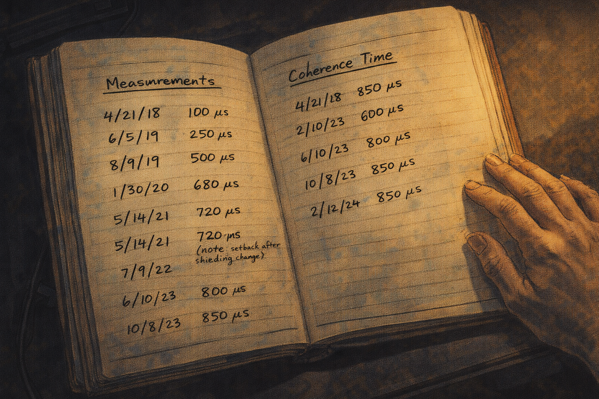

Six years of coherence measurements — real progress, not enough, both true

Generate a wide-landscape graphic novel drawing with a width:height ratio of 16:9. Use rich colors in the style of a thoughtful, cinematic graphic novel — expressive character faces, dramatic lighting, environments that reflect emotional tone. Not cartoonish. Do not put captions or text in the image. Show Yuki's lab notebook — six years of coherence time measurements in a handwritten log. Each entry is dated, the numbers showing the arc: 100 microseconds, 250, 500, 680, 720, 500 (the setback after the shielding change), 800, 850. Real progress, clearly visible. The last entry is notably below 1 millisecond. Below the notebook, out of frame, is the fault-tolerance threshold — still not reached after six years. The notebook is the whole story in one object. Yuki's hand rests on it. Color palette: the warm amber of aged notebook pages, the numbers telling a story of real work and real distance remaining.

She opens the lab notebook to the coherence time log — six years, every measurement, every setup change, every setback and improvement. The arc is real progress: from 100 microseconds at the beginning to 850 today, with detours. She is closer to 1 millisecond than she was. She is not there. The grant proposal from Year 1 projected 10 milliseconds by now. Both things are true. She closes the notebook and goes back to work.

---

**Epilogue:** *Dr. Yuki's career is not a failure — it is a life in science lived honestly. She made real progress, published real results, and eventually asked the real question: is this a problem that yields to effort, or one that doesn't? Not every scientific question has an answer that engineering can reach. Sitting with that uncertainty, without abandoning the work, is the most difficult part of the job.*
