# The Lecture That Started Everything

The 1981 Feynman Lecture that kicked off the quantum computing movement.

Cover Image 

Generate a wide-landscape graphic novel cover image with a width:height ratio of 16:9. Use rich
  colors in the style of a thoughtful, cinematic graphic novel — expressive character faces,
  dramatic lighting, environments that reflect emotional tone. 

  Place the title text at the top of the image: "The Lecture That Started Everything"

  Not cartoonish. Think Saga or Maus rather than superhero comics. 
  Do not put any captions or text in the image EXCEPT the title at the top. 
  
  Show Richard Feynman — rumpled suit jacket, tie loosened, wild eyebrows raised in that famous grin — standing at a blackboard in a state of pure intellectual electricity. He has just spread both hands open wide as
   if presenting something obvious. The blackboard behind him is covered in chalk marks: a rough
  simulation grid of dots on the left, an unfinished circuit-like diagram on the right — the sketch
  of a question, not a blueprint. The room around him is a modest 1981 MIT conference room:
  fluorescent ceiling light, folding metal chairs, a narrow window showing spring trees. In the
  lower foreground, the backs of heads — forty academics leaning forward in unison. The focal point
  is entirely Feynman's face: the electric delight of a man who has just said something that cannot
  be unsaid. Color palette: warm amber on Feynman's animated face, cool institutional light on the
  audience, chalk white blazing against the blackboard, a sliver of green spring light through the
  window as contrast.

## Panel 1: The Night Before (Caltech, 1981)

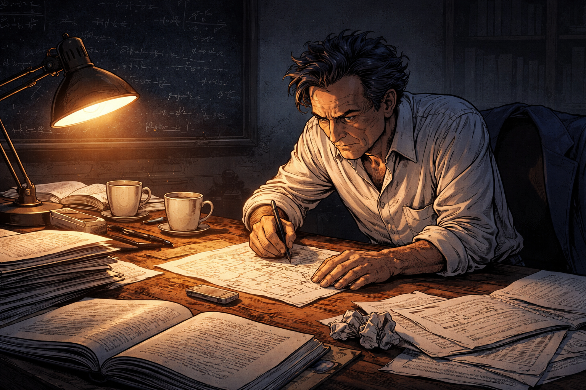

Feynman at his desk the night before the lecture

Generate a wide-landscape graphic novel drawing with a width:height ratio of 16:9. Use rich colors in the style of a thoughtful, cinematic graphic novel — expressive character faces, dramatic lighting, environments that reflect emotional tone. Not cartoonish. Think Saga or Maus rather than superhero comics. Do not put captions or text in the image. Show Richard Feynman — depicted accurately: rumpled suit jacket slung over a chair, wild eyebrows, infectious energy even in solitude, bongo drum energy even when standing still — hunched over a cluttered Caltech office desk late at night, scribbling furiously on a paper napkin. The desk is covered in physics papers, coffee cups, and open textbooks. A single desk lamp throws warm amber light across his face. His expression is one of electric excitement, not preparation — this is a man chasing an idea, not writing slides. The room beyond is dark, a blackboard covered in half-erased equations visible in the background. Color palette: warm amber desk-light against cool institutional darkness.

Richard Feynman is not preparing slides. He never prepares slides. He is in his Caltech office at eleven at night, filling a paper napkin with marks that are not equations so much as questions — arrows connecting words like "simulation," "classical," and "why not?" The rest of the office is dark. The coffee next to him went cold an hour ago. He doesn't notice. He is chasing something.

## Panel 2: MIT Campus, Spring 1981

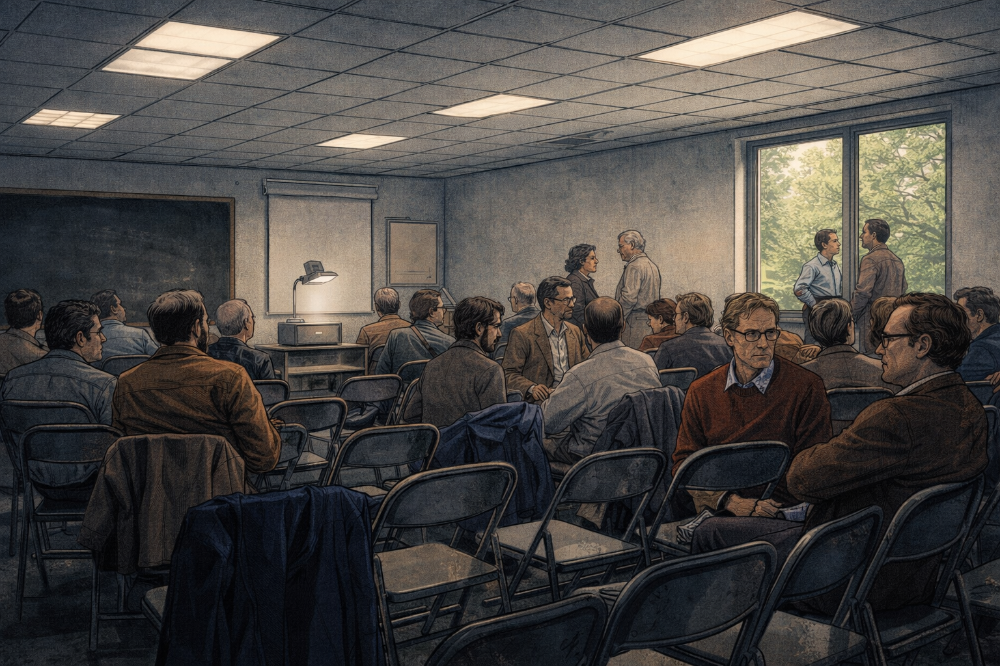

A small MIT conference room before the talk

Panel 2
Generate a wide-landscape graphic novel drawing with a width:height ratio of 16:9. Use rich colors in the style of a thoughtful, cinematic graphic novel — expressive character faces, dramatic lighting, environments that reflect emotional tone. Not cartoonish. Do not put captions or text in the image. Show a modest MIT conference room in spring 1981 — folding metal chairs arranged in rough rows, about forty people settling in, an overhead projector at the front. The room has the institutional fluorescent quality of academic spaces from that era: acoustic tile ceiling, a narrow window showing spring trees outside, coats piled on chairs at the back. The atmosphere is collegial, unhurried, curious — not a stadium event. A few people are chatting in pairs. There are no camera crews, no banners. The scale is intimate. Color palette: cool institutional fluorescent light, warm spring green visible through the window.

It is not a stadium. The First Conference on the Physics of Computation at MIT has drawn about forty people to a conference room with folding chairs and an overhead projector. This is not the venue of a historic moment — it looks like a departmental seminar, which is exactly what it is. Spring light comes through a narrow window. People are finding seats, setting down coffee cups, chatting. Nobody in the room knows what is about to happen.

## Panel 3: Before the Talk

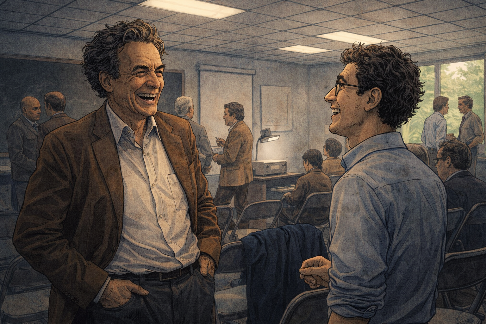

Feynman laughing with a grad student before the lecture

Generate a wide-landscape graphic novel drawing with a width:height ratio of 16:9. Use rich colors in the style of a thoughtful, cinematic graphic novel — expressive character faces, dramatic lighting, environments that reflect emotional tone. Not cartoonish. Do not put captions or text in the image. Show Richard Feynman — rumpled suit, wild eyebrows, infectious grin — standing near the front of the conference room, completely at ease, laughing with a young graduate student. Feynman's body language is open and delighted; the student is caught between starstruck and genuinely amused. Other conference attendees mill in the background. The moment feels warm, unguarded, improvisational — Feynman is not "on" yet, just genuinely enjoying conversation. Natural light and fluorescent light mix. Color palette: warm human tones against the neutral institutional setting.

Before he walks to the front, Feynman spends ten minutes talking to a graduate student near the door — telling a story that makes them both laugh, asking what the student is working on, listening with real interest. He is entirely at ease in the way only someone completely comfortable with not knowing things can be. He is not rehearsing. He is curious about the student's problem. He seems to have forgotten he is about to give a talk.

## Panel 4: He Begins

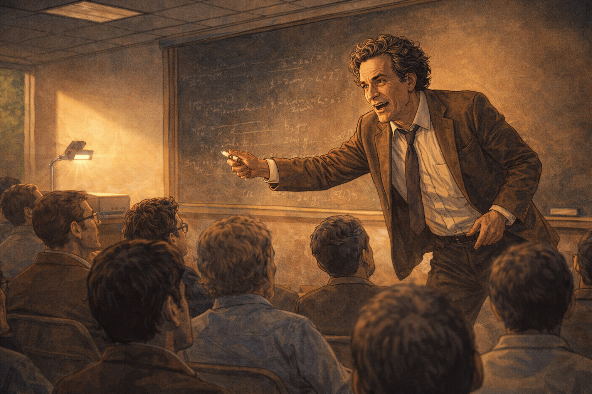

Feynman begins speaking at the front of the room

Generate a wide-landscape graphic novel drawing with a width:height ratio of 16:9. Use rich colors in the style of a thoughtful, cinematic graphic novel — expressive character faces, dramatic lighting, environments that reflect emotional tone. Not cartoonish. Do not put captions or text in the image. Show Richard Feynman — rumpled suit, tie loosened, wild eyebrows animated — standing at the front of the conference room with a marker in hand, just beginning to speak. His posture is forward-leaning, immediately engaged, as if the thought he's about to say has been pressing to get out. The overhead projector is on but he's already moving toward the blackboard instead. The audience is alert, leaning in. The atmosphere shifts — something is beginning. Color palette: the slightly warmer tone as the talk begins, Feynman's animated face catching the light.

He begins without preamble, without slides, without ceremony. "I want to talk about simulating physics." That's it. That's the opening. He picks up a marker and turns toward the board, and the forty people in folding chairs lean forward almost in unison. His tie is already loose. He has the look of someone who can't get the words out fast enough, because the idea is running ahead of him.

## Panel 5: The Classical Simulation Problem

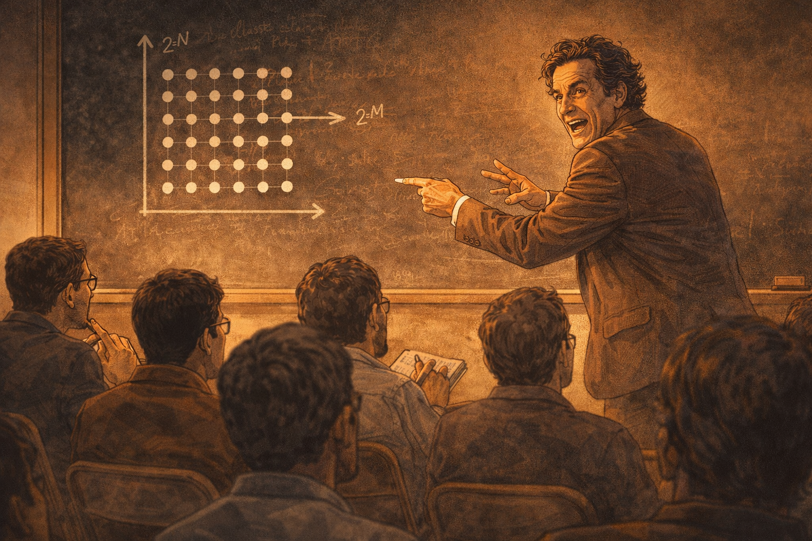

Feynman drawing a simulation grid on the board

Generate a wide-landscape graphic novel drawing with a width:height ratio of 16:9. Use rich colors in the style of a thoughtful, cinematic graphic novel — expressive character faces, dramatic lighting, environments that reflect emotional tone. Not cartoonish. Do not put captions or text in the image. Show Richard Feynman at the blackboard drawing a grid of dots — a crude representation of a classical simulation lattice. He's mid-gesture, one hand pointing at the grid, his body turned back toward the audience as he speaks. His expression is animated, almost exasperated — he's building to a punchline. The blackboard shows the grid and some rough notation suggesting exponential growth. The audience is visible in the foreground, some of them already working through the implication on notepads. Color palette: chalk white against black board, the room in warm attentive focus.

He draws a grid on the blackboard — rows and columns of dots, the skeleton of a classical simulation. "To simulate N quantum particles," he says, turning back to face the room, "you need exponentially more memory. The amount of information in a quantum system grows like two to the N." He taps the grid. "Why does our computer have to simulate nature classically? Why should it?" The room is very quiet.

## Panel 6: The Audience Leans In

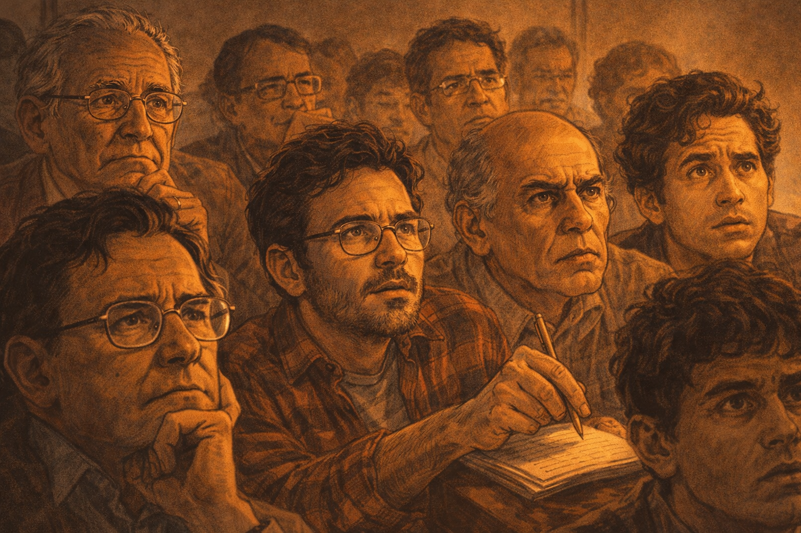

Close-up on audience faces — confused, engaged

Please generate the image for panel 6.
Generate a wide-landscape graphic novel drawing with a width:height ratio of 16:9. Use rich colors in the style of a thoughtful, cinematic graphic novel — expressive character faces, dramatic lighting, environments that reflect emotional tone. Not cartoonish. Do not put captions or text in the image. Show a close-up view of the audience in the conference room — a cross-section of faces, mostly academic physicists and computer scientists from 1981: older professors with wire-rimmed glasses, young grad students in flannel. The expressions range from confused to intensely focused to the particular look of someone mid-realization. One person's pen is hovering above a notepad, motionless — the hand forgot to write because the brain is working too hard. The lighting is slightly dramatic for a fluorescent room, as if the conversation itself is generating shadow. Color palette: mid-tones of attentive human faces, the quiet intensity of a room thinking hard.

The audience faces are a study in real-time comprehension. Some have the pen-hovering-without-writing look — the hand has given up because the mind is running too fast to transcribe. An older physicist near the back has stopped frowning and started squinting in a different way, working something out. A grad student in the third row has filled her entire notepad margin with question marks. Nobody is bored. Several people are confused in the productive way, the way that means the confusion is pointing somewhere.

## Panel 7: The Punchline

Feynman delivers his famous line with a grin

Please generate the image for panel 7.
Generate a wide-landscape graphic novel drawing with a width:height ratio of 16:9. Use rich colors in the style of a thoughtful, cinematic graphic novel — expressive character faces, dramatic lighting, environments that reflect emotional tone. Not cartoonish. Do not put captions or text in the image. Show Richard Feynman at the peak of his delivery — wild eyebrows raised, that famous infectious grin spreading across his face, both hands spread open as if presenting something obvious. This is the moment of the punchline. He looks delighted — genuinely delighted, as if the thought is funny and important at the same time. The audience visible in the lower frame has the look of people receiving a clarifying idea. The blackboard is covered in marks behind him. Color palette: warm illumination on Feynman's animated face, the room in rapt attention.

"Nature isn't classical, dammit." He grins. It lands like a punch. "And if you want to make a simulation of nature, you'd better make it quantum mechanical." There is a beat of silence — the kind that follows something that is simultaneously obvious and completely new. A few people laugh. A few others are already writing. The room has shifted. Something has been named that did not have a name before, and now that it has one, it cannot be un-named.

## Panel 8: The Sketch

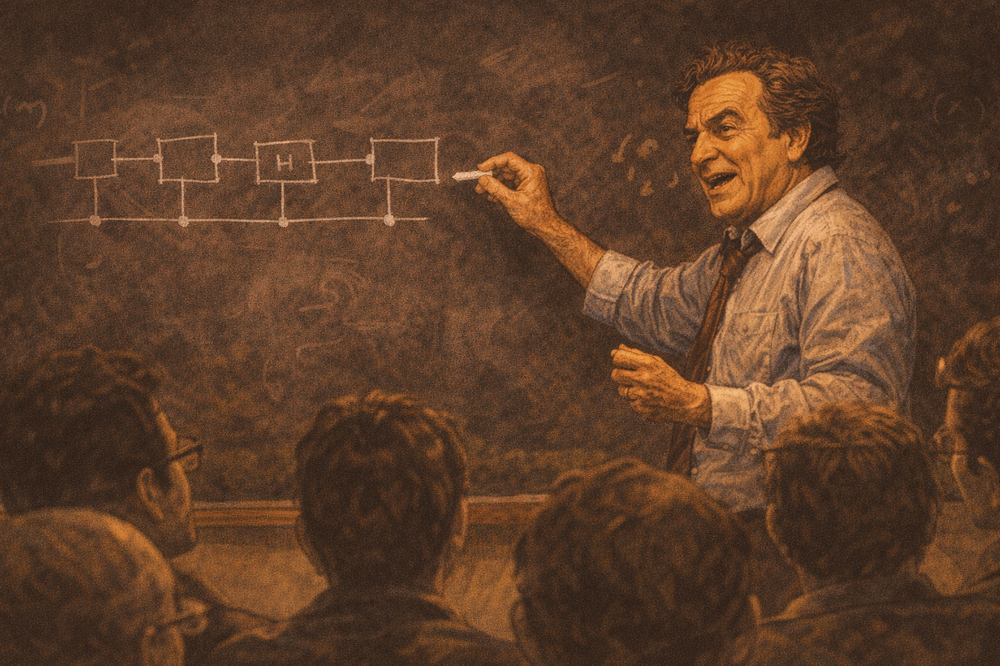

Feynman sketches a rudimentary quantum circuit

Generate a wide-landscape graphic novel drawing with a width:height ratio of 16:9. Use rich colors in the style of a thoughtful, cinematic graphic novel — expressive character faces, dramatic lighting, environments that reflect emotional tone. Not cartoonish. Do not put captions or text in the image. Show Richard Feynman at the blackboard, drawing a rudimentary diagram — boxes connected by lines, something that suggests gates and wires in a circuit but rendered in his rough, fast hand. He's talking as he draws, mid-sentence, chalk moving quickly. The diagram is not precise — it doesn't need to be. It's the shape of an idea, not a blueprint. His expression is exploratory, not certain. He's working it out in real time. Color palette: chalk on blackboard, the visual contrast of a new idea being sketched into existence.

He draws something on the board that is not yet a quantum circuit but is the ancestor of one: boxes, wires, the rough suggestion of operations performed by a system that obeys quantum rules. "What if the computer itself obeys quantum rules?" he asks, and he draws as he talks, and what appears on the board is unfinished, approximate, the sketch of a question. He doesn't know what this thing should look like. Nobody does. That is the point.

## Panel 9: Th
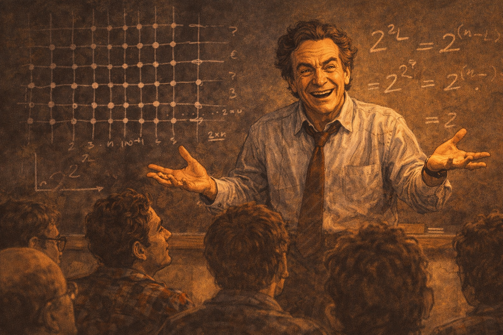

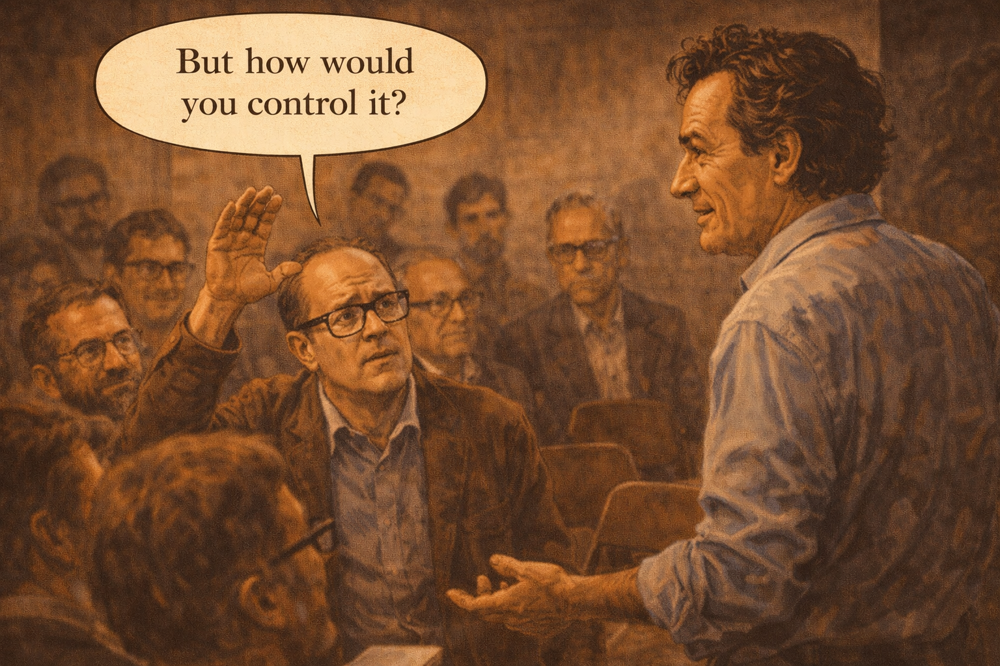

A hand goes up — "But how would you control it?"

Please generate an image for this panel.
Generate a wide-landscape graphic novel drawing with a width:height ratio of 16:9. Use rich colors in the style of a thoughtful, cinematic graphic novel — expressive character faces, dramatic lighting, environments that reflect emotional tone. Not cartoonish. Do not put captions or text in the image. Show an audience member — a middle-aged physicist with thick-framed glasses — raising his hand to ask a question, while Feynman at the front turns toward him with full attentive curiosity. The questioner looks skeptical but genuinely engaged. Feynman's posture is open — not defensive, delighted by the challenge. Other audience members are watching this exchange. The moment has the quality of a debate between peers, not a lecture. Color palette: the room in attentive mid-tone, the two figures — questioner and speaker — in sharper focus.

A hand goes up near the middle of the room. "But how would you control it? How would you read the output? You can't just look at a quantum system — you collapse it." Feynman turns to face the questioner and his expression is exactly right: he is not annoyed, not evasive. He is delighted. "I don't know," he says. "That's the fun part." The questioner blinks. Feynman means it completely.

## Panel 10: After the Talk

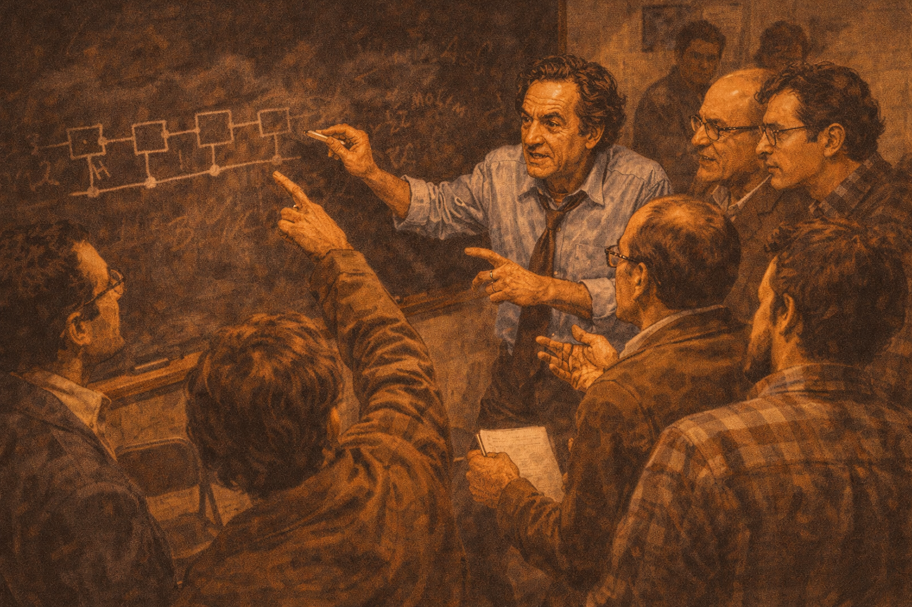

A cluster around the blackboard after the lecture

Generate a wide-landscape graphic novel drawing with a width:height ratio of 16:9. Use rich colors in the style of a thoughtful, cinematic graphic novel — expressive character faces, dramatic lighting, environments that reflect emotional tone. Not cartoonish. Do not put captions or text in the image. Show the scene immediately after the talk: a cluster of eight or ten people crowded around the blackboard, Feynman in the middle with his sleeves rolled up, deep in conversation with multiple people simultaneously. People are pointing at the diagram on the board, gesturing, talking over each other in the best way. The room has the electric quality of a genuine intellectual moment — ideas in the air, everyone aware that something was said that matters. Empty chairs pushed aside, coats forgotten. Color palette: warm animated scene, the blackboard and its marks the focal anchor.

The talk ends and the cluster forms immediately — eight, ten people pressing toward the front of the room. Feynman's sleeves are rolled up. He is at the board pointing at the diagram, talking to three people at once, answering the one in front and hearing the one behind. The folding chairs are pushed aside. Nobody is leaving. A few people from the hallway have heard the noise and drifted in. The board is covered in marks from multiple hands now, the conversation already becoming collaborative.

## Panel 11: The Notebook

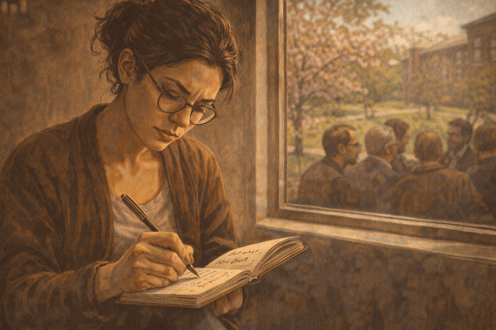

A young researcher writes in her notebook after the talk

Generate a wide-landscape graphic novel drawing with a width:height ratio of 16:9. Use rich colors in the style of a thoughtful, cinematic graphic novel — expressive character faces, dramatic lighting, environments that reflect emotional tone. Not cartoonish. Do not put captions or text in the image. Show a young female researcher — early 30s, dark hair, wire-rimmed glasses — sitting slightly apart from the main crowd near a window, writing intensely in a small notebook. Her face is focused, slightly frowning in the way of serious thought. We can see the notebook page at an angle — she is writing something, a phrase, a question. Through the window behind her, the spring campus is visible. The scene is quiet against the noise of the cluster in the background. Color palette: the soft spring light through the window on her face, warm notebook tones.

Near the window, a young researcher has separated herself from the cluster at the board. She is writing in a small notebook, her pen moving quickly, and her expression is the particular focused frown of someone not transcribing but thinking. She writes a question: "Universal quantum simulator — is this possible?" Then she underlines it. Then she sits looking at it for a long moment. Outside the window, spring trees move in a light wind.

## Panel 12: The Decades That Follow

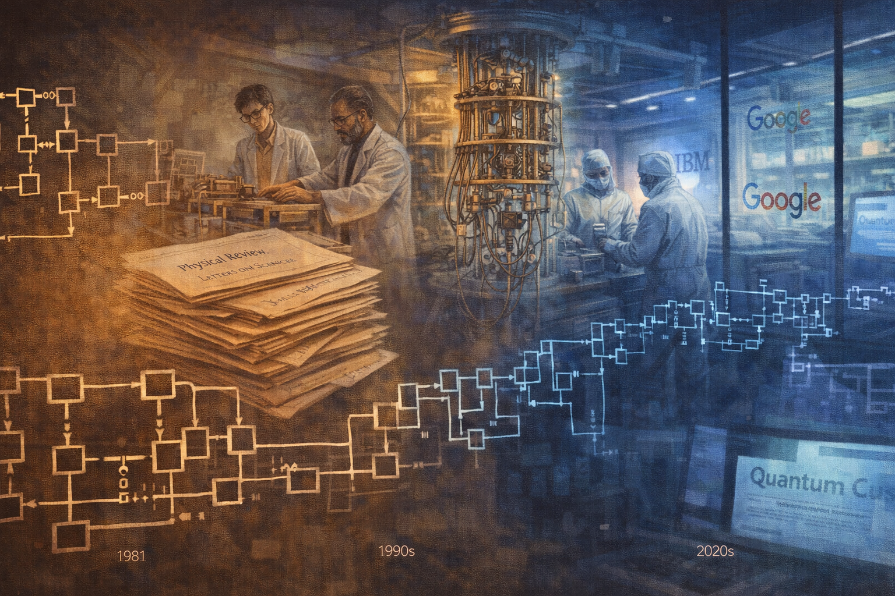

Montage of labs, papers, and companies — all tracing back

Generate a wide-landscape graphic novel drawing with a width:height ratio of 16:9. Use rich colors in the style of a thoughtful, cinematic graphic novel — expressive character faces, dramatic lighting, environments that reflect emotional tone. Not cartoonish. Do not put captions or text in the image. Show a montage composition — a single wide panel that flows from left to right across time: at left, the 1981 blackboard diagram; then academic papers stacked, a 1990s-era university lab, a 2000s cleanroom with early quantum hardware, a 2010s company logo on glass doors, a 2020s news headline on a screen. The images flow together without hard borders, connected by a visual thread — perhaps the circuit diagram evolving and growing more complex. The color palette shifts from the warm amber of the 1981 office through the cool blue-white of modern cleanrooms. A sense of vast time and accumulated effort.

Decades unspool. Papers accumulate. Labs are built in basements and then in dedicated buildings. Companies are founded and some fail and some raise hundreds of millions. Algorithms are written and benchmarked. Governments commission reports. Nobel lectures cite the 1981 talk. The circuit diagram on Feynman's blackboard — rough, unfinished, the sketch of a question — becomes the ancestor of a thousand more precise and more expensive diagrams. All of it traces back to one afternoon in a small room.

## Panel 13: The Modern Lab

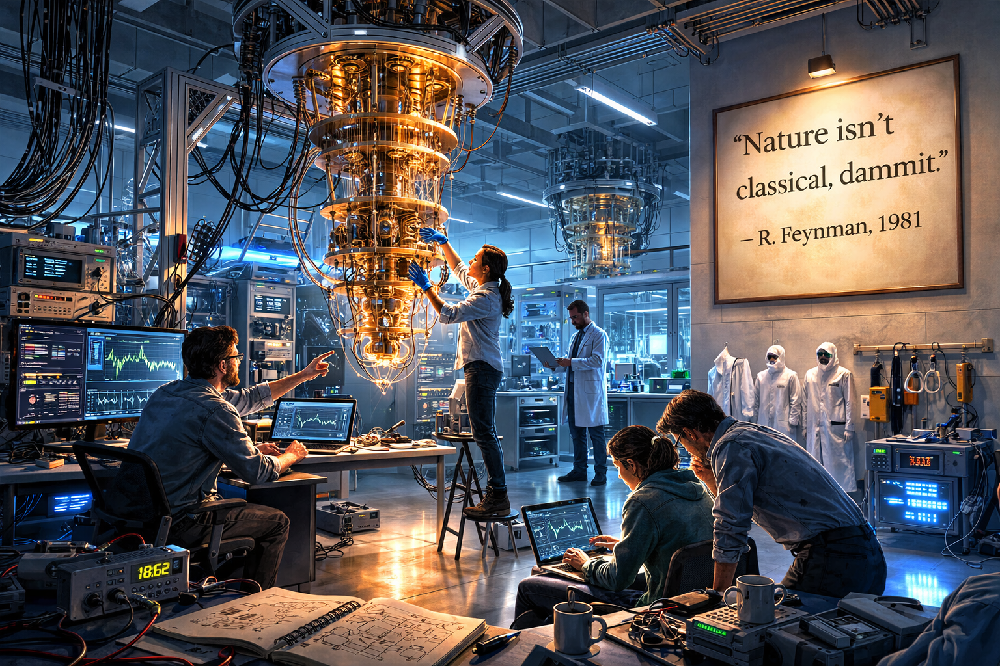

A modern quantum lab with a quote on the wall

Generate a wide-landscape graphic novel drawing with a width:height ratio of 16:9. Use rich colors in the style of a thoughtful, cinematic graphic novel — expressive character faces, dramatic lighting, environments that reflect emotional tone. Not cartoonish. Do not put captions or text in the image. Show a modern quantum computing laboratory — dilution refrigerators hanging from the ceiling like alien chandeliers, cables in organized bundles, cleanroom suits on hooks near the door, blue-tinged equipment lighting reflecting on polished floors. Researchers in partial cleanroom gear work quietly at stations. On one wall, visible clearly, is a framed quote printed in large clean type. The lab is beautiful in a technical way — the beauty of extreme precision, extreme cold, extreme care. Color palette: cool blues and whites of cryogenic equipment, the clinical precision of a modern physics lab, one warm accent on the framed quote.

The modern quantum lab hums at fifteen millikelvin, colder than empty space. Dilution refrigerators hang from the ceiling like architectural aliens. Researchers in cleanroom booties move carefully between stations. On the wall near the door, someone has framed a quote in clean sans-serif type: "Nature isn't classical, dammit." — R. Feynman, 1981. The researchers pass it every day. Some of them stop to read it. Most don't need to.

---

**Epilogue:** *Feynman didn't build a quantum computer. He asked a question nobody had put into words before. The field that followed — with all its promise and all its hype — began with one afternoon of honest curiosity in a small room. That is how science moves.*
