# The Five-Year Forecast

A quantum computing founder learns the difference between a best-case scenario and a plan.

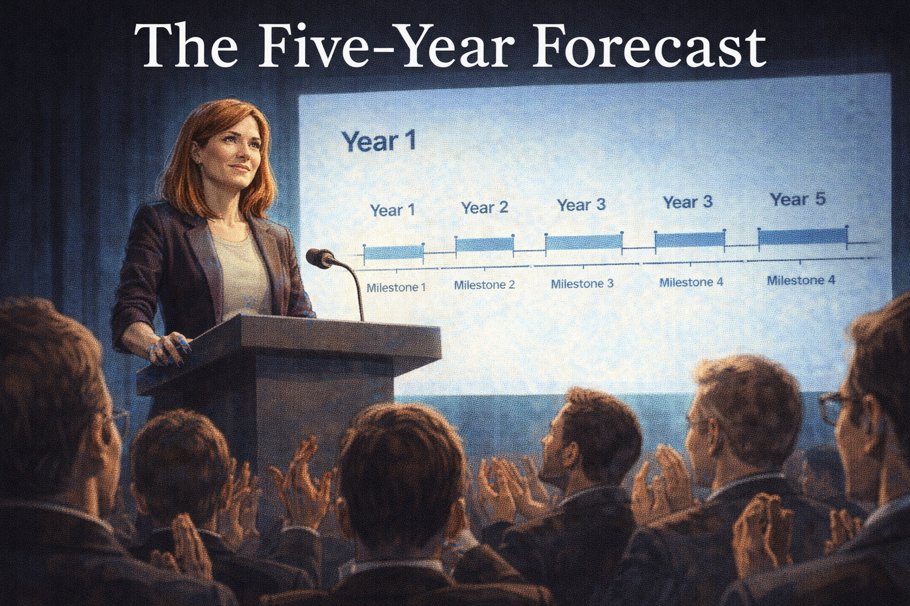

Cover Image 

Generate a wide-landscape graphic novel cover image with a width:height ratio of 16:9. Use rich colors in the style of a thoughtful, cinematic graphic novel — expressive character faces, dramatic lighting, environments that reflect emotional tone.

  Not cartoonish. Think Saga or Maus rather than superhero comics.
  Do not put any captions or text in the image EXCEPT the title at the top.

  Place the title text at the top of the image: "The Five-Year Forecast"

  Show Riley — a white woman in her late 30s, marker-stained fingers, confident founder energy — standing at a startup-stage podium at the company launch. Behind her, a clean roadmap slide is projected: Year 1, Year 2, Year 3, Year 5, each with a bold milestone. The audience of investors and early employees is applauding. Riley's expression radiates conviction. But the composition frames the roadmap slide large — its clean milestones and single-point dates carry the visual weight of something that will be tested. Color palette: the bright stage light of a founding moment, the roadmap slide blue-white behind Riley, the warm faces of a believing audience.

## Panel 1: Company Launch

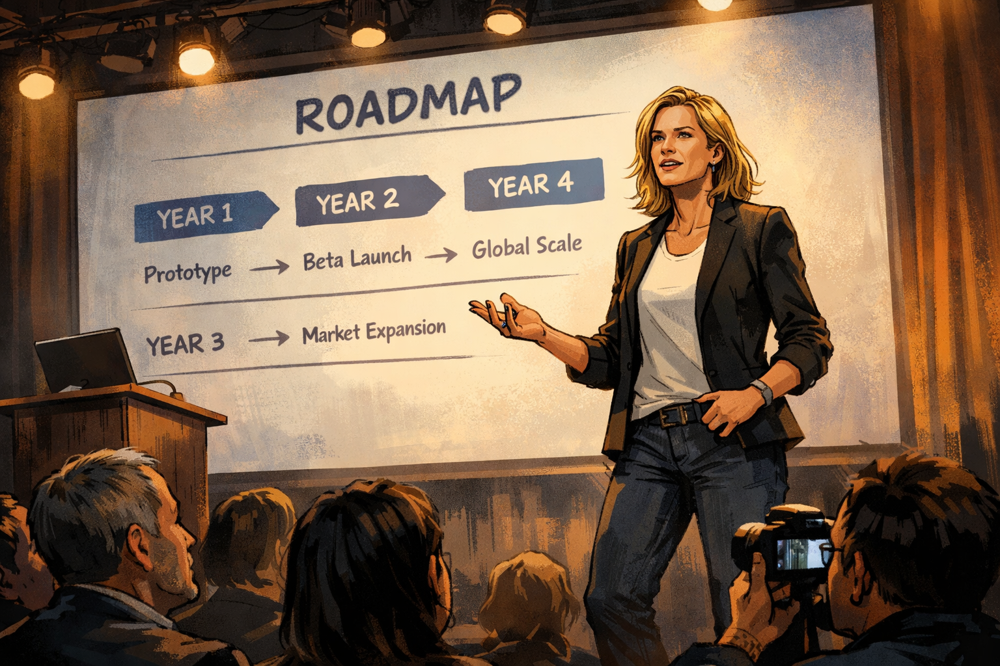

Riley on stage at company launch — confident roadmap projected

Panel 1 of 14.
Generate a wide-landscape graphic novel drawing with a width:height ratio of 16:9. Use rich colors in the style of a thoughtful, cinematic graphic novel — expressive character faces, dramatic lighting, environments that reflect emotional tone. Not cartoonish. Think Saga or Maus rather than superhero comics. Do not put captions or text in the image. Show Riley — a white woman, late 30s, confident founder energy, marker-stained fingers — on stage at a company launch event. Behind her, a roadmap slide is projected with clear milestones by year. Her posture radiates conviction. A small but enthusiastic audience watches — investors, early employees, press. The stage is startup-scale: good lighting, modest venue, genuine energy. Her slides are nearby. Color palette: the bright stage light of a startup launch, the energy of a founding moment.

Riley's company launches on a Tuesday and the roadmap on the screen behind her shows exactly the kind of clarity investors love: Year 1, fifty qubits; Year 2, error correction progress; Year 3, first commercial contract; Year 5, fault-tolerant operation. The milestones came from three months of internal planning and a review by two scientific advisors. She presents them with the confidence of someone who has thought hard about every number. The audience applauds. The roadmap is photographed. The company is real.

## Panel 2: The Investor Q&A

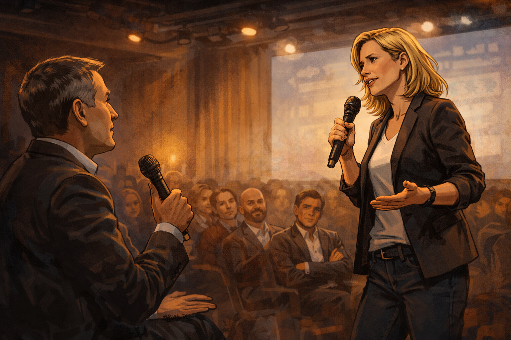

Investor asks if timelines are realistic — Riley: "Conservative, actually"

Panel 2 of 14.
Generate a wide-landscape graphic novel drawing with a width:height ratio of 16:9. Use rich colors in the style of a thoughtful, cinematic graphic novel — expressive character faces, dramatic lighting, environments that reflect emotional tone. Not cartoonish. Do not put captions or text in the image. Show the Q&A portion of the launch — Riley at the front, microphone in hand, responding to a question from an investor in the audience. The investor looks genuinely curious, not hostile. Riley's answer is confident, her body language forward and certain. Several investors in the audience are nodding. Color palette: the same launch-stage energy, Riley commanding the room.

An investor raises her hand: "Are these timelines realistic, or are they aspirational?" Riley doesn't hesitate. "Conservative, actually," she says. "We pressure-tested every milestone with our technical advisors. The planning is based on published results from the leading research groups, with margin built in." The investor writes something in her notes. Two others are nodding. Riley believes what she just said. The margins she built in were based on best-case scenarios from the published results. She did not build in the delays that came from problems nobody had encountered yet.

## Panel 3: Year 1 — On Track

Year 1 — 50 qubits achieved; team celebration

Panel 3 of 14.
Generate a wide-landscape graphic novel drawing with a width:height ratio of 16:9. Use rich colors in the style of a thoughtful, cinematic graphic novel — expressive character faces, dramatic lighting, environments that reflect emotional tone. Not cartoonish. Do not put captions or text in the image. Show the lab at Year 1 — Riley and the team around equipment showing the successful result: fifty qubits, on target. People are celebrating. Someone has drawn a checklist on a large whiteboard and is checking off the first box. Riley has a marker in hand. Her expression is the earned satisfaction of a milestone met. The checklist is visible behind the group with item one marked. Color palette: the warm lab celebration light, the first green check on a white board.

Year 1 delivers. Fifty qubits, coherence times within spec, fabrication pipeline working. Riley draws a large checkmark on the whiteboard next to "Year 1: 50 Qubits." The team takes a photo in front of the board. The company's investor newsletter leads with the milestone. Everything is, in this moment, going exactly as planned. The planning fallacy is invisible when it is working.

## Panel 4: Year 2 — First Slip

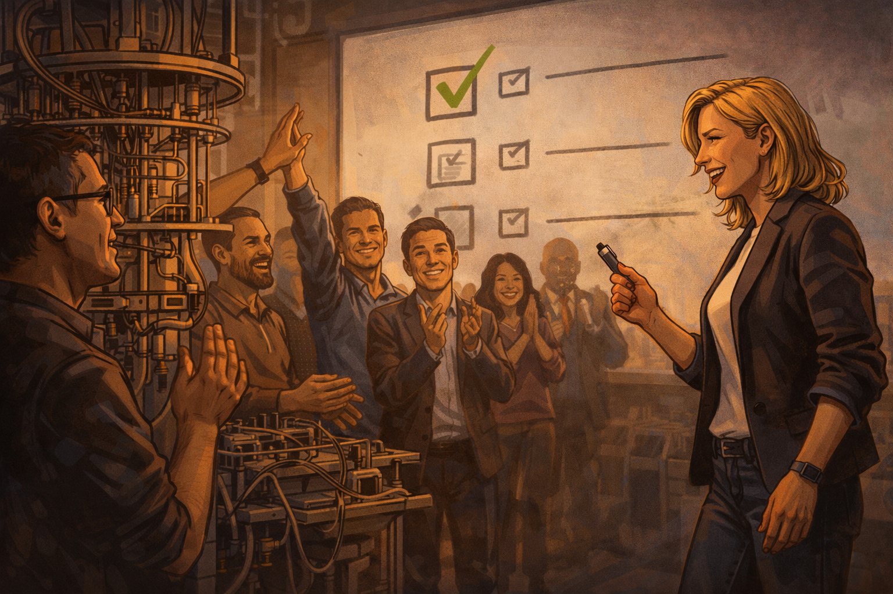

Year 2 — error rates not improving; Riley studies the data alone

Panel 4 of 14.
Generate a wide-landscape graphic novel drawing with a width:height ratio of 16:9. Use rich colors in the style of a thoughtful, cinematic graphic novel — expressive character faces, dramatic lighting, environments that reflect emotional tone. Not cartoonish. Do not put captions or text in the image. Show Riley alone at her desk or at the lab station in Year 2, studying data on a monitor. The data shows error rates that are not following the expected improvement trajectory. Her expression is focused and slightly troubled — this is not what the model predicted. Her marker-stained fingers are not holding a marker right now; they're clasped in front of her as she reads. Color palette: the quieter, more concerned lab light of a problem that hasn't been solved yet.

Year 2, the error rate improvement curve is not following the model. The qubits are working, but reducing error rates at scale has a different physics than reducing them in the test conditions the plan was built on. Riley studies the data over three weeks and the data does not change. She asks her lead engineer. He shows her a different set of models — ones that are more pessimistic, ones he had kept to himself because they seemed too gloomy. She reads them carefully.

## Panel 5: Quietly Revised Roadmap

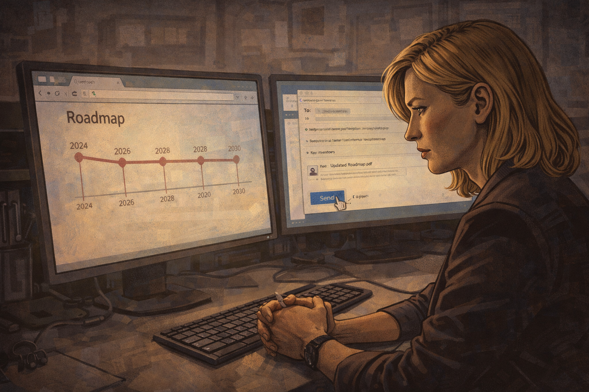

Revised roadmap quietly circulated — nobody announces the change

Panel 5 of 14.
Generate a wide-landscape graphic novel drawing with a width:height ratio of 16:9. Use rich colors in the style of a thoughtful, cinematic graphic novel — expressive character faces, dramatic lighting, environments that reflect emotional tone. Not cartoonish. Do not put captions or text in the image. Show Riley at her computer, sending an email to a small group with an attached updated roadmap. The email goes to the internal team and a handful of key investors. The original public roadmap is still on the company website — visible in a small browser window on screen. The revision is not announced. Riley's expression is purposeful and slightly uncomfortable — she is doing the necessary thing in the quietest possible way. Color palette: the office screen light, the quiet administrative quality of a decision that avoids public attention.

Riley revises the roadmap. The new version shifts commercial revenue from Year 3 to Year 4, and fault tolerance from Year 5 to Year 7. She sends it to the board and the lead investors. She does not issue a press release. She does not update the website. The original roadmap — the one photographed at the launch, the one cited in two news articles — remains publicly accessible. This is not a deception, she tells herself. Things change. This is normal. This is true, and it is also how the gap begins.

## Panel 6: Year 3 — No Revenue

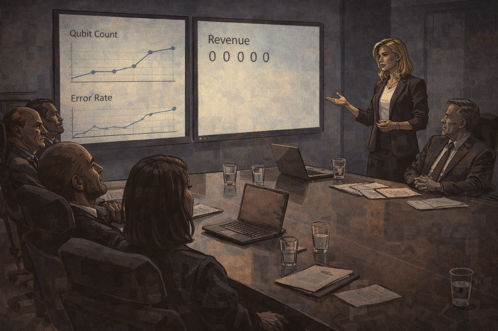

Year 3 — no revenue; board meeting with "progress" slides

Panel 6 of 14.
Generate a wide-landscape graphic novel drawing with a width:height ratio of 16:9. Use rich colors in the style of a thoughtful, cinematic graphic novel — expressive character faces, dramatic lighting, environments that reflect emotional tone. Not cartoonish. Do not put captions or text in the image. Show a board meeting — Riley presenting to five or six board members at a formal conference table. Her slides show technical progress metrics. The word "revenue" appears on one slide — no bars visible, the metric showing zeros or near-zeros. One board member is leaning back in their chair. Riley's posture is confident but the room carries the particular atmosphere of a board meeting where expectations are being renegotiated in real time. Color palette: the board room light — cooler, more formal, the accountability weight of an overdue milestone.

Year 3: no commercial revenue. The board meeting has slides that emphasize technical progress — gate fidelities, coherence improvements, a new fabrication partnership. The revenue slide has a bar chart with no bars. Riley says "we're in investment mode." A board member with a financial background writes something in her notebook. The word "investment mode" means something specific to engineers and something different to investors, and in this room both interpretations sit in the air at the same time.

## Panel 7: The Original Roadmap

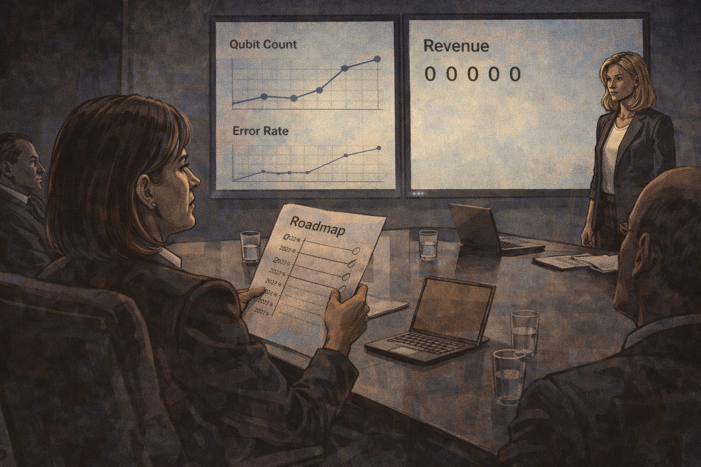

A board member holds the original roadmap next to today's slide

Panel 7 of 14.
Generate a wide-landscape graphic novel drawing with a width:height ratio of 16:9. Use rich colors in the style of a thoughtful, cinematic graphic novel — expressive character faces, dramatic lighting, environments that reflect emotional tone. Not cartoonish. Do not put captions or text in the image. Show a board member — a woman in her 50s, experienced and direct — at the conference table, holding a printed document (the original launch roadmap) and looking from it to the current slide on the screen. The comparison is visual and immediate. Riley, standing at the front, sees what the board member is doing. The room recognizes what is happening. Color palette: the board room light, the moment of comparison made physical.

The board member reaches into her folder and places the original launch roadmap on the table beside her notepad. She looks from it to the current slide. The Year 3 milestone on the original says "first commercial contracts." The current slide says "progressing toward commercial readiness." She does not say anything. The comparison is the statement. Riley looks at both documents from the front of the room.

## Panel 8: The Science Takes Longer

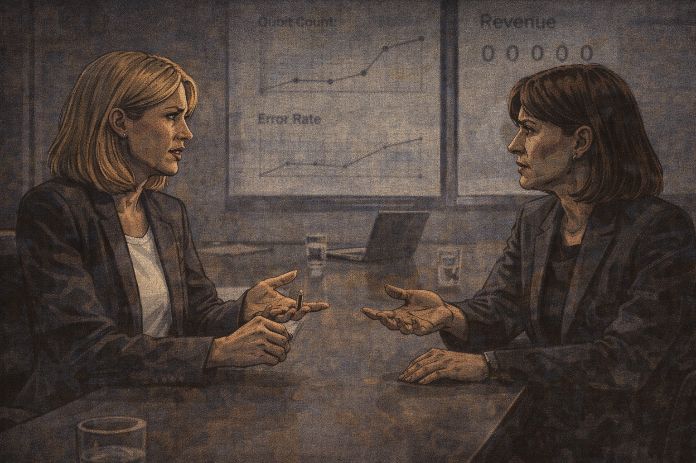

Riley: "The underlying science took longer than we projected" — the board member's response

Panel 8 of 14.
Generate a wide-landscape graphic novel drawing with a width:height ratio of 16:9. Use rich colors in the style of a thoughtful, cinematic graphic novel — expressive character faces, dramatic lighting, environments that reflect emotional tone. Not cartoonish. Do not put captions or text in the image. Show Riley and the board member in direct exchange — Riley explaining, the board member responding. Riley's answer is honest: science timelines. The board member's response is the direct observation that the planning assumed best case. Both women are professional and intelligent. This is not a confrontation — it is a reckoning between people who understand the situation differently but not incorrectly. Color palette: the board room, the direct light of accountability.

"The underlying science took longer than we projected," Riley says. The board member responds: "You projected the best case and treated it as the expected case." Riley doesn't argue with this. "Yes," she says. "That's accurate. In retrospect, I should have presented scenarios — best, expected, pessimistic. The planning process gave us one answer and I presented it as the answer." The room is quiet. Riley has just said something that most founders in this situation don't say. Several board members write it down.

## Panel 9: Three Scenarios

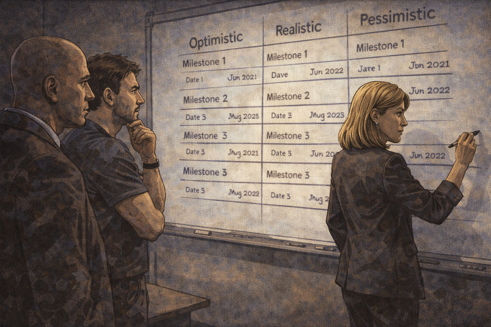

New planning session — three scenarios mapped out

Panel 9 of 14.
Generate a wide-landscape graphic novel drawing with a width:height ratio of 16:9. Use rich colors in the style of a thoughtful, cinematic graphic novel — expressive character faces, dramatic lighting, environments that reflect emotional tone. Not cartoonish. Do not put captions or text in the image. Show a new planning session — Riley at a whiteboard with her technical lead and CFO. Three columns are drawn on the whiteboard: Optimistic, Realistic, Pessimistic. Each column has milestones and dates. The pessimistic column extends the furthest right on the timeline. Riley is at the board with a marker. Her expression is the focused clarity of someone doing planning the right way for the first time. Color palette: the working whiteboard light, the three-column structure visible, the board as a tool for honesty.

The new planning process takes three weeks. Riley and her technical lead and the CFO map three scenarios across a whiteboard. The optimistic scenario is the one she used to present as the plan. The realistic scenario is based on actual observed improvement rates from their own data. The pessimistic scenario assumes two more unexpected technical blockers in the next two years. All three scenarios are on the board at once. It is, Riley notices, the most useful planning session the company has ever had.

## Panel 10: The Pessimistic Scenario — Presented Publicly

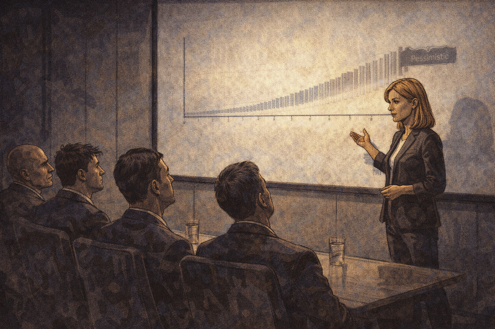

Riley presents the pessimistic scenario publicly for the first time

Panel 10 of 14.
Generate a wide-landscape graphic novel drawing with a width:height ratio of 16:9. Use rich colors in the style of a thoughtful, cinematic graphic novel — expressive character faces, dramatic lighting, environments that reflect emotional tone. Not cartoonish. Do not put captions or text in the image. Show Riley at an investor update or board meeting, presenting a slide that clearly shows the pessimistic scenario — a timeline that extends further than anyone in the room was expecting. Her voice is steady; her posture is confident rather than apologetic. Some faces in the audience show surprise. Riley is not flinching from the number. Color palette: the presentation room, Riley in the forward-facing posture of someone choosing honesty over impression management.

At the next investor update, Riley presents all three scenarios — including, for the first time publicly, the pessimistic one. The pessimistic timeline puts fault-tolerant operation at Year 9. She does not apologize for it. She explains the methodology: observed rates, known unknowns, historical correction factors from comparable programs. She says: "I don't know which scenario is correct. I know these three are all plausible, and you deserve to see all of them."

## Panel 11: "Most Honest Pitch I've Seen"

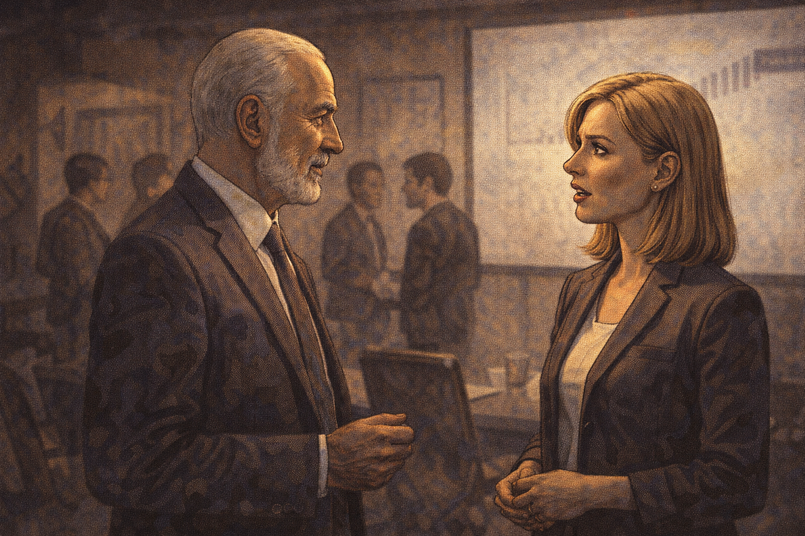

Investor: "Most honest pitch I've seen." Riley: quiet surprise.

Panel 11 of 14.
Generate a wide-landscape graphic novel drawing with a width:height ratio of 16:9. Use rich colors in the style of a thoughtful, cinematic graphic novel — expressive character faces, dramatic lighting, environments that reflect emotional tone. Not cartoonish. Do not put captions or text in the image. Show a brief moment after the presentation — a senior investor approaches Riley. He is saying something that clearly lands with weight. Riley's reaction is not performance — it is genuine, slightly surprised. She didn't expect the response to the honesty to be what it is. Color palette: the post-presentation light, the warm and slightly private quality of a conversation after the meeting.

An investor stops her after the meeting — a man who has seen hundreds of quantum pitches in the last five years. "That's the most honest pitch I've seen in this industry," he says. Riley looks at him for a moment. She is genuinely surprised. Not at the compliment — at the implication that honesty is notable. She says: "It's just the real data." He nods. "I know," he says. "That's what makes it unusual."

## Panel 12: The Pessimistic Scenario, Framed

Pessimistic scenario framed on the wall with a note below it

Panel 12 of 14.
Generate a wide-landscape graphic novel drawing with a width:height ratio of 16:9. Use rich colors in the style of a thoughtful, cinematic graphic novel — expressive character faces, dramatic lighting, environments that reflect emotional tone. Not cartoonish. Do not put captions or text in the image. Show the company's main meeting room — on the wall, the pessimistic scenario slide is now printed and framed. Below it, a handwritten note on paper is mounted beneath the frame. The room around it shows the company's active work. Riley passes by it in the foreground, glancing at it. Color palette: the company meeting room light, the framed document as an artifact of institutional commitment to honesty.

Riley has the pessimistic scenario printed and framed and hung in the main meeting room. Beneath it, a note in her handwriting: "Still more optimistic than it turned out to be. We're learning." New employees notice it during their first week. Some of them ask about it. She tells them the story. It has become the closest thing the company has to a founding document that wasn't written at the founding.

## Panel 13: Riley at the Whiteboard — Error Bars

Riley writing a new timeline — this time with error bars

Panel 13 of 14.
Generate a wide-landscape graphic novel drawing with a width:height ratio of 16:9. Use rich colors in the style of a thoughtful, cinematic graphic novel — expressive character faces, dramatic lighting, environments that reflect emotional tone. Not cartoonish. Do not put captions or text in the image. Show Riley at a whiteboard — Year 5 of the company, marker in hand, drawing a new planning timeline. This time, each milestone date has a range around it — not a single point but a visible interval. The error bars are wide. She is drawing them deliberately, accurately, without apology. Her expression is the calm competence of a person who has learned something and integrated it. Color palette: the working whiteboard, Riley's marker-stained fingers, the wide error bars as the visual lesson.

The Year 5 planning session produces a roadmap with error bars. Riley draws them wide — wide enough to be honest, wide enough to cover the range of what she actually knows. The result is less beautiful than the original launch roadmap and more accurate than anything she has presented in five years. She looks at it for a long moment. Then she takes a photo and sends it to her co-founders with no caption. They both respond with a single word: "Better."

## Panel 14: The Chart Is Honest

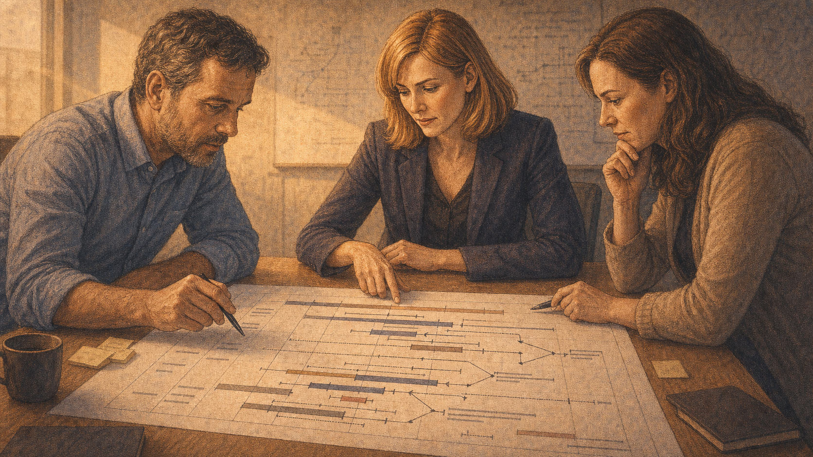

The error bars are wide — the chart is honest; less exciting, more true

Panel 14 of 14.
Generate a wide-landscape graphic novel drawing with a width:height ratio of 16:9. Use rich colors in the style of a thoughtful, cinematic graphic novel — expressive character faces, dramatic lighting, environments that reflect emotional tone. Not cartoonish. Do not put captions or text in the image. Show the planning chart from the whiteboard, now printed as a proper planning document on a table. The error bars are clearly visible — wide, honest, sometimes overlapping. It is less visually dramatic than the original launch slide. Riley and two team members are looking at it. Their expressions are the calm engagement of people who have stopped performing confidence and started doing planning. Color palette: the conference table light, the document itself with its wide, unashamed error bars.

The chart is less exciting than the launch roadmap. There is no single line promising Year 3 revenue. There are ranges, conditionals, branches. It is the honest shape of what the company knows about its future — which is to say, a range of plausible futures with different probabilities, none of which can be promised. Riley looks at the chart and does not wish it looked different. It is what the data supports. That is, at this point in the company's history, enough.

---

**Epilogue:** *The planning fallacy is not a mistake you fix by trying harder. It is a systematic bias: humans consistently estimate best-case scenarios as typical cases when planning things they care about. Riley ran into a wall that every founder hits. The difference is what she built on the other side of it.*
