# The Grad Student's Question

A first-year PhD student finds a flaw in a landmark paper — and learns why no one will hear it.

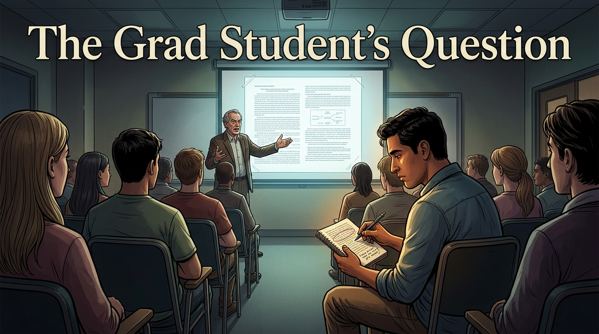

Cover Image 

Generate a wide-landscape graphic novel cover image with a width:height ratio of 16:9. Use rich colors in the style of a thoughtful, cinematic graphic novel — expressive character faces, dramatic lighting, environments that reflect emotional tone.

  Not cartoonish. Think Saga or Maus rather than superhero comics.
  Do not put any captions or text in the image EXCEPT the title at the top.

  Place the title text at the top of the image: "The Grad Student's Question"

  Show Tomás — a Latino man in his mid-20s, first-year graduate student energy, a worn notebook open in his hands — seated in the back row of a university seminar room. At the front, a senior professor gestures at a projected paper. Tomás is leaning slightly forward, pen hovering above a page where he has circled something and written a careful question in the margin. Around him, other students face forward, unquestioning. The professor's authority fills the front of the room. Tomás's expression is the careful calculation of someone who has found something real and is deciding whether to say it. Color palette: the seminar room institutional light, the projected paper bright at the front, Tomás a warm focal point in the cool mid-row.

## Panel 1: First Day

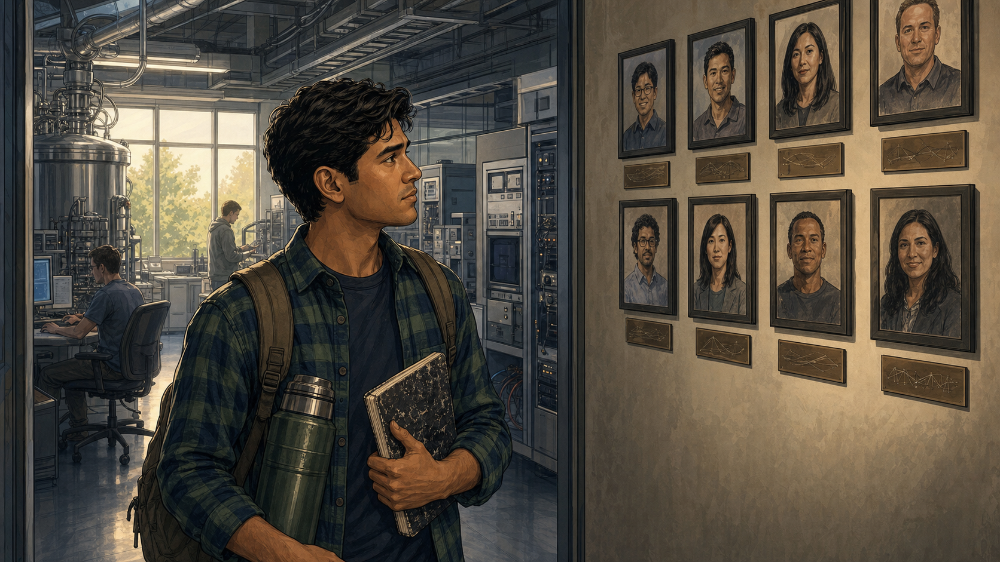

Tomás arrives at the lab — excited, photos of famous alumni on the wall

Panel 1 of 13.
Generate a wide-landscape graphic novel drawing with a width:height ratio of 16:9. Use rich colors in the style of a thoughtful, cinematic graphic novel — expressive character faces, dramatic lighting, environments that reflect emotional tone. Not cartoonish. Think Saga or Maus rather than superhero comics. Do not put captions or text in the image. Show Tomás — a Latino man, late 20s, grad student dishevelment: flannel shirt, backpack, perpetually caffeinated expression — arriving at a university quantum computing lab for the first day. He is looking around with genuine excitement. On the wall behind him, framed photos of the lab's famous alumni — researchers who went on to prominent positions. The lab equipment is visible and impressive. Tomás is lit by the bright enthusiasm of a beginning. Color palette: warm first-day morning light, the energy of new arrival, the lab as a place of aspiration.

Tomás arrives at the lab on a Monday in September with a backpack, a thermos of coffee that is already his second of the morning, and the particular excitement of someone who has worked for four years to get to this specific room. The framed photos on the wall near the door show former lab members who are now at national labs and tech companies. He reads each name. He wants to be on that wall. He puts his backpack down and starts reading the foundational paper.

## Panel 2: Reading the Landmark Paper

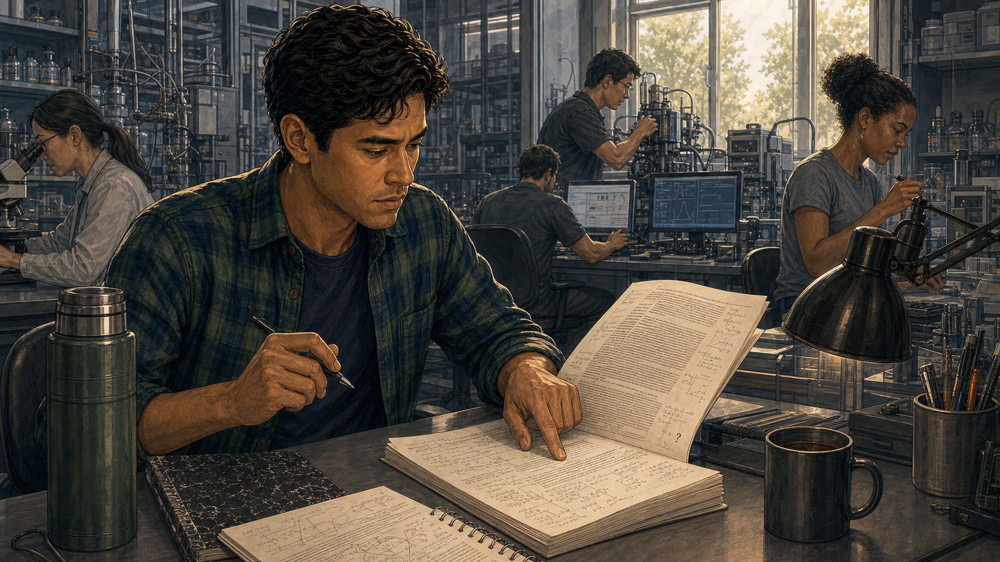

Tomás reading the landmark paper — pen slowing, frowning

Panel 2 of 13.
Generate a wide-landscape graphic novel drawing with a width:height ratio of 16:9. Use rich colors in the style of a thoughtful, cinematic graphic novel — expressive character faces, dramatic lighting, environments that reflect emotional tone. Not cartoonish. Do not put captions or text in the image. Show Tomás at a desk — the landmark paper in front of him, covered in his fresh annotations. His pen is in hand but has stopped moving. He is frowning — not frustrated, but with the particular focus of someone who has noticed something. He's re-reading a section of the paper, finger tracking the lines. The lab is active around him — other researchers at their stations. Color palette: the focused lab workday light, Tomás in the foreground with the paper, his sudden stillness contrasting with the activity around him.

The landmark paper is one he knows — everyone knows it. It established the benchmark result that every project in this lab builds on. He reads it front to back, making notes. His pen slows in section four, where the noise model is specified. He re-reads the assumptions. He reads them again. Something is not adding up. He writes a question mark in the margin, very small, and keeps reading. The question mark stays in his head.

## Panel 3: The Quiet Question

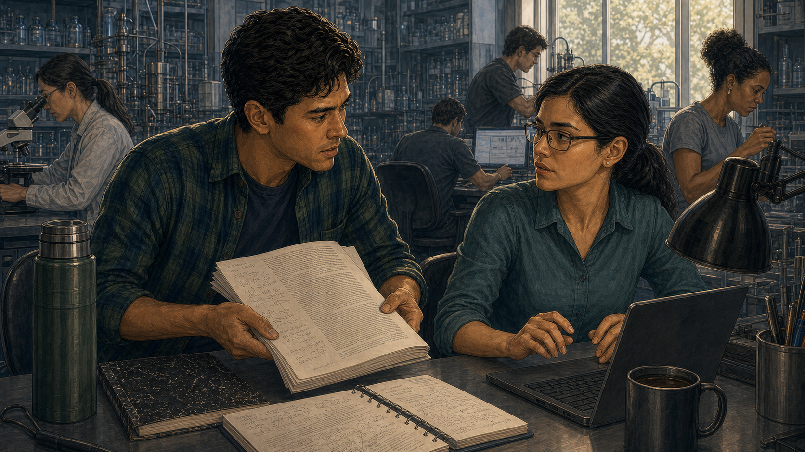

Tomás asks a labmate quietly: "Did anyone check the noise model?"

Panel 3 of 13.
Generate a wide-landscape graphic novel drawing with a width:height ratio of 16:9. Use rich colors in the style of a thoughtful, cinematic graphic novel — expressive character faces, dramatic lighting, environments that reflect emotional tone. Not cartoonish. Do not put captions or text in the image. Show Tomás leaning toward a labmate — a more senior grad student, 30s, professional, busy at her station. Tomás is asking his question quietly, the paper in his hand. Her reaction upon hearing the question is a very specific stillness — she has heard him, processed the implication, and gone very still. Not angry — just very still. The lab around them continues. Color palette: the ordinary lab light, the sudden stillness of the labmate as the visual signal.

A week in, Tomás slides over to the desk of Elena, a third-year student who was in the lab when the landmark result was generated. He keeps his voice low. "Did anyone verify the noise model in section four? The assumptions seem like they'd be hard to satisfy at the scale they're claiming." Elena's hands stop over her keyboard. She does not turn to look at him for a moment. Then she does. Her expression is the expression of someone deciding how to answer a question that has more than one answer.

## Panel 4: "That Paper Is Why We Have Funding"

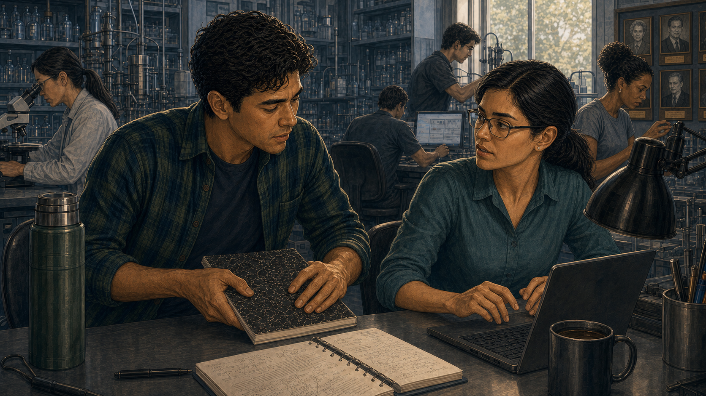

Labmate: "That paper is why we all have funding." Tomás closes his notebook.

Panel 4 of 13.
Generate a wide-landscape graphic novel drawing with a width:height ratio of 16:9. Use rich colors in the style of a thoughtful, cinematic graphic novel — expressive character faces, dramatic lighting, environments that reflect emotional tone. Not cartoonish. Do not put captions or text in the image. Show the conversation between Tomás and Elena — she is speaking quietly to him, her expression not unkind but very clear. Her meaning is fully visible in her face. Tomás receives this information and closes his notebook — not dramatically, just the movement of someone filing something away. His expression shows the first layer of the choice he is about to not make for several weeks. Color palette: the lab light, slightly cooler in this moment, the quiet weight of institutional reality landing on a new arrival.

"That paper is why we all have funding," Elena says. Her voice is not hostile. It is the tone of someone giving a newcomer important information about the terrain. "The PI wrote the grant around it. The department's quantum program budget references it. Three of the people at this lab have their careers on it right now." She turns back to her keyboard. Tomás closes his notebook. He understands the information. He stores it. He does not agree with what it implies.

## Panel 5: Going Back to Assigned Work

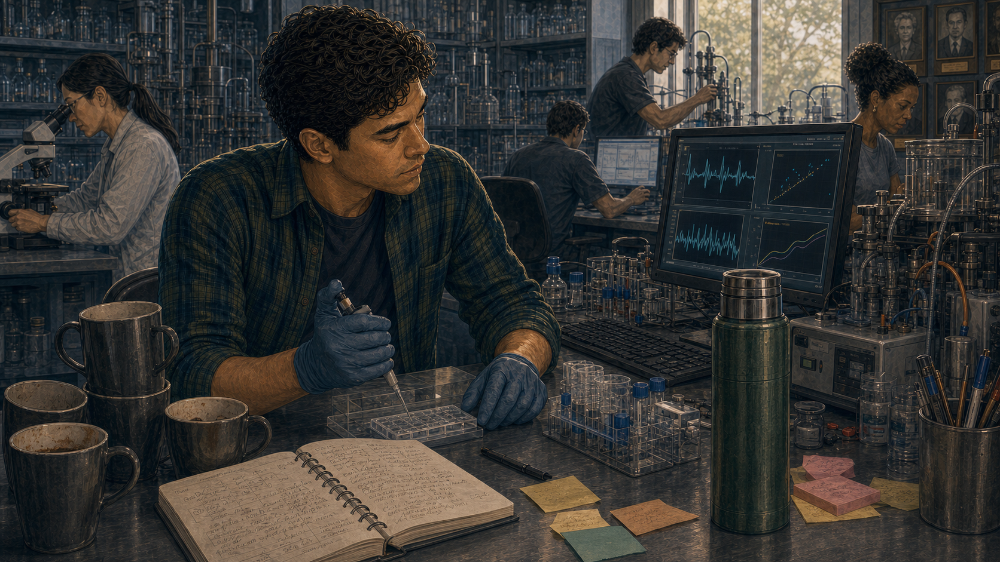

Tomás goes back to assigned work — the question won't leave him

Panel 5 of 13.
Generate a wide-landscape graphic novel drawing with a width:height ratio of 16:9. Use rich colors in the style of a thoughtful, cinematic graphic novel — expressive character faces, dramatic lighting, environments that reflect emotional tone. Not cartoonish. Do not put captions or text in the image. Show Tomás at his lab station in the weeks that follow — working, caffeinated, doing his assigned project. But the paper from Panel 2 is visible on his desk, off to the side, not filed away. His work is on the screen in front of him but periodically his eyes drift to the paper. The question is present in the composition even when Tomás is looking away from it. Weeks-worth of coffee cups suggest time passing. Color palette: the routine lab light of weeks passing, the paper on the desk a visual persistence.

He throws himself into the assigned work — a characterization experiment for the lab's main project. He is good at it. He makes progress. His advisor compliments his methodology. At night he reads papers in the field and the question about section four sits in the background like a frequency his ears won't stop noticing. He turns the assigned work up louder. The frequency doesn't go away.

## Panel 6: Starting the Replication

Late at night — Tomás alone in the lab, starting the replication

Panel 6 of 13.
Generate a wide-landscape graphic novel drawing with a width:height ratio of 16:9. Use rich colors in the style of a thoughtful, cinematic graphic novel — expressive character faces, dramatic lighting, environments that reflect emotional tone. Not cartoonish. Do not put captions or text in the image. Show Tomás alone in the lab very late at night — the lab is dark except for his station. He has the landmark paper open beside his laptop. He is setting up a replication analysis, beginning with the noise model in section four. His expression is the look of someone who has made a private decision. He is not certain. He is not brave in a heroic sense. He is just doing the thing. Color palette: the dark lab, the small warm pool of his station light, the late-night palette of solitary work beginning.

On a Thursday night in November, after everyone else has left, Tomás opens the landmark paper to section four and starts building the replication from scratch. He is not trying to disprove anything. He is trying to understand the noise model well enough to satisfy himself. If the model is right, the replication will show that and he'll file the question and move on. He has told himself this. He starts building the simulation. He sets a deadline of two months.

## Panel 7: Two Months of Careful Work

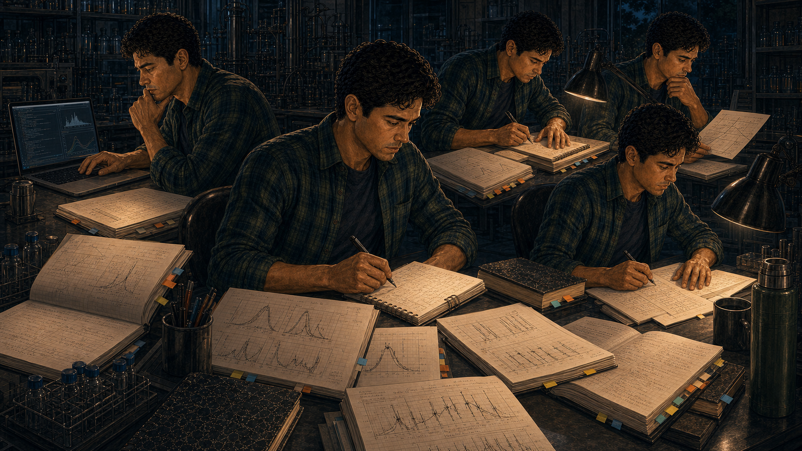

Spreadsheets, error bars, checking everything twice

Panel 7 of 13.
Generate a wide-landscape graphic novel drawing with a width:height ratio of 16:9. Use rich colors in the style of a thoughtful, cinematic graphic novel — expressive character faces, dramatic lighting, environments that reflect emotional tone. Not cartoonish. Do not put captions or text in the image. Show a montage composition — Tomás across multiple nights and weekends, the same station, the work accumulating: spreadsheets printed and annotated, error bar calculations on paper, a physical notebook filling with methodology notes. The flannel shirt and thermos are constants. The detail work is visible — this is painstaking, careful, methodical science. The lab light doesn't change between visits. He is always alone. Color palette: the consistent late-night blue-white of solitary work over time, the accumulation of effort visible in the surrounding papers.

It takes eight weeks. He runs the noise model at five different parameter regimes. He calculates the error bounds three separate ways. He asks a statistics postdoc in a different department, anonymously, about a methodological question, without explaining the context. He double-checks the statistics postdoc's answer against two textbooks. He is slow, careful, and thorough in the way you are when the result will matter and you don't want to be wrong about something this consequential.

## Panel 8: The Results

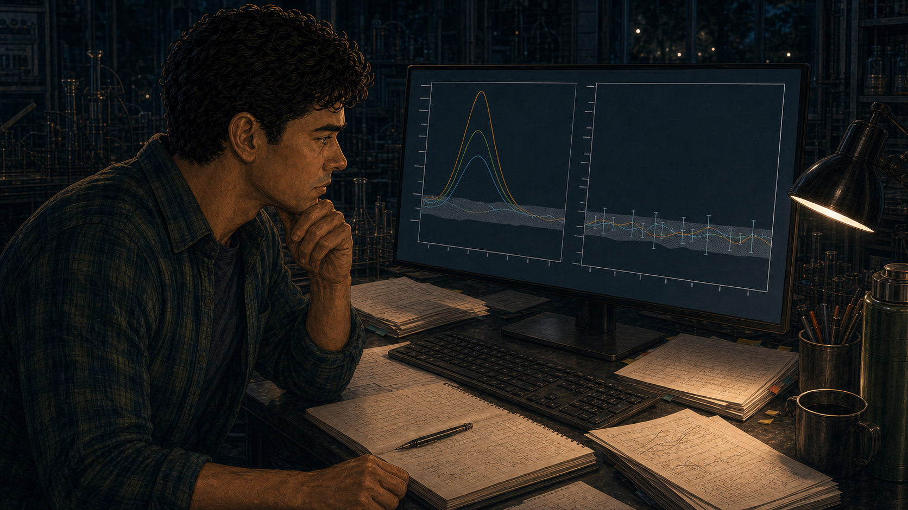

Results: they don't match — the effect shrinks to noise

Panel 8 of 13.
Generate a wide-landscape graphic novel drawing with a width:height ratio of 16:9. Use rich colors in the style of a thoughtful, cinematic graphic novel — expressive character faces, dramatic lighting, environments that reflect emotional tone. Not cartoonish. Do not put captions or text in the image. Show Tomás looking at his final results — a comparison graph or table on his screen showing the original paper's key result alongside his replication. The claimed effect is present in the original; in his analysis, under the corrected noise model, it shrinks to within the noise floor. His expression is the careful neutral of someone looking at a result that is clearly what it is. He is not victorious. He is not frightened — not yet. He is looking at something true. Color palette: the screen light on his face, the graph that tells the story in two columns.

The result is clear: under the corrected noise model, the effect reported in the landmark paper — the core result the lab's current work is built on — reduces to within the noise floor. The signal is not there. Tomás checks the code twice more. He reruns it. He changes one parameter that might conceivably be interpreted differently and checks whether the effect returns. It doesn't. He sits looking at his screen. He has been dreading this result and now it is here and it is what it is.

## Panel 9: Showing the Advisor

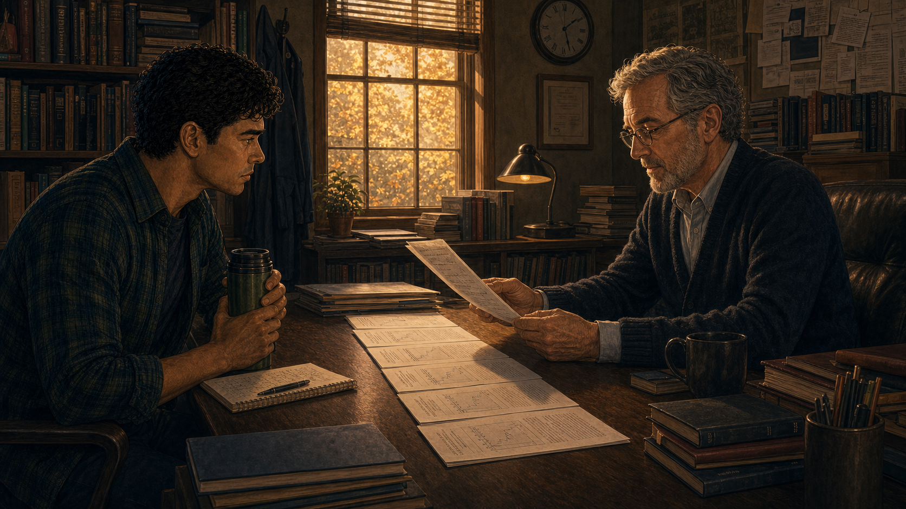

Tomás shows his advisor — long silence in the office

Panel 9 of 13.
Generate a wide-landscape graphic novel drawing with a width:height ratio of 16:9. Use rich colors in the style of a thoughtful, cinematic graphic novel — expressive character faces, dramatic lighting, environments that reflect emotional tone. Not cartoonish. Do not put captions or text in the image. Show Tomás sitting across from his advisor — a professor in his 50s, distinguished but not arrogant — in a faculty office. Tomás has placed a printed summary of the replication on the desk between them. The advisor is reading it. The silence in the room is visible in both their postures. The advisor has not yet responded. The result is on the desk. Color palette: the faculty office light — warmer than the lab, books and papers around them — the particular quality of a silence before something important is said.

Professor Hartley reads the twelve-page summary Tomás prepared without looking up. He reads it slowly. Tomás watches the clock on the wall and the color of the light through the window change slightly. When Hartley finishes, he sets the papers down and looks at the middle distance for a moment. Then he looks at Tomás. "You could be wrong," he says. His voice is not unkind. "I know," Tomás says. "I've checked six times. Here's the methodology."

## Panel 10: "I've Checked Six Times"

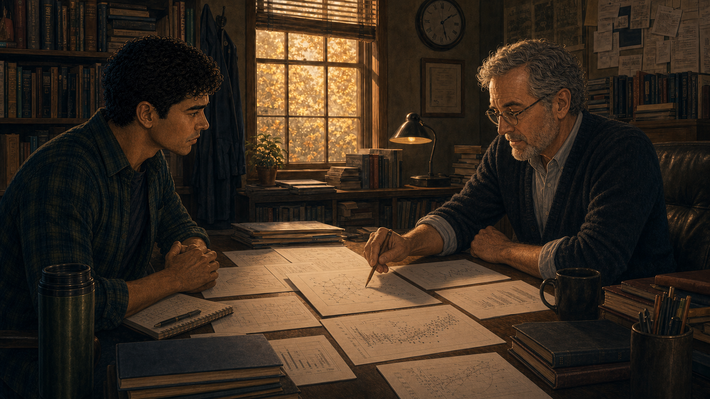

Tomás lays out the methodology — the advisor is convinced

Panel 10 of 13.
Generate a wide-landscape graphic novel drawing with a width:height ratio of 16:9. Use rich colors in the style of a thoughtful, cinematic graphic novel — expressive character faces, dramatic lighting, environments that reflect emotional tone. Not cartoonish. Do not put captions or text in the image. Show Tomás and his advisor at the faculty desk — Tomás has his methodology materials out, walking through the analysis step by step. His posture is confident but not confrontational — he has done the work and it speaks for itself. The advisor is following carefully, now engaged as a scientist evaluating evidence rather than an institution defending its stake. The expression on the advisor's face shifts from skepticism toward the particular respect that one scientist gives another when the work is correct. Color palette: the office in the late afternoon, the slight warming of a professional relationship navigating something difficult.

Tomás walks through every step. The noise model assumptions from section four. The parameter regimes. The statistical test choices. The sensitivity analysis. The result under every reasonable interpretation of the disputed assumptions. Professor Hartley is a good scientist. By the end of the walkthrough, he is not arguing with the analysis. He is asking the same questions Tomás asked himself during the eight weeks. The answers are the same. The result holds.

## Panel 11: Submission — Fierce Reviewer Pushback

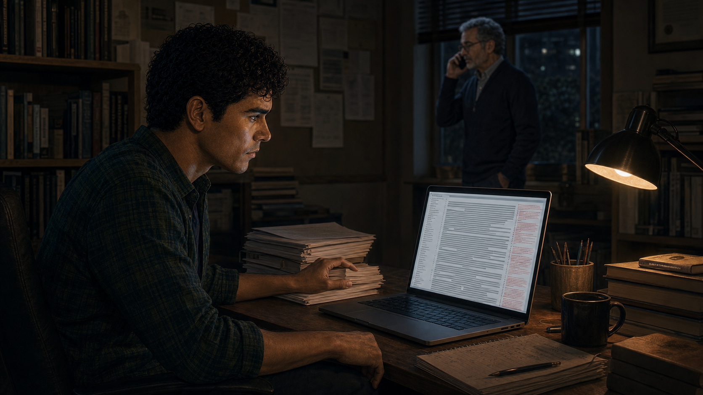

Replication note submitted — reviewer comments are fierce; Tomás reads with jaw tight

Panel 11 of 13.
Generate a wide-landscape graphic novel drawing with a width:height ratio of 16:9. Use rich colors in the style of a thoughtful, cinematic graphic novel — expressive character faces, dramatic lighting, environments that reflect emotional tone. Not cartoonish. Do not put captions or text in the image. Show Tomás at his station reading reviewer comments on his submitted replication note. The printed comments are long and aggressive in tone — dense text visible, the kind of reviewer response that reads as a challenge to the audacity of the submission rather than the science. Tomás reads it with his jaw slightly set, a young man absorbing institutional resistance. His advisor is on the phone in the background. Color palette: the lab light, slightly cooler, Tomás in the foreground with the physicality of a difficult document in his hands.

The reviewer comments come back six weeks after submission. Two of the three reviewers reject the note, one describing the analysis as "premature" and another suggesting the authors "lack the context to evaluate a result of this complexity." The third asks clarifying questions. None of the three engage with the specific methodological critique. Tomás reads the comments twice, jaw tight, and writes his response over a weekend. His response is specific, patient, and thorough. He does not concede the points he does not concede.

## Panel 12: Publication

It publishes — the original authors respond professionally; citations update quietly

Panel 12 of 13.
Generate a wide-landscape graphic novel drawing with a width:height ratio of 16:9. Use rich colors in the style of a thoughtful, cinematic graphic novel — expressive character faces, dramatic lighting, environments that reflect emotional tone. Not cartoonish. Do not put captions or text in the image. Show Tomás getting the acceptance notification on his laptop — a quiet moment of publication. In the background, a separate visual thread suggests the broader response: the original paper's authors (not shown as antagonists) issuing a professional response; citations to the landmark paper beginning to include caveats in other researchers' subsequent papers. The field is adjusting. Tomás's expression is not triumphant — it is the quiet look of something done correctly. Color palette: the ordinary lab light of a result achieved, without fanfare.

The replication note publishes after a third round of revision. The original authors issue a professional response that acknowledges the noise model concern and offers an alternative interpretation. The community begins incorporating the caveat in subsequent work. The landmark paper is not retracted — its broader contributions remain valid. But the specific claim in section four is now cited with a qualification note that links to Tomás's paper. The adjustment is quiet and slow and real.

## Panel 13: Teaching New Grad Students

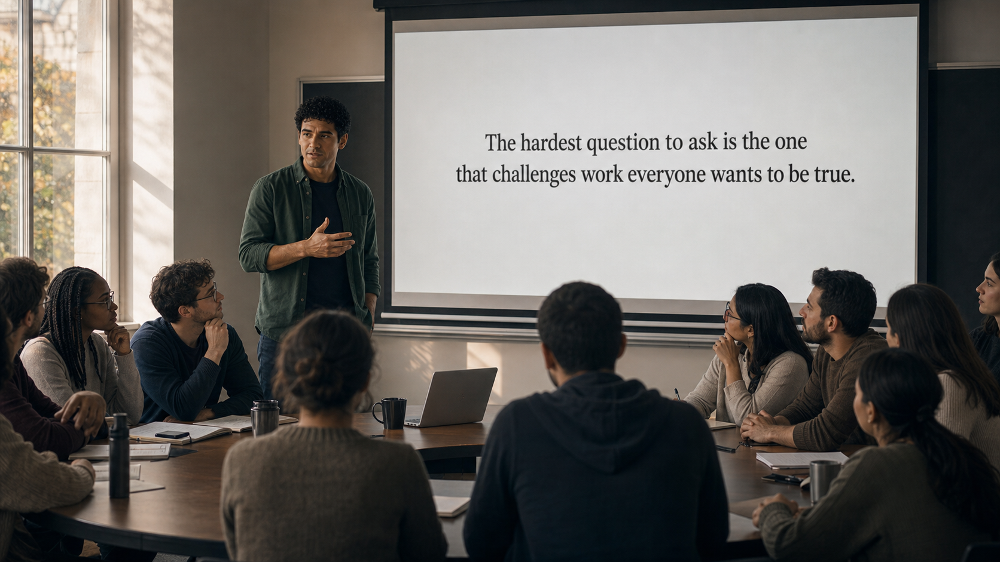

Tomás teaching a seminar — "The hardest question to ask..."

Panel 13 of 13.
Generate a wide-landscape graphic novel drawing with a width:height ratio of 16:9. Use rich colors in the style of a thoughtful, cinematic graphic novel — expressive character faces, dramatic lighting, environments that reflect emotional tone. Not cartoonish. Do not put captions or text in the image. Show Tomás — a few years older, a little more settled but still in flannel, still caffeinated — teaching a seminar to a new cohort of graduate students. He is at the front of a small room, a slide visible behind him with text about critical reading. The students are attentive. His expression is the honest authority of someone who has earned what he's teaching. Color palette: the seminar room light, the same warm quality as a good teaching moment.

Two years later, Tomás teaches a methods seminar to the new cohort. He covers noise models, statistical power, and the limits of what a measurement can tell you. On the last slide, he writes one sentence: "The hardest question to ask is the one that challenges work everyone wants to be true." He does not tell the story of the replication in the seminar — it would take too long and shift the focus in the wrong direction. He tells it afterward, over coffee, to the one student who asks the right follow-up question.

---

**Epilogue:** *Tomás almost didn't run the replication. The decision to stay quiet would have been completely rational — he was new, untenured, dependent on a lab whose reputation rested on the paper he was questioning. His courage wasn't dramatic. It was two months alone in a lab, checking arithmetic, choosing not to close the notebook.*
