# The Halo Effect in the Lab

A Nobel laureate's prestige silences the junior researcher whose analysis could have saved a year.

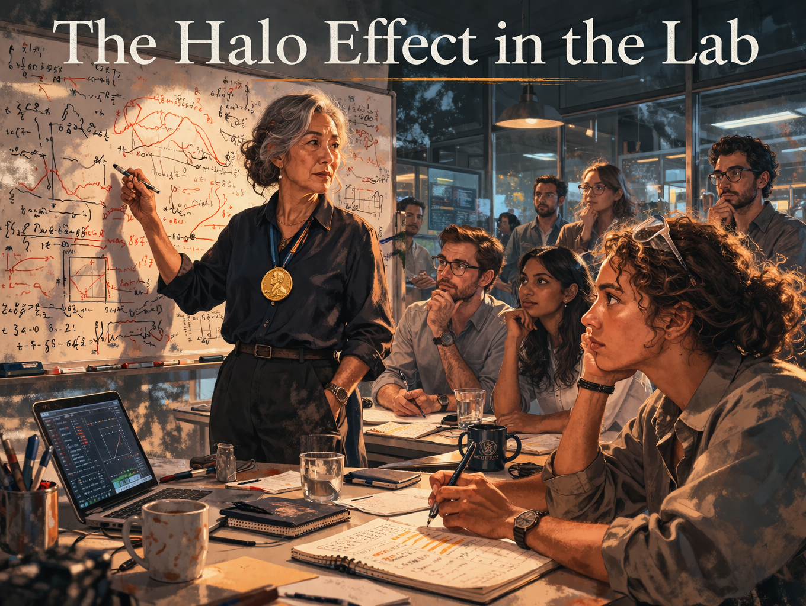

Cover Image 

Generate a wide-landscape graphic novel cover image with a width:height ratio of 16:9. Use rich colors in the style of a thoughtful, cinematic graphic novel — expressive character faces, dramatic lighting, environments that reflect emotional tone.

  Not cartoonish. Think Saga or Maus rather than superhero comics.
  Do not put any captions or text in the image EXCEPT the title at the top.

  Place the title text at the top of the image: "The Halo Effect in the Lab"

  Show Dr. Chen — an East Asian woman in her 60s, silver-streaked hair, Nobel medal visible at her collar — standing at a whiteboard in the institute's main lab. Around the table, her research team faces her, notebooks open. In the foreground, Dr. Alinta Watson — a postdoc in her early 30s, curly hair, pen hovering above her notebook — has written something and is not raising her hand. The Nobel medal catches the light. The whiteboard equations behind Chen radiate authority. The gap between Watson's written question and her silence is the visual center of the piece. Color palette: the clean institutional light of the new institute, the whiteboard bright, the medal a warm gold point against Dr. Chen's dark blouse.

## Panel 1: The Nobel Prize

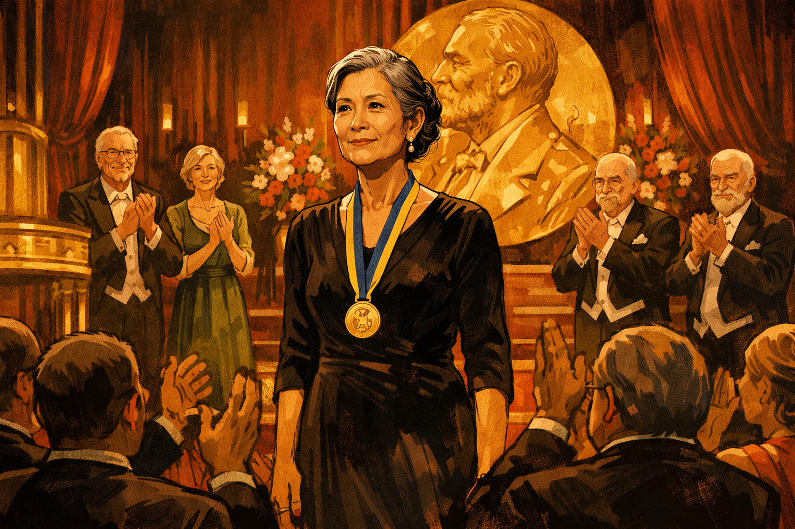

Dr. Chen receiving her Nobel Prize on stage

Panel 1 of 13.
Generate a wide-landscape graphic novel drawing with a width:height ratio of 16:9. 
Use rich colors in the style of a thoughtful, cinematic graphic novel — expressive character faces, dramatic lighting, environments that reflect emotional tone. Not cartoonish. Think Saga or Maus rather than superhero comics. Do not put captions or text in the image. Show Dr. Chen — an East Asian woman in her 60s, elegant, silver-streaked hair, precise posture, Nobel medal now around her neck — on a formal stage, just having received the prize. The audience is standing. The moment is one of genuine triumph — the culmination of a career. Her expression carries the complex pride of someone who has worked a very long time for something real. The stage is formal, gold and deep-red, Swedish ceremony aesthetics. Color palette: the formal warmth of a prize ceremony, deep reds and golds, the warm light of public recognition.

Dr. Chen stands on the Nobel stage in Stockholm and feels the weight of the medal settle against her chest. The audience is on its feet. The prize recognizes forty years of condensed matter physics — topological insulators, a field she helped build from the foundation. She gives her lecture with the precise posture she has held her entire career. She is sixty-three and at the peak of what her field considers possible. That night, over dinner, a technology company CEO slides a folder across the table.

## Panel 2: The CEO's Approach

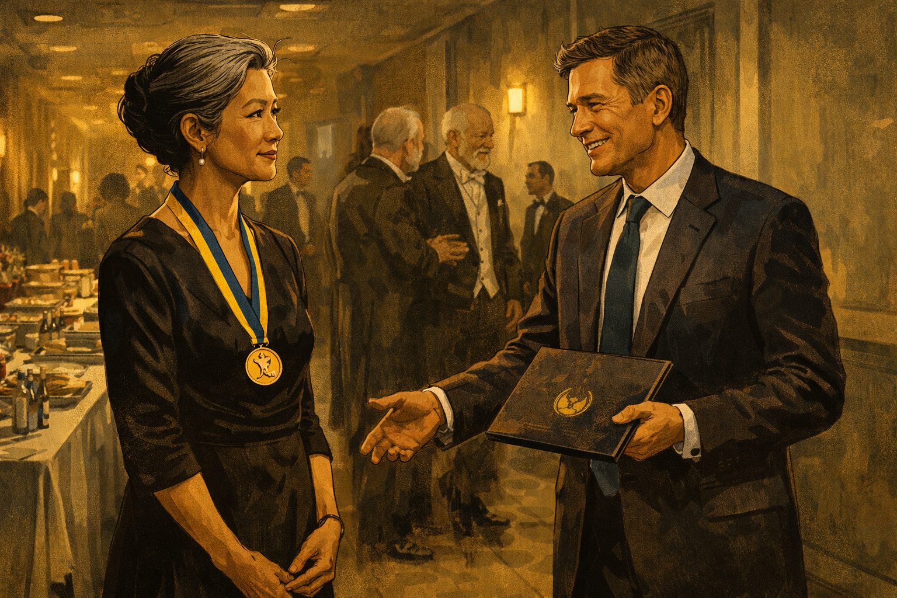

The company CEO approaches Dr. Chen backstage with a folder

Panel 2 of 13.
Generate a wide-landscape graphic novel drawing with a width:height ratio of 16:9. Use rich colors in the style of a thoughtful, cinematic graphic novel — expressive character faces, dramatic lighting, environments that reflect emotional tone. Not cartoonish. Do not put captions or text in the image. Show the Nobel ceremony backstage — a green room or corridor with catering tables and other laureates. A polished tech CEO — a man in his 50s, expensive suit, the ease of someone who moves comfortably in high-status rooms — is approaching Dr. Chen with a company folder in his hand. His smile is genuine and ambitious. Dr. Chen receives him with the precise courtesy of someone who has earned the right to be selective. The Nobel medal is still visible at her collar. Color palette: the backstage gold-grey of a formal event corridor, the two figures in a negotiation they haven't begun yet.

The CEO is charming and specific. The folder contains a proposal for a new institute attached to his company — quantum computing, topological qubits, her name on the door. Her Nobel work on topological matter, he explains, is foundational to their approach. She reads the proposal in the car on the way back to the hotel. The flattery is well-designed. It also happens to be technically plausible. She calls her husband. She accepts in the morning.

## Panel 3: Ribbon Cutting

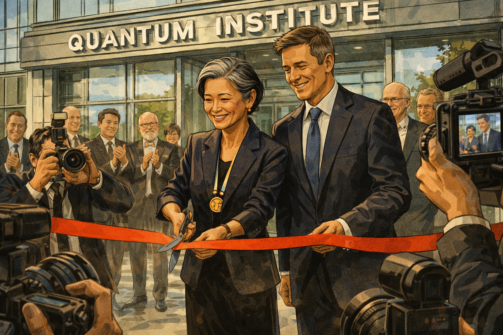

Institute ribbon cutting — cameras, smiling faces, Dr. Chen at center

Panel 3 of 13.
Generate a wide-landscape graphic novel drawing with a width:height ratio of 16:9. Use rich colors in the style of a thoughtful, cinematic graphic novel — expressive character faces, dramatic lighting, environments that reflect emotional tone. Not cartoonish. Do not put captions or text in the image. Show the ribbon cutting ceremony for the new quantum institute — a modern building entrance, a red ribbon, Dr. Chen holding ceremonial scissors. The CEO is beside her, other executives and press around them. Cameras from several angles. Everyone is smiling. The building behind them is glass and steel, the lettering of the institute's name visible above. Dr. Chen's expression shows genuine pride and forward momentum — this is a beginning. Color palette: the bright outdoor light of a public ceremony, the clean lines of a new building, institutional optimism in every element.

The institute building is glass and light and opens on a Tuesday in October. Twenty cameras record Dr. Chen cutting the ribbon. The press release leads with her Nobel. Her team of eighteen researchers will be among the best-funded quantum scientists in the world. The CEO says "transformational" in his remarks and means it. Dr. Chen says "rigorous" in hers and means that. The day is full of good intentions.

## Panel 4: First Technical Meeting

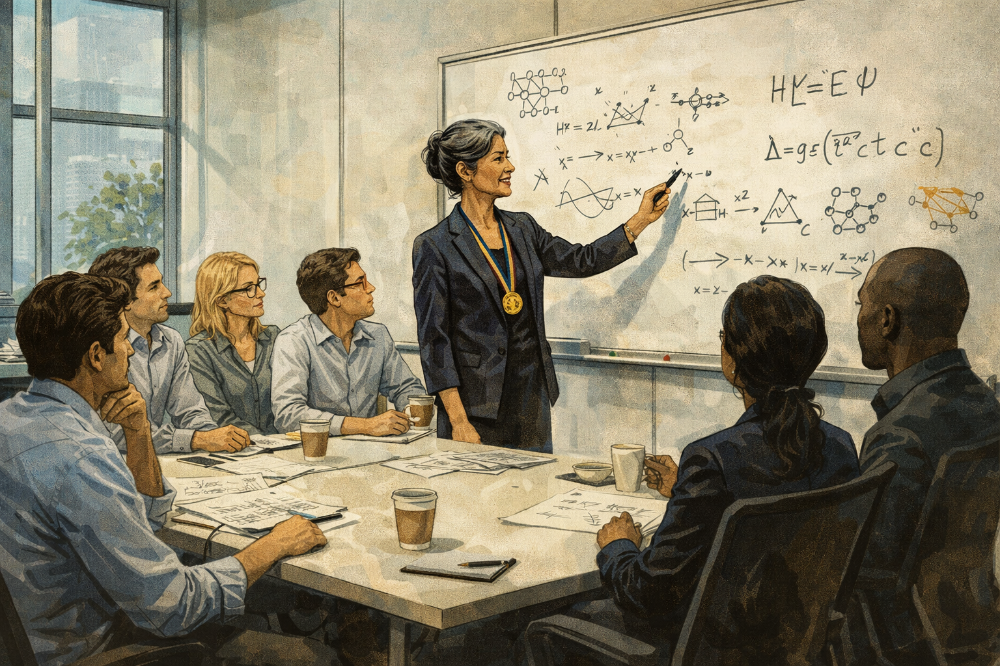

Dr. Chen proposes an approach; researchers exchange glances

Panel 4 of 13.
Generate a wide-landscape graphic novel drawing with a width:height ratio of 16:9. Use rich colors in the style of a thoughtful, cinematic graphic novel — expressive character faces, dramatic lighting, environments that reflect emotional tone. Not cartoonish. Do not put captions or text in the image. Show the institute's first technical meeting — a conference room, whiteboard, the team gathered. Dr. Chen stands at the whiteboard, marker in hand, proposing a technical approach that draws on her condensed matter background. Her posture and precision signal this is the beginning of her approach to the problem. Among the eight or ten researchers visible, two are exchanging the briefest glance — not hostile, not conspiratorial, just a quick look between colleagues who have a reaction they are not voicing. Color palette: the clean light of a new meeting room, the whiteboard bright, the subtle dynamics of power in a technical discussion.

In the first technical meeting, Dr. Chen proposes an approach to topological qubit stabilization that draws directly from her Nobel work. It is intellectually elegant — the kind of idea that comes from a mind that sees connections others miss. Around the table, three postdocs and two senior researchers have immediate technical thoughts. They write them in their notebooks. They do not raise their hands.

## Panel 5: The Silence

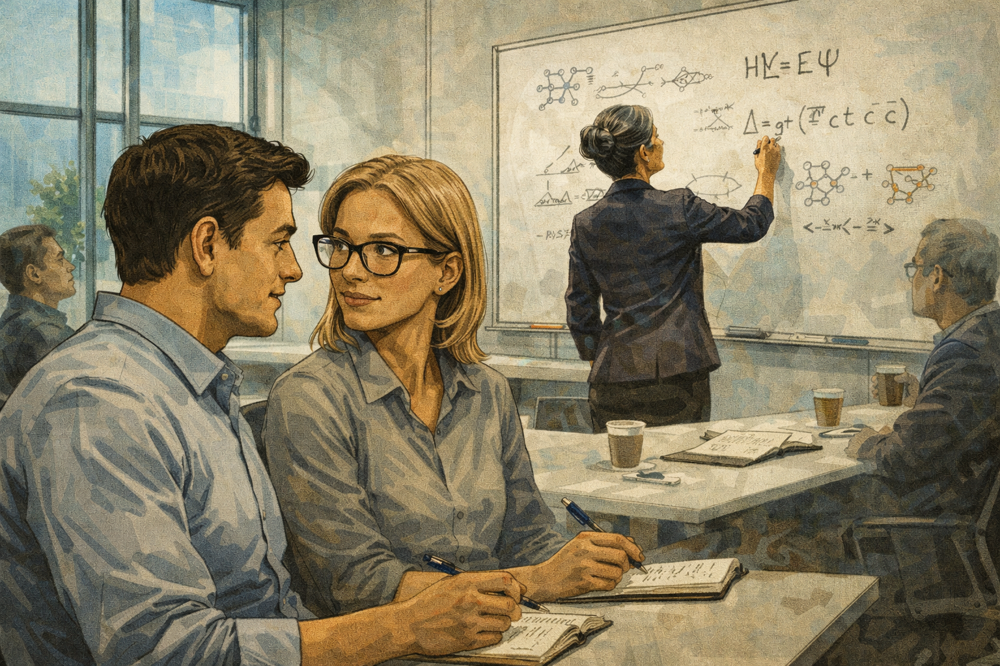

Junior researchers exchange glances but say nothing

Panel 5 of 13.
Generate a wide-landscape graphic novel drawing with a width:height ratio of 16:9. Use rich colors in the style of a thoughtful, cinematic graphic novel — expressive character faces, dramatic lighting, environments that reflect emotional tone. Not cartoonish. Do not put captions or text in the image. Show a meeting room moment — Dr. Chen is writing on the whiteboard with her back to the room. Two junior researchers in the foreground are exchanging a look: not skeptical or contemptuous, but the look of two people who have a shared thought and a shared sense that this is not the moment to voice it. Their notebooks are open. Their pens are hovering. The Nobel medal is not present here but its authority is. Color palette: the institutional meeting room light, the slight psychological weight of a room editing itself.

Dr. Chen writes an equation on the board and steps back to look at it. Behind her, the team looks at the equation and then at each other. Dr. Alinta Watson, a postdoc from MIT, has three specific questions about scalability. She writes them in her notebook in small, neat writing. She underlines the third one. She will re-read this notebook entry six months later and feel, not exactly regret, but something in that neighborhood.

## Panel 6: Late Night Simulations

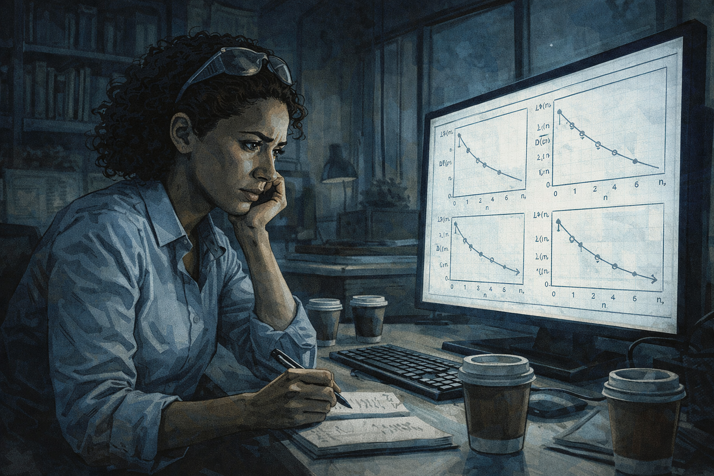

A postdoc runs simulations alone — the approach won't scale

Panel 6 of 13.
Generate a wide-landscape graphic novel drawing with a width:height ratio of 16:9. Use rich colors in the style of a thoughtful, cinematic graphic novel — expressive character faces, dramatic lighting, environments that reflect emotional tone. Not cartoonish. Do not put captions or text in the image. Show Dr. Alinta Watson — a postdoc, early 30s, curly hair, safety glasses pushed up on forehead — alone in a dark institute office late at night, running simulations on a computer. The screen shows scaling graphs that go in the wrong direction. Her expression is focused and troubled. Empty coffee cups around her. This is the private moment of someone finding something important that they don't yet know what to do with. Color palette: the blue-white of a monitor in a dark office, the late-night palette of solitary discovery.

Dr. Watson runs the simulations on a Thursday night when the institute is empty. She is not trying to prove Dr. Chen wrong — she is trying to understand the approach well enough to implement it. The scaling graphs emerge from the simulation and go in the wrong direction. She reruns them with different parameters. The curves are consistent. The approach, as specified, does not scale to the problem sizes that would make it useful. She saves the results in a folder. She does not send them to anyone.

## Panel 7: The Deleted Memo

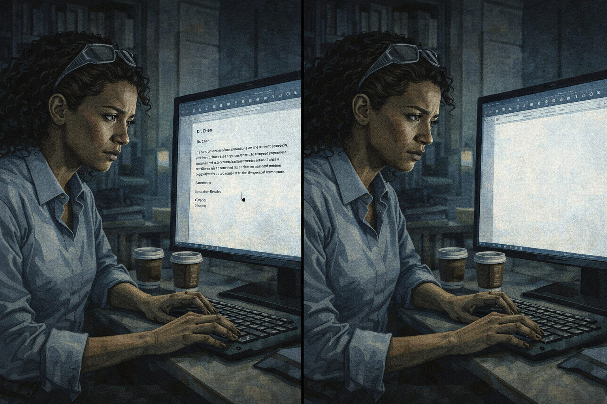

The postdoc drafts a memo, then selects all and deletes it

Panel 7 of 13.
Generate a wide-landscape graphic novel drawing with a width:height ratio of 16:9. Use rich colors in the style of a thoughtful, cinematic graphic novel — expressive character faces, dramatic lighting, environments that reflect emotional tone. Not cartoonish. Do not put captions or text in the image. Show Dr. Watson at her desk, a document on her screen — a draft memo. The memo is addressed to Dr. Chen and presents the simulation results with careful, respectful framing. Watson's hand is on the keyboard. The cursor is over the text. In the next moment — shown in the same panel through the slightest compositional shift — the document is empty. She has selected all and deleted it. Her expression in the moment before deletion is the complex calculation of someone weighing professional risk against intellectual honesty. Color palette: the office screen light, the moment before a decision made from fear rather than reason.

She writes the memo on a Sunday. It is careful and respectful — she frames the simulation results as questions, not conclusions, inviting Dr. Chen's interpretation. She reads it back twice. Then she thinks about the Nobel prize and the fact that she is in her second year of a three-year postdoc. She selects all. She deletes it. She tells herself she might be wrong about the scaling. She might be. She is not.

## Panel 8: Dead End

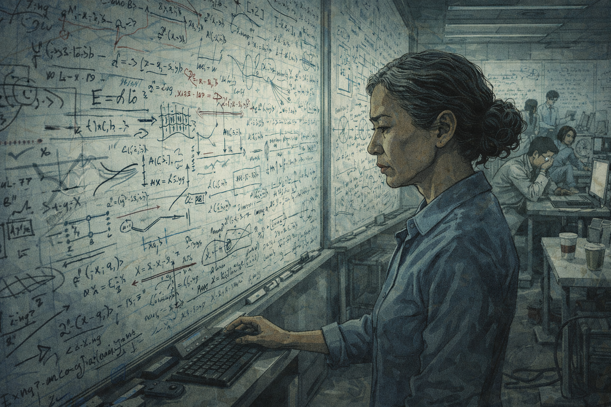

A year passes — whiteboards covered in failed attempts

Panel 8 of 13.
Generate a wide-landscape graphic novel drawing with a width:height ratio of 16:9. Use rich colors in the style of a thoughtful, cinematic graphic novel — expressive character faces, dramatic lighting, environments that reflect emotional tone. Not cartoonish. Do not put captions or text in the image. Show the institute research space a year later — the whiteboards that were clean in Panel 4 now covered in dense, accumulated work. Cross-outs. Revision arrows. Diagrams that have been erased and redrawn. Team members at different stations look tired in the productive way that eventually becomes just tired. Dr. Chen studies one whiteboard section, expression focused. The room has the atmosphere of effort sustained past where it should have been redirected. Color palette: the muted tone of accumulated work without resolution, the whiteboards as a visual record of a year of not finding what was needed.

A year passes. The approach evolves — Dr. Chen's team is brilliant and they push it as far as it will go. They publish two papers that advance the understanding of topological qubit decoherence. But the core scaling problem, which Dr. Watson's simulation found in month three, is still there, in various modified forms. The whiteboards are a record of a year of very good scientists working very hard in the wrong direction.

## Panel 9: Dr. Chen Finds the Deleted Memo

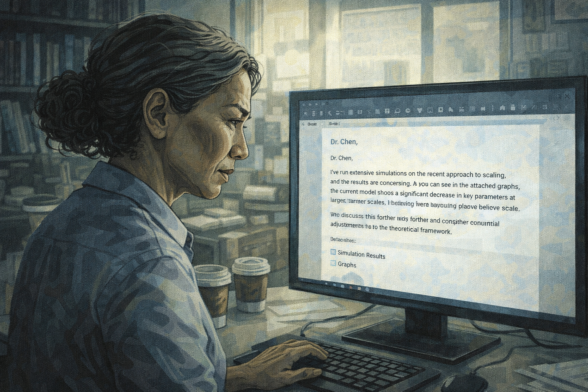

Dr. Chen finds Watson's deleted memo in a shared drive backup

Panel 9 of 13.
Generate a wide-landscape graphic novel drawing with a width:height ratio of 16:9. Use rich colors in the style of a thoughtful, cinematic graphic novel — expressive character faces, dramatic lighting, environments that reflect emotional tone. Not cartoonish. Do not put captions or text in the image. Show Dr. Chen at her desk, reading something on her screen — she has found a recovered file in a shared drive backup, and it is the memo Dr. Watson deleted a year ago. Dr. Chen's expression as she reads is complex: the initial surprise of finding it, then the careful absorption of its contents, then something that might be self-recognition. She is a precise person and she is reading something precise. Color palette: the afternoon office light, Dr. Chen in a private moment of discovering something about what she created.

In a routine data backup migration, a recovered draft appears in the shared drive's version history. Dr. Chen almost ignores it — old drafts are common. She clicks on it. It is addressed to her. It is dated fourteen months ago. It is from Dr. Watson and it contains, in polite, careful language, exactly the scaling analysis that has occupied the team's failed year. Dr. Chen reads it three times. The memo is correct.

## Panel 10: The Confrontation

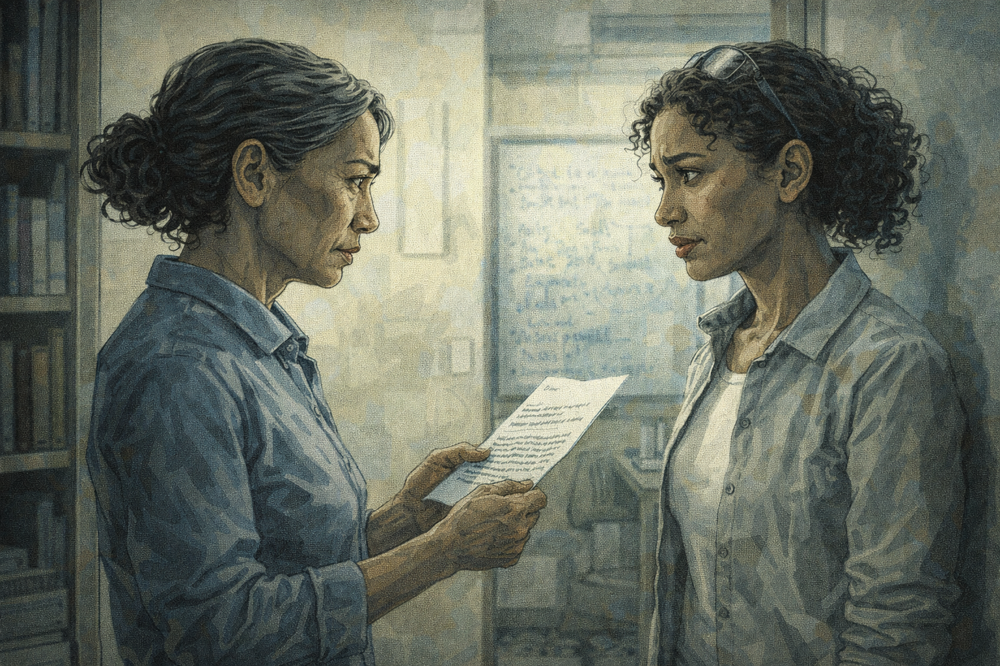

Dr. Chen and Watson face to face — "Why didn't you send this?"

Panel 10 of 13.
Generate a wide-landscape graphic novel drawing with a width:height ratio of 16:9. Use rich colors in the style of a thoughtful, cinematic graphic novel — expressive character faces, dramatic lighting, environments that reflect emotional tone. Not cartoonish. Do not put captions or text in the image. Show Dr. Chen and Dr. Watson standing facing each other in a small meeting room or office doorway — not confrontational in an aggressive way but in the direct way of two people having a necessary conversation. Dr. Chen is holding a printout of the memo. Her expression is not angry; it is the precise look of someone who wants to understand something. Dr. Watson's expression shows a mix of exposure and relief. Both women are dignified. The conversation is difficult and important. Color palette: the direct light of a real conversation, both women clearly visible, no shadow obscuring either face.

"Why didn't you send this?" Dr. Chen's voice is controlled and direct. Dr. Watson considers saying she wasn't confident enough, or that the analysis might have been wrong. She says the truth instead: "I didn't think it was my place." The silence that follows lasts about four seconds. In those four seconds, Dr. Chen understands something about the structure she has been the center of for fourteen months. Her face changes. Not dramatically — precisely.

## Panel 11: "I Didn't Think It Was My Place"

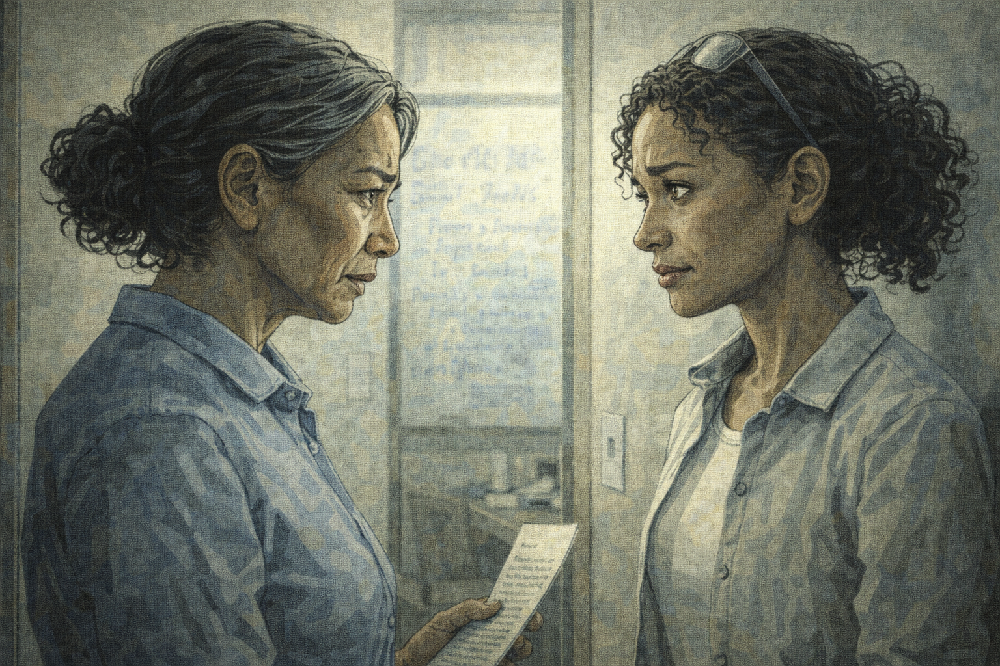

Long silence — both of them understanding something

Panel 11 of 13.
Generate a wide-landscape graphic novel drawing with a width:height ratio of 16:9. Use rich colors in the style of a thoughtful, cinematic graphic novel — expressive character faces, dramatic lighting, environments that reflect emotional tone. Not cartoonish. Do not put captions or text in the image. Show the two women in a moment after Watson's answer — both faces visible, both carrying the same dawning understanding from different directions. Dr. Chen's expression is that of a woman of great intelligence recognizing a structural failure she was at the center of. Watson's expression is the held breath of someone who said the true thing and is waiting for the consequence. The moment has the quality of two people arriving at the same understanding simultaneously but from opposite doors. Color palette: the still, clear light of a moment of mutual recognition.

"I didn't think it was my place." Dr. Chen hears this sentence and what she hears is: you created a structure in which a correct analysis sat in a deleted file for fourteen months because the person who found it was afraid of your Nobel prize. She did not intend this. She created it anyway. She is precise enough to see the difference between intention and effect, and honest enough not to reach for the first one as an excuse.

## Panel 12: The New Rule

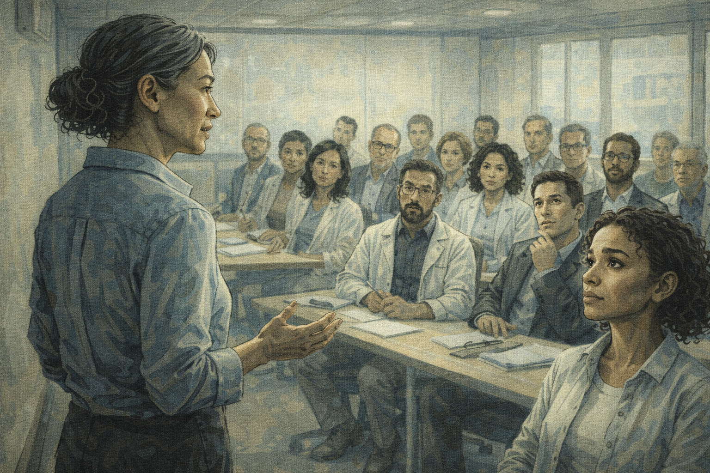

Dr. Chen calls a full team meeting: "I need you to challenge me"

Panel 12 of 13.
Generate a wide-landscape graphic novel drawing with a width:height ratio of 16:9. Use rich colors in the style of a thoughtful, cinematic graphic novel — expressive character faces, dramatic lighting, environments that reflect emotional tone. Not cartoonish. Do not put captions or text in the image. Show the institute conference room with the full team gathered — eighteen people, looking uncertain about what this meeting is. Dr. Chen stands at the front, not at the whiteboard but just standing, addressing them directly. Her posture is open, not performative. She is saying something that costs her something. The team faces vary from surprise to relief to cautious attentiveness. Color palette: the full team meeting light, Dr. Chen in the foreground without the whiteboard between her and the room.

Dr. Chen calls the full team meeting for Monday morning. She stands at the front without a whiteboard, without slides. She says: "I have found a memo from fourteen months ago that should have reached me. It contained correct analysis. It didn't reach me because of the structure I created. From now on, I need you to challenge me. Not politely — accurately. A Nobel prize is not a methodology, and I need you to understand that I know that." The room is very quiet. Dr. Watson is in the third row.

## Panel 13: The Postdoc at the Board

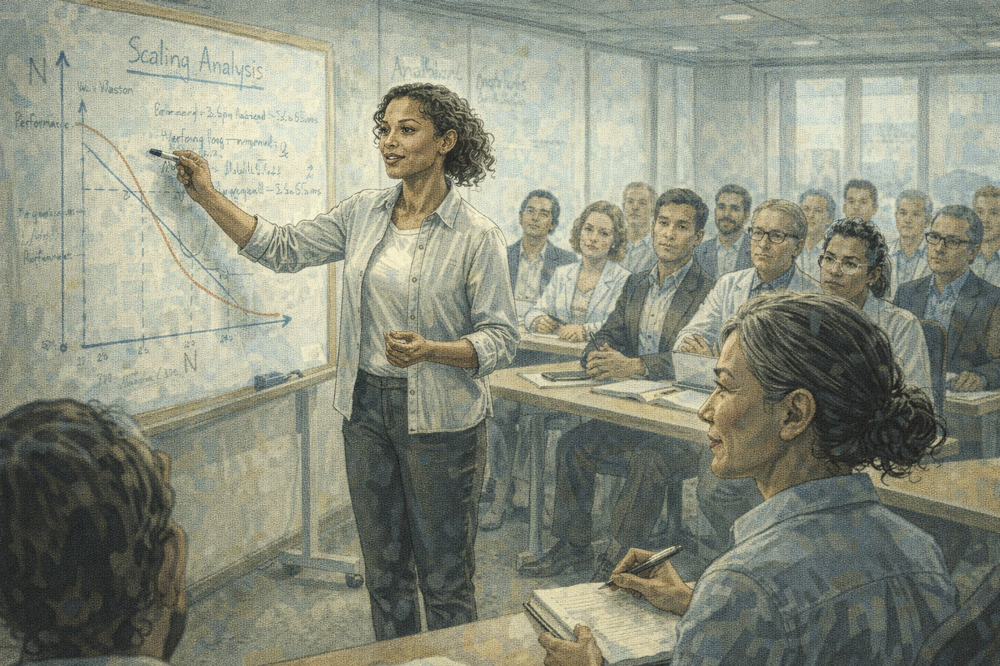

Watson presenting a critique — Dr. Chen in the front row taking notes

Panel 13 of 13.
Generate a wide-landscape graphic novel drawing with a width:height ratio of 16:9. Use rich colors in the style of a thoughtful, cinematic graphic novel — expressive character faces, dramatic lighting, environments that reflect emotional tone. Not cartoonish. Do not put captions or text in the image. Show a team seminar — Dr. Watson at the whiteboard presenting her scaling analysis, this time to the full group. She is presenting with the confidence of someone who has been explicitly invited to challenge. In the front row, Dr. Chen is seated, notebook open, pen moving — she is taking notes on her postdoc's critique of her own approach. Her expression is visibly engaged and pleased. The rest of the team watches this dynamic with relief and attention. Color palette: the bright seminar room light, Dr. Watson in the active role, Dr. Chen in the learning role — a visual reversal that feels right.

The following Tuesday, Dr. Watson presents her scaling analysis to the full team. She is at the whiteboard. Dr. Chen is in the front row, notebook open. When Watson reaches the key finding — the scaling failure — Dr. Chen writes it down. She asks two questions: good ones, the kind that go further rather than the kind that defend. Dr. Watson answers them. The team watches the most senior person in the room learning from the most junior one, and the dynamic shifts permanently.

---

**Epilogue:** *The halo effect doesn't just flatter the person at the center — it isolates them. Dr. Chen's Nobel was real. Her expertise in this new domain was incomplete. The tragedy is that nobody around her let her find out until a year had passed. Genius in one domain does not transfer automatically, and the people who most need to hear that are the ones least likely to be told.*
