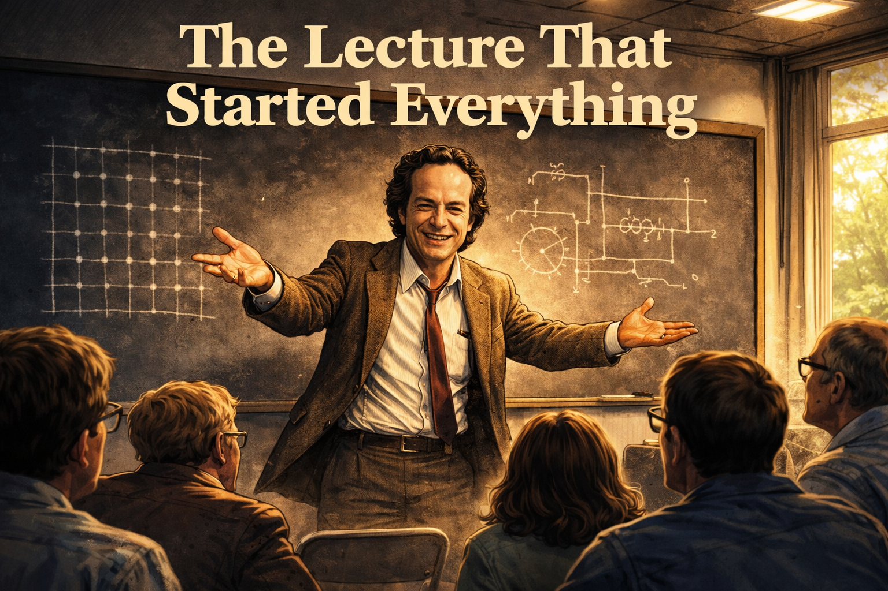

---
hide:
    toc
---
# Quantum Computing Graphic Novel Short Stories

These graphic novel stories follow researchers, founders, investors, journalists, and policymakers as they navigate the world of quantum computing hype, honest uncertainty, and the slow grind of real science. Each story illuminates a cognitive bias, institutional pressure, or critical thinking lesson through character and narrative.

<!--Two column grid card layout -->

- **[The Lecture That Started Everything](./feynman-lecture/index.md)**

    { width="350px"}

    Richard Feynman's 1981 MIT lecture — delivered to forty people in a room with folding chairs — asks a question that nobody had put into words before and launches an entire field.

- **[The Five-Year Forecast](./five-year-forecast/index.md)**

    A quantum computing founder presents a confident five-year roadmap at launch, then watches reality quietly diverge from the plan — and learns to plan with error bars instead of single points.

- **[The Benchmark Slide](./benchmark-slide/index.md)**

    A researcher discovers an unexpected speedup result late at night, presents it at a conference, and sets off a chain of events that reveals how quickly preliminary data becomes "proof."

- **[The Sunk Cost Superconductor](./sunk-cost-superconductor/index.md)**

    A project leader builds an ambitious superconducting quantum program with a large team and confident timelines — and then must decide what to do when the physics refuses to cooperate.

- **[The Journalist's Deadline](./journalists-deadline/index.md)**

    A reporter is assigned to cover a quantum breakthrough claim under deadline pressure, and must navigate PR spin, expert skepticism, and the editorial demand for a story that will get clicks.

- **[The Professor's Popular Book](./professors-popular-book/index.md)**

    A respected professor writes an accessible book about quantum computing for a general audience — driven by genuine excitement — and discovers how much gets lost between the lab and the bookshelf.

- **[The Investor Who Couldn't Say No](./investor-fomo/index.md)**

    An investor passes on a quantum startup in 2020 and spends the next two years watching FOMO and social proof slowly override her original analysis.

- **[The Halo Effect in the Lab](./halo-effect-lab/index.md)**

    A Nobel Prize-winning physicist is recruited to a quantum computing company, and her presence transforms how the company is perceived — independent of what the science actually shows.

- **[The Quantum Winter Is Coming](./quantum-winter/index.md)**

    A government program director launches a quantum research initiative with confident timelines and expert validation, then watches the predictions collide with the slower pace of fundamental science.

- **[The Quantum-Inspired Rebrand](./quantum-inspired-rebrand/index.md)**

    A classical optimization software company adds "quantum-inspired" to its marketing and discovers that the word "quantum" is doing more work than the product is.

- **[The Grad Student's Question](./grad-students-question/index.md)**

    A graduate student arrives at a quantum computing lab full of ambition, following the footsteps of famous alumni — and asks an uncomfortable question nobody wants to answer directly.

- **[The Best Wrong Turn](./best-wrong-turn/index.md)**

    An undergraduate stumbles into quantum computing through a single lecture, becomes completely absorbed — and must eventually reckon with whether passion and career incentives are pointing in the same direction.

- **[The Decoherence Clock](./decoherence-clock/index.md)**

    A postdoc doubles a qubit's coherence time from 50 to 100 microseconds and celebrates — until someone points out how far that number still is from what fault-tolerant computation requires.

- **[The CISO Who Spent the Budget Early](./ciso-budget/index.md)**

    A bank's chief information security officer reads a headline about quantum threats to encryption and begins reallocating budget — years before the threat is real, and before her classical defenses are in order.

- **[The Career Incentive Loop](./career-incentive-loop/index.md)**

    Five people in different roles — researcher, journalist, investor, policymaker, and startup founder — each make decisions that individually make sense but collectively sustain a hype cycle nobody intended to create.

- **[We've Seen This Movie Before](./seen-this-movie/index.md)**

    A veteran technology conference attendee walks through a quantum computing expo and recognizes, pattern by pattern, the same arc of hype that played out in AI winters, cold fusion, and nanotechnology.

- **[The Road Not Funded](./road-not-funded/index.md)**

    A theoretical computer scientist presents elegant mathematics on combinatorial optimization to a grant committee — and loses to a noisier, buzzier proposal that promises near-term quantum advantage.

- **[The Quantum Speedup That Wasn't](./quantum-speedup-wasnt/index.md)**

    A careful professor publishes a paper showing a real but narrow quantum speedup for a specific class of graph problems — and watches the press turn "specific and conditional" into "general and revolutionary."

