# The Investor Who Couldn't Say No

## Panel 1: The Original Pass (2020)

Valentina reads the pitch deck and writes "Pass"

Generate a wide-landscape graphic novel drawing with a width:height ratio of 16:9. Use rich colors in the style of a thoughtful, cinematic graphic novel — expressive character faces, dramatic lighting, environments that reflect emotional tone. Not cartoonish. Think Saga or Maus rather than superhero comics. Do not put captions or text in the image. Show Valentina — a Latina woman, late 40s, sharp blazer, reading glasses pushed up on her head, commands every room she enters — at her desk in a sleek investment office, reading a startup pitch deck on her laptop. Her expression is professionally neutral, slightly skeptical — she is evaluating, not excited. She is writing a handwritten note on a legal pad beside the laptop. The office is sophisticated: floor-to-ceiling windows, minimal design, city view. Color palette: the crisp light of a high-end investment office, cool and professional, Valentina in focused evaluation mode.

Valentina reads the QuantumX pitch deck on a Tuesday afternoon in March 2020 and the analysis takes her forty minutes. The technology is real but early. The team is impressive but not exceptional. The market projections assume a timeline that conflicts with what she knows about the physics. She writes "Pass — too early, unclear path to commercial application" on her legal pad and moves to the next deck. It is a clean, reasoned decision. She is good at this.

## Panel 2: The Headline Six Months Later

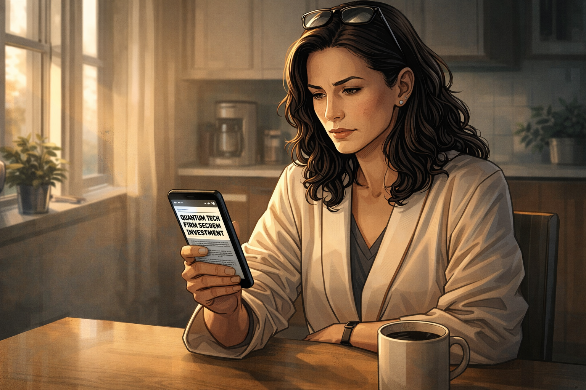

Valentina reads the "QuantumX raises $200M" headline over breakfast

Generate a wide-landscape graphic novel drawing with a width:height ratio of 16:9. Use rich colors in the style of a thoughtful, cinematic graphic novel — expressive character faces, dramatic lighting, environments that reflect emotional tone. Not cartoonish. Do not put captions or text in the image. Show Valentina — Latina woman, late 40s, sharp blazer now a morning robe or casual home wear — at a kitchen table in the morning, phone in hand, reading a news headline. The headline announces a major funding round by a quantum company. Her expression is the controlled look of a professional receiving information she knows is significant — not panicked, just noting it. Coffee on the table. Morning light through a window. Color palette: the warm neutral of a home morning, the phone screen introducing a slightly more urgent note.

Six months later, over breakfast and a second coffee, the tech news feed on her phone leads with a headline: "QuantumX Closes $200M Series B Led by Major Tier-1 Firms." Valentina reads it with the professional stillness of someone tracking a decision they made. The names in the syndicate are familiar and good. She puts her phone face-down and finishes her coffee. She picks it up again and reads the article fully. The technical details are the same technology she passed on six months ago.

## Panel 3: First Mention at the Conference

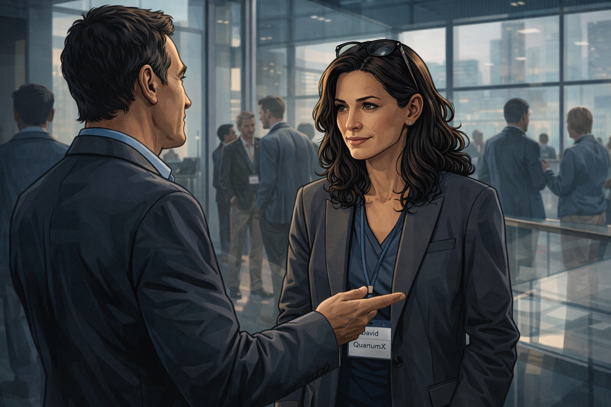

A conference lobby — a colleague mentions QuantumX casually

Generate a wide-landscape graphic novel drawing with a width:height ratio of 16:9. Use rich colors in the style of a thoughtful, cinematic graphic novel — expressive character faces, dramatic lighting, environments that reflect emotional tone. Not cartoonish. Do not put captions or text in the image. Show the lobby of a technology investment conference — glass and steel, people in business-casual networking attire, name badges, the ambient sound of professional conversation implied by body language. Valentina is talking with a colleague, her expression politely engaged. The colleague is mentioning something — the QuantumX name might be suggested visually on a badge or in their body language pointing to something across the room. Valentina nods. She stores the mention. Color palette: the cool business-formal palette of a conference space, Valentina in her element but now carrying one more data point.

At the conference that fall, a colleague mentions QuantumX during a five-minute lobby conversation. He is not pushing it — he is noting it, the way people note things that are becoming part of the field's landscape. Valentina nods politely. She asks one question. She moves on. She does not think much about it until later, lying in her hotel bed at 11 p.m., when she thinks about it for twenty minutes before sleeping.

## Panel 4: Second Mention — Something Shifts

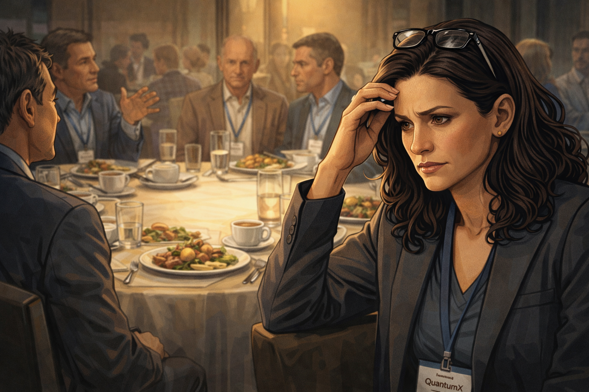

Conference lunch — second mention; Valentina grows quiet

Generate a wide-landscape graphic novel drawing with a width:height ratio of 16:9. Use rich colors in the style of a thoughtful, cinematic graphic novel — expressive character faces, dramatic lighting, environments that reflect emotional tone. Not cartoonish. Do not put captions or text in the image. Show a conference lunch table — round table, six or seven investors, plates of hotel food, the social ease of professional peers. Someone across the table is mentioning QuantumX again — not to Valentina specifically but to the group. Valentina is in the midground, listening, and her expression is slightly different from Panel 3: something small has shifted. She is still composed, but she is no longer just noting — she is feeling something. Her reading glasses are pushed up in her characteristic gesture, but the gesture this time signals something other than confidence. Color palette: the warm lunch-table social light, a slightly tighter focus on Valentina's face.

The second mention is at lunch, three tables of people at a round, and someone brings up QuantumX in the context of who's been lucky on timing. Two other people around the table acknowledge it — not effusively, just as a known thing, a reference point in a shared map. Valentina eats her lunch and says very little. Something in her chest has shifted one degree. It is not analysis. It is something older.

## Panel 5: Third Mention — The Room Buzzes

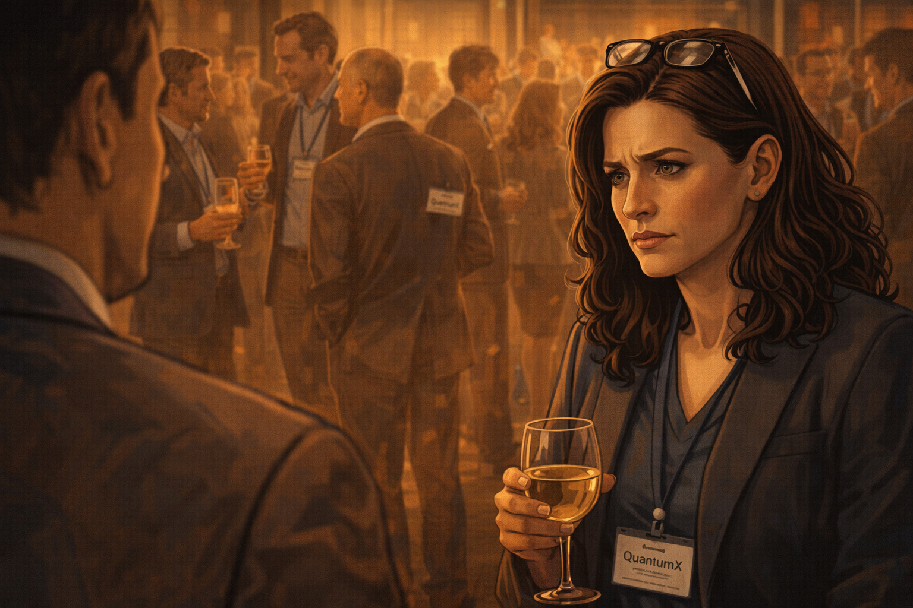

Cocktail hour — "Everyone's talking about it"; the room buzzes

Generate a wide-landscape graphic novel drawing with a width:height ratio of 16:9. Use rich colors in the style of a thoughtful, cinematic graphic novel — expressive character faces, dramatic lighting, environments that reflect emotional tone. Not cartoonish. Do not put captions or text in the image. Show a conference cocktail reception — evening light, drinks in hand, clusters of animated conversation. In the foreground, someone says something to Valentina that visually lands — the kind of statement that changes her evening. The room around her has a slightly elevated energy around the QuantumX topic. Multiple conversations seem to be about the same thing. Valentina stands with a glass she is no longer drinking from, the social environment registering as a signal her brain is treating as data. Color palette: the warm amber of evening cocktails, the slightly charged energy of social information spreading, Valentina beginning to look slightly isolated in her earlier certainty.

At the cocktail reception, a third person — someone whose judgment she respects — leans over and says: "Everyone's talking about QuantumX tonight. Are you positioned?" It is the word "everyone" that does it. Not the technology, not the numbers, not the arguments — the word "everyone." Valentina is aware, professionally, that social proof is not technical evidence. She is also aware that she has heard the same name three times today in a room full of people whose pattern recognition she respects. These two awarenesses do not cancel each other. They sit uneasily side by side.

## Panel 6: The Same Deck, Revisited

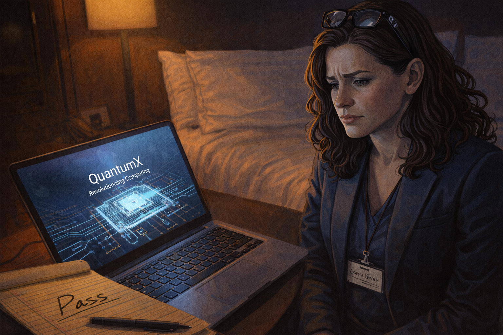

Valentina pulls up the exact same pitch deck — same technology

Generate a wide-landscape graphic novel drawing with a width:height ratio of 16:9. Use rich colors in the style of a thoughtful, cinematic graphic novel — expressive character faces, dramatic lighting, environments that reflect emotional tone. Not cartoonish. Do not put captions or text in the image. Show Valentina in her hotel room that night — blazer still on, sitting on the bed with her laptop. The screen shows a pitch deck. On the desk beside her, we can see her legal pad from Panel 1 — the "Pass" note visible, same handwriting. She is looking at the laptop. The deck on screen is the same one she evaluated six months ago. Her expression is the look of a person watching themselves do something they know they are doing. Color palette: the hotel room night light, the blue-white of the laptop, the close physical juxtaposition of the old "Pass" note and the current open deck.

In her hotel room at 10 p.m., Valentina opens her laptop and pulls up the QuantumX deck from her archived files. It is the same deck. The same technology, the same timeline, the same team. Nothing has changed in the underlying investment case since March except the Series B and the conversations at lunch and dinner. She opens the deck and holds it next to her legal pad. "Pass — too early, unclear path to commercial application." She stares at both documents. "Why does it feel different now?"

## Panel 7: "Why Does It Feel Different?"

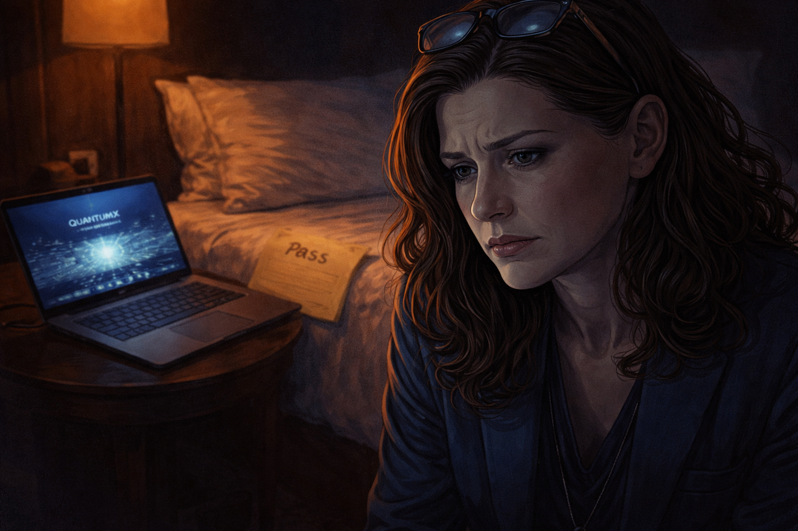

Valentina staring at her pass note and the deck side by side

Generate a wide-landscape graphic novel drawing with a width:height ratio of 16:9. Use rich colors in the style of a thoughtful, cinematic graphic novel — expressive character faces, dramatic lighting, environments that reflect emotional tone. Not cartoonish. Do not put captions or text in the image. Show a close, intimate composition: Valentina's face in the foreground, slightly lit by the laptop, her expression showing a kind of wary self-examination — she is watching herself from a slight distance and asking the question. Behind her on the bed: the legal pad with "Pass" visible, the open laptop with the deck. The hotel room is spare and quiet. This is a private moment of a person who knows what is happening to her and is doing it anyway. Color palette: the intimate night-blue of a hotel room, the small warm pool of laptop light, a figure thinking.

She sits with the question for a long time. The technology hasn't improved. The timeline hasn't shortened. The commercial path is still unclear. The only thing that has changed is that three people whose opinions she tracks mentioned the same company in one day. And yet the pass, written in her own hand six months ago, now feels like it requires justification in a way it didn't when she wrote it. The justification she had was good. It is still good. It feels less stable than it did.

## Panel 8: "Run the Numbers Again"

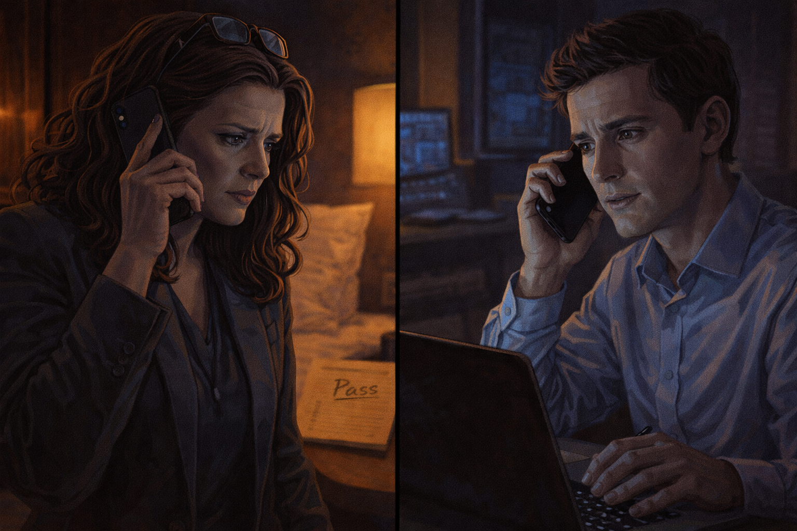

Valentina calls her analyst — "Run the numbers again"

Generate a wide-landscape graphic novel drawing with a width:height ratio of 16:9. Use rich colors in the style of a thoughtful, cinematic graphic novel — expressive character faces, dramatic lighting, environments that reflect emotional tone. Not cartoonish. Do not put captions or text in the image. Show Valentina on her phone — she is in her hotel room, pacing slightly, phone to her ear. Her analyst is shown in a small counterpart scene — a young man at a desk, looking slightly surprised at the call. The visual tells us she is asking him to re-examine something and he is doing what she asks, even though something in both their expressions suggests they both know what the answer will be. Color palette: the hotel room night, the split of a phone call across distance, the slight tension of asking a question you already know the answer to.

She calls her analyst at 10:45 p.m. "Run the QuantumX numbers again," she says. "Clean slate. Don't look at the old analysis." He is professional; he doesn't ask why they're running it again this late, or why now. He says he'll have it in the morning. She hangs up and looks out the hotel window at the city. She knows what the morning analysis will say.

## Panel 9: "Nothing Has Changed"

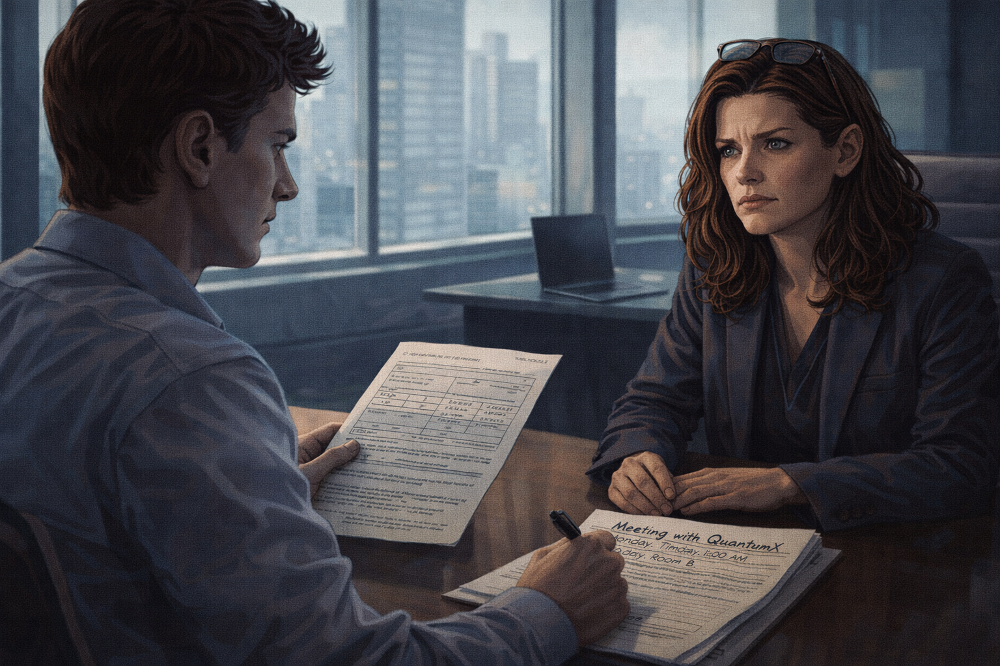

Analyst: "Nothing has changed technically" — Valentina: "Set up the meeting"

Generate a wide-landscape graphic novel drawing with a width:height ratio of 16:9. Use rich colors in the style of a thoughtful, cinematic graphic novel — expressive character faces, dramatic lighting, environments that reflect emotional tone. Not cartoonish. Do not put captions or text in the image. Show a morning call — Valentina now back in her office, the analyst across a table or on screen. He has his analysis in front of him, clearly showing the same conclusions as six months ago. His expression is careful: he is telling her something she doesn't want to hear, but he is telling her accurately. Valentina's expression is the look of a person whose decision has already moved past the analysis. She says the words. He is writing the meeting request. Color palette: the morning office light, crisp and professional, the kind of light that makes decisions feel more considered than they are.

The morning analysis is thorough. Her analyst presents it carefully: comparable companies, risk-adjusted returns, technology readiness levels, competitive landscape. His conclusion is clear: nothing has changed from the March pass. He meets her eyes when he says it. She nods. "Nothing has changed technically, Valentina." The nod means she heard him. The next sentence means she is doing it anyway. "Set up the meeting," she says.

## Panel 10: The Wire Sent

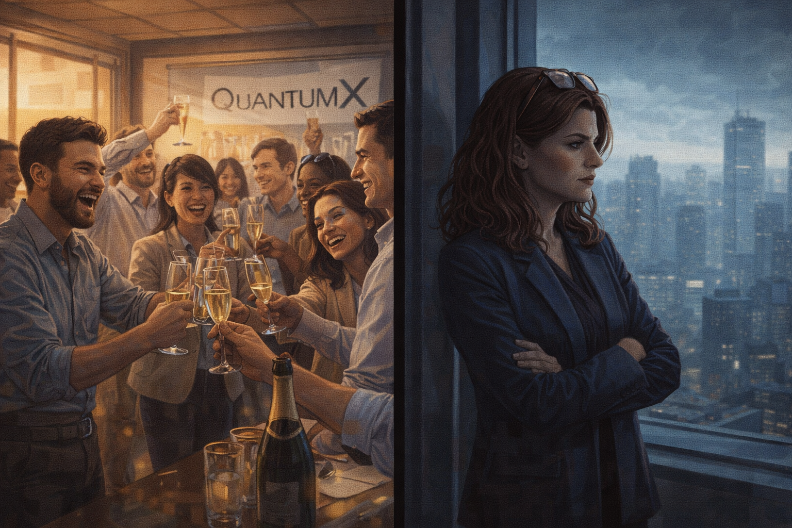

Funding wire sent — team celebrates; Valentina stares out the window

Generate a wide-landscape graphic novel drawing with a width:height ratio of 16:9. Use rich colors in the style of a thoughtful, cinematic graphic novel — expressive character faces, dramatic lighting, environments that reflect emotional tone. Not cartoonish. Do not put captions or text in the image. Show a split moment: in the foreground, the QuantumX team in their office, celebrating the new funding — people laughing, champagne maybe. In the background, or in a separate visual frame, Valentina stands at the window of her office alone, looking out. The celebrations and her private expression occupy the same panel but not the same emotional space. Her expression is the particular stillness of someone who knows what they just did. Color palette: the warm celebration colors of the startup office contrasted with the cooler, more isolated tone of Valentina at her window.

The term sheet closes in six weeks. The QuantumX team celebrates in their open-plan office. Valentina stands at the window of her floor-to-ceiling glass office and watches the city. She does not feel bad. She does not feel relieved. She feels the particular flatness of a person who acted against their own analysis and knows it, and can now only wait to see which truth wins.

## Panel 11: The Write-Down

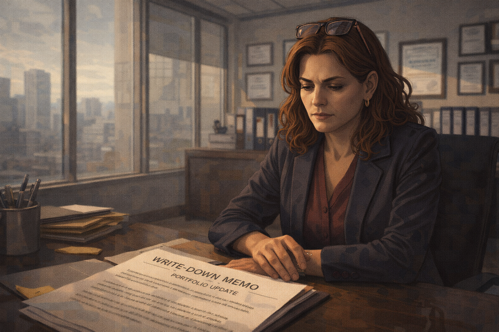

Two years later — the startup pivots; write-down memo on Valentina's desk

Generate a wide-landscape graphic novel drawing with a width:height ratio of 16:9. Use rich colors in the style of a thoughtful, cinematic graphic novel — expressive character faces, dramatic lighting, environments that reflect emotional tone. Not cartoonish. Do not put captions or text in the image. Show Valentina at her desk, two years later — she looks as sharp as ever but the desk has a document on it that she is clearly looking at: a write-down memo, a portfolio update, the financial acknowledgment of what the company became (quantum-inspired classical software — a pivot away from the original promise). Her expression is not devastated — she has done this before. But it is the controlled expression of someone absorbing a predictable loss. Color palette: the professional afternoon light of an investment office, the document on the desk catching just enough light to be read as a loss.

Two years later, the memo lands on her desk: QuantumX has pivoted to "quantum-inspired classical optimization software." The quantum hardware program has been suspended pending further research. The valuation has been revised. The write-down is significant. Her analyst sends a brief email — no "I told you so," just the portfolio update numbers. She looks at the memo for a long time. Her pass note from 2020 is in the filing cabinet four feet away. She does not get up to look at it.

## Panel 12: What Changed?

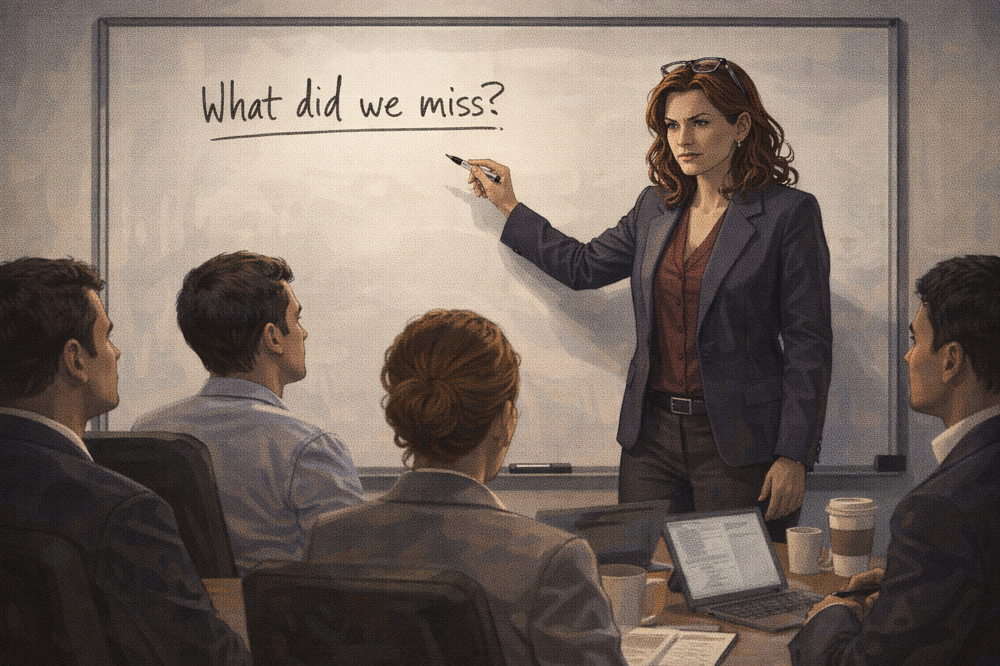

Valentina at a whiteboard with her team: "What changed between the pass and the check?"

Generate a wide-landscape graphic novel drawing with a width:height ratio of 16:9. Use rich colors in the style of a thoughtful, cinematic graphic novel — expressive character faces, dramatic lighting, environments that reflect emotional tone. Not cartoonish. Do not put captions or text in the image. Show Valentina at a whiteboard with her investment team — four or five people seated around her in a small conference room. She is standing at the whiteboard, marker in hand. Her posture is open and direct — she is not hiding from what happened. The whiteboard question is visible as text she's written. The team watches her. Her expression is the unsentimental clarity of someone conducting a post-mortem on themselves. Color palette: the clean whiteboard light, Valentina in commanding form, the room attentive.

She calls a team post-mortem three weeks after the write-down. She starts with the QuantumX file — walks through the March 2020 pass analysis and then the reversal. She asks the question herself: "What changed between the pass and the check?" The team knows her well enough not to offer excuses. She writes the answer on the whiteboard and steps back to look at it.

## Panel 13: The Answer on the Board

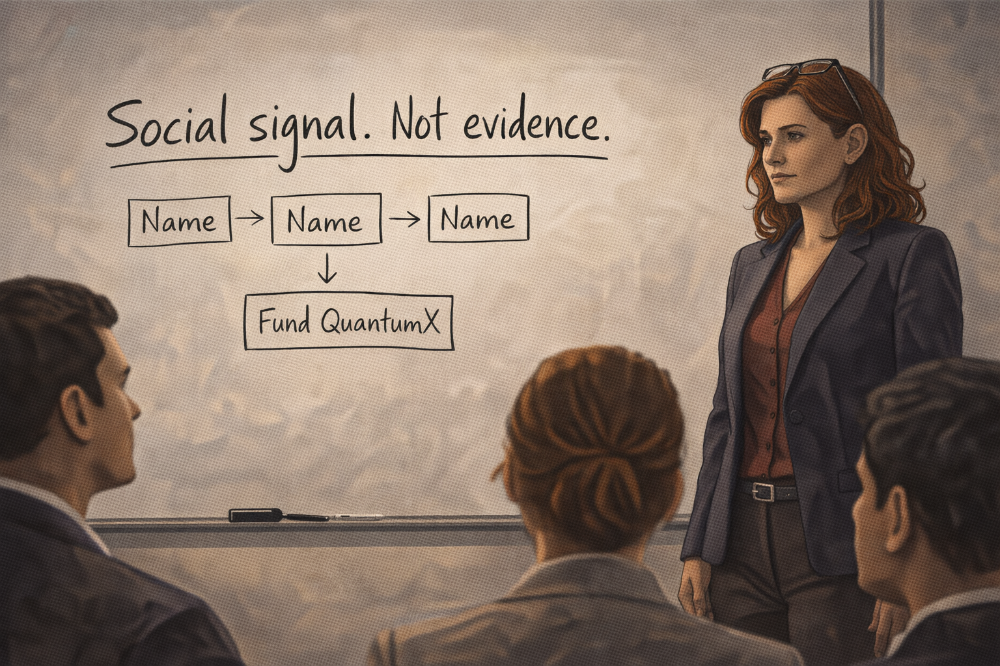

On the whiteboard: "Social signal. Not evidence."

Generate a wide-landscape graphic novel drawing with a width:height ratio of 16:9. Use rich colors in the style of a thoughtful, cinematic graphic novel — expressive character faces, dramatic lighting, environments that reflect emotional tone. Not cartoonish. Do not put captions or text in the image. Show the whiteboard close-up — Valentina's handwriting in clear large letters: "Social signal. Not evidence." Below it, perhaps a diagram showing three mentions of a name in one day converting to a funding decision. Valentina stands beside the whiteboard, looking at what she wrote. The team is visible in the foreground. Her expression is the particular dignity of someone who has told the truth about themselves in front of witnesses. Color palette: the crisp white of the whiteboard text, Valentina beside it with the composed expression of honest self-accounting.

"Social signal. Not evidence." She caps the marker. The room is quiet in the particular way of rooms where something true has been named plainly. She leaves it on the board for the rest of the meeting and doesn't erase it when they move on to other topics. Later that week she types it into the top of the firm's investment checklist: "Technical analysis is not complete until we have identified and corrected for any social signal effect."

---

**Epilogue:** *Valentina is one of the sharpest investors in the room. That is exactly the point. FOMO is not a failure of intelligence — it is an ancient survival instinct (don't miss what everyone else is taking) firing in a context it was never designed for. Her superpower became her liability the moment the social signal and the evidence decoupled.*
