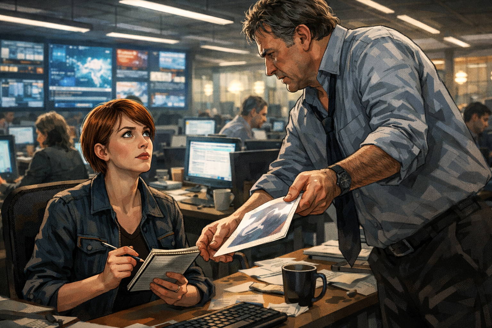
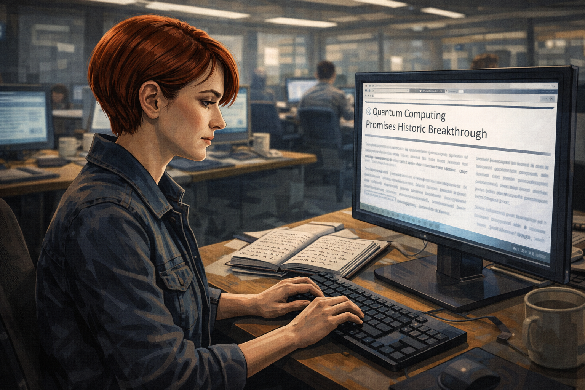
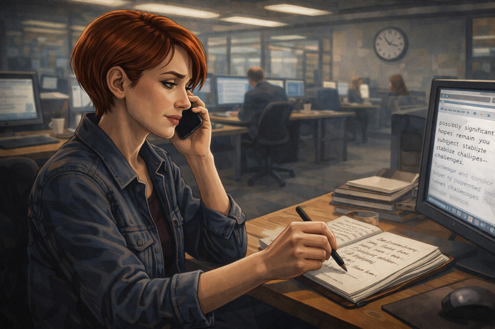
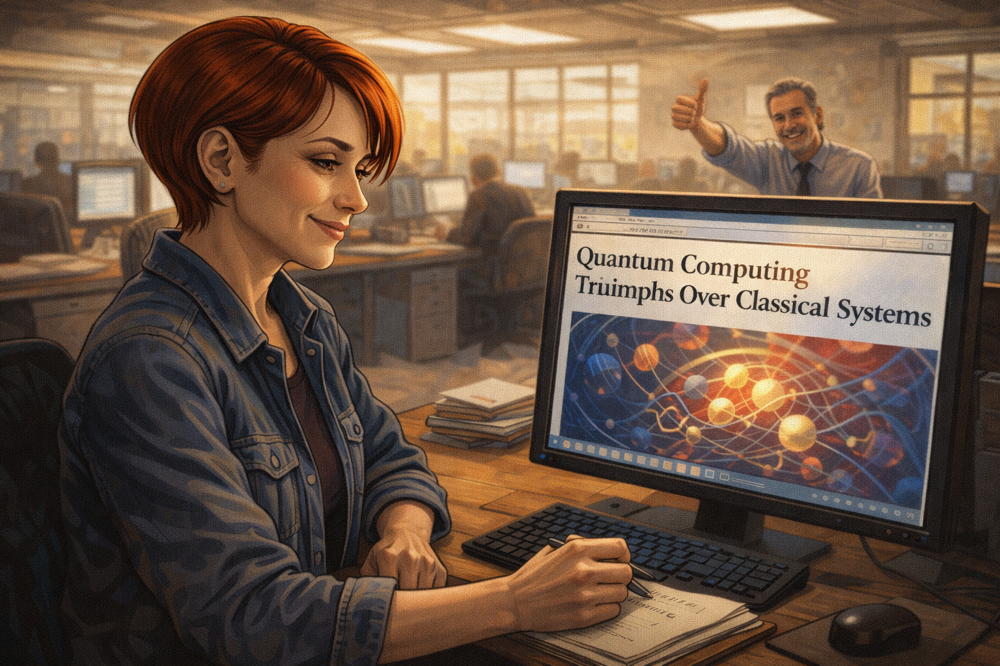
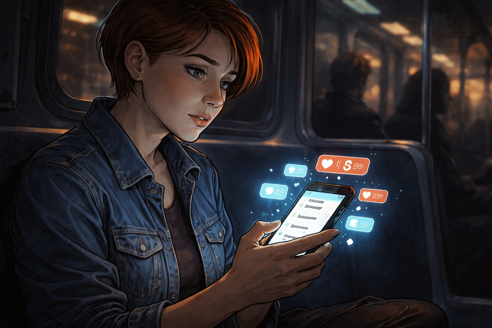
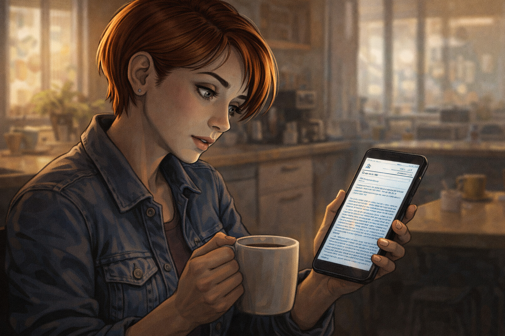
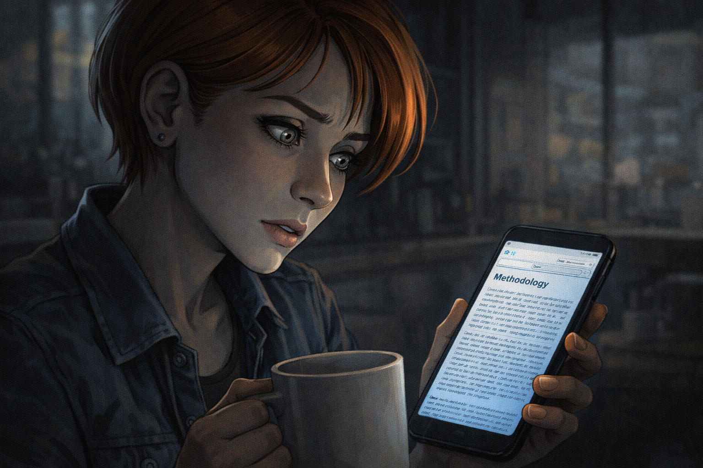
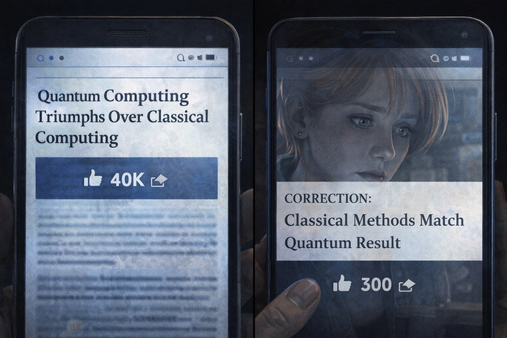
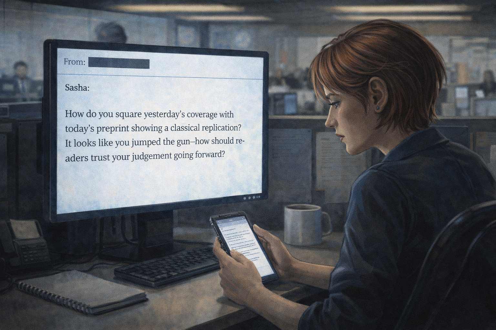
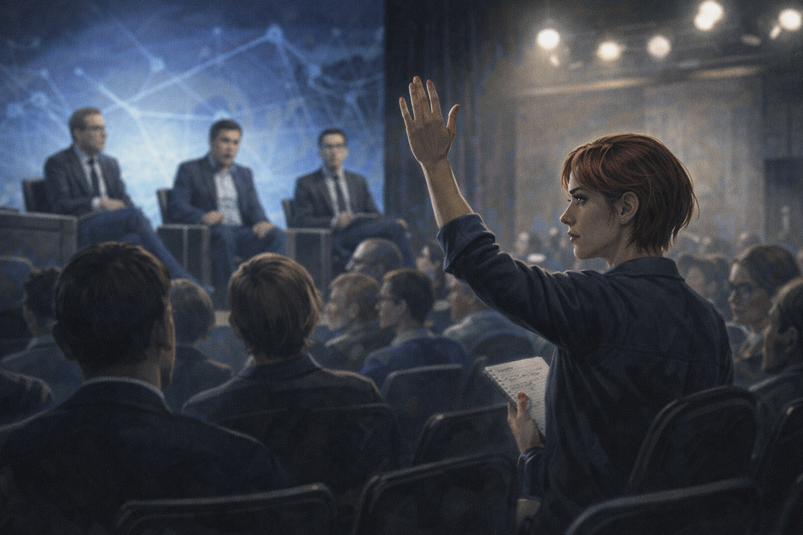

# The Journalist's Deadline

## Panel 1: The Assignment

Sasha's editor drops the press release on her desk

Generate a wide-landscape graphic novel drawing with a width:height ratio of 16:9. Use rich colors in the style of a thoughtful, cinematic graphic novel — expressive character faces, dramatic lighting, environments that reflect emotional tone. Not cartoonish. Think Saga or Maus rather than superhero comics. Do not put captions or text in the image. Show a busy technology newsroom — open office, desks with monitors, a wall of screens. Sasha — a white woman, early 30s, short auburn hair, reporter's notebook in hand, quick observant eyes — sits at her desk as her editor, a harried-looking man in his 50s, drops a glossy press release on her desk from above. His posture says urgency. Sasha is looking up at him, expression alert, notebook already in hand. The newsroom hums around them. Color palette: the bright and slightly harsh light of a modern newsroom, the sense of deadline pressure in every element.

Sasha's editor drops the press release on her desk the way editors drop things when they have already decided it's a story. "This is huge — file by Thursday," he says, and is already walking away. Sasha picks it up. The headline uses the phrase "classical computing obsolete." She turns it over looking for the technical details. They are on the back, in smaller type, written by a PR firm. She opens her reporter's notebook.

## Panel 2: The CEO Demo

Slick company demo — Sasha taking notes

Generate a wide-landscape graphic novel drawing with a width:height ratio of 16:9. Use rich colors in the style of a thoughtful, cinematic graphic novel — expressive character faces, dramatic lighting, environments that reflect emotional tone. Not cartoonish. Do not put captions or text in the image. Show a polished corporate demonstration room — a tech startup aesthetic, good lighting, a large monitor showing impressive quantum visualization graphics. A confident CEO type stands at the front presenting to a small invited press group. Sasha — white woman, early 30s, short auburn hair — sits in the front row with her notebook open, nodding and writing notes. Her expression is attentive and professional. The presentation around her looks expensive and well-rehearsed. Color palette: the cool brand-blue of a polished tech presentation, Sasha in the warm foreground.

The company demo is impeccably staged. A large screen shows abstract visualizations of quantum circuits solving problems in real time. The CEO — a man in his late 40s with the relaxed confidence of someone who has given this pitch three hundred times — walks Sasha through the key claims in a voice that is simultaneously enthusiastic and casual, as if the historic nature of what he is describing is simply the obvious state of affairs. Sasha writes "first ever," "impossible for classical," and "historic" in her notebook. These are words he used. She is noting them accurately.

## Panel 3: Back at Her Desk

Sasha at her desk, notes visible, drafting the story

Generate a wide-landscape graphic novel drawing with a width:height ratio of 16:9. Use rich colors in the style of a thoughtful, cinematic graphic novel — expressive character faces, dramatic lighting, environments that reflect emotional tone. Not cartoonish. Do not put captions or text in the image. Show Sasha — white woman, early 30s, short auburn hair — at her newsroom desk, typing. Her reporter's notebook is open beside her keyboard. On the notebook, we can partially see her notes: phrases like "first ever" and "historic." Her expression is focused and professional — she is writing, not doubting. The monitor screen shows a draft headline forming. The newsroom around her is active with the low hum of a busy day. Color palette: the workday light of a functional newsroom, Sasha in her element as a competent professional doing her job.

Back at her desk, Sasha types quickly. She has the story — the structure is clear, the quotes are good, the tech is impressive. She reads back through her notes and picks the most vivid numbers. Her draft headline is forming in her head before her fingers catch up. The Thursday deadline is tomorrow. She has what she needs. She makes one phone call.

## Panel 4: The One Call

Sasha on the phone with one academic who says "sounds impressive"

Generate a wide-landscape graphic novel drawing with a width:height ratio of 16:9. Use rich colors in the style of a thoughtful, cinematic graphic novel — expressive character faces, dramatic lighting, environments that reflect emotional tone. Not cartoonish. Do not put captions or text in the image. Show Sasha at her desk, phone to her ear, pen hovering over her notebook. Her expression is professional, slightly impatient — she is getting the quote she needs and moving on. On the other end (not shown), an academic is clearly saying something generally positive but hedged. We see Sasha's pen write something, see her nod, see her start to say "Great, thank you." The conversation is ending before it has fully begun. The newsroom clock is visible on the wall behind her. Color palette: the pressure-light of a deadline afternoon, Sasha in professional efficient mode.

She calls a university professor who is tangentially familiar with the technology. He says "sounds impressive" and "the field is moving quickly." She writes both phrases. He starts to add a caveat — something about needing to see the methodology — and she thanks him and says she'll note that there are skeptics, and she hangs up. She doesn't not include the caveat because she is dishonest. She includes it in the piece as "some scientists urge caution," which is accurate. And then she files.

## Panel 5: The Headline Goes Live

Sasha watching her headline publish on screen

Generate a wide-landscape graphic novel drawing with a width:height ratio of 16:9. Use rich colors in the style of a thoughtful, cinematic graphic novel — expressive character faces, dramatic lighting, environments that reflect emotional tone. Not cartoonish. Do not put captions or text in the image. Show Sasha at her desk, monitor visible, the published article loading with a large dramatic headline visible on screen — something implying quantum has defeated classical computing. Her expression is the quiet satisfaction of filed work — she did her job, it's done. In the background, her editor is giving a thumbs up. The newsroom has the slightly lighter energy of a deadline that has been met. Color palette: the warm afternoon light of a job done, the bright digital glow of a published piece.

The headline goes live at 4:47 p.m. and Sasha closes her laptop and takes her first real breath of the day. Her editor walks by her desk and gives a thumbs-up without stopping. The piece is clean, well-written, correctly attributed. It has a dramatic headline, vivid quotes, and one sentence near the bottom noting that independent experts have not yet verified the results. The sentence near the bottom is accurate. The headline is what everyone will remember.

## Panel 6: Forty Thousand Shares

Sasha's phone lighting up with shares and notifications

Generate a wide-landscape graphic novel drawing with a width:height ratio of 16:9. Use rich colors in the style of a thoughtful, cinematic graphic novel — expressive character faces, dramatic lighting, environments that reflect emotional tone. Not cartoonish. Do not put captions or text in the image. Show Sasha in the evening — she might be on the subway or at home — her phone in her hand, screen lighting up with notification after notification. Social share counts, mentions, direct messages. Her expression shifts from satisfaction to slight unease as the numbers keep climbing. The glow of the phone in a darker environment makes the notifications look almost overwhelming. Color palette: the blue-white of a phone screen in an evening setting, the almost feverish light of viral traction.

By nine o'clock that night, the story has been shared forty thousand times. Her editor texts: "Huge. Well done." Someone on the publication's social team texts: "Best performing piece this month." Her phone won't stop. Three other outlets have cited her story in their own coverage, amplifying the central claim. The forty thousand shares are shares of the headline, mostly. Most people share without reading to the sentence near the bottom.

## Panel 7: The Preprint Arrives

Sasha reading the preprint on her phone — three researchers, a laptop

Generate a wide-landscape graphic novel drawing with a width:height ratio of 16:9. Use rich colors in the style of a thoughtful, cinematic graphic novel — expressive character faces, dramatic lighting, environments that reflect emotional tone. Not cartoonish. Do not put captions or text in the image. Show Sasha the next morning, coffee in one hand, phone in the other, reading something. The phone screen shows an academic preprint — the kind with dense text and a sparse header. Her expression is shifting — she started reading casually and now something has pulled her attention fully in. The preprint describes a classical replication of the quantum result. The scene is quiet — a kitchen or coffee shop morning. Color palette: gentle morning light, the contrast between the ordinary setting and the significance of what she's reading on her phone.

A preprint lands on arxiv twelve days later. Three university researchers — two grad students and a professor, using a laptop and a cluster of classical computing nodes — have replicated the key results of the demo in four seconds. The paper is clear, methodical, and polite. It doesn't accuse anyone of fraud. It simply shows the work. Sasha reads it on her phone over morning coffee and something cold settles in her stomach.

## Panel 8: Color Draining

Sasha reading the methodology section, color draining from her face

Generate a wide-landscape graphic novel drawing with a width:height ratio of 16:9. Use rich colors in the style of a thoughtful, cinematic graphic novel — expressive character faces, dramatic lighting, environments that reflect emotional tone. Not cartoonish. Do not put captions or text in the image. Show a close-up on Sasha — white woman, early 30s, short auburn hair — face partially lit by her phone screen. She has scrolled to the methodology section of the preprint. Her expression is the one where the implications are arriving faster than the defenses can organize. The coffee cup in her other hand has stopped halfway to her mouth. She is very still. Color palette: the phone's blue-white light on her face, the colors of the world slightly desaturated around her as the moment contracts to this one read.

The methodology section of the preprint does not say the company lied. It says the problem they chose was one that happens to be efficiently solvable by a classical algorithm published fourteen months ago — an algorithm Sasha had no way of knowing existed, but that any academic reviewer of the original claim should have checked. The company's result is technically accurate. The framing is what fell apart. The framing is what she wrote as her headline.

## Panel 9: The Correction

Correction published — 300 shares; original still trending

Generate a wide-landscape graphic novel drawing with a width:height ratio of 16:9. Use rich colors in the style of a thoughtful, cinematic graphic novel — expressive character faces, dramatic lighting, environments that reflect emotional tone. Not cartoonish. Do not put captions or text in the image. Show two phone screens or browser windows side by side: on the left, the original article still showing a large share count (40,000+), on the right, the correction piece with a much smaller count (300). Sasha's face is reflected faintly in one screen, looking at the disparity. The visual makes the asymmetry concrete and undeniable. Color palette: the digital glow of screens, the cool contrast between two numbers that tell the whole story.

The correction runs. Sasha writes it herself. It is accurate and fair and clearly explains what the original piece got wrong and why. It receives three hundred shares. The original article remains the second result when you search the company's name. The company's communications team does not issue a retraction. Several newsletters still cite the original story without the correction. The forty thousand shares do not unshare.

## Panel 10: The Reader's Email

Sasha reading a reader's pointed email question

Generate a wide-landscape graphic novel drawing with a width:height ratio of 16:9. Use rich colors in the style of a thoughtful, cinematic graphic novel — expressive character faces, dramatic lighting, environments that reflect emotional tone. Not cartoonish. Do not put captions or text in the image. Show Sasha at her desk, reading an email on her monitor. The email is from a reader — not mean, just direct. Its tone is the kind that gets to the point. Sasha's expression is not defensive. She is reading it carefully, with the look of someone who knows the question is fair. The newsroom around her is active. Her reporter's notebook sits closed on her desk. Color palette: the ordinary newsroom light, Sasha in a moment of private reckoning that looks, from outside, exactly like reading email.

A reader emails: "Why didn't you ask a skeptic?" It is not a hostile email — it is a direct question from someone who works in the field and read both the original piece and the correction. Sasha reads it twice. Then she looks at her original notes and tries to identify the moment when she should have picked up the phone and called someone who had a reason to doubt. The moment was there. It was right after she wrote "first ever" in her notebook.

## Panel 11: The Post-It

Post-it note on Sasha's monitor: "Who benefits from this claim being true?"

Generate a wide-landscape graphic novel drawing with a width:height ratio of 16:9. Use rich colors in the style of a thoughtful, cinematic graphic novel — expressive character faces, dramatic lighting, environments that reflect emotional tone. Not cartoonish. Do not put captions or text in the image. Show Sasha's monitor at her newsroom desk — a yellow Post-it note is stuck to the bottom edge of the screen. On it, in Sasha's handwriting, is a question about the source's incentives — why would someone want this claim to be true? Sasha is in the background, slightly out of focus, working at her desk, the Post-it visible as a permanent fixture now. Color palette: the warm yellow of a Post-it against the blue-white of the newsroom monitor, a small yellow anchor in the composition.

She writes a question on a Post-it and sticks it to the bottom edge of her monitor. She leaves it there. It becomes the first thing she reads when she opens a new assignment. Some of her colleagues notice it and ask about it. She tells them the short version. A few of them make their own Post-its.

## Panel 12: The Conference — Asking the Hard Question

Sasha at a conference, hand raised, asking the hard question

Generate a wide-landscape graphic novel drawing with a width:height ratio of 16:9. Use rich colors in the style of a thoughtful, cinematic graphic novel — expressive character faces, dramatic lighting, environments that reflect emotional tone. Not cartoonish. Do not put captions or text in the image. Show a technology or science conference — a panel discussion on a stage. Sasha — white woman, early 30s, short auburn hair, reporter's notebook in hand — is in the audience with her hand raised, asking a question. Her expression is direct, composed, and completely unafraid. The panelist on stage — a tech company executive — has an expression that suggests the question is not the comfortable one. Other audience members are turning to look at Sasha. She is the person in the room asking what nobody else asked. Color palette: the bright stage lighting from a conference, Sasha in the mid-ground of the audience — the one hand raised cutting a clear line through the scene.

At a quantum computing conference six months later, a CEO is presenting a new breakthrough. Sasha is in the third row. When the Q&A opens, she raises her hand first. The question she asks is specific, technical, and aimed at the classical baseline: what comparison was used, and against what algorithm, and who ran the comparison? The CEO's answer is less specific than her question. She writes it down exactly as he says it, including what he doesn't say. The story she files is different from the one she would have filed a year ago.

---

**Epilogue:** *Sasha is good at her job. The problem is that "good at her job" includes hitting deadlines, pleasing editors, and writing stories that get shared — incentives that don't always align with finding the skeptic in the room. She learns. But 40,000 shares don't unshare.*
