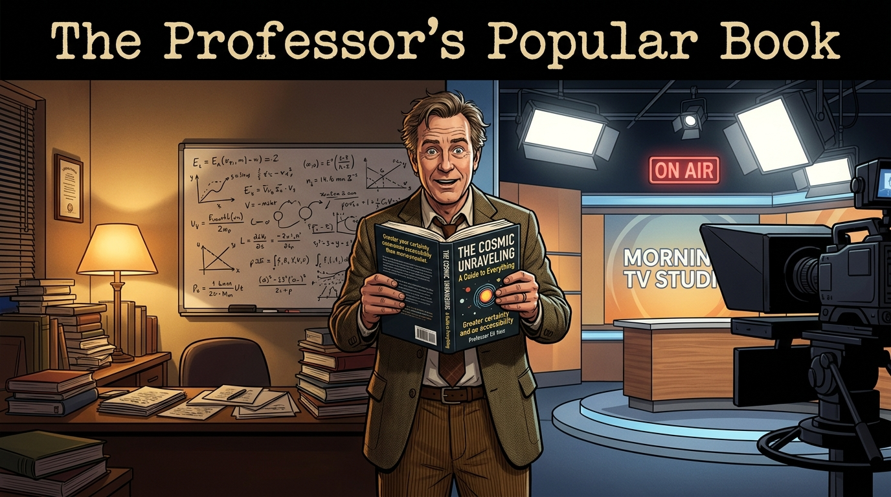
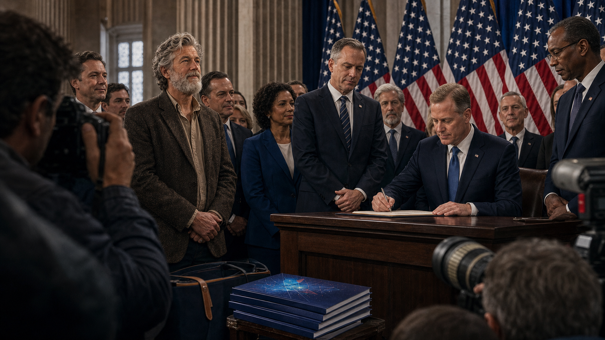
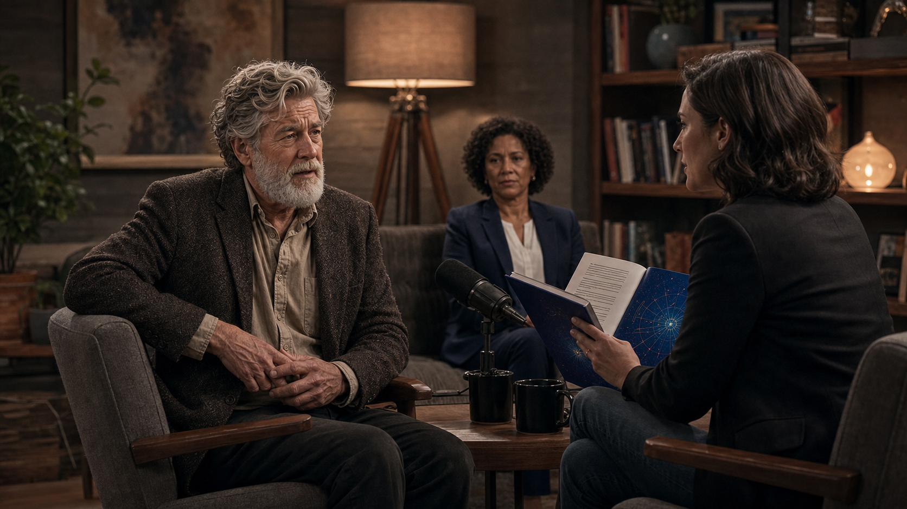
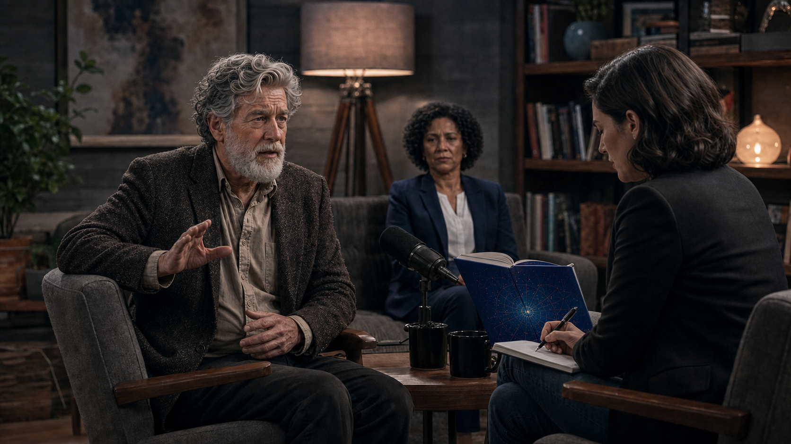
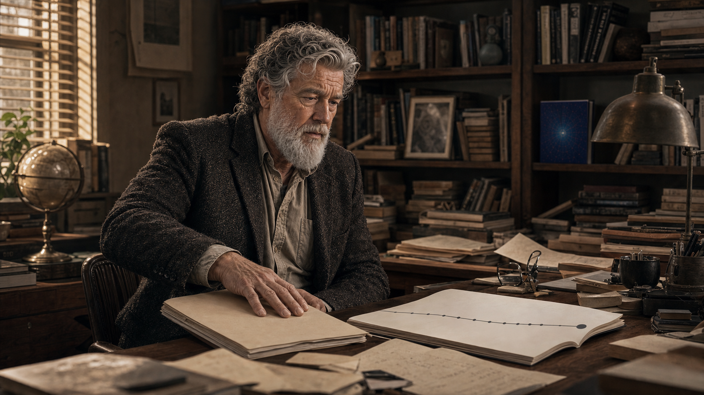
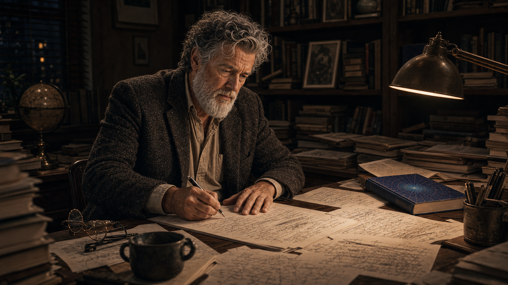
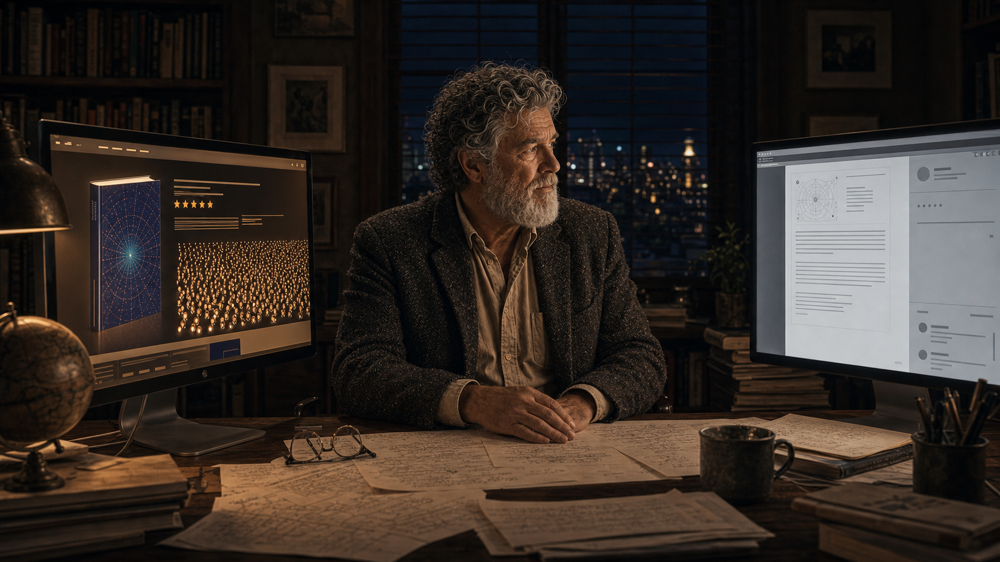

# The Professor's Popular Book

A careful scientist translates his work for a general audience — and watches the translation drift.

Cover Image 

Generate a wide-landscape graphic novel cover image with a width:height ratio of 16:9. Use rich colors in the style of a thoughtful, cinematic graphic novel — expressive character faces, dramatic lighting, environments that reflect emotional tone.

  Not cartoonish. Think Saga or Maus rather than superhero comics.
  Do not put any captions or text in the image EXCEPT the title at the top.

  Place the title text at the top of the image: "The Professor's Popular Book"

  Show Professor Eli — a white man in his 50s, rumpled academic jacket, genuine enthusiasm — holding up a freshly published popular science book. Behind him, a split composition: on the left, his university office with careful papers and equations on a whiteboard; on the right, a morning TV studio set with bright lights and a camera pointed at him. The book cover, visible to the viewer, promises more certainty than the whiteboard equations behind him do. His expression is the genuine pride of a communicator who loved the work and the first awareness that the translation has changed something. Color palette: the warm academic office light on the left, the flat bright studio light on the right, Eli at the threshold between them.

## Panel 1: Writing the Book

Professor Eli writing at his desk with genuine excitement

Panel 1 of 12.
Generate a wide-landscape graphic novel drawing with a width:height ratio of 16:9. Use rich colors in the style of a thoughtful, cinematic graphic novel — expressive character faces, dramatic lighting, environments that reflect emotional tone. Not cartoonish. Think Saga or Maus rather than superhero comics. Do not put captions or text in the image. Show Professor Eli — a white man in his 60s, white beard, rumpled blazer — writing enthusiastically at a home desk surrounded by stacks of academic papers, open books, and printed articles. His expression is genuine intellectual excitement. Coffee cups at various stages of emptiness dot the desk. Pages of manuscript are stacked near him. A window shows a university campus at dusk. This is a man engaged in the real pleasure of making an argument. Color palette: warm amber evening desk light, the comfortable clutter of a scholar's working space.

Professor Eli has been teaching quantum computing for twenty years and this is the book he has always wanted to write — not for specialists, but for the educated general reader who deserves to understand what is coming. He writes in the evenings, after seminars, with the particular energy of someone converting deep expertise into accessible prose. He is not exaggerating to sell books. He is excited because he believes it.

## Panel 2: The Publisher's Letter

Publisher feedback requesting more concrete timelines

Panel 2 of 12.
Generate a wide-landscape graphic novel drawing with a width:height ratio of 16:9. Use rich colors in the style of a thoughtful, cinematic graphic novel — expressive character faces, dramatic lighting, environments that reflect emotional tone. Not cartoonish. Do not put captions or text in the image. Show Professor Eli — white man, 60s, white beard, rumpled blazer — sitting at his desk reading a letter from his publisher. The letter is on publisher's letterhead, visible at an angle. His expression is reading-focused but slightly uncertain — the publisher is asking for something that gives him pause. The desk has the manuscript draft visible. Color palette: the same warm desk light as the writing scene, but the letter introduces a slightly cooler note — the outside world's requirements entering the private writing space.

The publisher's letter arrives three months into the revision. It is warm, enthusiastic, and specific: "The book is extraordinary, Eli. But readers love specificity — can we make the timeline more concrete? When will a quantum computer run Shor's algorithm at scale? Give them a year they can hold onto." Eli reads this twice. He opens his laptop and looks at the most optimistic projections from the major research groups. He picks a range. He writes "by 2030" and moves on to the next chapter.

## Panel 3: The Book Cover

Professor Eli holding the published book

Panel 3 of 12.
Generate a wide-landscape graphic novel drawing with a width:height ratio of 16:9. Use rich colors in the style of a thoughtful, cinematic graphic novel — expressive character faces, dramatic lighting, environments that reflect emotional tone. Not cartoonish. Do not put captions or text in the image. Show Professor Eli — white man, 60s, white beard, rumpled blazer — holding his newly published book, standing perhaps in his office or a bookstore. The book cover is visible and colorful — a popular science aesthetic, bold title suggesting quantum transformation, abstract design. His expression is genuine pride, the pleasure of a completed work. Behind him on a shelf, his academic publications look small and quiet by comparison. Color palette: the warm tones of a personal triumph moment, the book cover itself providing the most vivid color in the frame.

The book arrives in a box and Eli holds the first copy for a long moment before opening the flap. The cover is bolder than he expected — a designer's interpretation of quantum computing involving blue light and a fractured geometry. His name is large. "The Quantum Decade" is larger. He reads the back cover text and recognizes his words but slightly improved, the hesitations edited away. It is a good book. He believes what is in it. He sends copies to twenty colleagues.

## Panel 4: Morning Talk Show

Eli on a morning talk show under bright studio lights

Panel 4 of 12.
Generate a wide-landscape graphic novel drawing with a width:height ratio of 16:9. Use rich colors in the style of a thoughtful, cinematic graphic novel — expressive character faces, dramatic lighting, environments that reflect emotional tone. Not cartoonish. Do not put captions or text in the image. Show a morning television studio — bright, slightly artificial daylight through studio windows, oversized armchairs, a coffee-table setup. Professor Eli — white man, 60s, white beard, his best blazer — sits across from a TV host. The host is leaning forward asking a question, visibly excited. Eli is about to answer, smiling but slightly uncertain about something. The studio makeup artist has smoothed his normal rumpled quality into something television-ready. The book is visible on the table between them. Color palette: the bright flat light of television, the slightly unreal quality of a studio morning, Eli slightly outside his natural element but managing well.

The television host asks: "Professor, when will quantum change everything?" It is a real question that deserves a careful answer, and in the ninety seconds available to him, Eli gives the best careful answer that ninety seconds allows. "The fundamental breakthroughs are in place," he says. "We're looking at commercial applications within this decade. By 2030, the landscape of computing will be unrecognizable." Under the studio lights, with the book on the table between them, he says it and it sounds right.

## Panel 5: The Senator's Aide

A senator's aide on a plane, marking up the book

Panel 5 of 12.
Generate a wide-landscape graphic novel drawing with a width:height ratio of 16:9. Use rich colors in the style of a thoughtful, cinematic graphic novel — expressive character faces, dramatic lighting, environments that reflect emotional tone. Not cartoonish. Do not put captions or text in the image. Show a government aide — a young woman in professional clothes — on an airplane, reading Eli's book. She has a yellow highlighter and is circling key phrases. Close enough to see what she's circling: "2030" appears in the highlighted text, and "inevitable." The plane window shows clouds outside. She looks efficient and purposeful — this reading is research, not leisure. A government briefing folder sits in the seat pocket in front of her. Color palette: the blue-grey of airplane travel, the yellow of highlighted text creating a warm focal point.

A legislative aide to a senator on the Commerce and Technology Committee buys the book at an airport and reads it in the air between Washington and San Francisco. She highlights "2030" on page 147, "competitive necessity" on page 203, and "the window is closing" on page 289. These phrases will appear, unattributed, in a white paper that becomes the basis of a committee hearing. The aide is doing her job. The book is giving her exactly what she needs. Nobody in this chain is acting in bad faith.

## Panel 6: The National Initiative

National quantum initiative launch — the book partly credited

Panel 6 of 12.
Generate a wide-landscape graphic novel drawing with a width:height ratio of 16:9. Use rich colors in the style of a thoughtful, cinematic graphic novel — expressive character faces, dramatic lighting, environments that reflect emotional tone. Not cartoonish. Do not put captions or text in the image. Show a Washington DC press conference or government announcement — a podium, flags, officials in suits, a news headline visible or implied. The announcement is about a national quantum computing initiative. In the lower foreground, a stack of copies of Eli's book sits near a staffer's bag. In the background, Eli himself — white man, 60s, white beard, his best blazer — is visible among the invited guests, clearly proud and slightly overwhelmed. Color palette: the formal blue-red-white palette of official Washington, the sense of scale and consequence that comes from a government stage.

The National Quantum Initiative Act passes with bipartisan support. One senator cites "recent expert work" establishing the timeline. The book is listed as a reference source in two committee reports. Eli attends the signing ceremony and has his photograph taken with officials. The funding announced is substantial: research universities will receive it, including his department, which will expand. He will hire three postdocs. He does not revisit page 147 that day.

## Panel 7: Five Years Later — The Journalist

A journalist asking Eli about his predictions; he shifts in his chair

Panel 7 of 12.
Generate a wide-landscape graphic novel drawing with a width:height ratio of 16:9. Use rich colors in the style of a thoughtful, cinematic graphic novel — expressive character faces, dramatic lighting, environments that reflect emotional tone. Not cartoonish. Do not put captions or text in the image. Show a magazine or podcast interview setting — Eli and a journalist face to face. Eli — white man, now five years older than in Panel 3, still white-bearded, still rumpled — is sitting slightly less comfortably than he would like, answering a question. The journalist has a copy of the book open to a specific page. Eli's expression is the controlled expression of a man adjusting his posture and his words at the same time. His publicist, visible in the background, has a watchful expression. Color palette: the warm neutral of an interview setting, slightly more tension in the color than the earlier comfortable scenes.

In 2027, a journalist writes a "where are they now?" piece on the predictions in popular technology books from 2022. She has Eli's book open to page 147 and her first question is about the 2030 target. Eli shifts in his chair. He is a fair man and an honest one, and so he does not reach for comfortable excuses. He says, "The timeline has proven more optimistic than the evidence now supports." His publicist, seated off-camera, closes her eyes briefly.

## Panel 8: "More Complicated"

Eli: "It's more complicated than I may have suggested"

Panel 8 of 12.
Generate a wide-landscape graphic novel drawing with a width:height ratio of 16:9. Use rich colors in the style of a thoughtful, cinematic graphic novel — expressive character faces, dramatic lighting, environments that reflect emotional tone. Not cartoonish. Do not put captions or text in the image. Show Eli mid-sentence in the interview, one hand slightly raised in a gesture of qualification. His expression is that of a man being honest at some cost to his position. The journalist across from him is writing, not looking up. In the background, the publicist has a fixed neutral expression that costs effort. The open book between them is the visual anchor. Color palette: the interview setting, now with the slightly cooler light that follows a moment of admission.

"The physics is still real," he says. "The timeline… it's more complicated than I may have suggested." The journalist writes this down. She does not look up. Eli is aware that this sentence is the part of the interview that will be quoted, that the headline will contain the phrase "more complicated," and that the article will be read by a fraction of the people who read the book. He says it anyway. It is still true.

## Panel 9: The Policy Director's Meeting

The aide, now a policy director, asking when they get results

Panel 9 of 12.
Generate a wide-landscape graphic novel drawing with a width:height ratio of 16:9. Use rich colors in the style of a thoughtful, cinematic graphic novel — expressive character faces, dramatic lighting, environments that reflect emotional tone. Not cartoonish. Do not put captions or text in the image. Show a government meeting room — long table, bureaucratic setting, a budget review meeting. The aide from Panel 5 is now older, more senior — a policy director. She is sitting at the table, the program officers across from her. She is asking the question that the original policy was built to answer by now. Her expression is not hostile but it is not warm. The program officers across from her have the expressions of people who do not have the answer the policy was built around. Color palette: the cool formal light of a government meeting, the slight tension of accountability arriving.

In a budget review meeting, the senator's aide — now a deputy policy director — asks the program officer from the National Quantum Initiative: "When do we get results?" Her tone is professional. The question is the right one. The program officer begins explaining revised timelines. On her desk back in her office, she still has the copy of Eli's book with "2030" circled in yellow. Nobody in this meeting is angry. They are simply holding a date against a different reality.

## Panel 10: Eli Reads the New Paper

Eli reading a paper showing the timeline has slipped another decade

Panel 10 of 12.
Generate a wide-landscape graphic novel drawing with a width:height ratio of 16:9. Use rich colors in the style of a thoughtful, cinematic graphic novel — expressive character faces, dramatic lighting, environments that reflect emotional tone. Not cartoonish. Do not put captions or text in the image. Show Professor Eli — white man, now noticeably older, white beard somewhat longer — at his desk reading a new academic paper. The paper's conclusion is visible enough to suggest a major timeline revision. He is reading slowly. When he finishes, he turns it face-down on the desk. He doesn't throw it away or argue with it — he just places it face down, and stares at the desk for a moment. The late afternoon light through the window catches the side of his face. Color palette: late afternoon golden light, the quieter palette of a man facing something true and uncomfortable.

The new review paper from the National Academies revises the fault-tolerant quantum computing timeline by another decade. Eli reads it on a Saturday morning. He does not disagree with it — the analysis is rigorous and the authors are people he respects. When he finishes, he turns it face-down on the desk. He is not angry at the paper. He is thinking about page 147 of his book, sitting in the public library, in airports, on shelves. Still saying 2030. Still saying "inevitable."

## Panel 11: The Follow-Up Essay

Eli writing "What I Got Wrong, and Why" alone at his desk

Panel 11 of 12.
Generate a wide-landscape graphic novel drawing with a width:height ratio of 16:9. Use rich colors in the style of a thoughtful, cinematic graphic novel — expressive character faces, dramatic lighting, environments that reflect emotional tone. Not cartoonish. Do not put captions or text in the image. Show Professor Eli alone at his writing desk — older, late evening, the desk lamp the same warm amber as in Panel 1 but the scene quieter, slower. He is writing something new, by hand. His expression is the particular look of someone choosing honesty over comfort. The draft pages visible nearby have cross-outs and revisions — this is not coming easily but he is doing it. Color palette: the same warm amber desk lamp from Panel 1, creating a visual echo, but the surrounding darkness is deeper and the man is older.

He writes the follow-up essay himself — not as an op-ed for maximum reach, but as a careful piece for a science communication journal where the readers will understand the nuances. He titles it "What I Got Wrong, and Why." It takes him three weeks to write. In it, he explains the mechanism: the publisher's request for specificity, the pressure to simplify, the way a range becomes a date and a date becomes a fact. It is the most honest piece of writing he has ever done. He writes it more slowly than the book.

## Panel 12: Final — Two Pages Compared

The book's Amazon page with 3,847 reviews vs. the follow-up's near-empty webpage

Panel 12 of 12.
Generate a wide-landscape graphic novel drawing with a width:height ratio of 16:9. Use rich colors in the style of a thoughtful, cinematic graphic novel — expressive character faces, dramatic lighting, environments that reflect emotional tone. Not cartoonish. Do not put captions or text in the image. Show two screens side by side — on the left, a laptop showing a popular book's online sales page with a large review count, high ratings, and prominent placement. On the right, a screen showing the journal webpage for Eli's correction essay — smaller, plainer, a much smaller reader count visible. Eli sits between these two screens, looking at neither — looking at something off-frame, out the window, into the middle distance. His expression is the quiet look of a man who has done what he could and knows what it amounts to. Color palette: the warm and cool of two different digital worlds, Eli in the neutral middle.

The follow-up essay is published. It receives eleven hundred reads in its first month — a very good number for a science communication journal, and a small fraction of the people who have underlined "2030" in the original book. The book's online sales page has four thousand reviews. The follow-up's webpage has a comment thread that is not especially active. Eli reads the comments once and does not go back. Both documents are true. They do not have the same audience.

---

**Epilogue:** *Professor Eli wrote the book he believed. The publisher asked for a timeline; he gave one. The talk show wanted a sound bite; he delivered. At every step, he made the choice that a reasonable person with his incentives would make. The result was a decade of policy built on a forecast that had no error bars attached.*
