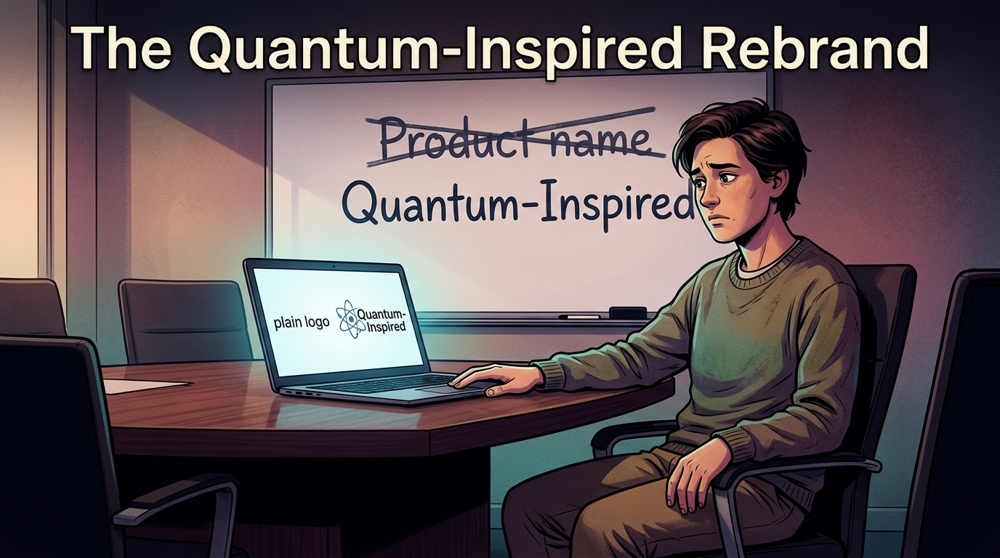
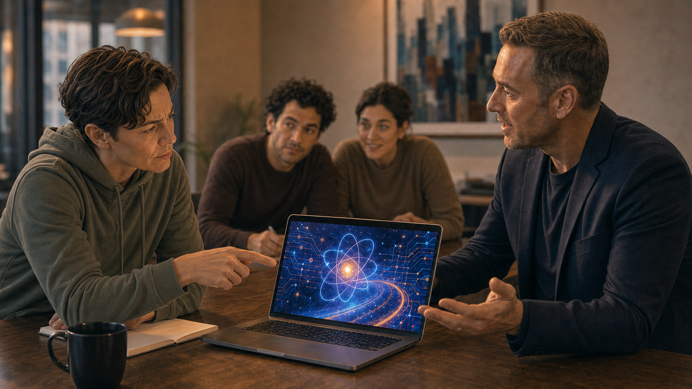
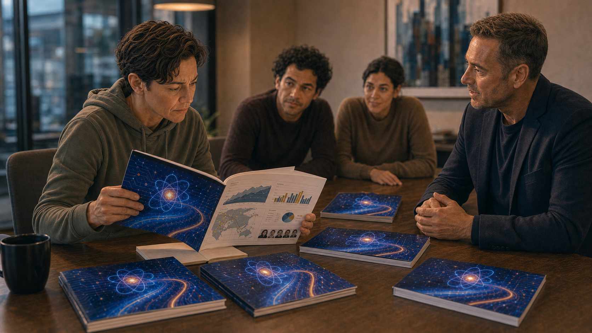
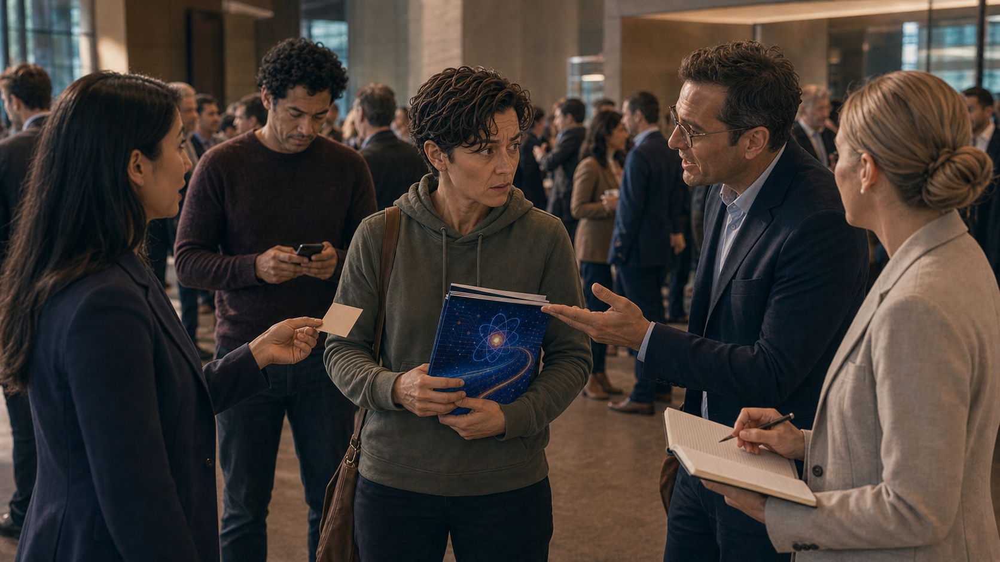
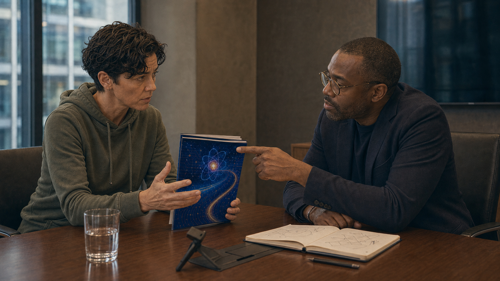
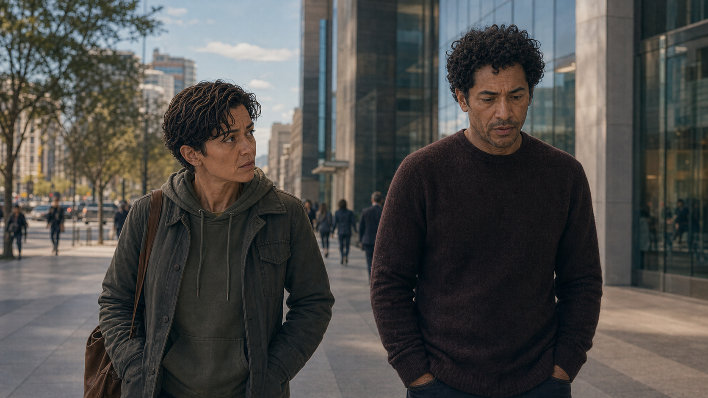
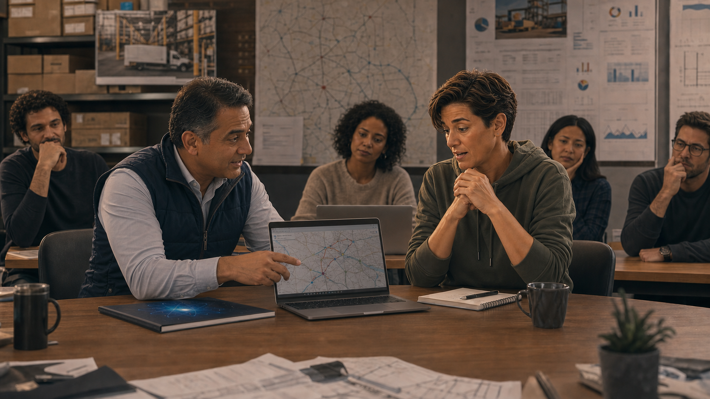

# The Quantum-Inspired Rebrand

A solid classical software company adopts a quantum label it doesn't need and can barely define.

Cover Image 

Generate a wide-landscape graphic novel cover image with a width:height ratio of 16:9. Use rich colors in the style of a thoughtful, cinematic graphic novel — expressive character faces, dramatic lighting, environments that reflect emotional tone.

  Not cartoonish. Think Saga or Maus rather than superhero comics.
  Do not put any captions or text in the image EXCEPT the title at the top.

  Place the title text at the top of the image: "The Quantum-Inspired Rebrand"

  Show Jordan — a gender-neutral person in their 30s, startup casual, uncertain expression — seated at a conference table. A marketing consultant's laptop faces them, showing two logos side by side: the old one and the new "Quantum-Inspired" version with an atom graphic. On the wall behind them, a whiteboard shows the old product name crossed out and the new name written below it. Jordan's hand rests on the table between the two choices. Their expression is the discomfort of someone choosing a label they can't fully defend. Color palette: the conference room light, the laptop screen showing both identities, the whiteboard behind carrying the history of the decision.

## Panel 1: The Good Product

Jordan's office — solid classical optimization software, happy customers

Panel 1 of 13.
Generate a wide-landscape graphic novel drawing with a width:height ratio of 16:9. Use rich colors in the style of a thoughtful, cinematic graphic novel — expressive character faces, dramatic lighting, environments that reflect emotional tone. Not cartoonish. Think Saga or Maus rather than superhero comics. Do not put captions or text in the image. Show Jordan — gender-neutral presenting, early 40s, startup casual hoodie and jeans, always near a whiteboard — in a modest but functional startup office. The whiteboard behind them shows a revenue chart with modest steady growth. A laptop is open showing what looks like dashboard metrics — real numbers, real customers. Jordan's expression is the quiet satisfaction of someone running something that actually works. A few team members work at desks in the background. Color palette: the honest warm light of a working startup, functional and unflashy.

Jordan's company has been running for four years and the product actually works. Their classical optimization software finds efficient solutions to logistics and scheduling problems — real customers, real results, modest but growing revenue. The team is twelve people. The office is rented. The customers renew. Jordan knows the technical details of what they built and believes in it. None of this is enough for a Series B in the current funding environment.

## Panel 2: The Marketing Consultant

Marketing consultant presents rebranding options on a laptop

Panel 2 of 13.
Generate a wide-landscape graphic novel drawing with a width:height ratio of 16:9. Use rich colors in the style of a thoughtful, cinematic graphic novel — expressive character faces, dramatic lighting, environments that reflect emotional tone. Not cartoonish. Do not put captions or text in the image. Show a small meeting room — Jordan and two team members sitting across from a marketing consultant, a man in his 40s with the confident affect of someone who has done this many times. His laptop is open showing branding options — mockup slides with different company positioning statements. Jordan looks at the screen with cautious interest. The consultant is in his element; Jordan is slightly outside theirs. Color palette: the meeting room light, the consultant's slide deck providing the most vivid colors in the frame.

The marketing consultant the investors recommended has done this pitch before. He opens the deck to slide seven: "Competitive positioning in adjacent spaces." He walks through three options. Option one: emphasize reliability. Option two: target enterprise logistics specifically. Option three — he pauses slightly for effect — "quantum-inspired optimization." His tone is professionally neutral. He has done this three hundred times. He knows which slide the room responds to.

## Panel 3: The Room Lights Up

"Quantum-inspired optimization" — the room lights up; Jordan looks uncertain

Panel 3 of 13.
Generate a wide-landscape graphic novel drawing with a width:height ratio of 16:9. Use rich colors in the style of a thoughtful, cinematic graphic novel — expressive character faces, dramatic lighting, environments that reflect emotional tone. Not cartoonish. Do not put captions or text in the image. Show the same meeting room, but the energy has changed. The two team members flanking Jordan are visibly engaged — leaning forward, nodding, the consultant's slide with "quantum-inspired" language now the focal point of the room. Jordan is the one person not fully leaning in — their expression is interested but slightly skeptical, uncertain. The contrast between Jordan's hesitation and the team's enthusiasm is the visual story. Color palette: the same meeting room, but the colors of the consultant's slide are warmer and more vivid, drawing everyone except Jordan.

The two team members on either side of Jordan lean forward at the same moment. One says "that's interesting." The other opens his laptop and starts typing notes before the consultant has finished the slide. Jordan looks at their own product and then at the slide. "But we don't use any quantum hardware," Jordan says. The consultant nods. "Inspired by," he says. "The math draws on quantum annealing principles. The framing is technically accurate." He pauses. "It's also what investors are looking for right now."

## Panel 4: "Inspired By"

Jordan: "We don't use quantum hardware" — Consultant: "Inspired by. Vague enough."

Panel 4 of 13.
Generate a wide-landscape graphic novel drawing with a width:height ratio of 16:9. Use rich colors in the style of a thoughtful, cinematic graphic novel — expressive character faces, dramatic lighting, environments that reflect emotional tone. Not cartoonish. Do not put captions or text in the image. Show Jordan and the consultant in a moment of direct exchange — Jordan asking the direct technical question, the consultant giving the careful answer. The consultant's expression is professional and slightly practiced — he has navigated this exact conversation many times. Jordan's expression is one of someone trying to locate the line between true and misleading. The rest of the team is visible in background, waiting for Jordan's decision. Color palette: the meeting room, slightly more intimate framing as the key exchange happens.

The consultant shows Jordan the slide: a quantum circuit diagram on the cover, blue gradient background, the same product beneath. "The diagram is decorative," Jordan says. "It's evocative," the consultant says. "Of what?" "Of quantum computing. Which is what the math is conceptually adjacent to." Jordan looks at the slide. The algorithm doesn't use quantum principles. It uses a heuristic search method that, in the academic literature, is described as inspired by quantum annealing — a phrase that appeared in a 2019 paper the team used as a starting point. The consultant is technically accurate. Jordan knows this.

## Panel 5: The New Pitch Deck

New pitch deck printed — quantum circuit diagram on cover, same product inside

Panel 5 of 13.
Generate a wide-landscape graphic novel drawing with a width:height ratio of 16:9. Use rich colors in the style of a thoughtful, cinematic graphic novel — expressive character faces, dramatic lighting, environments that reflect emotional tone. Not cartoonish. Do not put captions or text in the image. Show the new pitch deck printed and laid out on a table — glossy, professional, the cover featuring an abstract quantum circuit visualization in blue and white. Several copies are stacked. Jordan picks one up and opens it. The inside pages are visible — the same product, the same revenue charts, the same team bios. Jordan's expression as they look from cover to inside pages carries the dissonance. Color palette: the high-contrast blue-white of the new brand against the ordinary table, the disconnect between the cover and the content.

The new deck is printed in full color. The cover is striking — a quantum circuit visualization that the designer found in a stock library, blue and luminous. Jordan picks up a copy and opens to the technical description of the product. It is the same product. The same algorithm. The same customers. The cover promises quantum. The product delivers classical optimization with a new name. Both things are real. They are not the same thing.

## Panel 6: Three VCs Want Meetings

Investor conference — suddenly three VCs want meetings

Panel 6 of 13.
Generate a wide-landscape graphic novel drawing with a width:height ratio of 16:9. Use rich colors in the style of a thoughtful, cinematic graphic novel — expressive character faces, dramatic lighting, environments that reflect emotional tone. Not cartoonish. Do not put captions or text in the image. Show a technology investor conference — lobby, networking environment. Jordan is being approached by investors, not approaching them. Three different encounters in a single panel: each one initiates the conversation. Jordan's co-founder is visible in the background, texting on their phone. Jordan's expression is the surprise of someone whose new label is doing work that the product couldn't. Color palette: the bright conference light, the energized atmosphere of capital in motion, Jordan slightly off-balance in an unexpected way.

At the conference, something different happens. Jordan is not chasing people — people are approaching them. Three separate VCs initiate conversations about the quantum-inspired positioning. One mentions a thesis on "quantum-adjacent applications" his fund has been building. Jordan's co-founder texts from across the room: "what changed??" Jordan texts back: "The deck." The co-founder types for a moment, then doesn't respond.

## Panel 7: The Technical Question

A technical investor asks: "Walk me through the quantum component"

Panel 7 of 13.
Generate a wide-landscape graphic novel drawing with a width:height ratio of 16:9. Use rich colors in the style of a thoughtful, cinematic graphic novel — expressive character faces, dramatic lighting, environments that reflect emotional tone. Not cartoonish. Do not put captions or text in the image. Show a follow-up investor meeting — a small conference room, Jordan across from one investor who is clearly technically sophisticated. The investor is leaning forward, the pitch deck open in front of him, pointing to the quantum circuit diagram on the cover. His expression is genuinely curious, not accusatory. Jordan's expression is the particular look of someone choosing their words very carefully. Color palette: the investor meeting light, the slight tension of a technically sophisticated question meeting a prepared but imprecise answer.

The technical investor at the Thursday meeting points to the quantum circuit on the cover. "Walk me through the quantum component," he says. Jordan walks through it: the academic paper, the conceptual connection to quantum annealing principles, the classical implementation. The investor nods throughout. He asks one follow-up: "So no quantum hardware, but the optimization heuristic draws from quantum annealing theory." Jordan says yes. The investor writes something in his notebook. He seems satisfied. Jordan cannot tell if satisfaction means he understood or if it means the vagueness worked.

## Panel 8: "Did We Just Lie?"

Investor signs; Jordan and co-founder outside: "Did we just lie?" "We said inspired."

Panel 8 of 13.
Generate a wide-landscape graphic novel drawing with a width:height ratio of 16:9. Use rich colors in the style of a thoughtful, cinematic graphic novel — expressive character faces, dramatic lighting, environments that reflect emotional tone. Not cartoonish. Do not put captions or text in the image. Show Jordan and their co-founder — a different person, late 30s, pragmatic energy — outside the investor's building after a successful meeting. They're walking together, the building behind them. Both are quiet. Jordan asks the question. The co-founder answers it. The body language of both carries the ambiguity of an answer that is technically right but emotionally unresolved. Color palette: the exterior daylight after the meeting room, the open sky suggesting the larger world where this will play out.

Outside the building, Jordan and the co-founder walk half a block in silence. "Did we just lie?" Jordan asks. The co-founder considers this for a moment. "We said inspired," he says. "The paper we referenced uses that word." Jordan nods. "The diagram on the cover," Jordan says. The co-founder: "Is decorative." Another silence. "But the investor thinks—" "The investor thinks what he wants to think," the co-founder says. "We gave him what he needed to think it." Neither of them says anything else for another block.

## Panel 9: The Team Celebration

Funding closes — team celebrates; some look at each other

Panel 9 of 13.
Generate a wide-landscape graphic novel drawing with a width:height ratio of 16:9. Use rich colors in the style of a thoughtful, cinematic graphic novel — expressive character faces, dramatic lighting, environments that reflect emotional tone. Not cartoonish. Do not put captions or text in the image. Show the team celebration for the funding close — the startup office, champagne, people happy. But in the celebration, two or three team members exchange a brief look — not unhappy, not accusatory, just a moment of shared awareness of something unspoken. Jordan is in the celebration too, present but carrying something. The joy is real. The undertone is also real. Color palette: the warm celebration light, the genuine happiness of funding, a slightly cooler note in two or three faces.

The funding closes and the team celebration is real. The money will let them hire five more engineers and extend runway by two years. The product is good and will get better with these resources. Jordan opens a bottle of champagne and means it. But at least three people in the room have now seen the quantum circuit diagram on the cover and know exactly how accurate it is, and during the celebration they share a brief look that costs about half a second. It will not come up again. Everyone makes the choice to not bring it up.

## Panel 10: The Customer Question

A customer asks: "Will this work better on a real quantum computer?"

Panel 10 of 13.
Generate a wide-landscape graphic novel drawing with a width:height ratio of 16:9. Use rich colors in the style of a thoughtful, cinematic graphic novel — expressive character faces, dramatic lighting, environments that reflect emotional tone. Not cartoonish. Do not put captions or text in the image. Show a customer meeting — a logistics company executive and Jordan across a table. The customer has the new pitch deck open. They're asking the genuine question of a person who wants to understand what they're buying. Jordan's expression is the pause of someone deciding between the easy answer and the honest one. This is a real moment of choice. Color palette: the customer meeting light — slightly different from the investor meeting, more practical, more grounded.

Three months after the funding, a customer in a quarterly review asks the question directly: "We've been reading about quantum computing. Will this software run better when we get access to real quantum hardware?" Jordan pauses. It is a real pause — not strategic, not theatrical. It is the pause of someone deciding who they are in this moment. The customer is genuine. The question is good. Jordan has the easy answer and the honest answer, and they are not the same answer.

## Panel 11: The Honest Answer

Jordan: "Let's talk about what your actual problem is"

Panel 11 of 13.
Generate a wide-landscape graphic novel drawing with a width:height ratio of 16:9. Use rich colors in the style of a thoughtful, cinematic graphic novel — expressive character faces, dramatic lighting, environments that reflect emotional tone. Not cartoonish. Do not put captions or text in the image. Show Jordan leaning forward in the customer meeting, beginning a direct and honest conversation. Their expression is the relief of someone who has decided to tell the truth. The customer looks slightly surprised — this is not the answer they expected — and then genuinely engaged. The pitch deck on the table between them is closed. Color palette: the customer meeting room, now slightly warmer as something authentic begins.

"Honestly — not really," Jordan says. "Our software is a classical algorithm. The 'inspired by quantum' in our description refers to a theoretical connection to quantum annealing methods — it doesn't mean the software has quantum capabilities or will benefit from quantum hardware. What it means is that the optimization approach is sophisticated and it works." The customer nods slowly. Jordan continues: "Let's talk about what your actual problem is, and I'll tell you what this software can and can't do for it." The customer opens his laptop. The meeting becomes a real conversation.

## Panel 12: Rewriting the About Page

Jordan rewrites the company's About page — clearer, plainer, true

Panel 12 of 13.
Generate a wide-landscape graphic novel drawing with a width:height ratio of 16:9. Use rich colors in the style of a thoughtful, cinematic graphic novel — expressive character faces, dramatic lighting, environments that reflect emotional tone. Not cartoonish. Do not put captions or text in the image. Show Jordan alone that night, laptop open, rewriting the company website's About page. Their expression is focused and clean — this is the right work. The screen shows before-and-after text as they revise. The quantum circuit cover image from the pitch deck is visible in a different browser tab, minimized. Color palette: the evening home or office light, the quiet satisfaction of someone making a thing more true.

That night Jordan rewrites the About page. Out goes "quantum-inspired" as the primary descriptor. In comes a clear description of what the software does: a sophisticated classical optimization engine, applied to logistics and scheduling, delivering measurable improvements to customer operations. The academic connection to quantum annealing theory is preserved in one sentence in the technical description, with the phrase "classical implementation" added. The product doesn't change. The honesty does.

## Panel 13: The New Tagline

New company tagline on the website — "Advanced optimization. No buzzwords required."

Panel 13 of 13.
Generate a wide-landscape graphic novel drawing with a width:height ratio of 16:9. Use rich colors in the style of a thoughtful, cinematic graphic novel — expressive character faces, dramatic lighting, environments that reflect emotional tone. Not cartoonish. Do not put captions or text in the image. Show Jordan's company website on a laptop — clean, redesigned, the quantum circuit diagram on the cover now replaced with something that represents the actual work: a route optimization diagram or a scheduling grid. The new tagline is visible. Jordan sits back looking at it. Their expression is the quiet satisfaction of something that is simply and completely right. Color palette: the clean design palette of a company that has decided to be what it is, warm satisfaction.

The new website goes live on a Tuesday. Two customers email to say the updated description is clearer. One investor sends a brief message asking about the positioning change. Jordan explains it. The investor says he appreciates the directness. Three months later, a logistics conference features Jordan on a panel about "honest technology marketing." They tell the whole story, including the quantum circuit diagram. The room laughs — not at Jordan but with them. The product hasn't changed. It still works.

---

**Epilogue:** *Jordan's product was always good. The rebranding didn't make it better — it made it fundable by people who were looking for a different story. The framing effect works because labels carry emotional weight that logic doesn't. Jordan didn't start a fraud. But standing in the room when a vague label closes a deal has a way of changing what you say the next time.*
