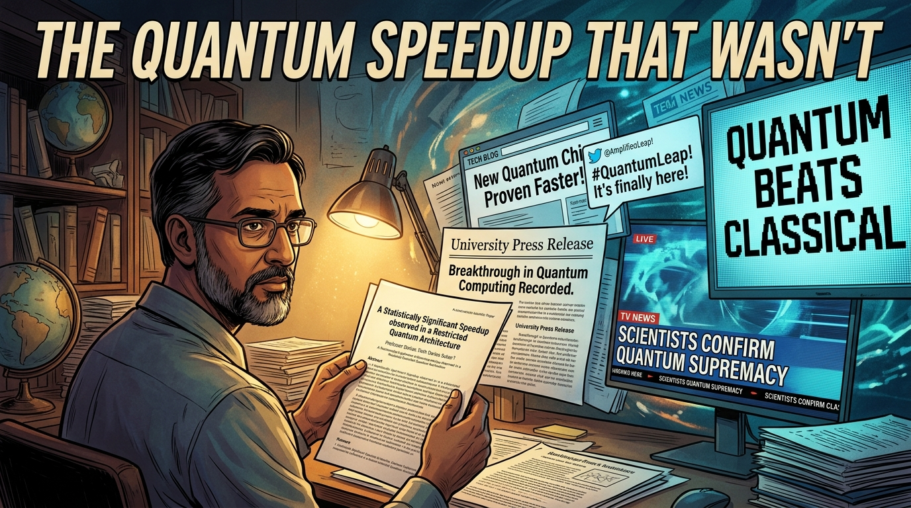
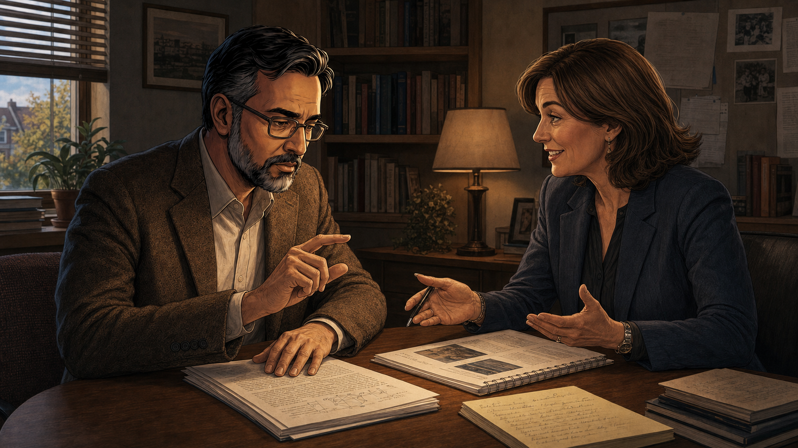
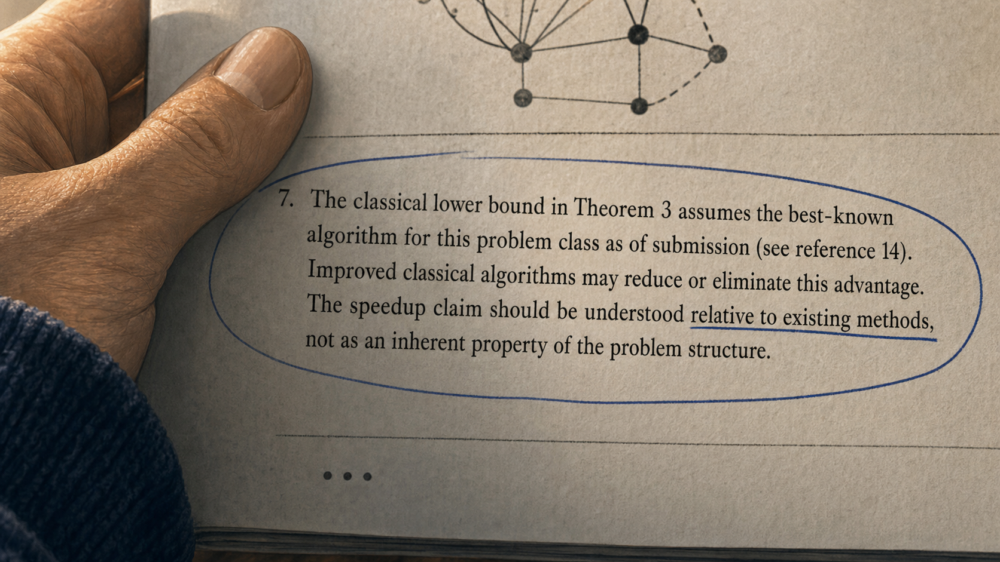
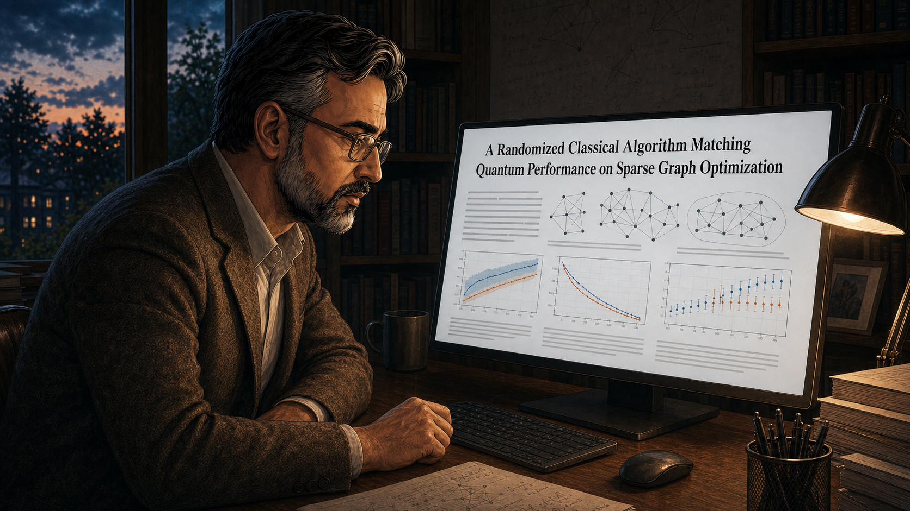
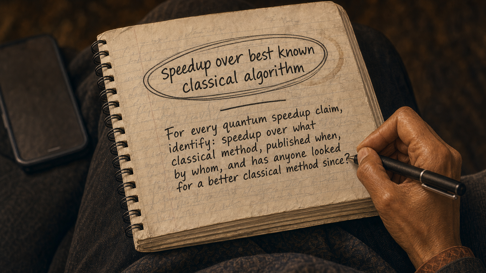

# The Quantum Speedup That Wasn't

A carefully qualified research finding travels through press releases and social media until the qualifications vanish.

Cover Image 

Generate a wide-landscape graphic novel cover image with a width:height ratio of 16:9. Use rich colors in the style of a thoughtful, cinematic graphic novel — expressive character faces, dramatic lighting, environments that reflect emotional tone.

  Not cartoonish. Think Saga or Maus rather than superhero comics.
  Do not put any captions or text in the image EXCEPT the title at the top.

  Place the title text at the top of the image: "The Quantum Speedup That Wasn't"

  Show Professor Darius — a South Asian man in his 50s, reading glasses, the precise bearing of a careful scientist — holding his original paper. Behind him, a cascade of increasingly distorted versions of the headline fans outward: the press release, the tech blog post, the tweet, the TV chyron — each one bolder and less qualified than the last. The original paper's title, visible in Darius's hands, has a hedged, precise phrasing. The final headline in the cascade, at the far edge of the composition, says simply "QUANTUM BEATS CLASSICAL." Darius's expression is the resigned precision of someone watching their careful work be summarized beyond recognition. Color palette: the warm academic light on Darius and the original paper, the headlines behind growing cooler and more saturated as they move further from the source.

## Panel 1: Professor Darius Finishing a Paper

Professor Darius finishing a careful, well-cited paper at his desk

Panel 1 of 14.
Generate a wide-landscape graphic novel drawing with a width:height ratio of 16:9. Use rich colors in the style of a thoughtful, cinematic graphic novel — expressive character faces, dramatic lighting, environments that reflect emotional tone. Not cartoonish. Think Saga or Maus rather than superhero comics. Do not put captions or text in the image. Show Professor Darius — an Iranian-American man in his 50s, tweed jacket, precise and careful speaker even in his body language — at his faculty desk finishing a paper. The desk has the controlled order of a careful researcher: papers in labeled stacks, a cup of pens, the manuscript near completion. His expression is the satisfied precision of someone who has been rigorous and knows it. Evening light through the window. Color palette: the warm evening desk lamp light, the quiet satisfaction of a completed careful work.

Professor Darius finishes the paper on a Thursday evening and sends it to his co-authors with a note: "Please check footnote 7 in particular — I want to make sure we've been appropriately careful about the classical comparison." He has been working on this algorithm for three years. The result is real: for a specific class of graph problems, the quantum algorithm demonstrates a measurable speedup over the best classical method he is aware of. Footnote 7 says exactly that — "over the best-known algorithm."

## Panel 2: The University Press Office

Press office asks to put out a release — Darius asks them to be careful with framing

Panel 2 of 14.
Generate a wide-landscape graphic novel drawing with a width:height ratio of 16:9. Use rich colors in the style of a thoughtful, cinematic graphic novel — expressive character faces, dramatic lighting, environments that reflect emotional tone. Not cartoonish. Do not put captions or text in the image. Show Professor Darius in a meeting or call with the university press office — a communications professional, enthusiastic and competent. She is proposing a press release. Darius is engaged but making a specific request — he is trying to explain something nuanced. His expression is the careful look of a precise person asking for care from someone operating in a different medium. Color palette: the office meeting light, the slight friction of two professionals with different goals.

The press office contacts him a week after the paper is accepted. "This is a big result — can we put out a release?" The communications director is competent and genuinely excited about the science. Darius says yes and adds: "Please be careful how you frame the speedup. It's over the best-known classical algorithm — that's specific and important. A better classical algorithm could reduce or eliminate the gap. Can we put that in the release?" She says absolutely. She writes a first draft.

## Panel 3: The Press Release Headline

Darius reads the press release headline — winces slightly; lets it go

Panel 3 of 14.
Generate a wide-landscape graphic novel drawing with a width:height ratio of 16:9. Use rich colors in the style of a thoughtful, cinematic graphic novel — expressive character faces, dramatic lighting, environments that reflect emotional tone. Not cartoonish. Do not put captions or text in the image. Show Professor Darius reading the draft press release on his laptop. His expression shows the specific wince of a precise person seeing precision sacrificed for impact — a slight tightening around the eyes. The headline on screen implies "exponential quantum speedup demonstrated" without the "best-known" qualifier. Below the headline, the body text has some of the nuance he requested, but the headline is the headline. He is about to decide something. Color palette: the laptop screen light, the slight tightening of a precise man seeing imprecision.

The headline in the first draft reads: "Exponential Quantum Speedup Demonstrated for Graph Problem Class." Darius reads it. The word "exponential" is technically justifiable for the specific comparison being made. The "best-known" qualifier from footnote 7 is in the third paragraph. He thinks about the back-and-forth it would take to change the headline. He thinks about the fact that the press office needs something shareable. He thinks about his department chair's interest in high-impact press coverage. He lets it go.

## Panel 4: Maya Reads the Press Release

Maya reads the press release and the abstract — uses the press release

Panel 4 of 14.
Generate a wide-landscape graphic novel drawing with a width:height ratio of 16:9. Use rich colors in the style of a thoughtful, cinematic graphic novel — expressive character faces, dramatic lighting, environments that reflect emotional tone. Not cartoonish. Do not put captions or text in the image. Show Maya — a mixed-race woman, early 30s, science and technology journalist, always typing notes on her phone — at her desk with two documents open: the press release and the abstract. She reads the abstract, starts to get into the density, then returns to the press release. The press release is clearer. Her expression shows the professional judgment of a journalist prioritizing the accessible document. Color palette: the journalist's desk light, the two documents competing for her attention and one winning.

Maya covers science and technology for a national publication. She receives the press release and opens the abstract in a separate tab. The abstract uses "best-known classical algorithm" twice and references a footnote. The press release says "exponential quantum speedup." She calls the press office for a quote. The press office confirms the exponential speedup. She uses the press release's framing. The abstract is dense. The press release is clear. This is the professional journalist's calculus.

## Panel 5: Maya's Article — 60,000 Shares

Maya's article: "Quantum Algorithm Leaves Classical Computers in the Dust" — 60,000 shares

Panel 5 of 14.
Generate a wide-landscape graphic novel drawing with a width:height ratio of 16:9. Use rich colors in the style of a thoughtful, cinematic graphic novel — expressive character faces, dramatic lighting, environments that reflect emotional tone. Not cartoonish. Do not put captions or text in the image. Show the published article on a screen — a large headline about quantum leaving classical computing behind. Below it, a share count climbing. Maya's phone is visible, showing notifications. The article is spreading. Professor Darius is shown in a small inset or background — he has seen the article. His expression is not triumphant; it is the mild discomfort of a precise person watching an imprecise version of his work travel. Color palette: the digital glow of viral spread, the warm ambivalence of unexpected scale.

The article publishes on a Wednesday morning. "Quantum Algorithm Leaves Classical Computers in the Dust." Sixty thousand shares by Friday. The university president's office emails Darius's department chair. A technology podcast invites Darius to explain the result. Three quantum computing companies tweet the article. The "best-known classical algorithm" qualifier in footnote 7 is read by approximately 400 people — those who download the paper itself and read to the footnotes.

## Panel 6: The Classical Algorithms Researcher at Breakfast

Classical algorithms researcher reads the article — pulls up the paper, finds footnote 7

Panel 6 of 14.
Generate a wide-landscape graphic novel drawing with a width:height ratio of 16:9. Use rich colors in the style of a thoughtful, cinematic graphic novel — expressive character faces, dramatic lighting, environments that reflect emotional tone. Not cartoonish. Do not put captions or text in the image. Show a researcher — a woman in her 40s, theoretical CS, reading the article on her phone over breakfast. Her expression shifts as she reads: initial scrolling, then a sharpening of attention, then the specific look of someone who has noticed something. She puts down her coffee and opens her laptop. She has the paper up within minutes. Color palette: the warm breakfast morning light, the shift from casual reading to focused investigation.

Dr. Lindqvist is a classical algorithms researcher at ETH Zurich. She reads the article over breakfast and something about the problem class catches her attention — it's in her area of expertise, and she knows the best-known algorithm for it. She opens her laptop and finds the paper. She reads the abstract, the main result, and then footnote 7. She reads footnote 7 twice. Then she opens her email and writes three words to her graduate students: "New project. Come discuss."

## Panel 7: Footnote 7 Close-Up

Footnote 7 close-up: "The classical lower bound assumes the best-known algorithm"

Panel 7 of 14.
Generate a wide-landscape graphic novel drawing with a width:height ratio of 16:9. Use rich colors in the style of a thoughtful, cinematic graphic novel — expressive character faces, dramatic lighting, environments that reflect emotional tone. Not cartoonish. Do not put captions or text in the image. Show a close-up of the paper — specifically a footnote at the bottom of a page. The text of the footnote is large enough to read, containing the key qualification: that the classical lower bound assumes the best-known algorithm and that improved classical methods may reduce or eliminate the gap. The footnote is circled in pen. Dr. Lindqvist's hand is holding the paper. Color palette: the warm close focus of printed academic paper, the circled text as the visual anchor.

Footnote 7: "The classical lower bound in Theorem 3 assumes the best-known algorithm for this problem class as of submission (see reference 14). Improved classical algorithms may reduce or eliminate this advantage. The speedup claim should be understood relative to existing methods, not as an inherent property of the problem structure." Dr. Lindqvist reads it and understands exactly what it is: an honest caveat that nobody is reading, attached to a headline that sixty thousand people have shared.

## Panel 8: Six Months of Work

Six months — grad students at a whiteboard; classical response paper taking shape

Panel 8 of 14.
Generate a wide-landscape graphic novel drawing with a width:height ratio of 16:9. Use rich colors in the style of a thoughtful, cinematic graphic novel — expressive character faces, dramatic lighting, environments that reflect emotional tone. Not cartoonish. Do not put captions or text in the image. Show Dr. Lindqvist's group over six months: her and two grad students, a whiteboard that accumulates work, late nights, the iterative structure of algorithm research. The work is clearly going well — the whiteboard shows a developing approach, not failed attempts. The team looks engaged and productive. Color palette: the lab working light across time, the steady accumulation of a response taking shape.

It takes six months. Dr. Lindqvist and her two students build a new randomized classical algorithm for the problem class, drawing on a technique from a 2021 combinatorial optimization paper that Darius's group had not incorporated. The new algorithm is not a refutation of Darius's work — it is progress in classical algorithms, which is the correct scientific response to a quantum speedup claim. When they have a clean result, she writes to Darius directly before submitting.

## Panel 9: The Classical Paper Publishes

Classical paper: "Matching Quantum Performance on [Problem Class]"

Panel 9 of 14.
Generate a wide-landscape graphic novel drawing with a width:height ratio of 16:9. Use rich colors in the style of a thoughtful, cinematic graphic novel — expressive character faces, dramatic lighting, environments that reflect emotional tone. Not cartoonish. Do not put captions or text in the image. Show the classical algorithms paper on a screen — the title visible, indicating it matches or approaches the quantum performance. The paper is in a well-regarded venue. Darius is shown reading it — not at a board meeting or a press conference, but alone at his desk, reading carefully. Color palette: the desk reading light, the focused quality of a scientist engaging with work that directly addresses his own.

The paper publishes in the same journal as Darius's original. Title: "A Randomized Classical Algorithm Matching Quantum Performance on Sparse Graph Optimization." The speedup from footnote 7 is reduced from exponential to at most polynomial, and under the new algorithm, the polynomial is small. The result is not a correction of Darius's paper — Darius's paper was accurate about what it said it was accurate about. The field has advanced. That is what is supposed to happen.

## Panel 10: Darius Reads It

Darius reads the classical response — "This is good work. This is how science is supposed to work."

Panel 10 of 14.
Generate a wide-landscape graphic novel drawing with a width:height ratio of 16:9. Use rich colors in the style of a thoughtful, cinematic graphic novel — expressive character faces, dramatic lighting, environments that reflect emotional tone. Not cartoonish. Do not put captions or text in the image. Show Professor Darius alone at his desk, reading the classical paper. His expression is the specific look of a scientist reading work that revises the implication of his own: he is genuinely engaged, not defensive. When he finishes, he says something out loud to himself. His expression in this moment is the professional respect of someone who takes the work seriously. Color palette: the office reading light, Darius's expression the visual center.

Darius reads Dr. Lindqvist's paper in one sitting on a Saturday morning. When he finishes, he says out loud, to his empty study: "This is good work. This is how science is supposed to work." He means it completely. The new algorithm advances the field — it identifies a structural property of the problem class that wasn't visible in his framing. He sends Lindqvist a congratulatory email. He tells her footnote 7 was exactly the right thing to include. She thanks him and says she wouldn't have started the project without it.

## Panel 11: The Correction That Nobody Reads

Maya asked to write the correction — original had 60,000; both know the follow-up number

Panel 11 of 14.
Generate a wide-landscape graphic novel drawing with a width:height ratio of 16:9. Use rich colors in the style of a thoughtful, cinematic graphic novel — expressive character faces, dramatic lighting, environments that reflect emotional tone. Not cartoonish. Do not put captions or text in the image. Show Maya and her editor — she has been asked to write a follow-up piece on the classical response. The editor asks about the original's reach. Maya's expression shows the particular weariness of a journalist who knows what the follow-up readership will be before they file it. Her editor's expression shows the same knowledge. Both of them know the correction is the right thing to do and both of them know the mathematics of corrections. Color palette: the editorial environment, the slightly muted quality of the conversation about a necessary but limited-reach story.

Maya's editor asks her to write the follow-up: "Quantum Speedup Narrowed by New Classical Algorithm." She asks how many people read the original. The editor says sixty thousand. They look at each other. Maya says: "The follow-up will get eight hundred if we're lucky." The editor nods. "Write it anyway," he says. She does. It is accurate and well-written. The original article remains the second search result for the quantum algorithm in question, with the original headline intact.

## Panel 12: 900 Readers

Correction runs — 900 readers; original article first in search results

Panel 12 of 14.
Generate a wide-landscape graphic novel drawing with a width:height ratio of 16:9. Use rich colors in the style of a thoughtful, cinematic graphic novel — expressive character faces, dramatic lighting, environments that reflect emotional tone. Not cartoonish. Do not put captions or text in the image. Show a screen with two search results: the original article at the top with its dramatic headline and large share count, the correction article below with a modest reader count. The asymmetry is the visual fact. Maya looks at this screen. Her expression is the resigned professionalism of someone who has done what she could. Color palette: the screen light, the two results as the story.

The correction runs. Nine hundred readers. The original article has been cited in four press releases by quantum computing companies, referenced in two Congressional statements about quantum investment, and is still the first result when you search the algorithm's name plus "speedup." The accurate sentence — "speedup over best-known classical algorithm" — lives in the correction, in footnote 7, and in the original paper's abstract, where it is read by the people who read abstracts.

## Panel 13: The Conference Panel

Maya and Darius on a panel — "What should I have said differently?" "Speedup over best known classical."

Panel 13 of 14.
Generate a wide-landscape graphic novel drawing with a width:height ratio of 16:9. Use rich colors in the style of a thoughtful, cinematic graphic novel — expressive character faces, dramatic lighting, environments that reflect emotional tone. Not cartoonish. Do not put captions or text in the image. Show a panel discussion — Maya and Professor Darius seated beside each other on a stage at a science communication conference. Darius is asking Maya the question about what he should have said differently. Maya is writing it in her notebook in real time. The audience watches. The exchange has the quality of two people having a genuine exchange about a specific lesson. Color palette: the conference panel light, the focused quality of two people figuring something out in public.

The science communication conference puts them on a panel together a year later. Darius says: "I've thought about what I should have asked the press office to say differently. What would have changed the coverage?" Maya is writing before he finishes the question. "Four words," she says. "Speedup over best known classical." She holds up her notebook where she's written it. "Those four words change everything. They tell the reader this might not survive a better algorithm. They set the right expectation. They make the correction a non-story instead of a contradiction." Darius nods slowly. "I thought they were in the footnote," he says. "They were," she says. "That's the problem."

## Panel 14: The Notebook Rule

Maya's notebook — the four words circled; a new rule for every quantum claim she'll cover

Panel 14 of 14.
Generate a wide-landscape graphic novel drawing with a width:height ratio of 16:9. Use rich colors in the style of a thoughtful, cinematic graphic novel — expressive character faces, dramatic lighting, environments that reflect emotional tone. Not cartoonish. Do not put captions or text in the image. Show Maya's journalist's notebook — open to a page she has clearly visited more than once. In large, circled writing: "speedup over best known classical algorithm." Below the circled phrase, a personal rule written in smaller handwriting — something about checking this qualifier on every quantum claim she covers. The notebook has the look of something used heavily. Color palette: the warm notebook light, the circled phrase as an anchor, the rule that follows it.

Maya writes the four words in her notebook and circles them. Below the circle, she writes a personal rule: "For every quantum speedup claim, identify: speedup over what classical method, published when, by whom, and has anyone looked for a better classical method since?" She will apply this rule to the next thirty quantum speedup claims she covers. Several of them will survive it. Several will not. All of them will be better described for it.

---

**Epilogue:** *Professor Darius's paper was correct. The press release was defensible. The article was misleading. The correction was accurate and unread. Science's self-correction mechanism worked exactly as designed — and the public conversation was shaped almost entirely by the headline that appeared on day one. The four words "best known classical algorithm" carry more epistemic weight than any graph in the paper. They almost never make it into the headline.*
