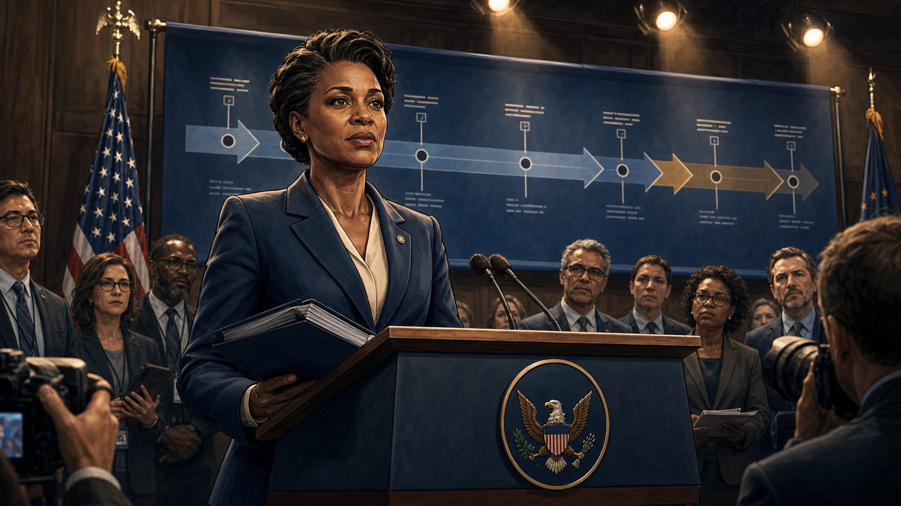
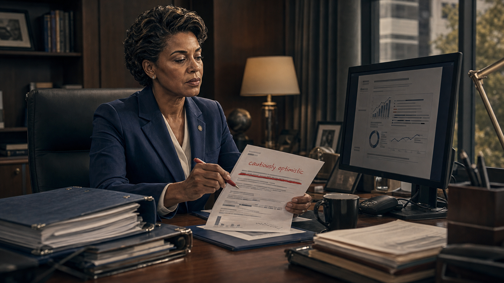
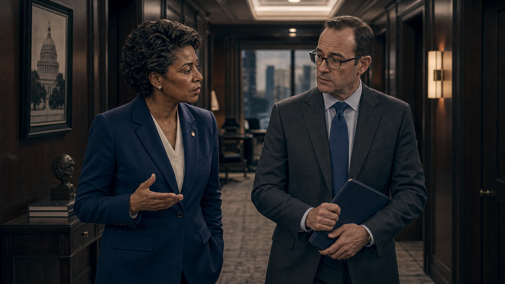
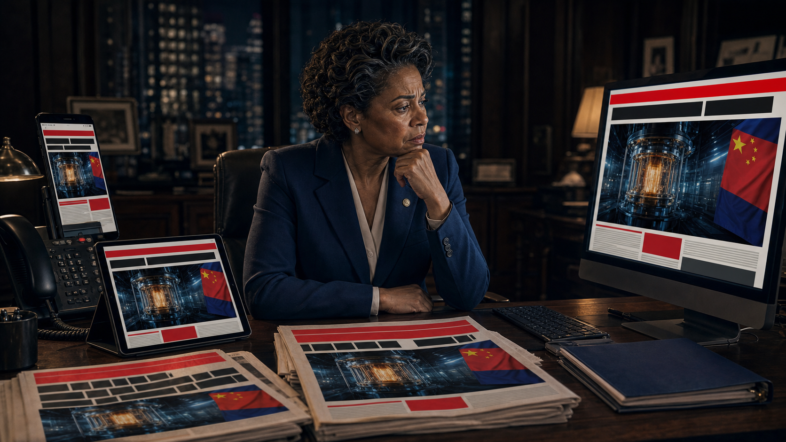
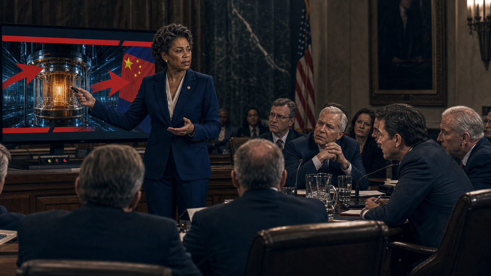
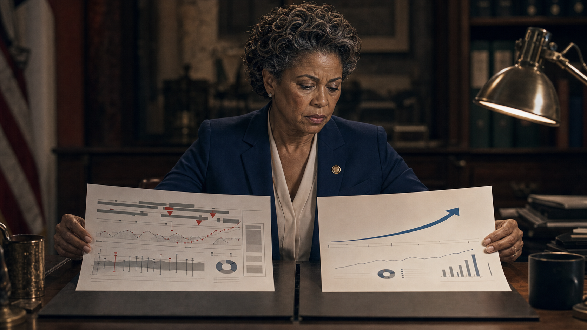
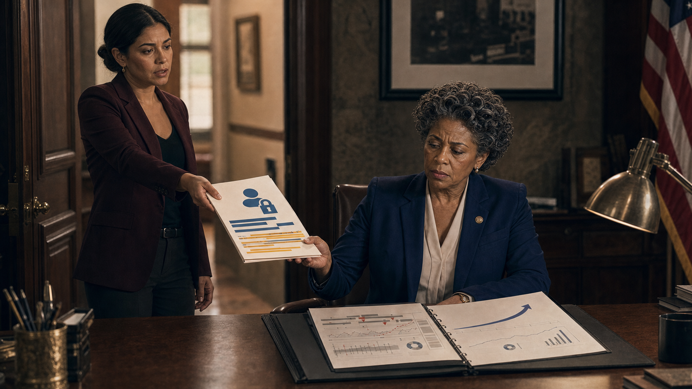
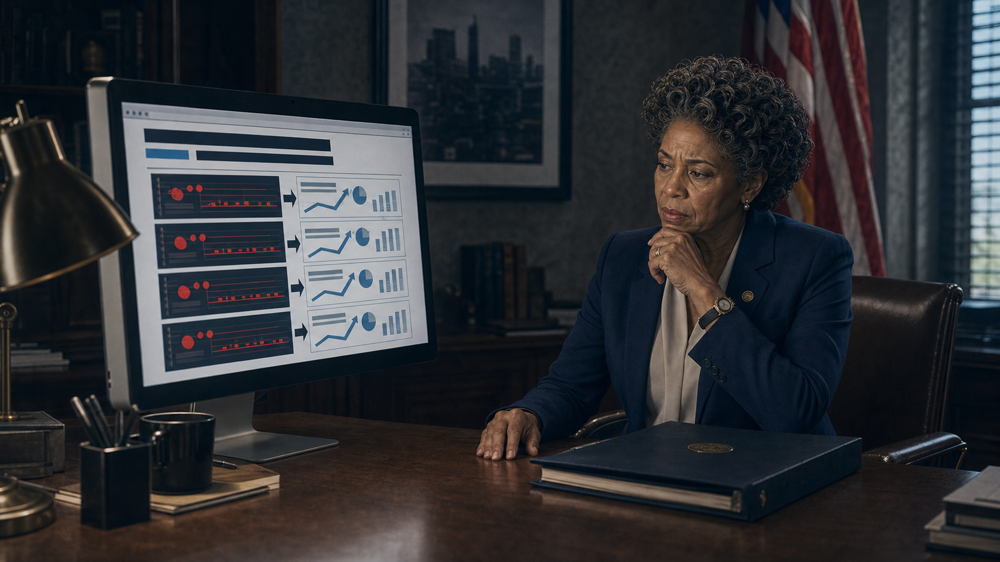
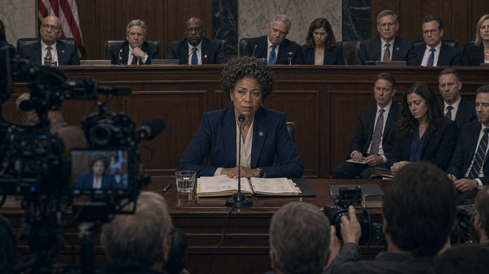
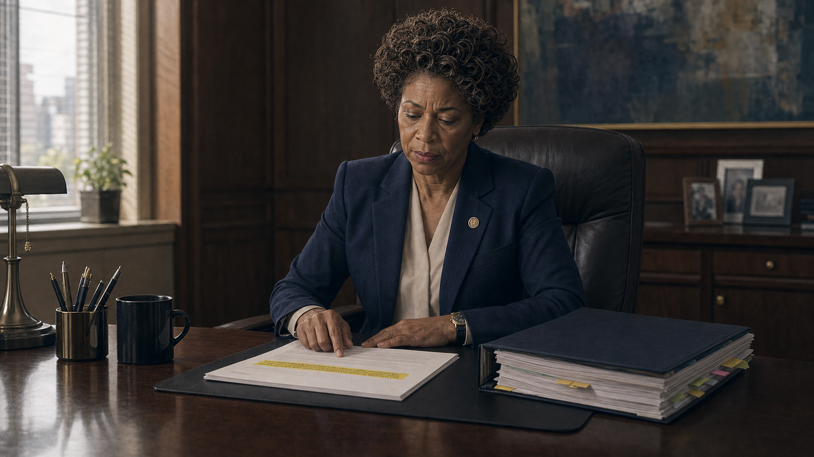

# The Quantum Winter Is Coming

## Panel 1: Program Launch

Director Amara at the podium — ambitious timeline banner behind her

Generate a wide-landscape graphic novel drawing with a width:height ratio of 16:9. Use rich colors in the style of a thoughtful, cinematic graphic novel — expressive character faces, dramatic lighting, environments that reflect emotional tone. Not cartoonish. Think Saga or Maus rather than superhero comics. Do not put captions or text in the image. Show Director Amara — a Black woman in her 50s, government-formal clothes, carrying a thick binder — at a podium for the launch of a major quantum computing research program. Behind her on a banner or screen is the program title with ambitious milestone language and years. She looks confident and genuine — this is a real commitment from a serious person. An audience of researchers, press, and government officials fills the room. Flags and official seals are visible. Color palette: the formal patriotic palette of a government announcement, warm confident light on Amara.

Director Amara has spent eighteen months building this program. The funding is real, the researchers are excellent, and the timeline was reviewed by three independent expert panels who all agreed it was ambitious but achievable. She stands at the podium and gives the program's launch statement with the conviction of someone who believes what she is saying. This is year one. The timeline on the banner behind her will survive the year.

## Panel 2: Year 1 Review — Honest Results

Year 1 review — promising results, Amara accurate and honest

Generate a wide-landscape graphic novel drawing with a width:height ratio of 16:9. Use rich colors in the style of a thoughtful, cinematic graphic novel — expressive character faces, dramatic lighting, environments that reflect emotional tone. Not cartoonish. Do not put captions or text in the image. Show a formal program review meeting — a long table, Amara presenting, funding committee members and program officers around the table. Slides visible behind her show Year 1 results — the data is mixed but directionally positive. Amara's expression and posture are those of an honest professional: the report she is giving is the actual one. Her thick binder is open in front of her. The committee looks engaged and neither alarmed nor ecstatic. Color palette: the functional conference room light of a professional review, neutral and honest.

The year-one review is straightforward. Four of seven milestones met; two running slightly behind schedule; one deferred to Year 2 following a technical pivot that was, on reflection, the right call. Amara presents this accurately. The program officer from the funding agency writes it down. The committee asks good questions. The program is on a reasonable trajectory. Amara's report is, in every meaningful sense, true.

## Panel 3: Year 2 — The Softening

Year 2 — Amara softening language over a paragraph she crosses out

Generate a wide-landscape graphic novel drawing with a width:height ratio of 16:9. Use rich colors in the style of a thoughtful, cinematic graphic novel — expressive character faces, dramatic lighting, environments that reflect emotional tone. Not cartoonish. Do not put captions or text in the image. Show Amara at her desk, working on the Year 2 report. Her screen shows a document. In her hand is a pen and she is editing a printed draft — crossing out a sentence, writing "cautiously optimistic" over something that was more direct. Her expression is the expression of a professional making a small, defensible choice that she knows is a small, indefensible compromise. The thick binder is on the desk. Color palette: the office afternoon light, the slightly dimmer quality of a scene where something is being reduced.

Year 2 results are mixed. Three of six milestones reached; two behind by more than is comfortable; one — the key coherence milestone — behind by eighteen months. Amara writes the draft report. The section on coherence reads, in draft: "Progress has been significantly slower than projected. The current trajectory does not support the original Year 3 targets." She reads it back. She thinks about the upcoming budget review. She crosses out "significantly slower" and writes "proceeding with revised expectations." She writes "cautiously optimistic" at the end of the section. Both sentences are technically accurate. The overall impression they create is different from the underlying data.

## Panel 4: The Flag

A program officer flags the growing gap in a meeting

Generate a wide-landscape graphic novel drawing with a width:height ratio of 16:9. Use rich colors in the style of a thoughtful, cinematic graphic novel — expressive character faces, dramatic lighting, environments that reflect emotional tone. Not cartoonish. Do not put captions or text in the image. Show a program team meeting — Amara and four or five colleagues at a table. A program officer — a man in his 40s, careful professional manner — is raising a concern. He has a printout in front of him showing the original projections alongside the current results. His expression is serious but not adversarial — he is doing his job. Amara is listening with a controlled expression. The gap between the two sets of numbers on his printout is visually suggested even at document scale. Color palette: the meeting room light, slightly more tense than the Year 1 review — the dynamic has shifted.

A program officer named David raises his hand in the mid-year meeting. He has laid the original program milestones beside the current status in a table, and the two columns don't match in ways that the softened language in the report doesn't fully capture. He presents this carefully — as a discrepancy that needs addressing, not an accusation. Amara acknowledges it. She says the program is adjusting its approach. She says the adjustments are promising. She does not update the public-facing timeline.

## Panel 5: "We Don't Want to Spook the Committee"

Amara: "We don't want to spook the funding committee" — program officer closes folder

Generate a wide-landscape graphic novel drawing with a width:height ratio of 16:9. Use rich colors in the style of a thoughtful, cinematic graphic novel — expressive character faces, dramatic lighting, environments that reflect emotional tone. Not cartoonish. Do not put captions or text in the image. Show a private conversation between Amara and the program officer — a hallway, or a small office, after the larger meeting. Amara is speaking quietly, her expression firm but not unkind. The program officer is holding a folder — his discrepancy analysis. As she speaks, he closes the folder. His expression shows the moment of a person absorbing a decision they don't fully agree with. Both people are professionals. Neither is a villain. Color palette: the corridor light — slightly darker, more private, the space where real conversations happen.

After the meeting, she finds David in the hallway. "The funding committee has a re-authorization vote in six months," she says. "We don't want to spook them with language that will look worse than the situation actually is." David looks at his folder. "The situation is what the situation is," he says. "I know," she says. "Which is why the language needs to be careful." He closes the folder. He is not wrong and she is not wrong, and they are choosing between different kinds of wrong.

## Panel 6: The Competitor Nation's Announcement

A competitor's unverified "breakthrough" dominates front pages

Generate a wide-landscape graphic novel drawing with a width:height ratio of 16:9. Use rich colors in the style of a thoughtful, cinematic graphic novel — expressive character faces, dramatic lighting, environments that reflect emotional tone. Not cartoonish. Do not put captions or text in the image. Show Amara reading multiple news sources — phone, computer, physical newspaper — all showing the same story: a competitor nation has announced a quantum computing breakthrough. The headlines are dramatic. Amara's expression is complex: she knows enough to be skeptical of the claim, but she also knows what the political effect will be. The word "unverified" is not in the headlines. Her binder is on the desk and for once she is not consulting it. Color palette: the media-glow of multiple screens, the bright primary colors of urgent headlines, Amara in the middle absorbing the consequences.

Year 3, February: a foreign national program announces a "major breakthrough" in fault-tolerant quantum computing. The press release is vague on technical specifics. Within 48 hours it is on the front page of twelve major newspapers and has been cited in a Congressional floor speech. The announcement has not been peer-reviewed or independently verified. None of this appears in the floor speech. Amara reads the announcement, identifies three claims that she doubts, and opens a new document.

## Panel 7: Using the Announcement

Amara uses the competitor's announcement to justify continued funding

Generate a wide-landscape graphic novel drawing with a width:height ratio of 16:9. Use rich colors in the style of a thoughtful, cinematic graphic novel — expressive character faces, dramatic lighting, environments that reflect emotional tone. Not cartoonish. Do not put captions or text in the image. Show Amara presenting to the funding committee — a formal hearing room or budget meeting. Her slide shows the competitor nation's announcement prominently. Her posture and expression are those of someone making an argument she partly believes: the geopolitical risk is real; the specific announcement may not be. The committee members lean forward. The room responds to the competitive framing. Color palette: the hearing room formality, the visual impact of a foreign competitor's achievement used as leverage.

Her memo to the funding committee begins with the competitor's announcement. "We cannot afford to fall behind," she writes — which is true, even if the specific announcement that prompted the sentence is probably overstated. The memo requests continued and expanded funding for the program. The committee approves it with fewer questions than the Year 2 honest review generated. This is the lesson the system teaches. Amara notes it and does not like it.

## Panel 8: The Growing Gap

Side-by-side: internal report vs. public statement — the gap is visible

Generate a wide-landscape graphic novel drawing with a width:height ratio of 16:9. Use rich colors in the style of a thoughtful, cinematic graphic novel — expressive character faces, dramatic lighting, environments that reflect emotional tone. Not cartoonish. Do not put captions or text in the image. Show two documents side by side — an internal program report (marked as such) and a public statement or press release. The internal document has specific numbers, ranges, qualifications. The public document has more confident language, shorter timeline references, none of the internal hedging. A thin but visible gap of meaning separates the two columns of text. Amara is reviewing both documents at her desk. Her expression shows she sees the gap clearly. Color palette: the desk-light of a careful professional reviewing documents, the visual contrast between the two texts.

By the end of Year 3, two documents describe the program. The internal status report — accurate, qualified, distributed to a small review group — shows three major milestones behind schedule, one abandoned, the overall timeline extended by two years from original projections. The public-facing program update — accurate in a technically defensible sense — describes "continued progress," "promising developments," and an "on-track program." Neither document is false. The gap between them is the institutional lie that isn't quite a lie.

## Panel 9: The FOIA Request

Amara learns a journalist has filed a FOIA request

Generate a wide-landscape graphic novel drawing with a width:height ratio of 16:9. Use rich colors in the style of a thoughtful, cinematic graphic novel — expressive character faces, dramatic lighting, environments that reflect emotional tone. Not cartoonish. Do not put captions or text in the image. Show Amara in her office, her communications team member — a young professional — delivering news. Amara's expression upon receiving the FOIA information is controlled but not comfortable. Her binder is open in front of her but she is not looking at it. She already knows, approximately, what the FOIA will find. Color palette: the office morning light, the slightly more tense quality of institutional exposure beginning.

The communications team director appears at Amara's door on a Thursday morning with a notification: a journalist has filed a Freedom of Information Act request for all internal program status documents from Years 2 and 3. Amara says "okay" and asks to see the full request. She reads it carefully. It is specific and well-informed — whoever filed this knows what they're looking for. She calls David, who wrote the original discrepancy memo. She asks if he's been talking to journalists. He says he hasn't. She believes him.

## Panel 10: The Gap Becomes Public

Not fraud — compounded optimism becoming public

Generate a wide-landscape graphic novel drawing with a width:height ratio of 16:9. Use rich colors in the style of a thoughtful, cinematic graphic novel — expressive character faces, dramatic lighting, environments that reflect emotional tone. Not cartoonish. Do not put captions or text in the image. Show a newspaper article or web page — visible enough to convey that a story has broken comparing the internal program reports with public statements. Amara reads it at her desk. The headline is pointed but not accusatory of fraud — more like "gap between reality and claims." Her expression is the composed expression of someone who knew this was coming. Her binder is on the desk, closed for once. Color palette: the particular clarity of a consequence arriving — cooler light, sharper shadows.

The story runs three weeks later. It is careful journalism — not a fraud accusation, but a detailed comparison of internal milestone status and public program descriptions, year by year. The gap is visible and the cumulative optimism is clearly laid out. Amara reads it at 6 a.m. before it's on her team's radar. The analysis is correct. She has always known it was correct, in the way you know about the thing you have managed rather than addressed.

## Panel 11: Congressional Testimony

Amara testifies before a committee — "We believed the projections"

Generate a wide-landscape graphic novel drawing with a width:height ratio of 16:9. Use rich colors in the style of a thoughtful, cinematic graphic novel — expressive character faces, dramatic lighting, environments that reflect emotional tone. Not cartoonish. Do not put captions or text in the image. Show the formal setting of a Congressional hearing — Amara at the witness table, microphone in front of her, the committee dais with representatives above. The room is formal and recorded. Amara's posture is upright, her binder open, her expression the composed dignity of someone testifying accurately under uncomfortable conditions. She is not breaking down. She is doing the hardest part of the job. Color palette: the formal hearing room light — institutional, slightly harsh, the full visibility of public accountability.

At the committee hearing, the ranking member asks directly: "Did the program reports accurately represent the status of the program?" Amara answers precisely: "The public statements were accurate within the discretion available to program leadership. The internal reports were always more specific. In retrospect, the gap between internal and public communication was larger than appropriate. We believed the projections were achievable at the time each was made." It is the most honest answer she can give that is also legally safe. She knows the difference between those two things.

## Panel 12: The New Charter

New program charter with one new highlighted line — annual honest assessment

Generate a wide-landscape graphic novel drawing with a width:height ratio of 16:9. Use rich colors in the style of a thoughtful, cinematic graphic novel — expressive character faces, dramatic lighting, environments that reflect emotional tone. Not cartoonish. Do not put captions or text in the image. Show Amara at her desk, a new program charter document in front of her. A single line is highlighted — something about annual public honest assessments including negative results. She is reading this line. Her expression is the quiet satisfaction of someone who has gotten one correct thing formalized in writing — it is small, it matters, and it cost something. Her thick binder is beside the document, still full. Color palette: the desk morning light, the clean white of the new document, one highlighted line of yellow anchor.

The new program charter comes back from the committee with one new requirement highlighted: "Annual program assessment, published publicly, will include progress relative to original projections, including areas where targets were not met and revised estimates based on current data." It is one sentence. Amara reads it and thinks about the postdoc she once was, before the budget cycles and the re-authorization votes, when a true sentence was just a true sentence. She adds the requirement to the next program cycle. She is the one who insisted on it.

---

**Epilogue:** *Director Amara never filed a false document. She filed optimistic ones, then slightly more optimistic ones, then ones that no longer reflected the internal reality. Each decision was defensible. The accumulation was not. Institutional honesty doesn't fail all at once — it erodes one softened paragraph at a time.*
