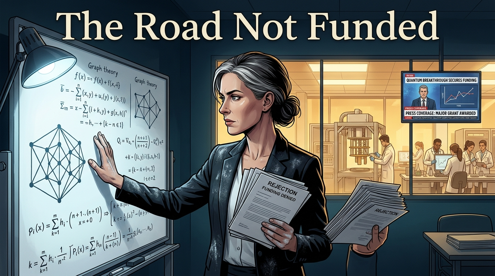
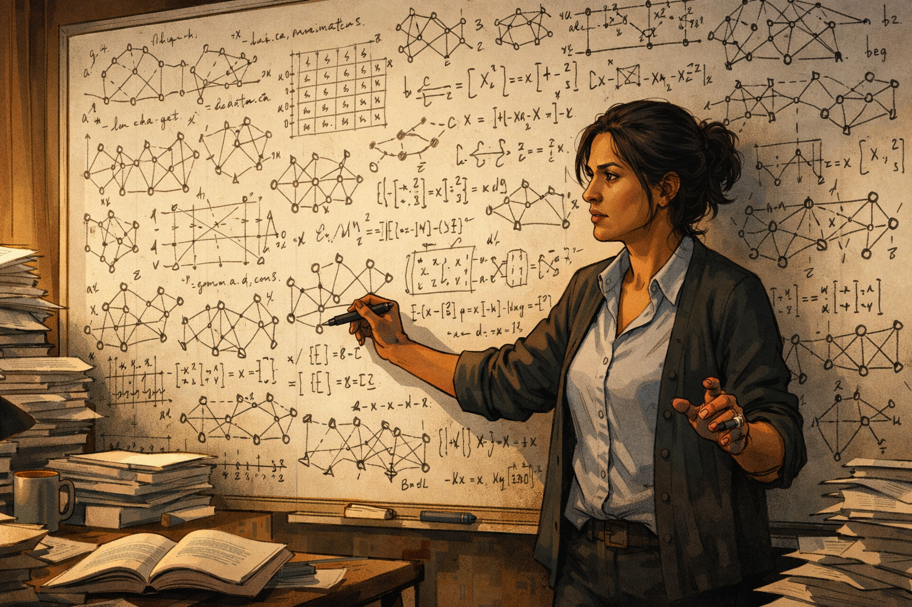
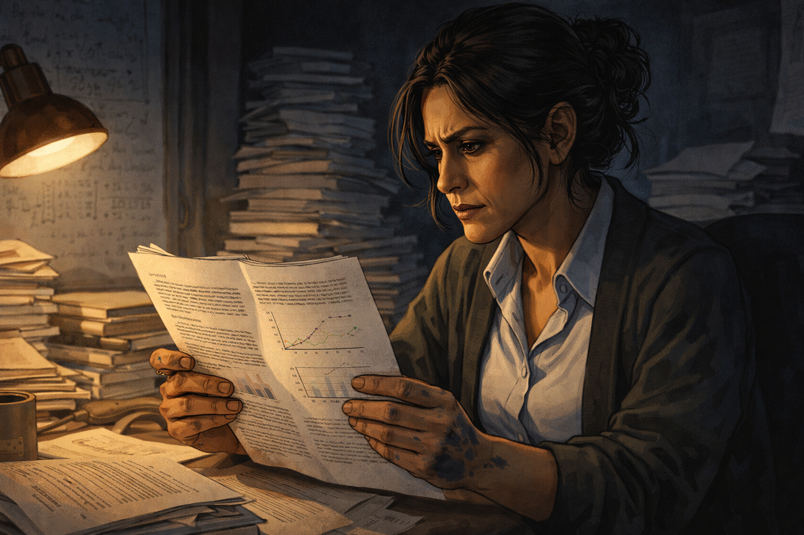
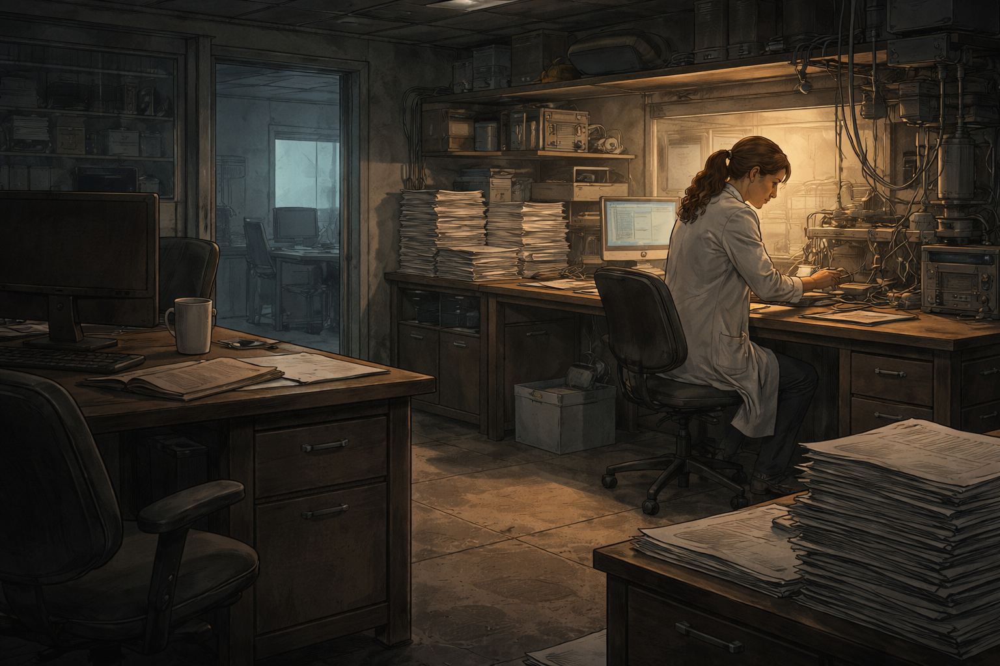

# The Road Not Funded

A classical algorithm researcher watches her superior work lose grant after grant to quantum-branded competitors.

Cover Image 

Generate a wide-landscape graphic novel cover image with a width:height ratio of 16:9. Use rich colors in the style of a thoughtful, cinematic graphic novel — expressive character faces, dramatic lighting, environments that reflect emotional tone.

  Not cartoonish. Think Saga or Maus rather than superhero comics.
  Do not put any captions or text in the image EXCEPT the title at the top.

  Place the title text at the top of the image: "The Road Not Funded"

  Show Dr. Imogen — a white woman in her 40s, precise and focused, chalk on her hands — standing at a whiteboard covered in dense graph theory — genuinely beautiful mathematics. In her other hand, a stack of rejection letters. Through a window in the background, a well-funded quantum lab is visible: equipment, a larger team, press coverage on a mounted screen. Her mathematics on the whiteboard is more correct and more applicable than what's visible through that window, and the composition makes this legible without a word. Her expression is the controlled frustration of someone whose work is right but unfashionable. Color palette: the cool whiteboard light on her elegant mathematics, the warm glow of the funded lab through the window, the rejection letters a neutral grey in her hand.

## Panel 1: The Beautiful Mathematics

Dr. Imogen at her whiteboard — dense graph theory, genuine mathematical beauty

Panel 1 of 14.
Generate a wide-landscape graphic novel drawing with a width:height ratio of 16:9. Use rich colors in the style of a thoughtful, cinematic graphic novel — expressive character faces, dramatic lighting, environments that reflect emotional tone. Not cartoonish. Think Saga or Maus rather than superhero comics. Do not put captions or text in the image. Show Dr. Imogen — a British-Indian woman in her 40s, theoretical CS energy, marker-covered hands, towers of printed papers on her desk — standing at a large whiteboard covered in dense graph theory notation. The math is beautiful in the way that advanced algorithm theory is beautiful: intricate, structured, suggesting connections. Her expression is the deep focus of someone working on something they find genuinely important. The office is an organized chaos of papers. Color palette: the warm afternoon office light, the whiteboard dense with elegant notation.

Dr. Imogen has been working on the combinatorial optimization problem for eight years. The mathematical structure is genuinely beautiful — a generalization of network flow theory that opens onto a class of NP-hard problems from a direction nobody has approached before. She knows, because she has checked, that this approach could cut the practical runtime on certain real-world problem instances from days to hours. She is presenting it to the grant committee next Tuesday.

## Panel 2: Grant Round One — Rejection

Reviewer comment: "Quantum annealing expected to surpass classical methods here"

Panel 2 of 14.
Generate a wide-landscape graphic novel drawing with a width:height ratio of 16:9. Use rich colors in the style of a thoughtful, cinematic graphic novel — expressive character faces, dramatic lighting, environments that reflect emotional tone. Not cartoonish. Do not put captions or text in the image. Show Dr. Imogen reading grant reviewer comments at her desk — the review is printed, and she is at a specific paragraph. Her expression shifts from reading-focus to the controlled look of someone receiving a decision they find frustrating. The reviewer comment implies that quantum approaches are expected to handle this problem class. Her towers of papers are visible behind her. Color palette: the desk light, the slight chill of a rejection.

The reviewer comment reads: "The proposed approach is promising in theory, but quantum annealing is expected to surpass classical methods for this problem class within the near-term horizon. Funding this classical approach may not represent the best use of resources given competitive quantum developments." Imogen looks up the paper the reviewer cited. It projects quantum advantage for 20-variable toy problems. Her application targets real-world instances with 10,000 variables. The comparison is not made.

## Panel 3: Reading the Cited Paper

She reads the cited paper — quantum "surpassing" is a projection on toy problems

Panel 3 of 14.
Generate a wide-landscape graphic novel drawing with a width:height ratio of 16:9. Use rich colors in the style of a thoughtful, cinematic graphic novel — expressive character faces, dramatic lighting, environments that reflect emotional tone. Not cartoonish. Do not put captions or text in the image. Show Imogen at her desk, reading the academic paper the reviewer cited. She is in the methodology section. Her marker-covered hands are holding the paper. Her expression is the close focus of someone locating a specific discrepancy — and finding it. The problem size in the paper versus the problem size in her application. Color palette: the desk research light, Imogen's expression showing the gap between what is cited and what is claimed.

The paper is careful and honest: quantum annealing shows a factor-of-two improvement on the 20-variable benchmark relative to naive classical methods. The conclusion notes this may extend to larger instances with further hardware development. The projection in the reviewer's comment — "expected to surpass classical methods" — has traveled several steps from the paper's actual data. The actual data shows improvement on problems 500 times smaller than the ones Imogen works on. She writes this in her rebuttal. The rebuttal is not read in time for the cycle.

## Panel 4: Grant Round Two — Same Result

Grant round two — different framing, same result; "quantum" appears four times in the rejection

Panel 4 of 14.
Generate a wide-landscape graphic novel drawing with a width:height ratio of 16:9. Use rich colors in the style of a thoughtful, cinematic graphic novel — expressive character faces, dramatic lighting, environments that reflect emotional tone. Not cartoonish. Do not put captions or text in the image. Show Imogen reading the second rejection letter. She has the first rejection visible on her desk for comparison. Her expression is the tired precision of someone analyzing a pattern — the word "quantum" appearing multiple times in reasons for rejecting classical work. She is not bitter; she is documenting. Color palette: the desk light, two rejection letters creating the visual record of a pattern.

She rewrites the proposal for round two. Different framing, stronger preliminary results, a new collaborator from industry. The second rejection cites quantum developments four times in the two-page evaluation. Her preliminary results section — showing runtime improvements on real-world benchmark instances of 10,000+ variables — is not directly addressed in the reviews. The committee is applying a different evaluation criterion than the one her work is designed for.

## Panel 5: The Lab Shrinks

Her lab shrinks — one postdoc leaves for a quantum startup

Panel 5 of 14.
Generate a wide-landscape graphic novel drawing with a width:height ratio of 16:9. Use rich colors in the style of a thoughtful, cinematic graphic novel — expressive character faces, dramatic lighting, environments that reflect emotional tone. Not cartoonish. Do not put captions or text in the image. Show Imogen's lab — once a group of four or five people, now smaller. An empty desk where a postdoc used to work. Imogen at her station running experiments, now without the help she had. The towers of papers are larger. The lab equipment is the same. The room is quieter. Color palette: the somewhat emptier lab, the quiet of reduced resources.

Her postdoc, a talented combinatorial mathematician, takes a position at a quantum optimization startup where the funding is better and the team is larger. He apologizes. She means it when she says she understands. Her research group is now two people: herself and a PhD student who is funded through teaching. She runs experiments in the evenings. She submits to smaller venues because the larger ones are favoring quantum work.

## Panel 6: The Quantum Team's Result

A quantum team, 10× her budget, publishes on the same problem class: 50 vars, 2 hours

Panel 6 of 14.
Generate a wide-landscape graphic novel drawing with a width:height ratio of 16:9. Use rich colors in the style of a thoughtful, cinematic graphic novel — expressive character faces, dramatic lighting, environments that reflect emotional tone. Not cartoonish. Do not put captions or text in the image. Show Imogen reading a new paper on her laptop. The paper is from a well-funded quantum computing group — the lab size implied by the author list is substantially larger than hers. The result is on a 50-variable benchmark of the same problem class she works on: 2 hours to solution. The press release accompanying the paper is visible in another tab. Imogen's expression is the specific look of someone running a mental comparison. Color palette: the screen light, Imogen's focused expression doing the math.

The quantum annealing paper publishes with a press release: "Quantum Algorithm Cracks Classic Optimization Problem." The problem instance is 50 variables. Runtime: 2 hours on proprietary quantum hardware. The lab has twelve researchers and ten million dollars in annual funding. Imogen writes the comparison in her notebook without comment: 50 variables, 2 hours.

## Panel 7: Almost Not Publishing

Imogen's result: 50 variables in 4 seconds on a laptop — she almost doesn't publish

Panel 7 of 14.
Generate a wide-landscape graphic novel drawing with a width:height ratio of 16:9. Use rich colors in the style of a thoughtful, cinematic graphic novel — expressive character faces, dramatic lighting, environments that reflect emotional tone. Not cartoonish. Do not put captions or text in the image. Show Imogen at her laptop, looking at her own result: a timing readout showing 4 seconds for the same 50-variable benchmark. Her expression is the quiet weariness of someone who has the better number but is not sure anyone is positioned to hear it. She has a draft submission form open. Her finger is hovering over the keyboard. Color palette: the late-night laptop light, the particular tiredness of someone doing important work that has become invisible.

She runs the 50-variable benchmark on her laptop — the same problem class the quantum team published on. Her algorithm takes 4 seconds. She sits with this result. The quantum team has a press release. She has a laptop and a two-person group and two grant rejections. She almost doesn't submit the paper. The field is not listening to classical optimization right now. Then she thinks about what the result means at 10,000 variables, and she submits.

## Panel 8: The Blogger Picks It Up

She publishes — a blogger picks it up; 800 retweets; then a biotech company emails

Panel 8 of 14.
Generate a wide-landscape graphic novel drawing with a width:height ratio of 16:9. Use rich colors in the style of a thoughtful, cinematic graphic novel — expressive character faces, dramatic lighting, environments that reflect emotional tone. Not cartoonish. Do not put captions or text in the image. Show Imogen at her desk, laptop open, watching unexpected attention arrive — a thread of notifications from a technical blog sharing her paper. Then an email from an address she doesn't recognize. Her expression shifts from surprise at the attention to focused attention on the email. Color palette: the desk light, the small unexpected brightness of attention from an unexpected direction.

The paper publishes in an algorithms journal. A computational science blogger picks it up with the headline "Classical Algorithm Runs Circles Around Quantum on Optimization Benchmark." Eight hundred retweets in technical circles. A week later, an email arrives from a computational biologist at a biotech company: "We've been following quantum optimization for our drug discovery pipeline. Is your algorithm applicable to molecular docking problems with 5,000–10,000 variables?" Imogen reads the email twice and then calls the sender back within the hour.

## Panel 9: The License

License signed — the biotech team runs Imogen's algorithm on drug discovery

Panel 9 of 14.
Generate a wide-landscape graphic novel drawing with a width:height ratio of 16:9. Use rich colors in the style of a thoughtful, cinematic graphic novel — expressive character faces, dramatic lighting, environments that reflect emotional tone. Not cartoonish. Do not put captions or text in the image. Show Imogen and the biotech team in a video call or meeting — the license agreement is being finalized. Imogen's expression shows the slightly stunned relief of someone whose work has found the exact application it was built for. The biotech team is energized and specific — they have a real problem and she has the tool. Color palette: the meeting light, the warm mutual recognition of application meeting need.

The license is non-exclusive and covers drug discovery applications. The biotech team sends Imogen's research group a molecular docking benchmark — 8,000 variables, 200 instances, representing a fragment of their active drug discovery pipeline. They have been running commercial quantum annealing software on the same benchmark for six months without satisfactory results. They need solutions within 24 hours per instance. Current runtime: 3 days.

## Panel 10: Eighteen Months Later — Drug Candidate Identified

A drug candidate identified — compute time: 11 hours on a laptop cluster

Panel 10 of 14.
Generate a wide-landscape graphic novel drawing with a width:height ratio of 16:9. Use rich colors in the style of a thoughtful, cinematic graphic novel — expressive character faces, dramatic lighting, environments that reflect emotional tone. Not cartoonish. Do not put captions or text in the image. Show Imogen in a video call with the biotech team — they are sharing results. The result is significant: a drug candidate has emerged from the pipeline that was stuck before. The compute infrastructure shown is modest — a laptop cluster, not exotic hardware. The biotech team's expressions carry the emotion of a real scientific result. Imogen's expression is the particular quality of someone whose work has just helped something real happen in the world. Color palette: the video call quality, the warm human tones of a result that means something.

Eighteen months after the license, the biotech team identifies a drug candidate that had not emerged from the quantum annealing pipeline. The molecular docking problem — 8,247 variables per instance — runs in 11 hours per instance on a cluster of twelve laptops. The candidate enters pre-clinical trials. The total compute cost for the screening run: $2,300 in cloud computing credits. Imogen's algorithm is not a product. It is a tool that worked.

## Panel 11: The Quantum Team's Latest Paper

Quantum team's latest: "Toward quantum advantage — progress and remaining challenges." Their benchmark: 200 variables.

Panel 11 of 14.
Generate a wide-landscape graphic novel drawing with a width:height ratio of 16:9. Use rich colors in the style of a thoughtful, cinematic graphic novel — expressive character faces, dramatic lighting, environments that reflect emotional tone. Not cartoonish. Do not put captions or text in the image. Show Imogen reading the quantum team's new paper on her screen. The paper is carefully written and honest — "progress and remaining challenges." The benchmark problem size in their latest result: 200 variables. On her desk: the biotech result, the 8,247-variable run. She is not triumphant. She is tired. Color palette: the desk screen light, Imogen in the tired quiet of someone who has seen the gap between what gets funded and what works.

The quantum annealing team's new paper is careful and honest: "Toward Quantum Advantage: Progress and Remaining Challenges in Combinatorial Optimization." Their new benchmark: 200 variables. Runtime: 45 minutes. The paper's conclusion is measured: fault-tolerant quantum advantage for this problem class is still a goal, not yet an achievement. The paper is good work. The benchmark is 40 times smaller than what Imogen ran last quarter.

## Panel 12: The Op-Ed

Imogen writes an op-ed: "Every dollar chasing quantum advantage here is a dollar not spent on algorithms that work today"

Panel 12 of 14.
Generate a wide-landscape graphic novel drawing with a width:height ratio of 16:9. Use rich colors in the style of a thoughtful, cinematic graphic novel — expressive character faces, dramatic lighting, environments that reflect emotional tone. Not cartoonish. Do not put captions or text in the image. Show Imogen at her desk writing — not a paper, a shorter piece, the op-ed. Her expression is the careful directness of someone who has decided to say something publicly that she has been saying privately for years. Her marker-covered hands are on the keyboard. The papers around her include the biotech result, the drug candidate announcement, the two rejection letters. Color palette: the desk light, Imogen writing with the focused calm of a person saying something that needs to be said.

She writes the op-ed in one sitting. The central argument: funding authorities evaluating classical and quantum approaches to the same problem class should be required to specify what the best current classical algorithm achieves before authorizing quantum development. "Every dollar chasing quantum advantage in combinatorial optimization is a dollar not spent on algorithms that work today, at scale, for real problems." She sends it to a computational science policy journal. They publish it with one edit — they soften "not spent" to "potentially not spent."

## Panel 13: The Review Panel Adds a Criterion

A grant review panel reads her op-ed — adds new criterion: classical baseline

Panel 13 of 14.
Generate a wide-landscape graphic novel drawing with a width:height ratio of 16:9. Use rich colors in the style of a thoughtful, cinematic graphic novel — expressive character faces, dramatic lighting, environments that reflect emotional tone. Not cartoonish. Do not put captions or text in the image. Show a grant review panel meeting — a committee around a table, papers visible, someone pointing to a document that includes Imogen's op-ed. Discussion is happening. A committee member is writing a new criterion in the evaluation rubric. The change is small but real — one sentence added to a review template. Color palette: the committee meeting light, the formal setting of a structural change being made.

The chair of a federal computing research grant panel reads the op-ed and brings it to the next panel meeting. After discussion, the committee adds one criterion to the evaluation rubric: "Classical baseline: Applicants must specify the best currently available classical algorithm for the proposed problem class and compare projected performance against it." It is one sentence in a six-page review document. It will be read by grant applicants. Some of them will take it seriously.

## Panel 14: The Research Hospital

Imogen's algorithm running in a research hospital — real patients, no headlines

Panel 14 of 14.
Generate a wide-landscape graphic novel drawing with a width:height ratio of 16:9. Use rich colors in the style of a thoughtful, cinematic graphic novel — expressive character faces, dramatic lighting, environments that reflect emotional tone. Not cartoonish. Do not put captions or text in the image. Show a research hospital computing environment — a server room or a clinical research workstation, the kind of place that is functional rather than designed for cameras. The screen shows Imogen's algorithm running — optimization outputs in a format that connects to a drug discovery pipeline. There are no cameras. There is no press release. There is a researcher using a tool that works. The scene has the quiet dignity of real work at scale. Color palette: the functional hospital-adjacent computing light — cool, clean, practical, the opposite of a press release.

Imogen's algorithm runs in a research hospital's drug discovery computation cluster. The biotech company licensed it to two academic medical centers. There are no press releases. There are no conference keynotes. A researcher in a hospital in Amsterdam uses it on Tuesday morning to screen molecular candidates for a pancreatic cancer drug target. The computation runs for nine hours. She has results by dinner. This is not a story anyone is writing about.

---

**Epilogue:** *Nobody decided to underfund Dr. Imogen. They decided to fund quantum — which seemed more promising, more exciting, more competitive with other nations' programs. The drug candidate found, the patients helped, the years of classical progress — these are the shape of the road not taken. Opportunity cost is invisible until someone maps it.*
