# We've Seen This Movie Before

A veteran technologist recognizes the quantum hype cycle from three previous technology bubbles she lived through.

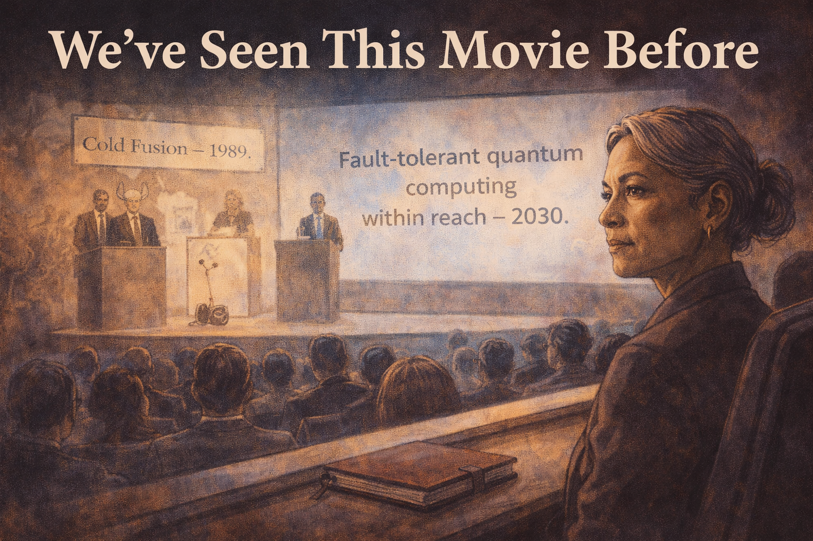

Cover Image 

Generate a wide-landscape graphic novel cover image with a width:height ratio of 16:9. Use rich colors in the style of a thoughtful, cinematic graphic novel — expressive character faces, dramatic lighting, environments that reflect emotional tone.

  Not cartoonish. Think Saga or Maus rather than superhero comics.
  Do not put any captions or text in the image EXCEPT the title at the top.

  Place the title text at the top of the image: "We've Seen This Movie Before"

  Show Constance — a white woman in her 60s, the precise poise of someone who has seen a great deal — seated in a quantum computing conference audience. On stage, a large screen reads "Fault-tolerant quantum computing within reach — 2030." But the composition uses a double exposure or layered visual: faintly behind the current conference scene, the ghosts of three earlier conference moments — a 1989 cold fusion announcement, a 2001 Segway reveal, an AI winter kickoff — all sharing the same "breakthrough is here" podium energy. Constance's expression is not cynical — it is the quiet, evidence-based recognition of a pattern. Color palette: the present conference in full color, the historical echoes in desaturated sepia overlay, Constance the still, clear-eyed center of the composite.

## Panel 1: The Conference, Present Day

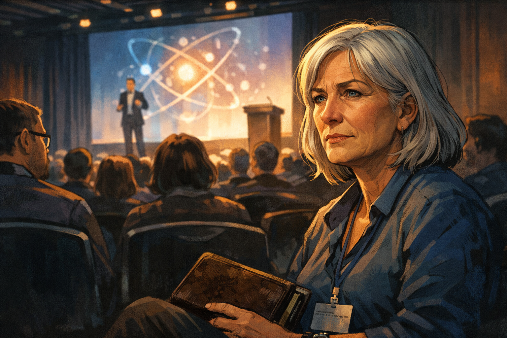

Constance at a quantum computing conference — a familiar expression

Panel 1 of 14.
Generate a wide-landscape graphic novel drawing with a width:height ratio of 16:9. Use rich colors in the style of a thoughtful, cinematic graphic novel — expressive character faces, dramatic lighting, environments that reflect emotional tone. Not cartoonish. Think Saga or Maus rather than superhero comics. Do not put captions or text in the image. Show Constance — a white woman, late 50s, silver hair, conference badge around her neck, worn leather notebook in hand — seated in the audience of a quantum computing conference. A keynote is in progress on stage. Her expression is the particular expression of a person who has been to many such conferences: not bored, not hostile — pattern-recognizing. She is watching the keynote with the careful attention of someone who has seen this before and is checking whether this time is different. Color palette: the conference hall ambient light, Constance's face in the foreground catching the glow from the stage.

Constance has been attending technology conferences for thirty years. She has been to the ones that announced cold fusion and the ones that announced the Segway and the ones that announced that neural networks would make human doctors obsolete within a decade. She sits in the audience of the Quantum Computing Applications Summit and watches the keynote with her notebook open and her expression professional and her internal pattern-recognition running at full speed.

## Panel 2: The Keynote Slide

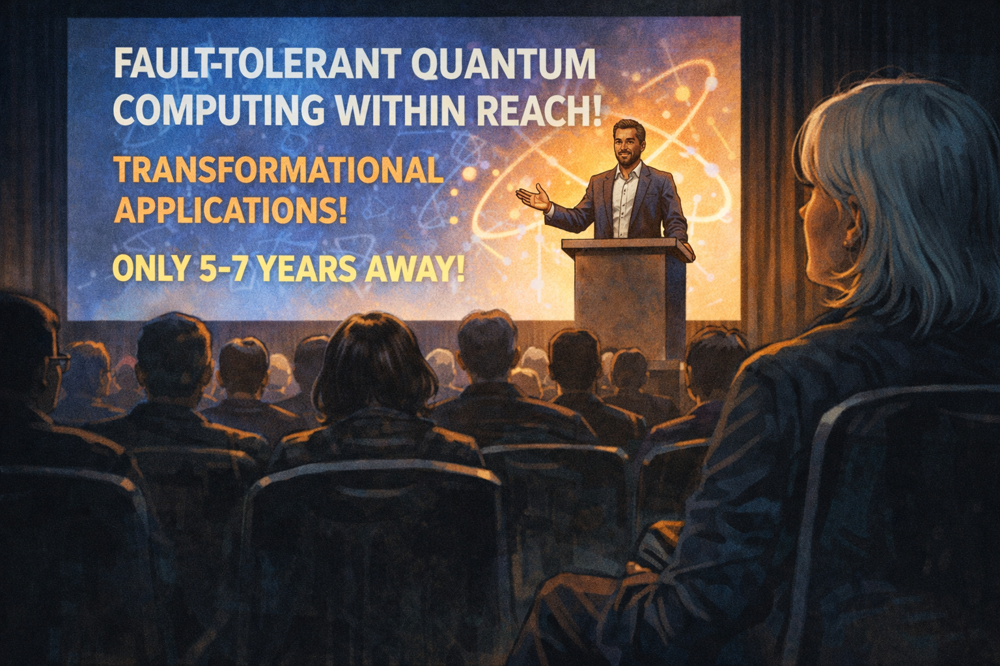

Keynote screen: "Fault-tolerant quantum computing within reach — 2030"

Panel 2 of 14.
Generate a wide-landscape graphic novel drawing with a width:height ratio of 16:9. Use rich colors in the style of a thoughtful, cinematic graphic novel — expressive character faces, dramatic lighting, environments that reflect emotional tone. Not cartoonish. Do not put captions or text in the image. Show the stage of the conference — the speaker at a podium, behind them a large screen with a bold slide. The slide announces fault-tolerant quantum computing within reach, transformational applications, a confident timeline. The speaker looks confident and genuine — they believe what they're saying. The audience is attentive. Constance is visible in the foreground, watching. Color palette: the bright stage light, the bold slide, Constance in the foreground at the darker edge of the audience.

The slide behind the speaker says: "Fault-tolerant quantum computing within reach — transformational applications by 2030." The speaker is not a hype artist. He is a serious scientist who has worked on this problem for fifteen years and genuinely believes the timeline is defensible. His slides are careful, his data is real, his team is excellent. Constance writes the date and the claim in her notebook. Then she opens to a different section.

## Panel 3: Memory Flash — Cold Fusion, 1989

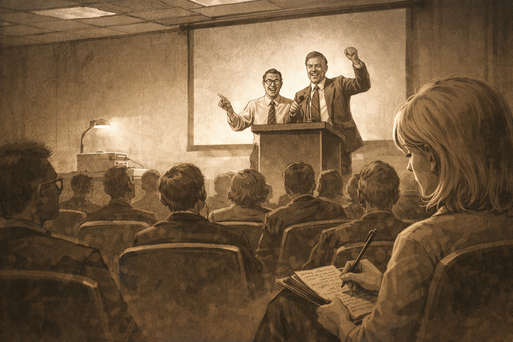

Memory flash — 1989 conference, "Cold fusion confirmed." Same podium energy.

Panel 3 of 14.
Generate a wide-landscape graphic novel drawing with a width:height ratio of 16:9. Use rich colors in the style of a thoughtful, cinematic graphic novel — expressive character faces, dramatic lighting, environments that reflect emotional tone. Not cartoonish. Do not put captions or text in the image. Show a memory flash panel — desaturated or differently colored from the present to indicate the past. A 1989 conference room: the furniture, the clothes, the overhead projector aesthetic of that era. Two scientists at a podium, visibly excited, announcing something. The same podium energy as the present-day keynote — the specific quality of people announcing what they believe is transformational. Constance at twenty-five or so is visible in the audience, taking notes. Color palette: sepia or desaturated blue-grey to mark the memory, the past rendered clearly different from the present.

She was twenty-six in 1989 when she sat in a conference room in Salt Lake City and two chemists announced that they had achieved cold fusion at room temperature. The energy in that room was identical to the energy in this room today. The speaker had the same forward lean, the same certainty, the same quality of someone saying "this is the thing we've been waiting for." She has been watching that quality for thirty years. It predicts nothing about whether the thing is real.

## Panel 4: The "Just Engineering" Quote

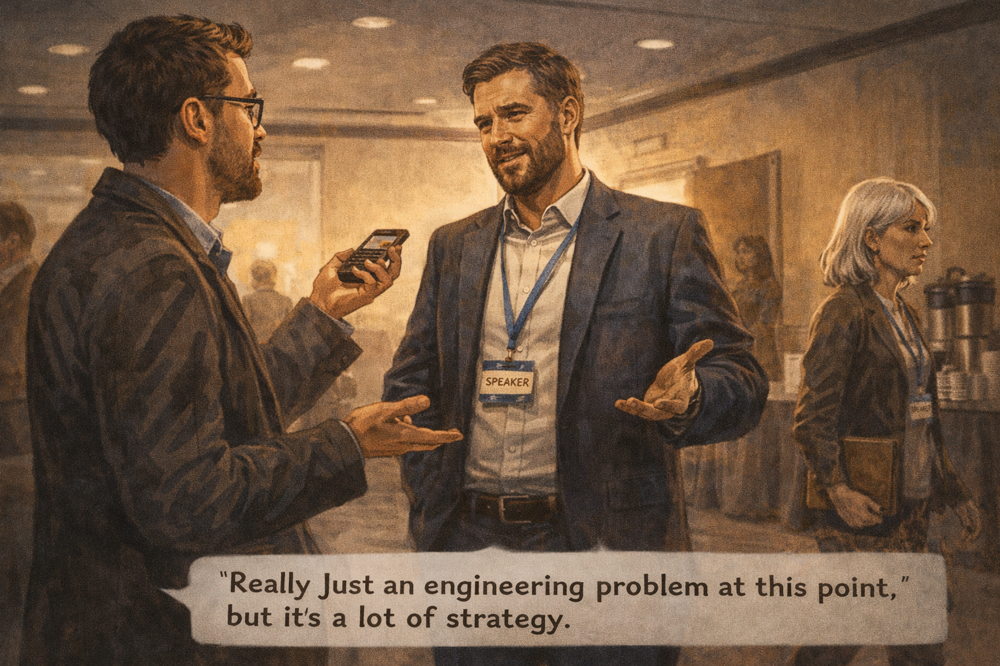

Journalist: "What's the biggest challenge?" Founder: "Really just engineering now"

Panel 4 of 14.
Generate a wide-landscape graphic novel drawing with a width:height ratio of 16:9. Use rich colors in the style of a thoughtful, cinematic graphic novel — expressive character faces, dramatic lighting, environments that reflect emotional tone. Not cartoonish. Do not put captions or text in the image. Show the conference hallway — a technology journalist interviewing the keynote speaker near a coffee station. The journalist asks the challenge question. The speaker's answer — "really just an engineering problem at this point" — is visible in his confident, slightly dismissive body language. Constance passes by in the background, not stopping. Color palette: the conference hallway light, the casual interview setting, Constance a background figure who has heard this exact phrase before.

She passes the post-keynote interview in the hallway. The journalist is asking: "What's the biggest remaining challenge?" The founder says: "Really just an engineering problem at this point." Constance keeps walking. She has heard this sentence applied to fuel cells, to Alzheimer's drug delivery, to supersonic commercial flight, to ITER fusion. The sentence is not technically false — everything is engineering once the physics is understood. The physics being understood is the part that requires evidence.

## Panel 5: Memory Flash — Segway, 2001

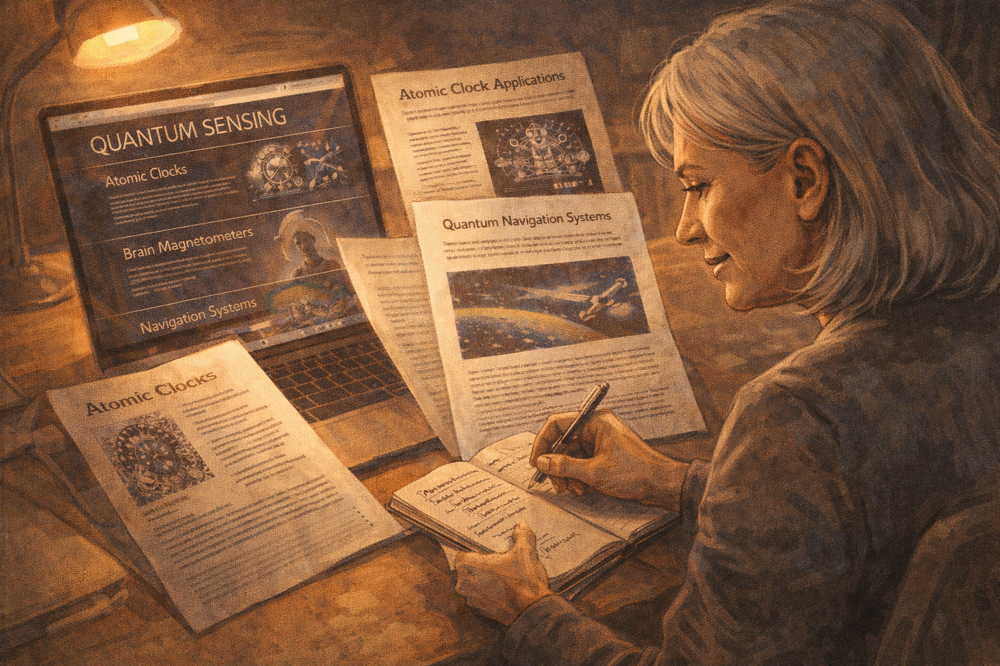

Memory flash — 2001 Segway launch: "This will change how cities are built"

Panel 5 of 14.
Generate a wide-landscape graphic novel drawing with a width:height ratio of 16:9. Use rich colors in the style of a thoughtful, cinematic graphic novel — expressive character faces, dramatic lighting, environments that reflect emotional tone. Not cartoonish. Do not put captions or text in the image. Show another memory flash panel — 2001, a product launch with the visual style of early 2000s tech presentations. A confident founder on a stage with the product. The claim about cities being redesigned is represented in the speaker's posture and the crowd's excitement. Same energy as the quantum keynote. Constance is visible, younger, in the audience. Color palette: the early 2000s aesthetic — slightly different from both 1989 and today, the past rendered distinctly.

In 2001 she attended the Segway launch press event. The founder said it would change how cities are built — that urban planners would redesign around it. He said the engineering was solved. He was right that the engineering was solved. The Segway worked exactly as designed. It did not change how cities were built. The engineering being solved was not the constraint. The constraint was something the engineering confidence didn't address. She has a note from 2001 in the old section of her notebook.

## Panel 6: Constance Writing in Her Notebook

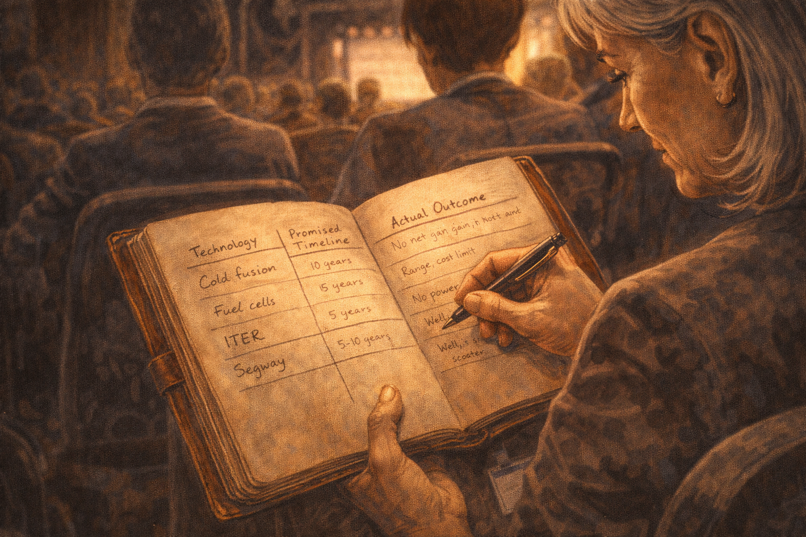

Constance's notebook — a table with technology, promised timeline, actual outcome

Panel 6 of 14.
Generate a wide-landscape graphic novel drawing with a width:height ratio of 16:9. Use rich colors in the style of a thoughtful, cinematic graphic novel — expressive character faces, dramatic lighting, environments that reflect emotional tone. Not cartoonish. Do not put captions or text in the image. Show Constance at a conference session seat, her worn leather notebook open. She is writing in a table visible to us — rows for technologies, columns for promised timeline and actual outcome. Cold fusion, fuel cells, ITER, Segway — entries visible. The table is her reference class, built over thirty years. Her handwriting is neat and small. The notebook has the patina of something that has been carried to many rooms. Color palette: the notebook's warm aged paper, Constance's careful handwriting, the conference ambient light.

The notebook has a table she has been building for thirty years. Each row is a technology. The columns: what was promised, by when, what actually happened, and how long the gap between announcement and reality turned out to be (if the thing worked at all). Cold fusion: unlimited clean energy, 1989, outcome: electrochemistry artifact, peer review failed within months. ITER fusion: first net energy, originally 2005, then 2020, now 2035+, still incomplete. Segway: urban transportation revolution, 2001, outcome: niche mobility device. She has fourteen rows. She starts a new one.

## Panel 7: Coffee Break — The Young Analyst

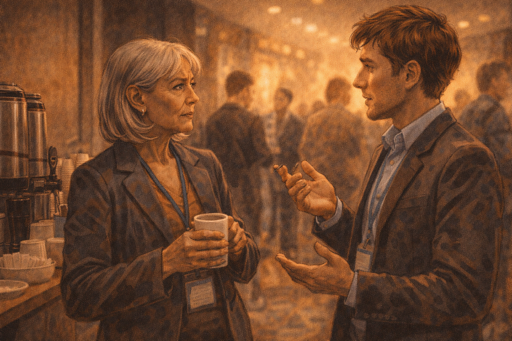

Young analyst approaches: "What do you think?" — Constance: "What reference class?"

Panel 7 of 14.
Generate a wide-landscape graphic novel drawing with a width:height ratio of 16:9. Use rich colors in the style of a thoughtful, cinematic graphic novel — expressive character faces, dramatic lighting, environments that reflect emotional tone. Not cartoonish. Do not put captions or text in the image. Show the conference coffee break area — Constance at the coffee station, a young analyst approaching her. He is genuinely curious, not sycophantic — he has seen her in the audience taking careful notes and he wants to know what she thinks. Constance's first response to his question is itself a question. Color palette: the coffee break warmth, the casual quality of a conference hallway conversation.

At the break, a young analyst from a technology investment firm finds her by the coffee station. He has seen her taking notes and has correctly guessed she is not a first-timer. "What do you think?" he asks. "About the quantum timeline — do you believe it?" Constance pours her coffee. "What reference class are you using?" she asks. He blinks. "Reference class?" he says. "For the forecast," she says. "What other technologies are you comparing this to when you evaluate the timeline?"

## Panel 8: "What's a Reference Class?"

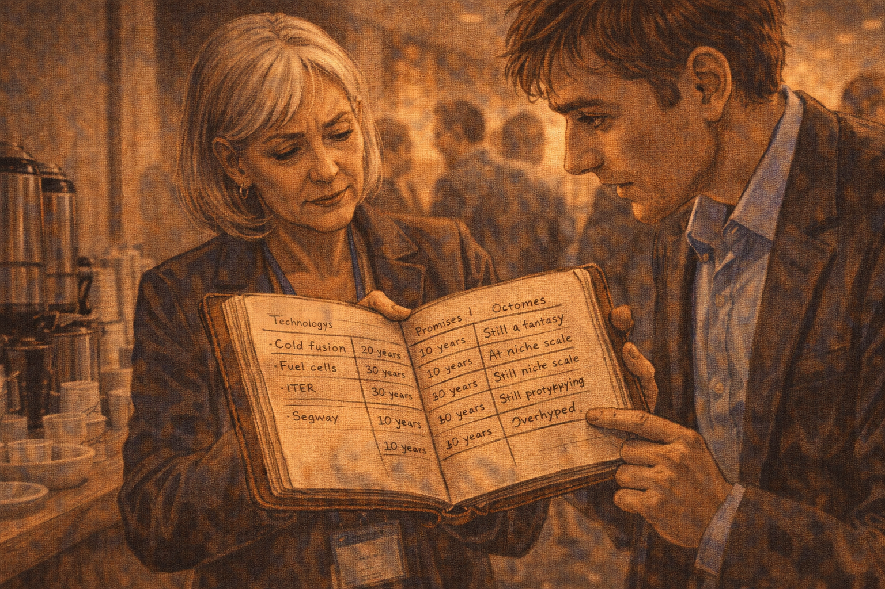

The analyst is confused — Constance shows him the notebook

Panel 8 of 14.
Generate a wide-landscape graphic novel drawing with a width:height ratio of 16:9. Use rich colors in the style of a thoughtful, cinematic graphic novel — expressive character faces, dramatic lighting, environments that reflect emotional tone. Not cartoonish. Do not put captions or text in the image. Show Constance opening her notebook to the table and holding it where the analyst can see it. His expression shifts from confusion to interest as he reads the rows. The table is its own argument — technology after technology, promised timeline on the left, actual outcome on the right, the gap between the two columns the visual story. Color palette: the coffee break light, the notebook open between them, the analyst's expression changing.

She opens the notebook to the table. He reads the rows. His expression shifts. "These are all technologies that didn't work," he says. "Some of them worked," she says. "Just not on the timeline promised, and not at the scale promised, and the ones that worked often worked for different reasons than the announcement suggested." He reads the ITER row. He reads the fuel cell row. He says: "But quantum has real physics behind it." She nods. "They all had real physics behind them."

## Panel 9: "They All Had Real Physics"

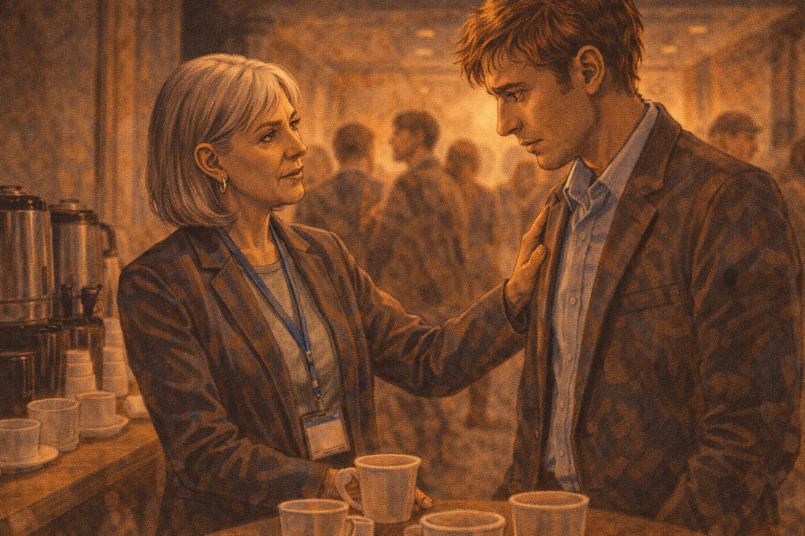

Analyst: "But quantum has real physics." Constance: "They all had real physics."

Panel 9 of 14.
Generate a wide-landscape graphic novel drawing with a width:height ratio of 16:9. Use rich colors in the style of a thoughtful, cinematic graphic novel — expressive character faces, dramatic lighting, environments that reflect emotional tone. Not cartoonish. Do not put captions or text in the image. Show the exchange between Constance and the analyst — this is the key moment. Constance says her line with the calm authority of someone who has thought this through for a long time. The analyst receives it with the specific expression of a person hearing something that both makes sense and is uncomfortable. They are standing together at the coffee station, the conference going on around them. Color palette: the coffee station warmth, the two figures in their own circle of conversation.

"Cold fusion was real electrochemistry," she says. "The Segway was real gyroscope engineering. ITER is real plasma physics. All of them had real physics behind them. The real physics is a necessary condition for the technology to work. It is not sufficient. The question is whether the real physics is consistent with all the other constraints — economic, thermodynamic, materials, manufacturing. Those constraints are where most technologies die." The analyst is very still. His coffee is going cold.

## Panel 10: The Skeptic on the Panel

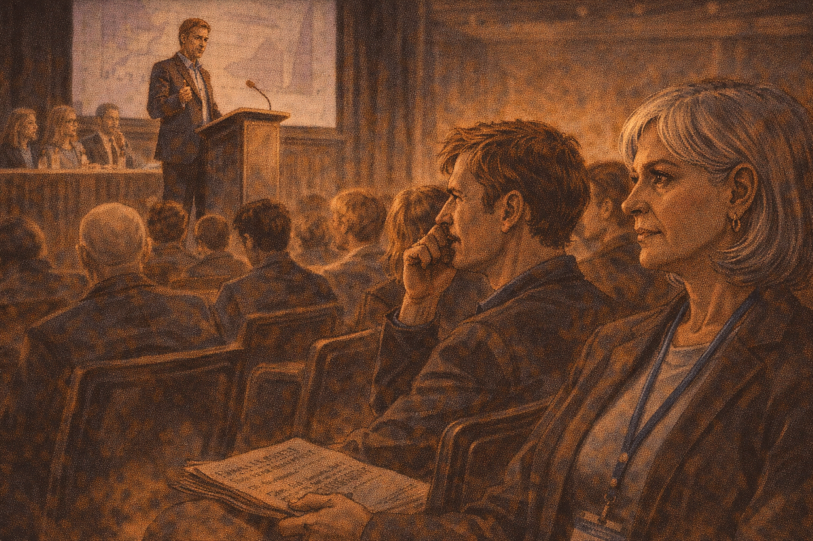

Afternoon panel — a skeptic on stage; audience muttering about negativity; Constance's thought

Panel 10 of 14.
Generate a wide-landscape graphic novel drawing with a width:height ratio of 16:9. Use rich colors in the style of a thoughtful, cinematic graphic novel — expressive character faces, dramatic lighting, environments that reflect emotional tone. Not cartoonish. Do not put captions or text in the image. Show the afternoon panel discussion — a skeptic is on stage presenting a careful, evidence-based cautious take. Part of the audience looks visibly restless or mildly hostile. Someone near Constance mutters something negative about the skeptic's tone. Constance watches this dynamic with the particular expression of someone watching a familiar social mechanism operate. Color palette: the afternoon conference session light, the slight tension in the audience.

The afternoon panel includes a physicist who has been in the field for twenty years and who gives a careful presentation of the technical obstacles remaining. His slides show the distance between current hardware and fault-tolerant operation. The audience is restless. Someone near Constance murmurs: "Why is she so negative? It's not helpful." Constance watches the murmur spread slightly — the social antibodies of a conference culture that prefers optimism activating against accurate information. She has seen this before too.

## Panel 11: Walking Out Into Sunlight

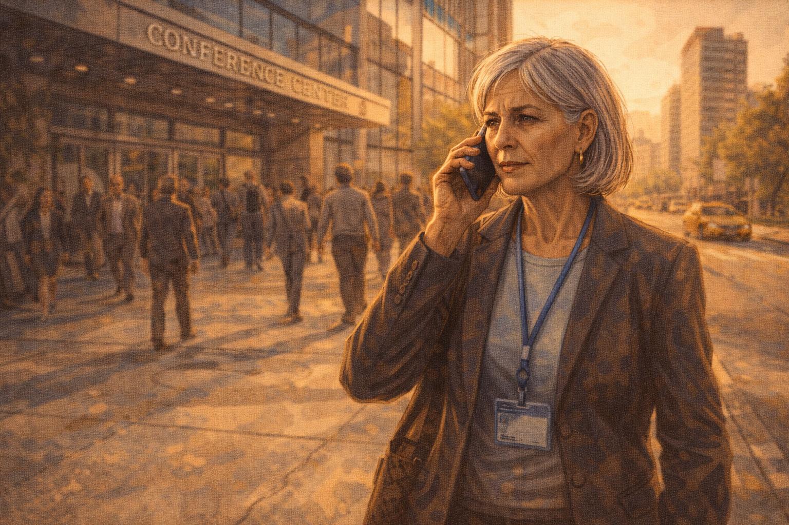

Constance walks out — she doesn't know if quantum will work; genuinely doesn't

Panel 11 of 14.
Generate a wide-landscape graphic novel drawing with a width:height ratio of 16:9. Use rich colors in the style of a thoughtful, cinematic graphic novel — expressive character faces, dramatic lighting, environments that reflect emotional tone. Not cartoonish. Do not put captions or text in the image. Show Constance walking out of the conference venue into afternoon sunlight. Her expression is the genuine uncertainty of someone who has processed a day's information and arrived at honest calibration rather than a conclusion. She is not smug. She is not defeated. She is simply a person who does not know, and knows she doesn't know, and is comfortable with that. Color palette: the warm outdoor afternoon sun after the cool conference interior, Constance in the transition.

She walks out of the conference into afternoon sun, notebook under her arm. She does not know if quantum computing will reach fault-tolerant scale. She genuinely does not know. The reference class doesn't tell her the answer — it tells her the base rate of success for technologies making this kind of announcement in this kind of timeframe. The base rate is not zero. It is not high. It is a calibration tool, not a prediction.

## Panel 12: The Call to Her Analyst

She calls her analyst: "Pass — not because the physics is wrong"

Panel 12 of 14.
Generate a wide-landscape graphic novel drawing with a width:height ratio of 16:9. Use rich colors in the style of a thoughtful, cinematic graphic novel — expressive character faces, dramatic lighting, environments that reflect emotional tone. Not cartoonish. Do not put captions or text in the image. Show Constance on her phone, walking, the conference center behind her. She is giving her assessment to her analyst. Her tone in the call is clear and precise. The reasoning she gives is not "quantum is fake" but something more specific and calibrated. The afternoon city around her continues. Color palette: the outdoor afternoon, the professional composure of a decision being delivered.

She calls her analyst. "Pass," she says. "Not because the physics is wrong — the physics is real. Because the timeline is borrowed from a different movie. The thirty-year history in my notebook has an average gap between 'just engineering now' and commercial scale of fifteen years for the ones that worked. And the one that didn't work, the gap was zero because they failed fast." Her analyst says: "So you'd reconsider in fifteen years?" She says: "I'd reconsider when the metrics move. Show me the composite error rate improving, not just the coherence time."

## Panel 13: The Notebook, New Page

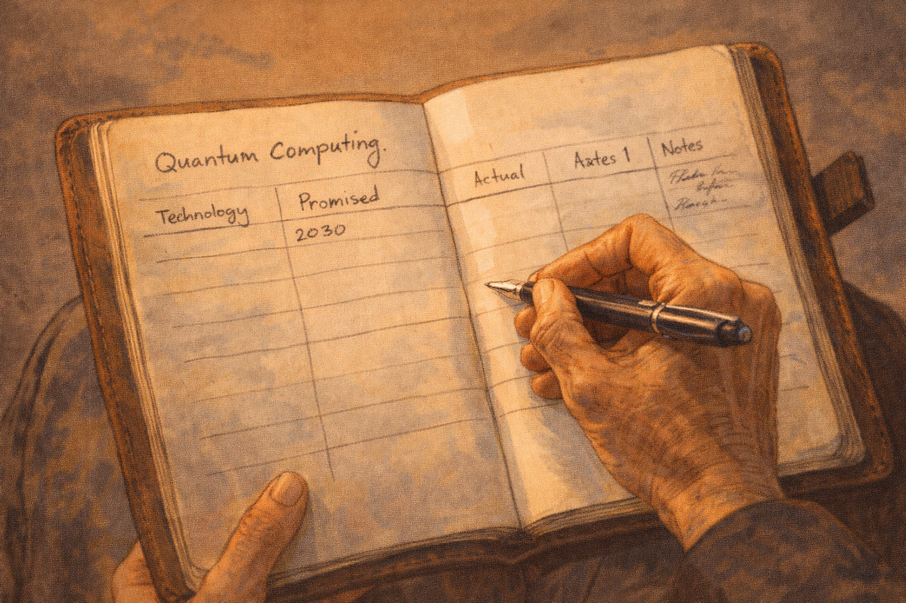

Constance's notebook, new page — "Quantum Computing." First row started, columns incomplete. She's still watching.

Panel 13 of 14.
Generate a wide-landscape graphic novel drawing with a width:height ratio of 16:9. Use rich colors in the style of a thoughtful, cinematic graphic novel — expressive character faces, dramatic lighting, environments that reflect emotional tone. Not cartoonish. Do not put captions or text in the image. Show Constance's notebook open to a new page — the heading "Quantum Computing" at the top. Below it, the same table structure from the reference class section: Technology, Promised, Actual, Notes. The first row is started — the promised date is filled in: 2030. The Actual column is empty. The Notes column has a few words but nothing final. The entry is incomplete. The notebook is open. Constance's hand is on the page — she is still watching. Color palette: the notebook's warm paper, the incomplete entry, the open book of something still in progress.

On the train back, she opens the notebook to a fresh page and writes "Quantum Computing" at the top. She draws the table. In the Promised column she writes 2030 and the specific claims from the keynote. The Actual column is empty. The Notes column has: "Real physics — yes. Engineering constraints unclear. Reference class: 12-15 year typical gap for working technologies. Historical pass rate for 'just engineering now' claims: ~30%." She closes the notebook. She will open it again. The row is not finished yet.

## Panel 14: Still Watching

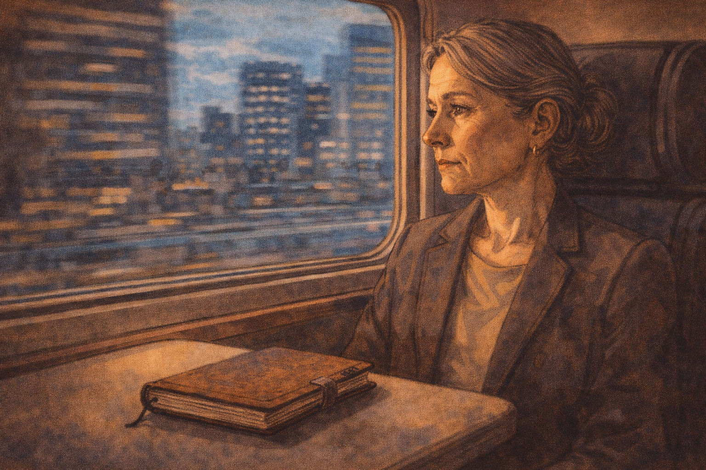

Final panel — Constance on the train home, notebook on the table, the city going by

Panel 14 of 14.
Generate a wide-landscape graphic novel drawing with a width:height ratio of 16:9. Use rich colors in the style of a thoughtful, cinematic graphic novel — expressive character faces, dramatic lighting, environments that reflect emotional tone. Not cartoonish. Do not put captions or text in the image. Show Constance on a train, her notebook closed on the table in front of her. Through the window behind her, the city moves past. Her expression is the calm, watchful face of someone who has no conclusion yet and is not pretending otherwise. She has been in this seat, on this kind of train, after this kind of conference, many times. She will be here again. Color palette: the warm interior train light against the moving city-blue of the window, Constance in the quiet of continued watching.

The train moves through the city. Constance looks out the window. She has been wrong before — she passed on technologies that worked, or worked in modified forms, or created unexpected value in ways her reference class hadn't anticipated. The reference class doesn't give you certainty. It gives you calibration. She has no strong feeling about whether quantum computing will reach scale. She has a practiced ability to hold that uncertainty and continue watching. That, after thirty years, is what she has.

---

**Epilogue:** *Constance's skepticism is not pessimism — it is pattern recognition trained on thirty years of front-row seats. She has been wrong before too: she passed on technologies that worked. The reference class doesn't give you certainty. It gives you calibration. That is all it promises, and it is more than most people in the room have.*
