# The Sunk Cost Superconductor

## Panel 1: Day One (2019)

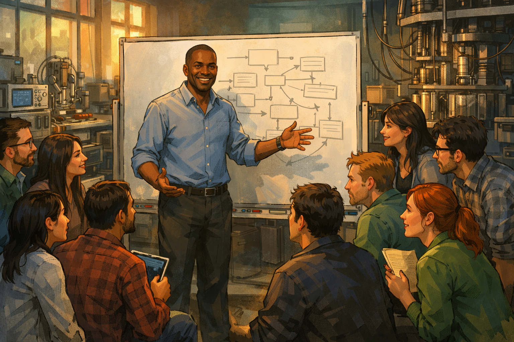

Marcus and his team on day one of the project

Generate a wide-landscape graphic novel drawing with a width:height ratio of 16:9. Use rich colors in the style of a thoughtful, cinematic graphic novel — expressive character faces, dramatic lighting, environments that reflect emotional tone. Not cartoonish. Think Saga or Maus rather than superhero comics. Do not put captions or text in the image. Show Marcus — a Black man, mid-40s, close-cropped hair, collared shirt and slacks — standing at a whiteboard in a large university lab, surrounded by a team of twelve researchers. His eyes are bright with excitement, his posture open and energetic. The whiteboard behind him shows a new project roadmap. The team members are a diverse group of postdocs and grad students, all leaning forward with fresh enthusiasm. The lab equipment is visible behind them, the kind of controlled chaos of a well-funded new initiative. Color palette: warm amber morning light, the green-and-blue of a new beginning, twelve people full of possibility.

It is January 2019, and Marcus has twelve people, a new grant, and a whiteboard full of reasons this approach will work. He has been thinking about this architecture for two years. The room is full of the particular energy of a project that has not yet failed at anything — engineers and postdocs who chose this lab, this problem, this team. Marcus looks at the whiteboard and feels certain. He will remember this feeling later.

## Panel 2: First Milestone

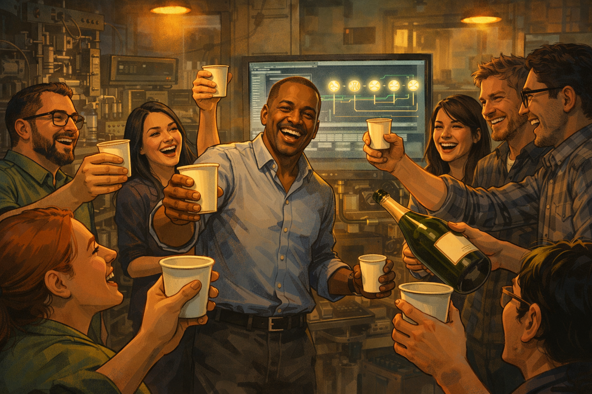

The team celebrating five working qubits

Generate a wide-landscape graphic novel drawing with a width:height ratio of 16:9. Use rich colors in the style of a thoughtful, cinematic graphic novel — expressive character faces, dramatic lighting, environments that reflect emotional tone. Not cartoonish. Do not put captions or text in the image. Show Marcus and several team members in a lab, celebrating. Someone has produced a bottle of champagne. People are laughing, some raising paper cups. The lab has its first successful result visible on a monitor behind the group — a clean readout showing five qubits operating. Marcus's expression is genuine delight. The celebration is warm and collegial. Color palette: warm festive light, the glow of successful lab equipment, the joy of earned achievement.

Five qubits, working, coherent, measured. The error rates are high but that is expected at this stage — the architecture is proven in principle. Marcus orders pizza and someone produces a bottle of champagne and the lab fills with the sound of twenty people who have made something real. He takes a photo of the readout and sends it to the program manager. That night he writes in his project notebook: "First light."

## Panel 3: The Flat Error Rate Graph

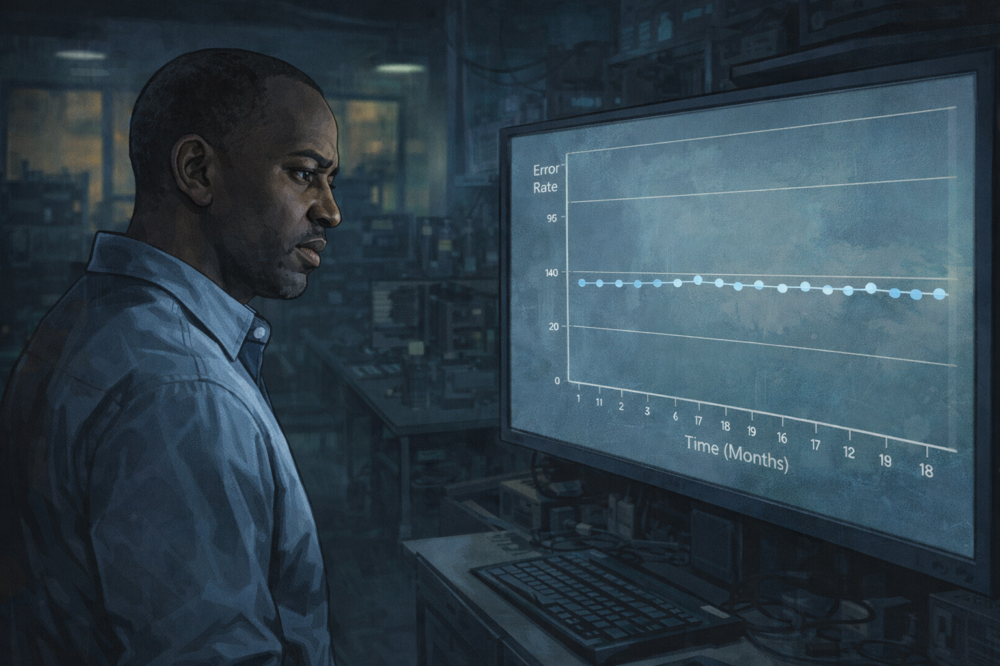

Marcus studying a flat error rate graph on a monitor

Generate a wide-landscape graphic novel drawing with a width:height ratio of 16:9. Use rich colors in the style of a thoughtful, cinematic graphic novel — expressive character faces, dramatic lighting, environments that reflect emotional tone. Not cartoonish. Do not put captions or text in the image. Show Marcus — Black man, mid-40s, close-cropped hair, collared shirt — standing in front of a large monitor, studying a graph. The graph shows an error rate over time that is essentially flat — no improvement over 18 months despite visible effort. His expression has the tired eyes mentioned in his character description, studying something that should be moving and isn't. The lab behind him is still active but quieter than Panel 1. Color palette: the blue-grey of a monitor in a dim lab, Marcus's face showing the first signs of a man absorbing unwanted information.

Eighteen months in, the error rate graph has the shape of a flat line. Not a plateau at a good value — a plateau at a bad one. Marcus has looked at this graph every morning for four months. He has tried six different approaches to the shielding. He has swapped out fabrication vendors. He has hired a new postdoc with a specific expertise. The line remains flat. The line is telling him something that he is not yet ready to hear.

## Panel 4: Board Meeting

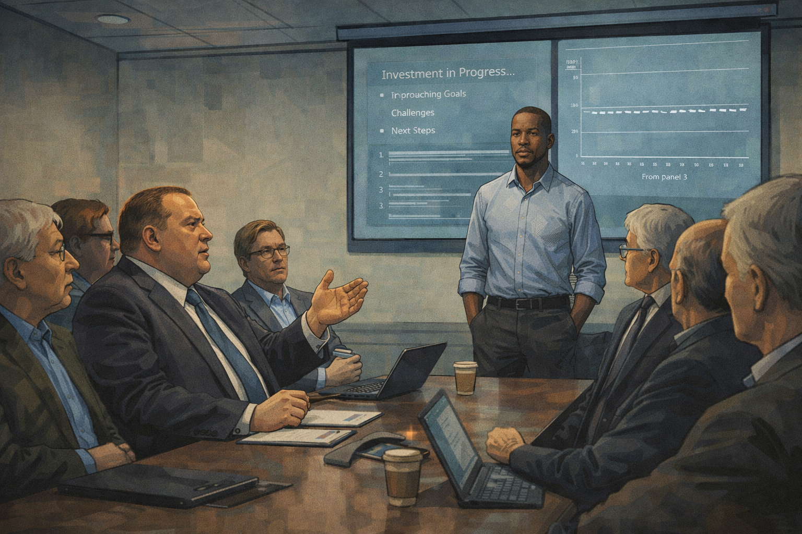

Marcus at the board meeting: "We've invested too much to stop"

Generate a wide-landscape graphic novel drawing with a width:height ratio of 16:9. Use rich colors in the style of a thoughtful, cinematic graphic novel — expressive character faces, dramatic lighting, environments that reflect emotional tone. Not cartoonish. Do not put captions or text in the image. Show a formal board or steering committee meeting — Marcus stands at the head of a conference table presenting to six or seven seated figures: program managers, department heads, funders. His slides are visible on a screen behind him. The faces around the table show various expressions of concern. Someone at the table is speaking — the quote about investment and commitment is being said by a heavyset man in a suit, not Marcus, while Marcus listens with a carefully neutral expression. The room is institutional, formal. Color palette: the cool fluorescent light of a conference room, the slight tension of a meeting where the real conversation is slightly different from the official one.

The steering committee meeting is in a glass-walled conference room with bad coffee. Around the table, a program officer from the funding agency says the words that will become the project's unofficial motto: "We've invested too much to stop now." Marcus is presenting the flat error rate graph. The program officer is looking past it. Marcus writes down "invested too much to stop" in his notebook that night, not as a concern — as a justification. It is both things at once.

## Panel 5: Doubling Down

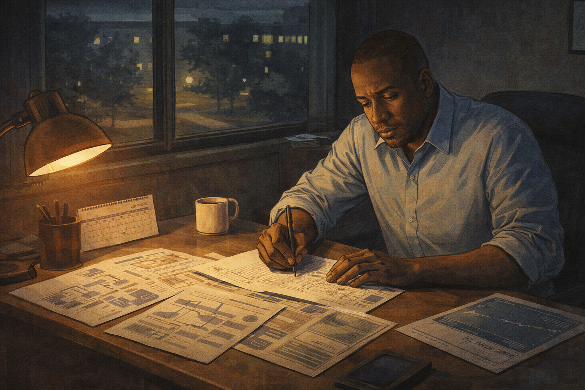

Marcus restructuring the team and writing a new plan alone at night

Generate a wide-landscape graphic novel drawing with a width:height ratio of 16:9. Use rich colors in the style of a thoughtful, cinematic graphic novel — expressive character faces, dramatic lighting, environments that reflect emotional tone. Not cartoonish. Do not put captions or text in the image. Show Marcus — Black man, mid-40s, tired eyes — alone very late at night in his office, a desk covered in org charts and project plans. He is writing a new plan — a restructuring of the team, a doubling down on the primary approach. His posture is determined but slightly hunched. On his desk: coffee, the flat error rate printout, a calendar showing late 2020. Through his window: an empty nighttime campus. This is the moment of recommitment, but the lighting makes it feel more like a man trying to convince himself. Color palette: amber desk lamp against dark office, the late-night palette of solitary decision-making.

Marcus restructures the team. He moves two researchers off secondary experiments to focus everything on the core approach. He writes a new 24-month plan — tighter, more focused, concentrating resources where they have the best chance. He works on the plan alone until 2 a.m. and when he finishes it he reads it back and it is a good plan. He believes it. He needs to believe it, which is not the same thing, but tonight those feel identical.

## Panel 6: The Competitor Pivots

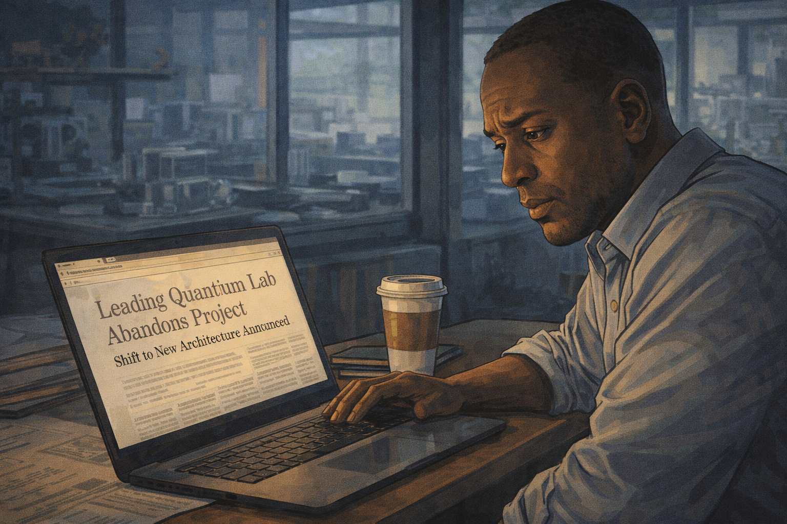

Marcus reading about a competitor's architectural pivot

Generate a wide-landscape graphic novel drawing with a width:height ratio of 16:9. Use rich colors in the style of a thoughtful, cinematic graphic novel — expressive character faces, dramatic lighting, environments that reflect emotional tone. Not cartoonish. Do not put captions or text in the image. Show Marcus at his desk in the morning, reading something on his laptop — a news article or preprint about a competing research group that has publicly announced it is abandoning its current architecture and pivoting to a completely different approach. His expression is a complex mix: initial surprise, then something that might be dismissal or might be recognition he doesn't want to have. The laptop screen is visible at an angle. The article headline implies a significant change of direction. Color palette: morning lab light, slightly cooler than the warm amber of earlier panels, Marcus in a moment of receiving unwanted information.

The Zurich group publishes a preprint announcing they are abandoning their trapped-ion approach and pivoting to photonic qubits. Marcus reads it over his morning coffee. It is a significant announcement — a respected group publicly admitting their architecture has limits. He reads the reasoning. It is careful and honest. He bookmarks the preprint, does not forward it to his team, and opens his email instead.

## Panel 7: Dismissal

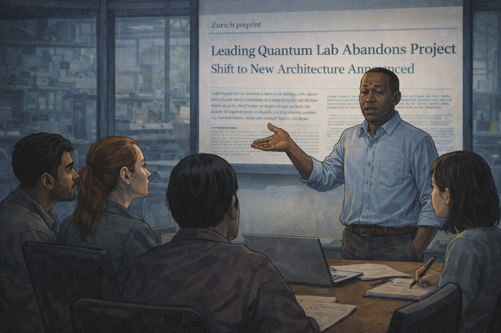

Marcus dismisses the competitor's pivot; his team looks uncertain

Generate a wide-landscape graphic novel drawing with a width:height ratio of 16:9. Use rich colors in the style of a thoughtful, cinematic graphic novel — expressive character faces, dramatic lighting, environments that reflect emotional tone. Not cartoonish. Do not put captions or text in the image. Show Marcus standing at the front of a lab meeting, addressing his team. He is gesturing dismissively — the body language of someone minimizing a threat. Behind him on a screen is the Zurich preprint. Around the table, his team members exchange glances: a slight skeptical look between two postdocs, a junior researcher who stopped writing notes and is watching Marcus's face instead. The gap between Marcus's confident dismissal and his team's uncertain response is the visual story of the panel. Color palette: lab meeting light, the slight chill of a room where consensus is not quite achieved.

"They're starting over," Marcus tells his team at the weekly meeting. "We have a three-year head start. You don't abandon a mature program to chase a different architecture every time someone publishes a preprint." He clicks past the slide. Two postdocs exchange a look. One of them — a young woman named Dr. Osei — writes nothing for the rest of the meeting and stares at the table. She has her own opinion about the Zurich preprint. She will keep it to herself for another six months.

## Panel 8: Empty Desks (2023)

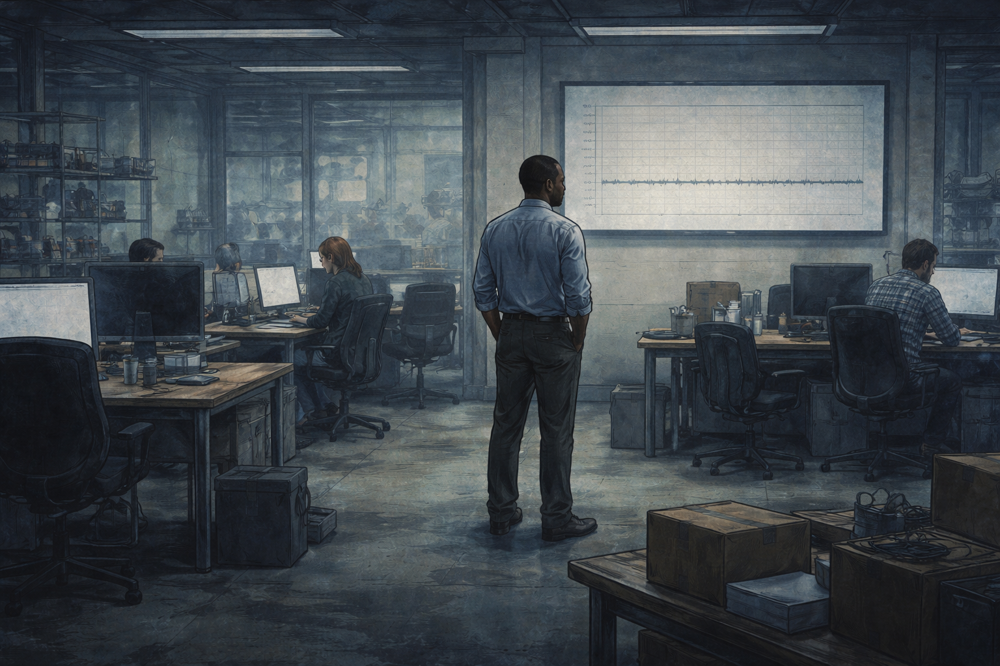

2023 — half the team gone, empty desks, flat error rates

Generate a wide-landscape graphic novel drawing with a width:height ratio of 16:9. Use rich colors in the style of a thoughtful, cinematic graphic novel — expressive character faces, dramatic lighting, environments that reflect emotional tone. Not cartoonish. Do not put captions or text in the image. Show the same lab from Panel 1, but now diminished. Several desks are empty — chairs pushed in, equipment unplugged, the spaces left by people who have moved on. Marcus stands in the middle of the lab, looking at the error rate graph on the wall — still flat. His posture is the posture of a man who has been carrying something heavy for a long time. The remaining team members work quietly at their stations. The room has the atmosphere of something winding down. Color palette: cooler, more muted than the opening panels — the same physical space drained of its early warmth.

It is late 2023. Five of Marcus's original twelve team members have left — quietly, professionally, for positions elsewhere. Three postdocs whose contracts ended were not renewed when he restructured the budget. Dr. Osei took a position at the Zurich group, which has not mentioned this to Marcus but he knows. The remaining team is still working. The error rate graph on the wall is still flat. It has been flat for three years.

## Panel 9: The Hard Question

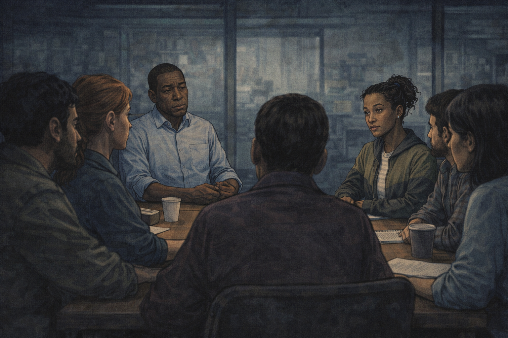

A new engineer asks the question nobody would ask

Generate a wide-landscape graphic novel drawing with a width:height ratio of 16:9. Use rich colors in the style of a thoughtful, cinematic graphic novel — expressive character faces, dramatic lighting, environments that reflect emotional tone. Not cartoonish. Do not put captions or text in the image. Show a lab meeting — Marcus at the head of the table, the remaining team around him. A new engineer — young, mixed-race woman, direct eyes, clearly new to this group — is speaking. Her expression is genuinely curious, not confrontational. The room around her has gone very still. The other team members are watching Marcus, not the new engineer. Marcus's face shows the particular expression of someone who has been asked something they needed to be asked and did not want. Color palette: the slightly tense stillness of a room hearing its own unspoken truth spoken aloud.

The new engineer joined three months ago. She has not absorbed the emotional history of the project. She raises her hand at the monthly review and asks: "What would it take to admit this approach won't work? What would that evidence look like?" The room goes so quiet that the ventilation system is suddenly audible. The other team members look at the table, or the wall, or their laptops. Marcus looks at the new engineer for a long moment. The question hangs in the air with no parachute.

## Panel 10: Reading the Dismissed Paper

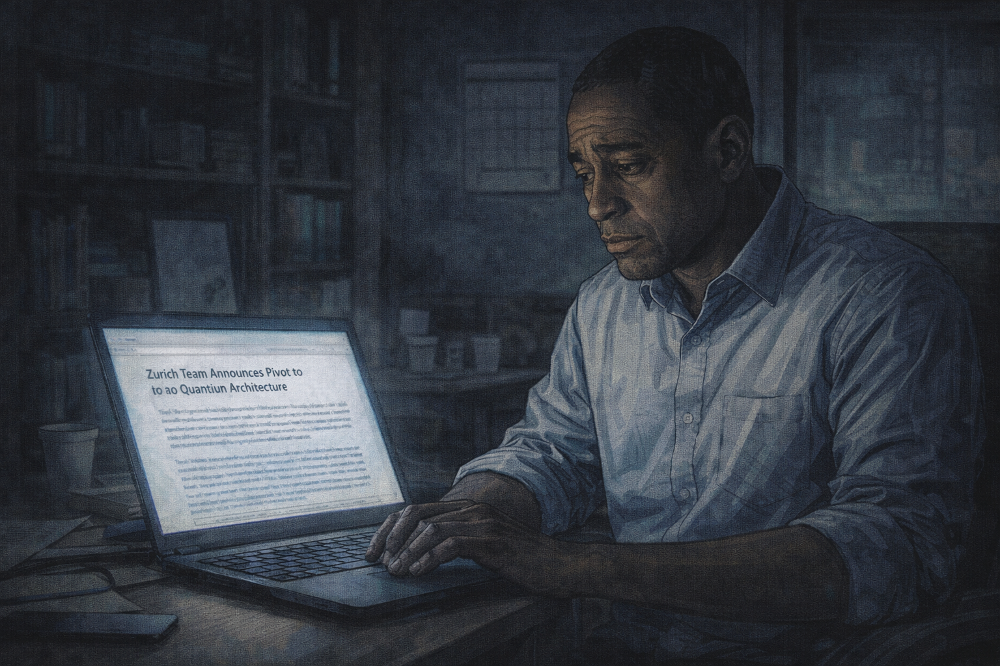

Marcus alone, very late, finally reading the competitor's paper

Generate a wide-landscape graphic novel drawing with a width:height ratio of 16:9. Use rich colors in the style of a thoughtful, cinematic graphic novel — expressive character faces, dramatic lighting, environments that reflect emotional tone. Not cartoonish. Do not put captions or text in the image. Show Marcus alone very late at night in his empty office, reading on his laptop — the Zurich preprint he bookmarked eighteen months ago, never fully read. His expression is not dramatic — it is the quiet look of a man reading something carefully, without defenses up, for the first time. The office is dark beyond the laptop glow. His collared shirt is rumpled. His eyes — described as tired — carry the specific weight of this moment. Color palette: the blue-white of a laptop screen in a dark room, the late-night palette of finally looking at something you've been avoiding.

Marcus reads the Zurich preprint. All of it, this time — not the abstract, not the conclusion, but the methods section, the error analysis, the technical argument for why they changed direction. He reads it slowly, the way you read something when you've stopped protecting yourself from it. He closes the laptop at 1 a.m. and sits in the dark for a while. The new engineer's question from two weeks ago is still there. It has always been there, asked or not.

## Panel 11: The Dark Office

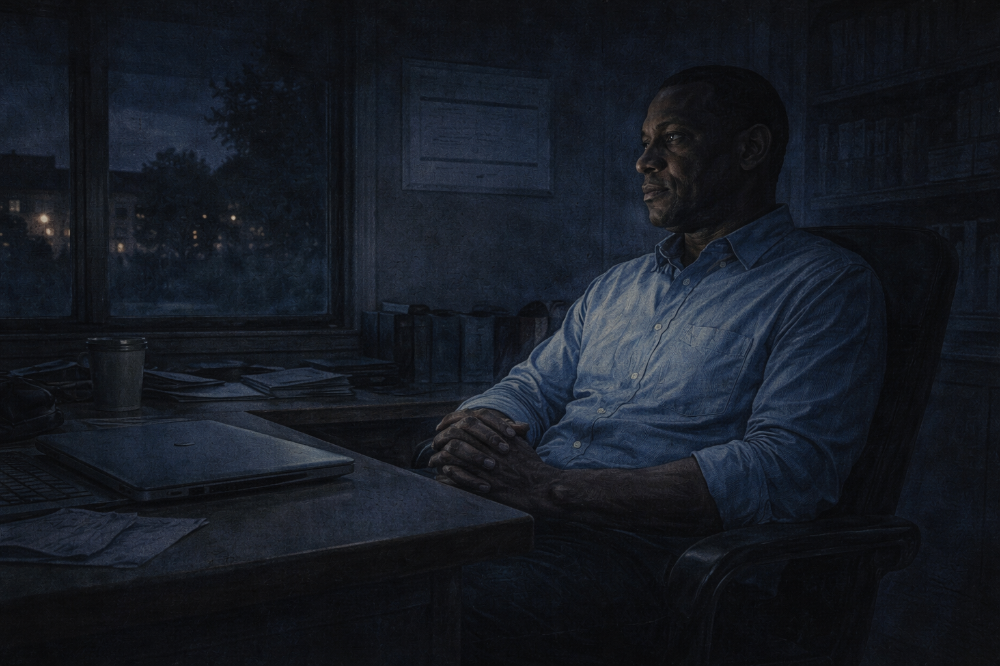

Marcus sitting in the dark — the graph that hasn't moved

Generate a wide-landscape graphic novel drawing with a width:height ratio of 16:9. Use rich colors in the style of a thoughtful, cinematic graphic novel — expressive character faces, dramatic lighting, environments that reflect emotional tone. Not cartoonish. Do not put captions or text in the image. Show Marcus sitting in his dark office — laptop closed, just sitting. Through his window, the campus is dark. On the wall, the printout of the flat error rate graph is just barely visible in the ambient light. His posture is not collapsed — it is the careful stillness of someone thinking clearly, perhaps for the first time in a long time. This is not despair. It is recognition. Color palette: very dark, the ambient blue of an empty nighttime campus, a single figure sitting with a truth.

He sits in the dark. He is not despairing — he is thinking. There is a difference, and he knows the difference. The graph on the wall has not moved in three years. He put six different explanations on that graph over three years and each explanation was reasonable and none of them moved the line. The new engineer's question is: what would it look like if this approach won't work? He looks at the graph in the dark. He thinks he can answer that question now.

## Panel 12: Year One at the New Company

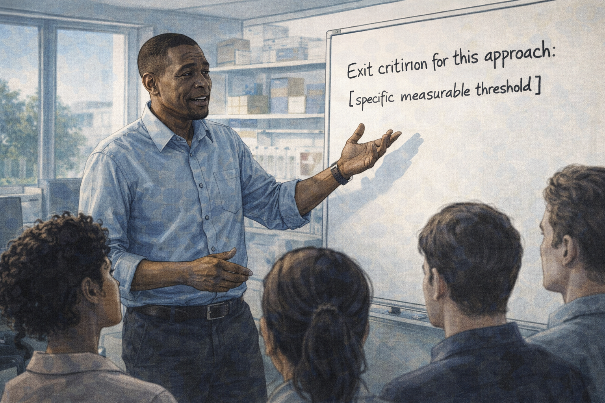

Marcus at a new company, whiteboard with exit criteria

Generate a wide-landscape graphic novel drawing with a width:height ratio of 16:9. Use rich colors in the style of a thoughtful, cinematic graphic novel — expressive character faces, dramatic lighting, environments that reflect emotional tone. Not cartoonish. Do not put captions or text in the image. Show Marcus — Black man, mid-40s, close-cropped hair, collared shirt, but now with a different energy — standing at a whiteboard in a new lab space (smaller, earlier stage, different feel from the old lab). On the whiteboard in clear letters is written something like "Exit criterion for this approach: [specific measurable threshold]." He is addressing a small new team — four or five people. His posture is more open than in the later panels of the old lab, and his eyes, while still carrying their history, look forward. Color palette: fresh morning light in a new space, the clean whiteboard, a beginning.

Marcus has a new company and a new lab and a team of five, and on his first full day he writes on the whiteboard before he does anything else: "What's our exit criterion for this approach?" He writes the specific threshold — the error rate they must achieve by a specific date, and the architectural change they will make if they don't. He takes a photo of the whiteboard. This time, he sends it to the whole team. He tells them what it cost him to learn to ask that question first.

---

**Epilogue:** *Marcus is not a cautionary tale about stubbornness. He is a portrait of how sunk cost operates — not as a logical choice but as an emotional gravity that bends every new piece of evidence toward the conclusion you need. The money already spent feels like a vote. It isn't. The universe doesn't grade on effort.*
